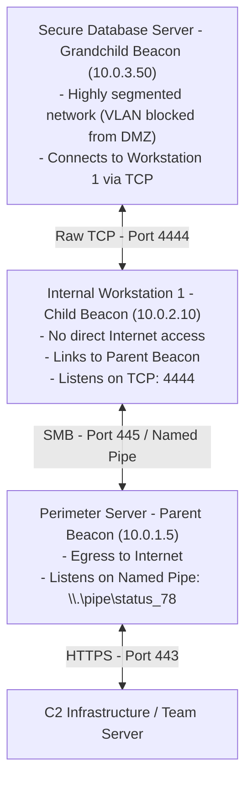

# 96.14 Lateral Movement and Pivoting with Cobalt Strike

## 1. Executive Summary
Lateral movement and pivoting are critical phases in any Red Team operation or Advanced Persistent Threat (APT) campaign. Once an initial foothold is established, the attacker must traverse the internal network to locate high-value assets, domain controllers, or sensitive data repositories. Cobalt Strike provides a highly sophisticated suite of built-in lateral movement capabilities, heavily leveraging Peer-to-Peer (P2P) communication profiles to bypass network segmentation, VLAN restrictions, and internal firewall rules. This note details the mechanisms, topologies, and detection strategies associated with Cobalt Strike pivoting.

## 2. Peer-to-Peer (P2P) Beacons
Cobalt Strike supports creating a "chain" of beacons. Instead of every compromised host communicating directly with the Team Server (which is easily detected by firewalls and egress network monitoring), child beacons communicate with parent beacons.

### SMB Beacons
The SMB Beacon uses Windows Named Pipes to communicate. Named pipes encapsulate their traffic within the Server Message Block (SMB) protocol (TCP port 445). Because SMB traffic is ubiquitous and highly necessary in Windows domain environments, this traffic blends in seamlessly with legitimate network activity.
- **Binding to a listener:** `bind \\<target>\pipe\<pipename>`
- **Linking to a beacon:** `link <target> <pipename>`

### TCP Beacons
The TCP Beacon listens on a specific TCP port and waits for a parent beacon to connect to it. This is useful for bypassing internal firewalls that might block SMB but allow other specific ports (e.g., 8080, 8443, or custom application ports).
- **Listening:** `listen <port>`
- **Connecting:** `connect <target> <port>`

## 3. Lateral Movement Techniques

### PsExec
Cobalt Strike includes built-in implementations of PsExec. It copies a service executable to the `ADMIN$` share of the target machine, creates a new Windows service using the Service Control Manager (SCM) API, and starts the service. This method requires local administrator privileges on the target and is considered highly noisy.

### Windows Management Instrumentation (WMI)
WMI is leveraged to execute commands remotely without creating a new service. Cobalt Strike uses WMI to spawn a process on the target machine, which then executes a base64 encoded PowerShell payload or drops a binary. This avoids Event ID 7045 (Service Creation).

### WinRM / PowerShell Remoting
Using the `jump winrm` command, operators can utilize Windows Remote Management (TCP 5985/5986) to execute payloads on remote systems. This is highly effective as many organizations rely on WinRM for legitimate administration.

## 4. Architecture Diagram: Complex P2P C2 Topology



## 5. Token Manipulation and Authentication
Lateral movement requires valid credentials. Cobalt Strike allows operators to manipulate access tokens natively to impersonate users across the network.
- **Make-Token (`make_token`):** Creates a temporary token with supplied credentials. Network authentications use this new token, while local actions use the original token.
- **Pass-the-Hash (`pth`):** Leverages Mimikatz to inject an NTLM hash into the current session, allowing authentication without knowing the plaintext password.
- **Overpass-the-Hash:** Requests a full Kerberos Ticket Granting Ticket (TGT) using an NTLM hash, generating less suspicious network traffic than traditional NTLM authentication.

## 6. Threat Hunting and Detection Engineering

Detecting lateral movement requires correlating endpoint telemetry (process creation, service creation) with network traffic analysis (RPC connections, SMB shares).

### Detection Strategies:
- **Service Creation (Event ID 7045):** PsExec lateral movement generates a distinct Event ID 7045 (A service was installed in the system). Look for randomly generated service names (e.g., `bafhef.exe`) or services executing directly from `ADMIN$`.
- **Network Logon (Event ID 4624):** Monitor for Logon Type 3 (Network) originating from non-standard workstations to sensitive servers, especially if followed by administrative actions.
- **SMB Share Access (Event ID 5140 / 5145):** Accessing `IPC$` or `ADMIN$` shares over SMB is a strong indicator of remote execution setup or named pipe communication.
- **Named Pipe Anomalies:** Look for SMB traffic containing custom named pipes defined in default Cobalt Strike Malleable C2 profiles (e.g., `msagent_##`, `postex_##`).

### KQL Query: Suspicious Remote Service Creation
```kusto
Event
| where EventLog == "System" and EventID == 7045
| parse EventData with * 'ServiceName">' ServiceName '<' * 'ImagePath">' ImagePath '<' *
| where ImagePath contains "ADMIN$" or ImagePath contains "C:\\Windows\\Temp" or ImagePath matches regex @"(?i)\.exe$"
| project TimeGenerated, Computer, ServiceName, ImagePath
| order by TimeGenerated desc
```

### KQL Query: Lateral Movement via WMI
```kusto
DeviceProcessEvents
| where InitiatingProcessFileName =~ "WmiPrvSE.exe"
| where FileName in~ ("cmd.exe", "powershell.exe", "rundll32.exe")
| where ProcessCommandLine contains "-enc" or ProcessCommandLine contains "hidden" or ProcessCommandLine contains "http"
| project TimeGenerated, DeviceName, InitiatingProcessFileName, FileName, ProcessCommandLine
```

## 7. Real-World Attack Scenario

### The Setup
An attacker controls a compromised web server in the DMZ. They dump credentials from LSASS and obtain the NTLM hash of a Domain Administrator who recently logged into the server for maintenance. The internal domain controller (DC) does not have internet access and is blocked by firewalls from initiating connections to the DMZ.

### The Execution
1. The operator uses `pth` to inject the Domain Admin hash into their current session.
2. They map the network architecture and identify the internal IP of the DC.
3. They use the command `jump psexec <DC_IP> smb`.
4. Cobalt Strike automatically drops a service executable on the DC's `ADMIN$` share, starts the service via RPC, and executes an SMB beacon payload.
5. The new SMB beacon starts a named pipe listener.
6. The DMZ web server beacon automatically connects to the named pipe via SMB.
7. The operator now has a fully functioning SYSTEM beacon on the Domain Controller, securely routed through the DMZ server.

### The Defender's View
The SOC receives multiple alerts in quick succession:
1. "Pass-the-Hash Activity Detected" originating from the DMZ server (flagged by MDE analyzing LSASS memory).
2. "Suspicious Service Installed" (Event ID 7045) on the Domain Controller, with a randomly generated 7-character alphabetic name.
3. Network traffic sensors detect anomalous SMB traffic containing named pipe strings traversing the firewall boundary between the DMZ and the internal network.

## 8. MITRE ATT&CK Mapping
- **TA0008 Lateral Movement**
- **T1021 Remote Services:** Using SMB/WMI/WinRM.
- **T1550 Use Alternate Authentication Material:** Pass the Hash techniques.
- **TA0011 Command and Control**
- **T1090 Proxy:** P2P beacons acting as C2 proxies.

## 9. Mitigation Strategies
- **Network Segmentation:** Implement strict VLANs and internal firewall rules. Workstations should generally not be able to communicate with other workstations over SMB (TCP 445) or WinRM (TCP 5985).
- **Tiered Administrative Access:** Enforce an Active Directory tiering model. Domain Admins should never log into lower-tier systems (like DMZ servers or user workstations) where their credentials can be stolen.
- **Disable WMI and PsExec where unnecessary:** Use Group Policy to restrict remote management protocols to only authorized jump boxes or administrative subnets.

## 10. Chaining Opportunities
- Successful lateral movement almost always requires obtaining high-level privileges first, covered in [[11 - Elevate Kit for Privilege Escalation]].
- To automate the pivoting process across large /16 subnets, operators use Aggressor Scripts, detailed in [[12 - Aggressor Scripts Automating Red Team Tasks]].

## 11. Related Notes
- [[Windows Event IDs for Threat Hunting]]
- [[Pass-the-Hash and Kerberoasting]]
- [[WMI Architecture and Abuse]]
- [[Active Directory Tiering Model]]
- [[Malleable C2 Network Profiles]]
