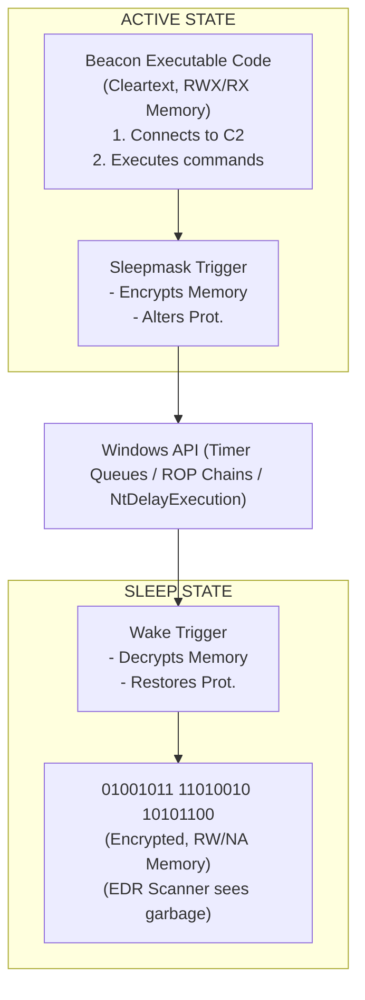

# 96.15 EDR Evasion with Custom Cobalt Strike Kits

## 1. Executive Summary
Endpoint Detection and Response (EDR) solutions have evolved dramatically from simple signature-based antivirus to complex behavioral, heuristic, and memory-scanning engines. To survive in these hostile environments, Cobalt Strike operators must heavily customize the framework. Cobalt Strike provides "Kits" (Artifact Kit, Resource Kit, Sleepmask Kit, UDRL) that allow developers to completely rewrite how the Beacon payload is loaded, obfuscated, and executed in memory. Understanding these deep-level evasion techniques is paramount for Threat Hunters aiming to identify sophisticated memory-resident malware.

## 2. The Artifact Kit and Resource Kit
The Artifact Kit is used to generate the executables, DLLs, and shellcode loaders that initially execute the Beacon payload. Out-of-the-box Cobalt Strike artifacts are widely signatured by every major AV/EDR vendor.
- **Custom Loaders:** Red teams modify the Artifact Kit (using C/C++) to implement custom shellcode execution methods (e.g., using `EnumSystemLocalesA`, `QueueUserAPC`, or direct Syscalls instead of the standard noisy `CreateThread` API).
- **Obfuscation:** Implementing custom XOR or AES decryption routines to hide the raw shellcode on disk and bypass static analysis.

The Resource Kit modifies the scripts (PowerShell, Python, VBA) used by Cobalt Strike. By dynamically changing variable names, logic flow, and encoding mechanisms, operators can bypass static AMSI (Anti-Malware Scan Interface) signatures.

## 3. Sleepmask Kit and In-Memory Obfuscation
When a Beacon is sleeping (waiting for the next check-in interval), its memory region is highly vulnerable to EDR memory scanners (e.g., YARA rules scanning for Cobalt Strike configuration blocks or strings). 
The Sleepmask Kit is a piece of code that executes right before the Beacon goes to sleep.

### The Sleep Cycle (e.g., Ekko / Foliage):
1. **Preparation:** Sleepmask hooks the Beacon execution cycle.
2. **Encryption:** It encrypts the Beacon's executable memory region (`PAGE_EXECUTE_READWRITE`) and its configuration block using a dynamically generated key.
3. **Protection Change:** It uses ROP chains to change the memory protection from `RWX` (Read-Write-Execute) or `RX` to `RW` (Read-Write) or `NOACCESS`. This completely bypasses EDRs that only scan executable memory regions.
4. **Sleep:** It avoids standard `SleepEx` hooks by utilizing Timer Queues or thread suspension techniques.
5. **Decryption:** Upon waking, a timer decrypts the memory, reverses the protections back to `RX`, and hands control back to Beacon.

## 4. Architecture Diagram: Sleep Obfuscation Mechanism



## 5. User-Defined Reflective Loader (UDRL)
Reflective DLL injection relies on a loader embedded within the payload itself to map the DLL into memory without touching the disk. Standard reflective loaders leave obvious artifacts (e.g., MZ/PE headers in memory, distinct memory allocation patterns).
Cobalt Strike allows operators to completely replace the default loader with a UDRL. Custom UDRLs can:
- Erase the MZ/PE headers after loading to foil memory scanners.
- Avoid allocating `PAGE_EXECUTE_READWRITE` (RWX) memory entirely, opting for safer `RX` allocations.
- **Module Stomping:** Loading a legitimate Windows DLL, and overwriting its code section with the Beacon payload to make the memory appear legitimately backed by a file on disk.

## 6. Thread Call Stack Spoofing
Modern EDRs heavily rely on Event Tracing for Windows (ETW) and kernel callbacks to inspect the Call Stack of threads. If a thread is making an API call (like `InternetOpenA` for C2 communication) and the call stack shows the origin is an unbacked, dynamically allocated memory region, the EDR will flag it instantly.
Advanced kits implement Call Stack Spoofing: before sleeping or making network calls, the kit manipulates the thread's stack frames to make it look like the execution originated from legitimate, signed DLLs (like `kernelbase.dll` or `ntdll.dll`).

## 7. Threat Hunting and Detection Engineering

Detecting advanced evasion techniques requires shifting focus from static signatures to memory forensics and behavioral telemetry.

### Detection Strategies:
- **Memory Scanning Anomalies:** Look for threads whose start address is completely outside the address space of any loaded module. This indicates execution from unbacked memory.
- **Sleep Anomalies:** Monitoring APIs like `SleepEx`, `WaitForSingleObject`, and `NtDelayExecution`. EDRs can hook these to analyze the process state during the sleep cycle.
- **Call Stack Analysis:** Utilizing ETWti to capture call stacks on sensitive API calls and analyzing them for spoofing artifacts (e.g., missing frame pointers, mismatched return addresses).
- **Protection Flapping:** Alerting on processes that frequently change memory protections on the exact same region from `RW` to `RX` and back again in a loop (the hallmark signature of Sleepmask).

### KQL Query: Suspicious Thread Creation
```kusto
DeviceEvents
| where ActionType == "CreateRemoteThread" or ActionType == "ThreadCreated"
| where isempty(StartAddressFileName) or StartAddressFileName == "" // Unbacked thread
| project TimeGenerated, DeviceName, InitiatingProcessFileName, ProcessFileName, StartAddress, StartAddressFileName
```

### KQL Query: Memory Protection Flapping (Conceptual EDR Query)
```kusto
MemoryEvents
| where ActionType == "VirtualProtect"
| where PreviousProtection in ("PAGE_READWRITE", "PAGE_NOACCESS")
| where NewProtection in ("PAGE_EXECUTE_READ", "PAGE_EXECUTE_READWRITE")
| summarize count() by ProcessId, BaseAddress, bin(TimeGenerated, 1m)
| where count_ > 3 // Flapping back and forth
| project TimeGenerated, ProcessId, BaseAddress, count_
```

## 8. Real-World Attack Scenario

### The Setup
An elite Red Team is tasked with bypassing a strictly configured EDR deployment in a financial institution. They compile a custom Cobalt Strike payload utilizing a UDRL (User-Defined Reflective Loader) that implements Module Stomping, paired with an advanced Sleepmask kit that utilizes Ekko (a sleep obfuscation technique using Timer Queues and ROP chains).

### The Execution
1. The initial stager is executed.
2. The UDRL allocates memory by loading `xpsservices.dll` (a legitimate Windows DLL).
3. It overwrites the `.text` section of `xpsservices.dll` with the Cobalt Strike Beacon payload. To the EDR, the memory appears perfectly backed by a signed Microsoft file.
4. When Beacon prepares to sleep, the Sleepmask kit utilizes a Return-Oriented Programming (ROP) chain to change memory protections to `PAGE_READWRITE`, encrypt the payload, and sleep without leaving a thread suspended in the Beacon's memory space.

### The Defender's View
Standard EDR alerts are silent. However, a proactive Threat Hunter running regular YARA scans on process memory across the fleet notices an anomaly. While examining `xpsservices.dll` in memory, they find that the in-memory hash of the `.text` section does not match the known on-disk hash for a specific process (`notepad.exe`). Further forensic memory analysis using Volatility reveals the encrypted Cobalt Strike configuration block, successfully detecting the highly evasive payload.

## 9. MITRE ATT&CK Mapping
- **TA0005 Defense Evasion**
- **T1055 Process Injection:** UDRL and module stomping.
- **T1027 Obfuscated Files or Information:** Sleepmask encryption.
- **T1620 Reflective Code Loading:** Loading without touching disk.

## 10. Defensive Countermeasures
- **Enable ETWti:** Ensure EDR solutions are integrated with ETW Threat Intelligence to gain deep visibility into kernel-level thread creation and memory allocation.
- **Aggressive Memory Scanning:** Schedule periodic memory scans of running processes, specifically looking for injected threads and mismatched module memory (Module Stomping detection).
- **Monitor Network Beacons:** Even with perfect memory evasion, the C2 communication must still traverse the network. Use TLS fingerprinting (JA3/JA3S) and beacon periodicity analysis to detect the C2 channel.

## 11. Chaining Opportunities
- Evasion is fundamentally required before executing noisy tasks like BOFs, described in [[13 - Cobalt Strike BOFs Beacon Object Files Development]].
- Sleepmask configuration heavily depends on the Malleable C2 profile, which dictates the communication frequency and jitter. 

## 12. Related Notes
- [[In-Memory Evasion and Obfuscation]]
- [[Thread Stack Spoofing Techniques]]
- [[ETW Threat Intelligence]]
- [[Advanced Malleable C2 Profiles]]
- [[Memory Forensics with Volatility]]
