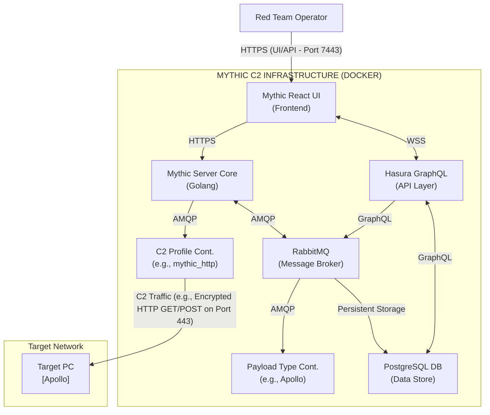

# 97.01 Introduction to Mythic C2 Architecture and Docker

## 1. Overview of Mythic C2 Framework

Mythic Command and Control (C2) represents a massive paradigm shift in how red team infrastructure is managed, developed, and deployed. Built from the ground up to be modular, collaborative, and extensively customizable, Mythic operates distinctly differently from legacy monolithic C2 frameworks like Cobalt Strike, Empire, or Metasploit. The entire ecosystem is designed around Docker containers, treating both the server backend and the various agent components as isolated microservices that communicate over standardized network protocols.

This modularity enables operators to hot-swap components, develop custom agents without touching the core server code, and distribute infrastructure across multiple hosts seamlessly. Understanding this architecture is fundamentally crucial for operators aiming to utilize Mythic in high-stakes environments where custom payload generation, evasion, and operational security (OPSEC) are paramount.

## 2. The Microservices Architectural Philosophy

Mythic abandons the traditional single-binary server approach. In older frameworks, if the server crashed due to a bad payload parse, the entire operation went down. In Mythic, each major component of the C2 framework is isolated within its own Docker container. This isolation provides enhanced security, much easier debugging, independent scalability, and the ability to write agents in any programming language.

### Core Server Components Breakdown

The Mythic "Server" is not a single entity but a collection of inter-dependent Docker containers working in concert:

1.  **Mythic React UI (Frontend):** The frontend web application is built using React. This is the visual interface through which operators interact with the framework, issue commands, view telemetry, manage files, and interact with the active callbacks grid.
2.  **Mythic Server (Golang Core):** The backend core was rewritten from Python to Golang for extreme performance and concurrency. It handles core business logic, operator authentication via JWT, tasking queues, payload compilation requests, and file transfers.
3.  **PostgreSQL Database:** The central repository for all relational data. It stores everything: operator accounts, operational configurations, active callbacks, individual tasking inputs, raw command responses, MITRE mappings, and file metadata. Everything that happens in Mythic is logged here for post-engagement reporting.
4.  **RabbitMQ Message Broker:** The circulatory system of Mythic. It facilitates asynchronous, reliable message passing between the Mythic Server Core, C2 Profiles, and Payload Type containers. RabbitMQ ensures that tasking and responses are decoupled and highly resilient.
5.  **Hasura GraphQL Engine:** Sits directly on top of the PostgreSQL database, providing a real-time, blazing-fast GraphQL API. The React frontend communicates heavily with Hasura to stream updates via WebSockets (like new callbacks or command outputs) directly to the operators' browsers without constant, resource-heavy polling.
6.  **Mythic CLI:** While not a running service container, the CLI (written in Go) is the administrative interface for bringing containers up, down, managing volumes, and configuring the `.env` settings.

### Extending the Architecture: C2 Profiles and Payload Types

The true power of Mythic lies in its infinite extensibility. Agents (Payload Types) and communication channels (C2 Profiles) are completely decoupled from the main server.

*   **Payload Type Containers:** Each supported agent (e.g., Apollo for Windows, Poseidon for Linux/macOS) runs in its own dedicated Docker container. This container doesn't run the malware agent itself; rather, it contains the build environment, compilers, and a Python translation script that translates the operator's tasking from the UI into the specific byte structure or JSON format required by the remote agent.
*   **C2 Profile Containers:** Similarly, C2 profiles (e.g., HTTP, SMB, WebSocket) run in dedicated containers. These containers act as listeners or reverse proxies. They receive the raw network traffic from the target, strip the headers, decode the payload, and forward the core message to the Mythic Server via the internal RabbitMQ broker.

## 3. Architecture ASCII Diagram



## 4. Deep Dive: Container Communication via RabbitMQ

Unlike legacy C2s that rely on tightly coupled internal functions, Mythic's microservices must communicate over a network boundary (even if that boundary is a virtual Docker bridge). RabbitMQ makes this possible and highly scalable.

When an operator issues a `shell whoami` command from the UI:
1.  **UI to Hasura:** The UI sends a GraphQL mutation to Hasura, which updates the PostgreSQL database to register a new task pending execution.
2.  **Core Notification:** The Mythic Core Server, monitoring the database, detects the new task.
3.  **Publish to RabbitMQ:** The Mythic Server packages the task details (Command, arguments, Operator ID) and publishes a message to a specific RabbitMQ exchange designated for the agent's Payload Type (e.g., `apollo_tasks_exchange`).
4.  **Translation:** The Apollo Payload Type container consumes this message, runs its internal Python translation script, and converts `shell whoami` into the specific tasking format expected by the Apollo agent (perhaps a specialized JSON structure, a packed C struct, or a proprietary binary format).
5.  **Return Formatting:** The translation container publishes the formatted task back to RabbitMQ.
6.  **Queueing:** The Mythic Server stores this formatted, ready-to-go task in the database, waiting for the agent to check in via its C2 Profile.

This completely decoupled translation means you can update an agent's protocol, update its compilation process, or change its command syntax simply by pulling a new version of the Payload Type container and restarting it—without ever bringing down the main C2 server or losing active callbacks.

## 5. Security and Network Isolation in Docker

By default, the Mythic deployment script (`mythic-cli`) creates a dedicated, isolated Docker network. All containers reside on this internal virtual network, and only explicitly necessary ports are exposed to the host machine.

*   **Port 7443:** The default exposed port for the React UI and Hasura API.
*   **Port 80/443:** Typically mapped dynamically to the HTTP/HTTPs C2 profile containers for external callback handling.
*   **Internal Ports (Unexposed):** Postgres (5432), RabbitMQ (5672), Hasura (8080) are *not* exposed to the host machine by default. This prevents direct external attacks against the backend infrastructure, securing the critical data even if the host's firewall rules are misconfigured.

Operators usually deploy a reverse proxy (like Nginx, Apache, Caddy, or a CDN) in front of the Mythic host. The reverse proxy handles SSL termination, user-agent filtering, and redirects legitimate traffic to a benign webpage while silently forwarding specific C2 callbacks to the exposed port of the C2 Profile container.

## 6. Docker Build Mechanisms and Data Volumes

Understanding Docker volumes is critical for managing Mythic. The platform relies heavily on named volumes to persist data across container restarts, updates, and host reboots.

### Key Persistent Volumes:
*   `mythic-postgres-data`: Stores the entire PostgreSQL database. Losing this volume means catastrophic loss of all operational data, active callbacks, task history, and operator accounts.
*   `mythic-rabbitmq-data`: Stores the message queues, user states, and exchange configurations for RabbitMQ.
*   `mythic-server-data`: Stores payloads that have been generated, files uploaded by operators, and files downloaded from targets.

### The Build Environment:
When generating a payload, the Payload Type container utilizes a mapped volume or its internal filesystem to compile the binary. For example, the Apollo container includes the complete `.NET Core SDK`. When a build request arrives, it uses `dotnet publish -c Release` against the modified source files entirely inside the container. The compiled payload is then transferred back to the Mythic Server container via the RabbitMQ/API interface and saved to `mythic-server-data`.

## 7. Example: Under the Hood of docker-compose.yml

Mythic dynamically generates its `docker-compose.yml` via the CLI. Here is an abstracted snippet showing how the isolation is structured:

```yaml
version: "3.8"
services:
  mythic_server:
    image: itsafeaturemythic/mythic_server:latest
    environment:
      - MYTHIC_SERVER_PORT=7443
      - POSTGRES_PASSWORD=SuperSecretDatabasePass
    volumes:
      - mythic-server-data:/srv/
    networks:
      - mythic_net

  mythic_postgres:
    image: postgres:14
    environment:
      - POSTGRES_USER=mythic_user
      - POSTGRES_PASSWORD=SuperSecretDatabasePass
    volumes:
      - mythic-postgres-data:/var/lib/postgresql/data
    networks:
      - mythic_net
    # Note: No ports mapped to host. Fully isolated.

networks:
  mythic_net:
    driver: bridge

volumes:
  mythic-server-data:
  mythic-postgres-data:
```

## 8. Real-World Attack Scenario

### Initial Foothold and Scalable Infrastructure Management

A red team is tasked with a large-scale, persistent, multi-month engagement against a multinational corporation. They anticipate multiple phases of the operation, requiring different payload types, evasion techniques, and egress methods as they move through variously segmented and highly monitored networks.

1.  **Deployment:** The team deploys the central Mythic server on a hardened, isolated Virtual Private Server (VPS). They install the `http` and `smb` C2 profiles, along with the `Apollo` (Windows) and `Poseidon` (macOS/Linux) payload types via the `mythic-cli`.
2.  **Initial Access:** Using the Mythic UI, they generate a custom Apollo payload configured to use the `http` profile. This payload is delivered via a highly targeted spear-phishing campaign containing a macro-enabled document.
3.  **Execution & Callback:** The target user opens the document, and the payload executes. The Apollo agent begins beaconing out via HTTP. The network traffic hits an external redirector (e.g., an AWS CloudFront distribution), which masks the C2 infrastructure and forwards the traffic to the Mythic server's `http` container.
4.  **Decoupled Translation:** The `http` container decodes the raw HTTP traffic, extracts the agent's AES-encrypted message, and pushes it to RabbitMQ. The Mythic Server processes the check-in and updates the Hasura/Postgres backend.
5.  **Lateral Movement (The Flex):** Once inside, the operators discover a highly restricted PCI-DSS VLAN with zero outbound internet access. They generate a new Apollo payload, this time configured with the `smb` C2 profile. They deploy this new payload to a server in the restricted VLAN via WMI.
6.  **P2P Chaining:** The new agent uses SMB named pipes to communicate directly with the initially compromised workstation. The first workstation encapsulates the SMB traffic and sends it out over its existing HTTP beacon. Mythic handles this multi-tiered routing seamlessly, allowing operators to control fully isolated assets.

The microservices architecture allowed the team to dynamically spin up new C2 profiles and compile entirely different agent types on the fly without ever exposing the main C2 backend to the target network or requiring a server restart.

## 9. Chaining Opportunities

*   The highly modular container architecture allows for the seamless integration of custom redirectors and heavy OPSEC infrastructure. By chaining Mythic's Docker environment with external proxy networks, operators can mask the true location of the server entirely.
*   The RabbitMQ broker can theoretically be tapped by external logging or SIEM systems (like ELK or Splunk) to provide real-time operational telemetry to the Red Team leadership, bypassing the UI.
*   Payloads generated in Mythic can be directly chained into execution frameworks and advanced C2 agents as described in [[04 - Understanding Mythic Payload Types Agents]] and [[05 - Apollo Agent Advanced Windows C2]].

## 10. Related Notes

*   [[02 - Deploying Mythic and Managing the Web Interface]]
*   [[03 - Mythic C2 Profiles HTTP WebSocket SMB]]
*   [[04 - Understanding Mythic Payload Types Agents]]
*   [[05 - Apollo Agent Advanced Windows C2]]
*   [[72 - Advanced Evasion Techniques in Containerized Environments]]
