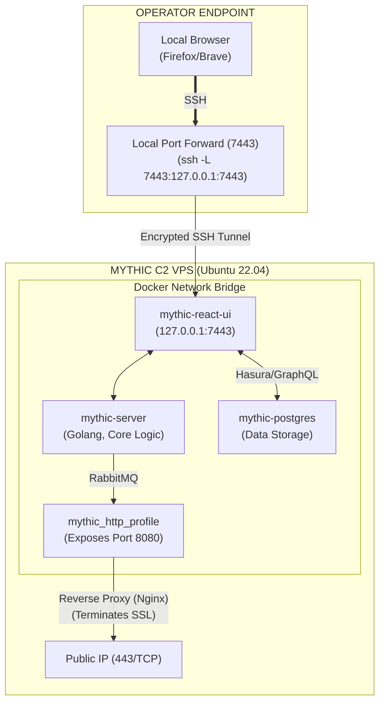

# 97.02 Deploying Mythic and Managing the Web Interface

## 1. Prerequisites and Environmental Setup

Deploying Mythic requires a highly stable and well-resourced foundation, typically a dedicated Linux host operating in a cloud environment. Due to its heavy reliance on microservices and containerization, the underlying operating system must have modern, up-to-date versions of Docker and Docker Compose installed.

### Strict Host Requirements
*   **Operating System:** Ubuntu 20.04/22.04 LTS or Debian 11/12 are highly recommended for optimal compatibility. Arch or RHEL variants can work but often require manual Docker networking tweaks.
*   **Hardware Specifications:** Minimum 4 CPU cores, 8GB RAM, and 50GB of disk space. **Do not skimp on RAM.** Compiling modern agents (like .NET or Golang payloads) inside Docker containers can be extremely memory-intensive. The Linux Out-of-Memory (OOM) killer terminating the payload build container mid-compilation is the most common deployment issue operators face if resources are inadequate.
*   **Required Software:** `git`, `make`, `docker` (engine >= 20.10), `docker-compose-plugin`.

### Initial Clone and Repository Setup
The Mythic repository is maintained by its creator, @its_a_feature_. The standard deployment sequence begins by cloning the core repository and leveraging the built-in `make` directives.

```bash
# Clone the repository
git clone https://github.com/its-a-feature/Mythic
cd Mythic

# Compile the management CLI
make
```

The `make` command compiles the `mythic-cli` Golang binary. This CLI tool is the absolute primary interface for managing the entire lifecycle of the C2 framework. It completely abstracts away raw `docker-compose` commands, ensuring proper environmental variables, volume mappings, and network bridges are set correctly.

## 2. Configuration via mythic-cli and .env

The `mythic-cli` binary generates, manages, and modifies a master `.env` file located in the root of the Mythic directory. This file dictates the behavior, credentials, and network bindings of all core containers.

### Core Configuration and Management Commands
Operators use `mythic-cli` to set operational parameters before starting the server and for ongoing maintenance:

```bash
# Start the Mythic server (spins up all core docker containers)
sudo ./mythic-cli start

# Stop the server cleanly without destroying data or active callbacks
sudo ./mythic-cli stop

# Install a payload type directly from GitHub (e.g., Apollo for Windows)
sudo ./mythic-cli install github https://github.com/MythicAgents/Apollo.git

# Install a payload type (e.g., Poseidon for Linux/macOS)
sudo ./mythic-cli install github https://github.com/MythicAgents/poseidon.git

# Install a C2 profile (e.g., HTTP egress)
sudo ./mythic-cli install github https://github.com/MythicC2Profiles/http.git
```

### Critical .env Variables Breakdown
A deep, intimate understanding of the generated `.env` file is necessary for advanced and secure deployments. Modifying these incorrectly can expose the C2 framework to the internet.
*   `MYTHIC_ADMIN_USER` / `MYTHIC_ADMIN_PASSWORD`: The initial credentials for the global administrator. These should be changed immediately upon first login.
*   `MYTHIC_SERVER_PORT`: Default is `7443`. This is the internal port the React UI and Hasura GraphQL engine bind to.
*   `MYTHIC_SERVER_BIND_LOCALHOST_ONLY`: **A critical OPSEC setting.** If set to `true`, the UI is only accessible via localhost (`127.0.0.1`), strictly requiring an SSH port forward or a reverse proxy to access. If `false`, it binds to `0.0.0.0`, exposing the management interface to the entire internet (Highly discouraged).
*   `RABBITMQ_PASSWORD`: Used for inter-container communication. Should be heavily randomized in production to prevent lateral container attacks.
*   `POSTGRES_PASSWORD`: Database credentials.

## 3. Mythic Deployment Architecture and Access Diagram



## 4. Web Interface Operations and OPSEC Workflow

The Mythic React UI is incredibly dense with functionality, designed explicitly for collaborative operations across distributed Red Teams.

### User, Role, and Operation Management
Mythic natively supports multi-tenant operations. The Global Administrator creates discrete "Operations" and assigns "Operators" to them.
*   **Operations Boundary:** Operations are strictly logical boundaries. Data, callbacks, and tasking from "Operation Alpha" are completely invisible to operators assigned only to "Operation Beta". This allows a single, powerful Mythic server to host multiple concurrent engagements or training scenarios safely without data spillage.
*   **Role-Based Access Control (RBAC):** Operators can be assigned as standard users (can task agents) or operation administrators (can manage operational settings, add members).

### The Callback Grid and Interactive Tasking
The primary working interface is the "Active Callbacks" screen. When an agent executes and checks in, it populates a row detailing its hostname, user context, IP address, PID, OS architecture, and last check-in time.
*   **Interactive Tasking Interface:** Clicking on a callback opens an interactive, terminal-like interface. Operators issue commands here (e.g., `ls`, `shell`, `execute-assembly`, `upload`).
*   **Browser-Based File Management:** The UI goes beyond a simple terminal. It provides graphical file browsers and process explorers. When an operator clicks through the file browser, Mythic secretly tasks the agent in the background (e.g., running `ls /target/dir`), parses the structured JSON response, and dynamically renders the UI view.

### Event Logging, MITRE Mappings, and Collaboration
Every single action taken in Mythic is logged to the PostgreSQL database and displayed in the Event Log. Operators can leave comments on specific tasks, assign tasks to specific team members, and tag command outputs for reporting. Mythic also allows operators to map specific tasks directly to MITRE ATT&CK techniques, generating a comprehensive log that can be exported for the Blue Team during the debriefing phase.

## 5. Reverse Proxy and SSL Termination Configuration

Exposing Mythic C2 profiles directly to the internet is exceptionally poor OPSEC. Advanced deployments always utilize a robust reverse proxy like Nginx, Caddy, or HAProxy to manage traffic routing, filter malicious/unwanted scanners, and handle SSL certificates via Let's Encrypt.

### Example Nginx Snippet for Mythic Payload Egress
```nginx
server {
    listen 443 ssl;
    server_name www.totallylegitdomain.com;

    ssl_certificate /etc/letsencrypt/live/totallylegitdomain.com/fullchain.pem;
    ssl_certificate_key /etc/letsencrypt/live/totallylegitdomain.com/privkey.pem;

    # Filter out common scanners and bad user agents
    if ($http_user_agent ~* (shodan|censys|zgrab|nmap)) {
        return 444; # Drop connection silently
    }

    # Route specifically matched C2 traffic to the internal Mythic HTTP Profile Container
    location ~ ^/(api/v1/update|api/v1/telemetry|assets/js/core.js)$ {
        proxy_pass http://127.0.0.1:8080; # Internal Mythic HTTP profile port
        proxy_set_header Host $host;
        proxy_set_header X-Real-IP $remote_addr;
        proxy_set_header X-Forwarded-For $proxy_add_x_forwarded_for;
    }

    # Redirect all other traffic to a benign decoy site
    location / {
        proxy_pass https://www.google.com;
    }
}
```

This configuration ensures that the Mythic infrastructure is protected by valid, verifiable TLS certificates, significantly reducing the likelihood of intermediate interception, hiding the self-signed certificates generated by Mythic internally, and preventing Blue Teams from actively profiling the C2 server.

## 6. Real-World Attack Scenario

### Setting up for an Assumed-Breach Engagement

A Red Team is preparing for an assumed-breach engagement inside a large financial institution. The operation requires extreme stealth and highly available infrastructure.

1.  **Infrastructure Provisioning:** The team spins up a rigid, locked-down Debian server in their controlled cloud environment (AWS).
2.  **Deployment & Lockdown:** They install Docker, clone Mythic, and run `make`. Using `mythic-cli`, they strictly lock `MYTHIC_SERVER_BIND_LOCALHOST_ONLY` to `true`.
3.  **Secure UI Access:** Operators connect to the Mythic UI by establishing SSH tunnels with local port forwarding (`ssh -i redteam_key -L 7443:127.0.0.1:7443 operator@c2-server`). This ensures absolutely no C2 management ports are exposed to scanning services like Shodan.
4.  **Profile Installation:** They use `mythic-cli` to install the `http` profile for initial egress.
5.  **External Redirector Setup:** Instead of exposing the `http` profile on the main C2 server directly to the target network, they set up an Apache server on a separate, disposable VPS (the Redirector). The Redirector uses `mod_rewrite` to forward requests matching specific C2 URIs to the backend Mythic server, while bouncing all other traffic.
6.  **Operation Initialization:** The Lead Operator logs into the UI via localhost, creates "Operation Manticore", invites the team members via unique login links, and sets up a global webhook to send Slack notifications to the Red Team channel whenever a new agent checks in or a high-value task completes.

This robust, multi-tiered setup ensures high availability, extremely tight OPSEC against Blue Team active scanning, and secure, real-time collaboration among the red team.

## 7. Chaining Opportunities

*   Proper deployment allows seamless chaining into [[03 - Mythic C2 Profiles HTTP WebSocket SMB]] for configuring the specific egress channels that will talk back to this deployed infrastructure.
*   Once the infrastructure is up, the UI is used to dynamically generate payloads as detailed in [[04 - Understanding Mythic Payload Types Agents]].
*   Deployments can be fully automated via CI/CD pipelines (e.g., using Terraform and Ansible scripts) for rapid, repeatable infrastructure spin-up as detailed in [[12 - Infrastructure Obfuscation and Redirectors]].

## 8. Related Notes

*   [[01 - Introduction to Mythic C2 Architecture and Docker]]
*   [[03 - Mythic C2 Profiles HTTP WebSocket SMB]]
*   [[04 - Understanding Mythic Payload Types Agents]]
*   [[12 - Infrastructure Obfuscation and Redirectors]]
*   [[22 - Nginx and HAProxy Traffic Filtering for Red Teams]]
