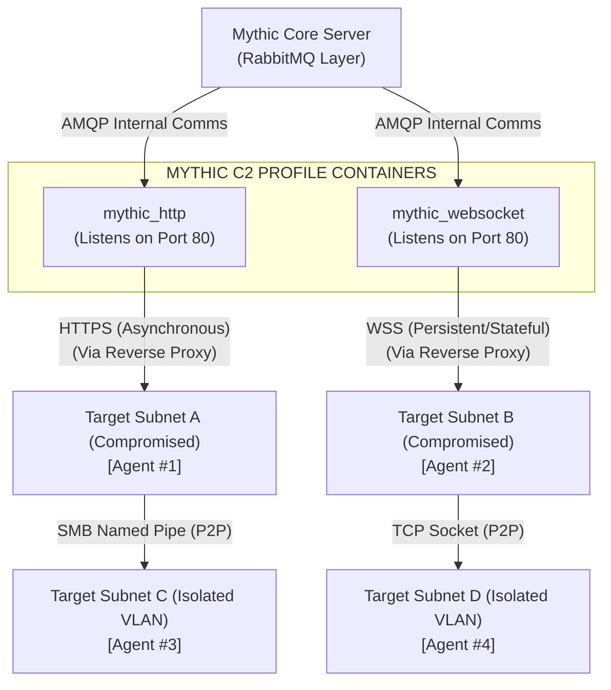

# 97.03 Mythic C2 Profiles HTTP WebSocket SMB

## 1. Introduction to C2 Profiles in Mythic

In the Mythic ecosystem, a "C2 Profile" is an entirely independent Docker container responsible for managing the network communications between the deployed agent (payload) and the core Mythic server. This complete separation of concerns is a defining, architectural feature of Mythic: the agent handles execution logic on the target, while the C2 Profile handles the transportation and routing of data.

This means an operator can take a single agent framework, such as Apollo, and instruct it to communicate over HTTP, SMB, WebSockets, TCP, or even DNS simply by linking it to the appropriate C2 Profile during the payload generation phase. The agent's core code remains the same; only the communication wrapper changes.

## 2. Egress Profiles: Exiting the Target Network

Egress profiles are specifically designed to cross the boundary from the target's internal network out to the internet, reaching the operator's external redirectors or C2 infrastructure.

### The HTTP Profile: The Workhorse
The HTTP profile is the foundation of modern C2 operations. It masquerades command and control traffic as standard, benign web traffic (HTTP/HTTPS).

*   **Malleability and Customization:** The Mythic HTTP profile is highly configurable via a `config.json` file. Operators can specify custom HTTP headers (e.g., spoofing `User-Agent` strings to match corporate browsers, adding fake `Authorization` or `Cookie` tokens), modify GET/POST URIs, and determine whether data is embedded in URL parameters, HTTP headers, or POST bodies.
*   **Encryption and Cryptography:** The profile natively supports AES256 encryption. Before the payload wraps its message in the HTTP protocol, the core agent encrypts the tasking/response. This ensures that even if network defenders perform SSL inspection/decryption on the HTTP traffic, the underlying C2 payload remains encrypted and unreadable.
*   **Jitter and Asynchronous Sleep:** The HTTP profile natively supports asynchronous beaconing. Agents sleep for defined intervals with a randomized jitter percentage. If an agent is set to sleep for 60 seconds with 20% jitter, it will randomly check in anywhere between 48 and 72 seconds, completely breaking programmatic, Fourier-transform-based beacon detection algorithms.

### The WebSocket Profile: Persistent Connections
WebSockets provide a persistent, bi-directional communication channel over a single TCP connection (which is initially established via an HTTP upgrade request, allowing it to pass through most web proxies).

*   **Low Latency / Interactive Speed:** Unlike HTTP polling, which introduces severe latency based on the sleep interval, WebSockets allow for near real-time interaction. As soon as a command is issued by the operator in the UI, it is instantly pushed down the active socket to the agent.
*   **Evasion Considerations (The Trade-off):** While excellent for interactive operations (like running an internal SOCKS proxy or managing a rapid lateral movement campaign), long-lived TCP connections can be highly anomalous. In environments where standard users rarely maintain persistent websocket connections to unknown domains, this can easily trigger behavioral network alerts.

## 3. C2 Profile Architecture and Routing Diagram



## 4. Peer-to-Peer (P2P) Profiles: Internal Lateral Movement

P2P profiles are utilized when a target machine does not have direct internet access, or when a red team operator wishes to deliberately minimize external egress points to reduce the chance of network perimeter detection. P2P agents route their traffic internally through another compromised host (the "egress node") that has a path out.

### The SMB Profile (Named Pipes)
Server Message Block (SMB) named pipes are the absolute primary method for stealthy lateral C2 traffic in Windows Active Directory environments.

*   **Mechanism of Action:** Agent #3 (in isolated Subnet C) creates an SMB named pipe listener (e.g., `\\.\pipe\atsvc_update`). Agent #1 (which has an active HTTP egress) connects to this pipe over the internal network. Agent #3 sends its encrypted data to Agent #1 over the pipe, and Agent #1 multiplexes and forwards that data out to the external Mythic Server.
*   **Stealth and Blending:** SMB traffic is ubiquitous in Windows environments. Named pipe communication over port 445 blends seamlessly with standard administrative operations, Group Policy updates, and file-sharing traffic. It rarely triggers internal lateral movement alerts unless the specific pipe name is signatured by an EDR.

### The TCP Profile (Raw Sockets)
The TCP profile allows agents to bind a raw TCP socket to a specific local port and listen for incoming connections from other agents.

*   **Cross-Platform Flexibility:** While SMB is heavily Windows-focused, TCP is platform-agnostic. A Linux agent (e.g., Poseidon) can listen on a TCP port, and a Windows agent can connect to it to route traffic out of the network. This is crucial for mixed-OS environments where a Linux server acts as the primary egress pivot.

## 5. Profile Configuration and Malleable C2

When an operator installs a C2 profile via `mythic-cli`, its configuration structure is made accessible within the Mythic Web UI. 

### Example HTTP Profile Configuration (config.json structure)
This configuration dictates both how the Mythic Server parses incoming traffic, and how the payload is compiled to structure its outbound traffic.

```json
{
  "callback_interval": 60,
  "callback_jitter": 20,
  "headers": [
    {
      "key": "User-Agent",
      "value": "Mozilla/5.0 (Windows NT 10.0; Win64; x64) AppleWebKit/537.36 (KHTML, like Gecko) Chrome/91.0.4472.124 Safari/537.36"
    },
    {
      "key": "Accept-Language",
      "value": "en-US,en;q=0.9"
    },
    {
      "key": "Cookie",
      "value": "session_id=8f7d6a5s4d3f2g1h"
    }
  ],
  "get_uri": "/api/v2/update",
  "post_uri": "/api/v2/telemetry",
  "crypt_type": "aes256_hmac"
}
```
During payload generation, these exact parameters are hardcoded/stamped into the payload binary. The C2 Profile container reads this exact same configuration to understand how to parse incoming requests. If an incoming request does not match this format exactly, the Mythic C2 profile drops it, mitigating active scanning by Blue Teams.

## 6. Real-World Attack Scenario

### Navigating a Segmented Defense-in-Depth Environment

An advanced threat actor has compromised an external-facing DMZ web server (Linux) via an unpatched Remote Code Execution (RCE) vulnerability.

1.  **Establishing the Beachhead (HTTP):** The attacker deploys a `Poseidon` payload configured with the `http` C2 profile to the DMZ web server. It beacons successfully to the external Mythic infrastructure, blending in with regular web traffic.
2.  **Internal Network Discovery:** From the DMZ server, the attacker utilizes built-in network scanning commands to discover a highly sensitive database server on an internal VLAN. This internal VLAN cannot reach the internet directly (no NAT, strict firewall egress rules).
3.  **Lateral Payload Generation:** The attacker uses the Mythic UI to generate a new payload (an `Apollo` agent for Windows) but explicitly selects the `tcp` C2 profile instead of HTTP. They configure the TCP profile to listen internally on port `8080`.
4.  **Deployment and P2P Linking:** They deploy this payload to the internal database server via compromised credentials. Once running, the Apollo agent simply listens silently on port 8080. From the Mythic UI, interacting with the original DMZ agent, the attacker issues a `link` command, pointing the DMZ agent to the internal IP of the database server on port 8080.
5.  **Seamless Routed Execution:** The P2P connection is established. A new callback appears in the Mythic UI for the database server. When the attacker issues a command to the database server agent, the Mythic Core routes the tasking to the `http` C2 container -> down to the DMZ agent -> across the internal TCP socket -> to the database agent. The command results flow back up the exact same path. The database server never touches the internet.

## 7. Chaining Opportunities

*   C2 profiles are useless on their own; they must be explicitly chained with specific [[04 - Understanding Mythic Payload Types Agents]] to be operational. Not all agents support all profiles (e.g., an agent must be explicitly programmed in C#/C to handle named pipes to use the SMB profile).
*   Understanding advanced profile configuration is absolutely crucial for setting up external [[12 - Infrastructure Obfuscation and Redirectors]] to ensure headers and URIs match the redirector's `mod_rewrite` filtering rules perfectly.

## 8. Related Notes

*   [[01 - Introduction to Mythic C2 Architecture and Docker]]
*   [[04 - Understanding Mythic Payload Types Agents]]
*   [[05 - Apollo Agent Advanced Windows C2]]
*   [[33 - Lateral Movement via SMB and Named Pipes]]
*   [[45 - Network Traffic Analysis Evasion]]
