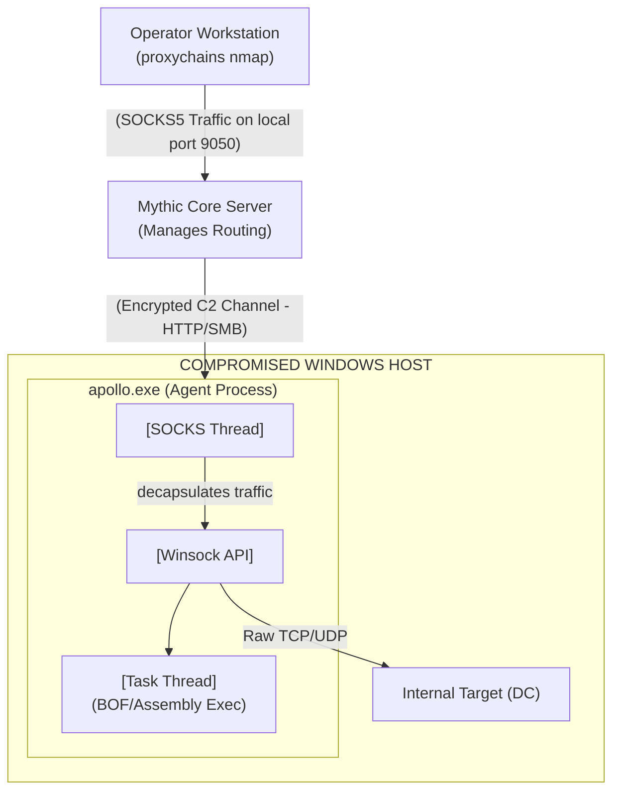

# 97.05 Apollo Agent Advanced Windows C2

## 1. Introduction to the Apollo Agent

Apollo is arguably the premier, most advanced Windows-centric payload type available within the Mythic C2 framework. Written entirely in C# and deeply leveraging the .NET Framework / .NET Core, Apollo is explicitly designed for complex, stealthy, post-exploitation operations in heavily monitored Active Directory environments. 

Unlike basic remote access trojans (RATs) that rely heavily on spawning `cmd.exe` or `powershell.exe` for task execution—actions which are highly monitored and instantly flagged by modern Endpoint Detection and Response (EDR) solutions—Apollo executes the vast majority of its core capabilities purely in memory, directly interfacing with the Windows API.

## 2. Core Capabilities and In-Memory Execution

Apollo’s true strength lies in its profound integration with the Common Language Runtime (CLR) and the Windows API via Platform Invocation Services (P/Invoke).

### Execute-Assembly (The Workhorse)
One of the most critical OPSEC features for modern Windows Red Teaming is `execute_assembly`. This command allows an operator to upload a compiled .NET executable (e.g., tooling like BloodHound, Rubeus, or Seatbelt) and execute it directly in the memory space of the Apollo agent's current process (or injected into a spawned sacrificial process like `werfault.exe`). 
*   **The EDR Bypass:** The .NET executable never touches the physical hard drive. This bypasses standard static file analysis and traditional antivirus file scanning entirely, allowing operators to run massive toolsets invisibly.

### Beacon Object Files (BOFs)
Originally popularized by the commercial framework Cobalt Strike, BOFs are unlinked C objects (essentially raw, compiled C code) that execute directly within the beacon's existing memory space. Apollo natively supports executing BOFs.
*   **The Advantage:** BOFs are extremely lightweight and execute incredibly fast. Because they use direct Windows API calls without launching new processes, they are highly evasive against process-creation monitoring (Windows Event ID 4688) and command-line logging.

### SOCKS5 Proxying and Routing
Apollo can instantiate a fully functional SOCKS5 proxy server directly inside the agent. This capability routes TCP traffic from the operator's local attack machine (e.g., using `proxychains`) through the Mythic Server, down the encrypted C2 channel, and out the compromised Windows host. This allows operators to run standard tools like `nmap`, `impacket`, or `crackmapexec` against internal network segments directly from their Kali Linux machines, treating the compromised Windows box as an invisible router.

## 3. Apollo Execution Flow and SOCKS Routing Diagram

## 4. Evasion, Sleep, and Jitter Mechanics

To actively avoid behavioral detection heuristics and network traffic analysis, Apollo implements advanced sleep and execution obfuscation techniques.

*   **Asynchronous Beaconing:** Apollo does not hold an open connection to the server unless explicitly using WebSockets. It wakes up, checks in over HTTP/SMB, retrieves queued tasks, sends command responses, and immediately goes back to sleep.
*   **Jitter:** If sleep is set to 60 seconds with a 20% jitter factor, the agent will dynamically randomize its check-in interval between 48 and 72 seconds. This completely breaks programmatic, Fourier-transform-based beacon detection algorithms used by network security monitors (like Zeek or Suricata).
*   **Thread Obfuscation (Sleep Obfuscation):** While advanced thread stack spoofing requires very specific configurations, modern iterations and community extensions of Apollo aim to hide the beacon's execution thread while it is in a sleep state. This involves manipulating thread contexts to make the memory space look benign, rendering it invisible to in-memory scanners (like YARA or BeaconHunter) searching for suspicious, unbacked memory segments during sleep cycles.

## 5. Token Manipulation and Privilege Escalation

Apollo excels in Active Directory environments due to its robust, built-in token manipulation and impersonation capabilities.

*   **make_token:** Allows operators to input known credentials (username, domain, password) to create a new, invisible logon session and impersonate that specific token for subsequent network actions (e.g., accessing a remote, restricted file share). Crucially, this happens without altering the primary process token or spawning a visible `runas` process.
*   **steal_token:** This command operates by opening a handle to a process running as a different user on the same machine (e.g., a Domain Admin who left an RDP session active) and duplicating its access token. Apollo can then apply this stolen token to its own executing thread, effectively escalating privileges and entirely assuming the identity of the target user for lateral movement.

## 6. Real-World Attack Scenario

### Lateral Movement via In-Memory Tooling and Token Theft

A red team has established an initial foothold on a standard user's Windows 10 workstation using an Apollo HTTP payload delivered via phishing.

1.  **Situational Awareness:** The operator runs `execute_assembly Seatbelt.exe` to gather system information silently. They then run `execute_assembly Rubeus.exe triage` to view Kerberos tickets in memory. They hit the jackpot: they discover a Domain Admin ticket residing in memory because a helpdesk administrator recently logged into this machine.
2.  **Process Injection / Token Theft:** The operator identifies the process ID owned by the Domain Admin. They use Apollo's `steal_token <PID>` command. Apollo successfully duplicates and impersonates the high-privilege token.
3.  **Lateral Movement:** The operator now has Domain Admin privileges in the context of the network. They use Apollo to execute a BOF (Beacon Object File) implementation of WMI (Windows Management Instrumentation) to execute a new, secondary SMB-based Apollo payload directly on the primary Domain Controller.
4.  **P2P Communication:** The newly executed Apollo payload on the Domain Controller binds to an SMB named pipe. The operator uses the `link` command on their initial workstation agent to connect to the DC.
5.  **Domain Compromise:** The operator now has highly privileged, entirely in-memory execution on the Domain Controller. The command traffic routes stealthily through the SMB pipe back to the initial workstation, and then out via the HTTP beacon, bypassing the DC's strict outbound internet firewall.

## 7. Chaining Opportunities

*   Apollo relies heavily on [[03 - Mythic C2 Profiles HTTP WebSocket SMB]] for both external egress and internal P2P communications.
*   The payload generation, configuration, and module inclusion process for Apollo is strictly governed by the principles outlined in [[04 - Understanding Mythic Payload Types Agents]].
*   Techniques utilized heavily by Apollo (like BOF execution, Assembly injection, and token manipulation) map directly to advanced OPSEC practices detailed in [[55 - In-Memory Evasion and Tradecraft]].

## 8. Related Notes

*   [[01 - Introduction to Mythic C2 Architecture and Docker]]
*   [[04 - Understanding Mythic Payload Types Agents]]
*   [[42 - Active Directory Domain Privilege Escalation]]
*   [[55 - In-Memory Evasion and Tradecraft]]
*   [[66 - Advanced Token Manipulation and Impersonation]]
