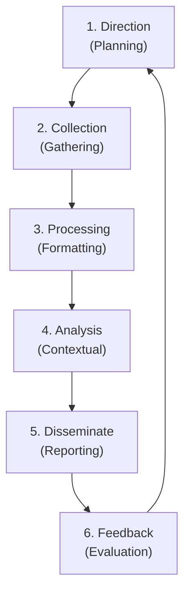

# The Intelligence Cycle: Direction, Collection, Processing

## 1. Executive Summary

The Intelligence Cycle is the foundational framework that transforms raw data into finished, actionable intelligence. Derived from traditional espionage and military intelligence doctrines (such as those used by the CIA, NSA, and DoD), the cyber iteration of this cycle ensures that Threat Intelligence teams do not merely collect data aimlessly, but operate with purpose, efficiency, and alignment to business goals. 

The cycle is continuous and iterative. The feedback from the final stage directly influences the beginning of the next cycle. In this deep dive, we will comprehensively cover the entire lifecycle, with an extensive focus on the first three critical phases: Direction, Collection, and Processing, while acknowledging Analysis, Dissemination, and Feedback.

## 2. The Intelligence Cycle Anatomy

The standard Cyber Threat Intelligence (CTI) cycle consists of six distinct phases. If any phase is neglected, the entire program degrades. Without direction, collection is noise. Without processing, analysis is impossible. Without dissemination, intelligence is useless.

1. **Direction** (Planning & Requirements)
2. **Collection** (Data Gathering)
3. **Processing** (Formatting & Normalization)
4. **Analysis** (Contextualization & Synthesis)
5. **Dissemination** (Reporting & Delivery)
6. **Feedback** (Evaluation & Iteration)

### ASCII Diagram: The Continuous Intelligence Cycle

## 3. Phase 1: Direction (Planning and Requirements)

The Direction phase, often called Planning and Requirements, is arguably the most critical step. Without clear direction, a CTI team will drown in a sea of irrelevant threat feeds. This phase answers the fundamental question: *What do we need to know?* It requires deep alignment between the intelligence team and the organization's executive leadership.

### 3.1. Priority Intelligence Requirements (PIRs)
PIRs are the high-level, business-driven questions that leadership needs answered to protect the organization. They must be specific, actionable, and aligned with risk management. They are not technical; they are strategic.

- **Poor PIR**: "Tell me about hackers." (Too broad, unactionable).
- **Poor PIR**: "Give me all malicious IPs." (Not a requirement, just a data request).
- **Good PIR**: "Which advanced persistent threat (APT) groups are currently targeting financial institutions in North America using ransomware, and what are their initial access vectors?"

### 3.2. Specific Intelligence Requirements (SIRs)
SIRs break down the PIRs into more manageable, tactical questions. If the PIR is the destination, the SIRs are the map.
- **SIR Example**: "What specific phishing themes, email subjects, and malicious document types are being utilized by APT29 against the banking sector?"
- **SIR Example**: "What vulnerabilities are currently being exploited in the wild by ransomware operators targeting public-facing VPN infrastructure?"

### 3.3. Essential Elements of Information (EEIs)
EEIs are the atomic, highly technical data points required to answer the SIRs. These are the explicit requests given to the collection managers.
- **EEI Example**: "List of sender email addresses, subject lines, and SHA256 file hashes of the attachments associated with recent APT29 campaigns."
- **EEI Example**: "PCAP data showing the network traffic signatures of the CVE-2024-XXXX exploit."

## 4. Phase 2: Collection

Once requirements are defined via EEIs, the Collection phase begins. This involves gathering raw data that satisfies those requirements. Crucially, collection is not analysis; it is simply the acquisition of raw material. 

Collection can be categorized into Active (interacting directly with adversary infrastructure, requiring extreme OPSEC) and Passive (gathering data without alerting the adversary).

### 4.1. Internal Collection Sources
Often the most valuable data is internal, as it reflects the actual attacks the organization is already experiencing. Internal data is high-fidelity and extremely relevant.
- SIEM (Security Information and Event Management) alerts and centralized logs.
- Firewall, IDS/IPS, WAF (Web Application Firewall), and DNS telemetry.
- Endpoint Detection and Response (EDR) telemetry (process creation, registry edits).
- Incident Response (IR) reports and malware analysis from previous internal breaches.
- Honeypots, honey-tokens, and deception technology telemetry.

### 4.2. External Collection Sources
External data provides the broader context of the threat landscape beyond the organization's perimeter.
- **OSINT (Open-Source Intelligence)**: Blogs, forums, Twitter/X, GitHub repositories, news articles, paste sites. OSINT is free but requires significant processing to verify.
- **Commercial Feeds**: Paid threat intel subscriptions (e.g., Recorded Future, CrowdStrike Falcon Intelligence, Mandiant). These are generally high-fidelity.
- **Closed-Source/Deep Web/Dark Web**: Dark web forums, Telegram channels, illicit marketplaces, ransomware leak sites. Collecting from here often involves fake personas (sock puppets) and requires strict operational security.
- **Information Sharing Centers**: ISACs (Information Sharing and Analysis Centers) tailored to specific industries (e.g., FS-ISAC for finance, H-ISAC for healthcare).
- **Technical Repositories & Scanners**: VirusTotal, Shodan, Censys, URLScan.io.

### 4.3. Collection Management and OPSEC
Organizations must carefully manage their collection to avoid "feed fatigue." Ingesting millions of IoCs daily without filtering leads to SIEM performance degradation and analyst burnout. 

Furthermore, Collection requires rigorous OPSEC (Operational Security). If an analyst uses their corporate IP address to browse a dark web forum or downloads a malware sample from a known adversary C2 server, the adversary now knows they are being investigated by that specific organization.

## 5. Phase 3: Processing

Processing is the mechanical transformation of collected raw data into a structured format suitable for analysis. Raw data is often messy, unstructured, varied, and incompatible with analytical tools. Processing takes the noise and organizes it.

### 5.1. Normalization and Structuring
Translating disparate data formats (CSV, PDF, unstructured text, JSON, XML) into a common, standardized taxonomy. 
- For example, ensuring that an IP address is always stored in a field called `destination_ip` rather than varying between `ip_addr`, `dst`, and `target` depending on the feed source.
- Converting all timestamps to UTC to ensure chronological consistency across global data sources.

### 5.2. Data Enrichment
Adding context to raw indicators. A raw IP address is nearly useless without enrichment.
- Taking a raw IP address and appending its ASN (Autonomous System Number), BGP routing info, geolocation, and WHOIS registration data.
- Running a raw hash through VirusTotal to pull down associated behavioral signatures, AV detections, and related network traffic.
- Identifying if an IP is a known Tor exit node or a commercial VPN provider.

### 5.3. Deduplication and Filtering
Removing redundant data. If five different threat feeds report the same malicious domain, the processing engine should collapse these into a single record with a higher confidence score, rather than generating five separate alerts.
Furthermore, filtering removes false positives. A robust processing pipeline will have whitelists to ensure `8.8.8.8` (Google DNS) or `127.0.0.1` are not accidentally processed as malicious IoCs, which could cause catastrophic network outages if automatically blocked.

### 5.4. Translation, Decryption, and Parsing
- Translating foreign language posts from dark web Russian forums into English using automated NLP models.
- Decrypting payload configurations extracted from malware samples.
- Parsing unstructured PDF threat reports into STIX (Structured Threat Information Expression) format using Natural Language Processing.

## 6. Phase 4: Analysis (The Human Element)

Processing prepares the data; Analysis makes sense of it. Analysts synthesize the processed data, look for patterns, and apply critical thinking. They formulate hypotheses and validate them against the data. A major challenge in this phase is overcoming cognitive biases:

- **Confirmation Bias**: The tendency to search for, interpret, and favor information that confirms one's pre-existing beliefs.
- **Mirror-Imaging**: The assumption that the adversary thinks, acts, and has the same motivations as the analyst.
- **Anchoring**: Relying too heavily on the first piece of information acquired when making decisions.

## 7. Phase 5: Dissemination

Delivering the finished intelligence to the right audience, in the right format, at the right time. 

### 7.1. Delivery Formats
- A strategic brief (PDF) for the CISO.
- STIX/TAXII machine-readable feeds sent directly to the firewall for automated blocking.
- YARA rules distributed to the Threat Hunting team.

### 7.2. Traffic Light Protocol (TLP)
Dissemination utilizes TLP to govern how the intelligence can be shared:
- **TLP:RED**: For the eyes and ears of individual recipients only. No further disclosure.
- **TLP:AMBER**: Limited disclosure, restricted to participants' organizations.
- **TLP:GREEN**: Limited disclosure, restricted to the community.
- **TLP:CLEAR**: Disclosure is not limited. Publicly shareable.

## 8. Phase 6: Feedback

Assessing whether the intelligence met the original PIRs. Did it help? Was it timely? Was the format correct? This feedback refines the Direction phase for the next cycle. If the CISO says, "This report was too technical," the next cycle adjusts the dissemination format. Without feedback, the cycle becomes stagnant.

## 9. Real-World Attack Scenario: Applying the Cycle

### The Scenario: E-Commerce Magecart Threat

1. **Direction**: The CISO of an e-commerce company establishes a PIR: "Identify and track threat actors conducting digital skimming (Magecart) attacks against our specific e-commerce platform (Magento) to prevent customer data theft."
2. **Collection**: 
   - The CTI team sets up OSINT alerts for "Magento vulnerabilities" and "digital skimming."
   - They subscribe to a commercial feed specializing in financial fraud.
   - They deploy a honey-token (fake credit card data) within their payment gateway to detect unauthorized access.
   - They collect JavaScript files loaded on their checkout pages daily for baseline comparison.
3. **Processing**:
   - The team uses an automated script to download newly registered domains containing variations of their brand name (typosquatting).
   - They process obfuscated JavaScript found on a suspicious newly registered domain, de-obfuscating it using automated tools to reveal a skimming payload.
   - The extracted exfiltration URLs are normalized, deduplicated, and enriched with WHOIS data, revealing they are hosted on a bulletproof provider in Russia.
4. **Analysis & Beyond**: Analysts confirm the de-obfuscated script matches known Magecart Group 4 signatures. They disseminate the exfiltration domains to the firewall team for immediate automated blocking, preventing the theft of customer credit card data. The feedback indicates the process worked, but processing the JavaScript took too long, leading to a new requirement for better automated de-obfuscation tools in the next cycle's planning phase.

## 10. Chaining Opportunities

- The Intelligence Cycle directly supports the operationalization of the [[04 - Threat Modeling Frameworks Diamond Model]] by providing structured, vetted data for adversary profiling.
- The output of the processing and analysis phases is heavily categorized into the intelligence tiers discussed in [[03 - Tactical vs Operational vs Strategic Intelligence]].
- EEIs (Essential Elements of Information) often map directly to data sources required to detect specific techniques defined in the [[05 - Mitre ATT&CK Framework Deep Dive]].

## 11. Related Notes

- [[01 - Introduction to Cyber Threat Intelligence CTI]]
- [[03 - Tactical vs Operational vs Strategic Intelligence]]
- [[04 - Threat Modeling Frameworks Diamond Model]]
- [[05 - Mitre ATT&CK Framework Deep Dive]]
