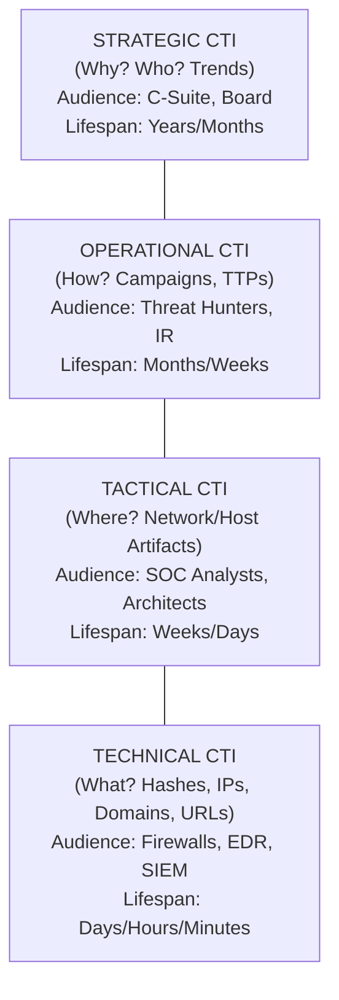

# Tactical vs Operational vs Strategic Intelligence

## 1. Executive Summary

Cyber Threat Intelligence (CTI) is not a monolith. Information that is absolutely critical to a Security Operations Center (SOC) analyst investigating a triggered alert may be entirely useless, and frankly confusing, to a Chief Information Security Officer (CISO) trying to allocate the annual cybersecurity budget. To be effective, intelligence must be precisely tailored to its consumer. Delivering the wrong type of intelligence to an audience guarantees it will be ignored.

The intelligence community standardizes this taxonomy into distinct layers: Strategic, Operational, Tactical, and Technical. Understanding the boundaries, inputs, outputs, goals, and audiences of each layer is essential for building a functional CTI program and ensuring that actionable intelligence reaches the right stakeholders at the right time.

## 2. The Intelligence Hierarchy

The hierarchy of intelligence reflects a transition from high-level, long-term business abstractions down to low-level, short-term technical details. The further up the pyramid you go, the longer the lifespan of the intelligence, but the harder it is to collect and analyze.

### ASCII Diagram: The Intelligence Pyramid



## 3. Strategic Intelligence

Strategic intelligence provides a high-level overview of the threat landscape. It is less concerned with specific IP addresses and more concerned with geopolitical shifts, overall adversary intent, and systemic risks to the business sector. It is the intersection of cybersecurity, business risk, and global affairs.

- **The Primary Question**: *Who* is targeting us, and *Why*? What is the financial, reputational, or geopolitical impact?
- **Audience**: Executive leadership (CEO, CISO), Board of Directors, Risk Management teams, Legal.
- **Focus Areas**: 
  - Emergence of new threat actor motivations (e.g., state-sponsored actors shifting from espionage to financial crime to fund sanctioned regimes).
  - High-level trends in attack vectors (e.g., a 300% increase in supply-chain attacks globally, the rise of AI-generated deepfakes in social engineering).
  - Legislative, regulatory, or compliance changes impacting cyber risk.
  - Cost-benefit analysis of security investments.
- **Output Formats**: Executive summaries, whitepapers, quarterly threat landscape briefings, risk matrix updates, PowerPoint presentations.
- **Collection Sources**: OSINT news, geopolitical analysis, high-level reporting from cybersecurity vendors (e.g., Mandiant M-Trends, Verizon DBIR), industry sharing groups (ISACs).

### 3.1. Strategic Intel Mock Example
> "Ransomware syndicates are increasingly targeting healthcare providers due to their low tolerance for downtime and willingness to pay. We must increase our capital expenditure budget for offline, immutable backups over the next fiscal year to mitigate this systemic risk. Additionally, new SEC guidelines require public disclosure of material breaches within 4 days, necessitating an overhaul of our internal incident communication protocol."

## 4. Operational Intelligence

Operational intelligence bridges the gap between strategic intent and technical execution. It focuses on the specific campaigns, infrastructures, and behaviors of threat actors over a medium-term timeframe.

- **The Primary Question**: *How* and *When* are the adversaries operating? What are their specific campaigns?
- **Audience**: Threat Hunting teams, Incident Response (IR) commanders, Security Engineering managers, Vulnerability Management teams.
- **Focus Areas**:
  - Profiling specific threat actors (e.g., FIN7, APT29, Scattered Spider, Lapsus$).
  - Tracking shifts in adversary infrastructure or tooling over time (e.g., "Actor X has stopped using Cobalt Strike and moved to Brute Ratel").
  - Identifying the specific targeting criteria of an active campaign (e.g., phishing campaigns specifically targeting HR departments with fake resume attachments).
- **Output Formats**: Actor profiles, campaign tracking reports, threat models (like the Diamond Model), YARA/Sigma rule deployment strategies.
- **Collection Sources**: Deep web monitoring, malware reverse engineering reports, telemetry from internal incidents, honeypots.

### 4.1. Operational Intel Mock Example
> "The threat group 'Scattered Spider' is currently executing a campaign targeting cloud identity providers. They are using highly convincing voice-phishing (vishing) directed at IT helpdesks to bypass MFA. We must immediately alert the helpdesk, simulate a vishing attack in our next Red Team engagement, and initiate mandatory video-verification protocols for password resets."

## 5. Tactical Intelligence

Tactical intelligence deals with the exact methodologies used by attackers on the ground. It is highly structured around Tactics, Techniques, and Procedures (TTPs). It is technical, but focused on behavior rather than static signatures.

- **The Primary Question**: *Where* and *How exactly* on the network or endpoint does the attack manifest?
- **Audience**: SOC Analysts Level 2/3, Network Defenders, SIEM Rule Creators, Detection Engineers.
- **Focus Areas**:
  - The precise command-line arguments used by an attacker to execute a payload.
  - The specific API calls a piece of malware makes to inject into memory.
  - The exploitation methodology and payload delivery mechanism of a newly released CVE.
- **Output Formats**: MITRE ATT&CK technique mappings, detailed technical write-ups, incident post-mortems, SIEM detection logic, YARA rules.
- **Collection Sources**: Malware sandbox outputs, packet captures (PCAPs), endpoint telemetry, OSINT technical blogs, reverse engineering notes.

### 5.1. Tactical Intel Mock Example (Sigma Rule Snippet)
```yaml
title: Detects Suspicious PowerShell Download
logsource:
    category: process_creation
    product: windows
detection:
    selection:
        CommandLine|contains|all:
            - 'powershell.exe'
            - 'Net.WebClient'
            - 'DownloadString'
            - '-Hidden'
    condition: selection
```

## 6. Technical Intelligence

Technical intelligence is the absolute lowest level of the pyramid. It consists of the atomic, highly ephemeral data points—the Indicators of Compromise (IoCs). It has a very short shelf life.

- **The Primary Question**: *What* exact artifacts do we block or alert on right now?
- **Audience**: Automated systems (Firewalls, IDS/IPS, WAF, EDR, SOAR platforms), SOC Level 1 Triage Analysts.
- **Focus Areas**:
  - Malicious IP addresses.
  - Command and Control (C2) domains.
  - File hashes (MD5, SHA1, SHA256).
  - Malicious URLs and URI paths.
- **Output Formats**: STIX/TAXII automated machine-to-machine feeds, JSON/CSV lists, blocklists.
- **Collection Sources**: Threat intelligence platforms (TIPs), automated malware analysis platforms, spam traps.

### 6.1. Technical Intel Mock Example (STIX JSON Snippet)
```json
{
  "type": "indicator",
  "id": "indicator--8e2e2d2b-17d4-4cbf-938f-98ee46b3cd3f",
  "pattern": "[ipv4-addr:value = '198.51.100.45']",
  "pattern_type": "stix",
  "valid_from": "2026-01-01T00:00:00Z",
  "name": "Malicious C2 IP associated with Emotet"
}
```

## 7. Intelligence Decay and Lifecycle Management

A critical concept differentiating these layers is the rate of decay.
- **Technical Intel** decays in minutes to days. An IP address is quickly abandoned.
- **Tactical Intel** decays in weeks to months. An attacker might change their command-line arguments, but the underlying technique (e.g., Scheduled Tasks) takes time to change.
- **Operational Intel** decays in months to years. An adversary's reliance on specific third-party infrastructure providers takes significant time to shift.
- **Strategic Intel** decays over years. The geopolitical motivations of a nation-state to steal intellectual property remain constant for decades.

Organizations must implement lifecycle management for Technical Intel. A firewall blocklist cannot grow indefinitely; IPs blocked a year ago are likely benign today. An automated aging-out process is required.

## 8. Real-World Attack Scenario: Multi-layered Defense

### The Scenario: State-Sponsored Espionage

1. **The Attack**: APT33 (Elfin), a state-sponsored actor, targets an aerospace engineering firm to steal intellectual property regarding a new drone design.
2. **Technical Response**: The automated firewall ingests a *Technical Intelligence* feed and successfully blocks an outbound connection to a known APT33 C2 domain. The alert goes to the SOC.
3. **Tactical Response**: The SOC analyst uses *Tactical Intelligence* to realize that APT33 often uses living-off-the-land techniques and does not rely on a single C2. The analyst hunts for anomalous `wmi.exe` and `powershell.exe` executions around the time of the blocked connection, discovering that the adversary had already established persistence via WMI event subscriptions.
4. **Operational Response**: The Incident Response team references *Operational Intelligence* profiles on APT33, noting their historical use of custom password spray tools and rapid lateral movement toward domain controllers. The IR team moves quickly to reset all privileged credentials, isolate critical engineering subnets, and deploy honeypots tailored to APT33's known tooling.
5. **Strategic Response**: After the incident is contained, the CISO presents *Strategic Intelligence* to the board. The brief explains that state-sponsored intellectual property theft is an escalating, long-term, existential threat to the business model, driven by global aerospace competition. The board approves a strategic initiative to migrate the most sensitive proprietary data to a highly restricted, air-gapped, zero-trust environment.

## 9. Chaining Opportunities

- The separation of these intelligence layers determines how data collected in [[02 - The Intelligence Cycle Direction Collection Processing]] is ultimately processed and disseminated.
- Tactical Intelligence is entirely reliant on standardized frameworks, the most prominent being detailed in [[05 - Mitre ATT&CK Framework Deep Dive]].
- Operational Intelligence heavily utilizes structural modeling to track campaigns and adversary behavior, such as the [[04 - Threat Modeling Frameworks Diamond Model]].
- These layers map directly to the maturity models discussed in [[01 - Introduction to Cyber Threat Intelligence CTI]].

## 10. Related Notes

- [[01 - Introduction to Cyber Threat Intelligence CTI]]
- [[02 - The Intelligence Cycle Direction Collection Processing]]
- [[04 - Threat Modeling Frameworks Diamond Model]]
- [[05 - Mitre ATT&CK Framework Deep Dive]]
