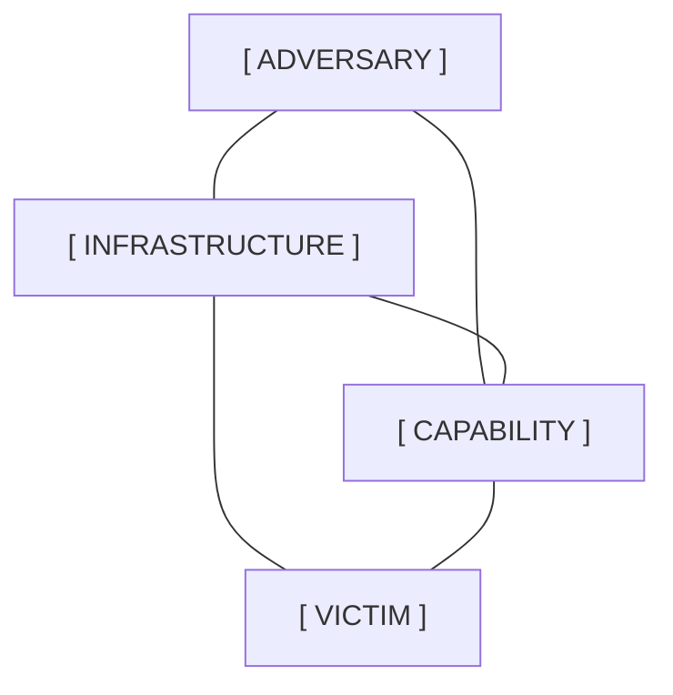

# Threat Modeling Frameworks: The Diamond Model

## 1. Executive Summary

In the complex landscape of Cyber Threat Intelligence (CTI), analysts require structured methodologies to categorize, track, and predict adversary behavior. Without a rigid framework, intelligence remains a disjointed collection of facts and indicators. The **Diamond Model of Intrusion Analysis** is one of the most fundamental, scientifically rigorous, and widely adopted frameworks used in CTI. 

Developed in 2013 by Sergio Caltagirone, Andrew Pendergast, and Christopher Betz, the Diamond Model establishes a simple but profound axiom: for every cyber intrusion event, there exists an **Adversary** utilizing a **Capability** over **Infrastructure** directed at a **Victim**. This note explores the core features, meta-features, advanced components, and the operational application of the Diamond Model, particularly in the context of analytical pivoting during incident response and threat hunting.

## 2. The Core Features of the Diamond Model

The model is visualized as a diamond, with four interconnected core nodes representing the fundamental elements of any cyber event. The lines connecting the nodes represent the relationships between them.

### ASCII Diagram: The Diamond Model

### 2.1. Adversary (Who)
The *Adversary* is the entity responsible for conducting the intrusion to achieve a specific goal. This can range from an individual script kiddie to an organized cybercrime syndicate (e.g., Conti, LockBit) to an Advanced Persistent Threat (APT) backed by a nation-state.
- **Unknowns**: Early in an investigation, the adversary node is almost always empty or labeled "Unknown." Attribution is extremely difficult and usually the final piece of the puzzle.
- **Types**: 
  - *Adversary Operator*: The actual person hands-on-keyboard executing the attacks.
  - *Adversary Customer*: The entity funding or directing the attack (e.g., a government intelligence agency directing an APT contractor).

### 2.2. Victim (Who is targeted)
The *Victim* is the target of the adversary. This is not just the compromised server; it encompasses the entire targeted entity.
- **Victim Persona**: The organization, person, or industry sector being targeted (e.g., "A Japanese financial institution", "The CEO").
- **Victim Asset**: The specific physical or logical asset compromised (e.g., "Exchange Server with IP 10.0.0.5", "CEO's Active Directory account").

### 2.3. Capability (What)
The *Capability* describes all the tools, techniques, and procedures (TTPs) the adversary uses to achieve their objective. This is the adversary's arsenal.
- **Malware**: Trojans, ransomware, backdoors, infostealers.
- **Exploits**: Zero-day exploits, publicly available CVE exploitation modules.
- **Techniques**: Phishing, credential stuffing, living-off-the-land (LotL) binaries, PowerShell obfuscation.

### 2.4. Infrastructure (How they connect)
The *Infrastructure* represents the physical and logical communication structures the adversary uses to deliver capabilities, maintain control, and exfiltrate data.
- **Type 1 Infrastructure**: Infrastructure fully controlled or owned by the adversary (e.g., a bulletproof hosting server purchased with cryptocurrency).
- **Type 2 Infrastructure**: Legitimate infrastructure co-opted by the adversary without the owner's knowledge (e.g., a compromised WordPress site used as a command and control proxy, or abusing legitimate services like Dropbox, Telegram, or AWS S3 for exfiltration).

## 3. Meta-Features

Beyond the four core vertices, the Diamond Model includes six essential meta-features that provide the necessary context to fully understand an event:
1. **Timestamp**: When the event occurred (Start and End times). Crucial for timeline reconstruction and sequencing.
2. **Phase**: Where the event fits in the overall attack lifecycle. This often maps the Diamond Model directly to the Lockheed Martin Cyber Kill Chain or MITRE ATT&CK (e.g., "Delivery Phase" or "Initial Access Phase").
3. **Result**: The success, failure, or unknown outcome of the adversary's action. (e.g., "Successful compromise", "Blocked by WAF").
4. **Direction**: The flow of the event (e.g., Adversary to Victim, Victim to Infrastructure).
5. **Methodology**: The general class of activity (e.g., spear-phishing, port scanning, lateral movement).
6. **Resources**: The external requirements the adversary needed to execute the event (e.g., specialized hardware, stolen credentials, funding, zero-day access).

## 4. Advanced Components: Socio-Political and Technology

To provide a holistic view, the Diamond model can be expanded to include two overarching components:
- **Socio-Political Component**: Describes the relationship between the Adversary and the Victim. Why is this happening? Is it hacktivism against a controversial corporation? Is it intellectual property theft to bolster a domestic economy? This component drives the *Strategic Intelligence*.
- **Technology Component**: Highlights the relationship between Infrastructure and Capability. The technology is the medium through which the capability operates.

## 5. Analytical Pivoting (The True Power of the Model)

The true operational power of the Diamond Model lies in **pivoting**. When an analyst uncovers one point on the diamond, they use the model's relationships to hypothesis, query, and hunt for the other points.

- **Victim-to-Infrastructure Pivot**: The SOC detects a *Victim Asset* (a laptop) communicating with an anomalous, uncategorized IP address. The analyst pivots to define this IP as the *Infrastructure*.
- **Infrastructure-to-Capability Pivot**: By analyzing the network traffic (PCAP) sent to that *Infrastructure*, the analyst identifies a specific malicious payload or exploit kit (*Capability*).
- **Capability-to-Adversary Pivot**: The analyst reverse-engineers the payload (*Capability*) and reveals specific language artifacts, compilation times, and encryption routines uniquely associated with a specific threat actor group (*Adversary*).
- **Adversary-to-Victim Pivot**: Knowing the *Adversary* (e.g., an APT known to target intellectual property), the analyst proactively searches for other *Victims* within the same industry sector who might have been compromised using the same TTPs.

## 6. Event Threads and Activity Threads

A single diamond represents a single atomic event (e.g., the delivery of a phishing email). Complex attacks consist of multiple events strung together.
- **Event Thread**: Linking multiple diamonds together chronologically to reconstruct a complete attack chain against a single victim. (e.g., Diamond 1: Phishing -> Diamond 2: Execution -> Diamond 3: Exfiltration).
- **Activity Thread**: Linking multiple diamonds across different victims to identify broader adversary campaigns and shared infrastructure. (e.g., seeing the same Infrastructure diamond linked to Victim A, Victim B, and Victim C).

## 7. Analysis of Competing Hypotheses (ACH)

Analysts often use ACH in conjunction with the Diamond Model. When an analyst identifies a Capability and a piece of Infrastructure, they might formulate three hypotheses about the Adversary. They then use the Diamond Model to systematically evaluate the evidence against each hypothesis, ruling out the ones that don't fit the established relationships.

## 8. Real-World Attack Scenario: Pivoting through the Diamond

### The Scenario: Investigating a Ransomware Outbreak

1. **The Starting Point (Victim & Capability)**: An analyst receives an alert that multiple domain controllers (*Victim Assets*) are being encrypted with a `.ryuk` extension (*Capability*).
2. **Pivot 1 (Capability to Infrastructure)**: The analyst analyzes a captured sample of the ransomware (*Capability*). Sandbox execution reveals that before encryption, the malware attempts to download an additional payload from `http://bad-domain[.]com/update.bin` (*Infrastructure*).
3. **Pivot 2 (Infrastructure to Infrastructure/Capability)**: The analyst investigates `bad-domain[.]com`. Threat intel feeds show this domain is frequently used to host TrickBot payloads (*Capability*). TrickBot is a known initial access trojan often used to deploy Ryuk.
4. **Pivot 3 (Capability to Victim)**: Knowing TrickBot is involved, the analyst knows TrickBot is often delivered via Emotet phishing campaigns. The analyst searches the email gateway logs for Emotet indicators, finding the original phishing email that compromised Patient Zero (*Victim Asset*), which occurred three weeks prior.
5. **Pivot 4 (Capability/Infrastructure to Adversary)**: The combination of Emotet -> TrickBot -> Ryuk is a highly documented attack chain historically associated with the cybercrime syndicate "Wizard Spider" (*Adversary*).
6. **The Result**: By utilizing the Diamond Model, the analyst didn't just stop the encryption process; they traced the attack back to the initial infection vector, identified the threat actor, and closed the original vulnerability, preventing reinfection. They turned a localized alert into a comprehensive operational picture.

## 9. Chaining Opportunities

- The output of a Diamond Model analysis provides the raw data required to categorize intelligence into the levels defined in [[03 - Tactical vs Operational vs Strategic Intelligence]].
- The *Capability* node of the Diamond Model is best detailed and codified using the tactics and techniques outlined in [[05 - Mitre ATT&CK Framework Deep Dive]].
- Information used to populate the diamond is gathered following the methodologies and requirements detailed in [[02 - The Intelligence Cycle Direction Collection Processing]].

## 10. Related Notes

- [[01 - Introduction to Cyber Threat Intelligence CTI]]
- [[02 - The Intelligence Cycle Direction Collection Processing]]
- [[03 - Tactical vs Operational vs Strategic Intelligence]]
- [[05 - Mitre ATT&CK Framework Deep Dive]]
