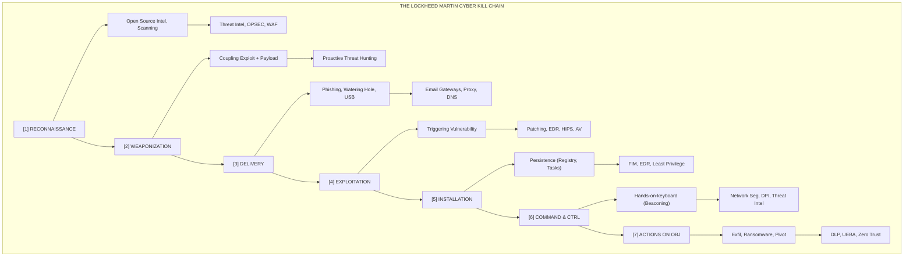

# 82.06 - Lockheed Martin Cyber Kill Chain

## Introduction to the Cyber Kill Chain

The Lockheed Martin Cyber Kill Chain is a foundational framework for understanding, analyzing, and dismantling cyberattacks. Originally adapted from military terminology—where a "kill chain" describes the structure of a physical attack including target identification, force dispatch, and target destruction—the cyber equivalent maps the progressive and sequential stages an adversary must complete to achieve their digital objectives. 

By deconstructing the anatomy of a cyberattack into distinct phases, the Cyber Kill Chain provides defenders with a structured methodology for identifying threats and deploying targeted countermeasures. The underlying philosophy is simple but powerful: an adversary must successfully traverse each stage of the chain to succeed. If defenders can interrupt the adversary at any single point in this sequence, the entire attack fails, and the adversary is forced to start over. This proactive approach shifts the defensive mindset from merely reacting to isolated alerts to anticipating and disrupting broader adversary campaigns.

## The Paradigm Shift in Cybersecurity Defense

Historically, cybersecurity defense relied heavily on perimeter-based security—often referred to as the "castle and moat" approach. Organizations focused almost entirely on preventing unauthorized access at the network boundary and remediating the damage if a breach occurred. 

The introduction of the Cyber Kill Chain fundamentally altered this perspective by introducing an intelligence-driven defense paradigm:
1. **Focus on the Adversary, Not Just the Malware:** Instead of analyzing a malicious binary in isolation, defenders analyze the entire campaign. Who sent it? How was it delivered? What infrastructure is it communicating with?
2. **Assumed Breach Mentality:** While the initial stages of the kill chain occur outside the network, the later stages assume the adversary has successfully bypassed the perimeter.
3. **Defense in Depth:** The framework encourages organizations to deploy security controls aligned with each phase, ensuring that if one layer fails, subsequent layers can still detect and block the threat.

## Detailed Breakdown of the Seven Stages

The framework divides a cyberattack into seven distinct, sequential phases. Understanding the intricacies, common techniques, and specific defensive strategies for each phase is critical for effective threat modeling.

### Stage 1: Reconnaissance
**Concept:** The observation and research phase where adversaries select their targets, analyze their vulnerabilities, and gather the intelligence necessary to execute the attack. This stage is often difficult to detect because it largely occurs on infrastructure the defender does not control.

**Adversary Techniques:**
- **Passive Reconnaissance:** Harvesting information from public sources without directly interacting with the target's infrastructure. This includes Open Source Intelligence (OSINT) gathering, analyzing DNS records, searching WHOIS databases, leveraging search engine dorks, and scraping social media (e.g., LinkedIn) to map organizational hierarchy and identify high-value targets (HVAs).
- **Active Reconnaissance:** Directly probing the target's infrastructure. This involves port scanning (e.g., Nmap), vulnerability scanning, service enumeration, and identifying misconfigured external-facing assets or leaky cloud storage buckets.

**Defender Countermeasures & Detection:**
- **Detection:** Monitoring external-facing infrastructure for anomalous scanning activity, repetitive failed login attempts on public portals, and identifying corporate data leaks on dark web forums.
- **Mitigation:** Implement strict access controls on public assets. Minimize the external attack surface by closing unused ports and services. Educate employees regarding Operational Security (OPSEC) to limit information shared on social media.

### Stage 2: Weaponization
**Concept:** The preparation phase where the adversary combines a malicious payload (e.g., a Remote Access Trojan - RAT, or ransomware) with an exploit into a deliverable package.

**Adversary Techniques:**
- Developing or purchasing custom malware tailored to bypass the target's specific security environment.
- Creating weaponized documents, such as PDFs containing malicious JavaScript or Microsoft Office documents with obfuscated malicious macros (VBA).
- Establishing command-and-control (C2) infrastructure, including registering domains and setting up proxy servers.

**Defender Countermeasures & Detection:**
- **Detection:** Since this stage occurs entirely within the adversary's environment, direct detection is nearly impossible. However, defenders rely on Cyber Threat Intelligence (CTI) to track adversary infrastructure setup, such as newly registered domains exhibiting malicious patterns.
- **Mitigation:** Proactively blocking known malicious infrastructure using Threat Intelligence Platforms (TIPs) and DNS sinkholing before the attack is even launched.

### Stage 3: Delivery
**Concept:** The transmission of the weaponized payload to the target environment. This is the first stage where the adversary directly interacts with the target's internal environment.

**Adversary Techniques:**
- **Spear-Phishing:** Sending highly targeted emails containing malicious attachments or links to credential-harvesting pages.
- **Watering Hole Attacks:** Compromising legitimate websites frequently visited by the target's employees to drive-by download malware.
- **Physical Media:** Dropping infected USB drives in corporate parking lots (Baiting).

**Defender Countermeasures & Detection:**
- **Detection:** Analyzing email headers, evaluating attachments in secure sandboxes, and monitoring web proxy logs for connections to newly observed or uncategorized domains.
- **Mitigation:** Deploying advanced email security gateways (SEG), implementing DMARC/SPF/DKIM to prevent email spoofing, utilizing web content filtering, and disabling AutoRun for removable media via Group Policy.

### Stage 4: Exploitation
**Concept:** The execution of the malicious payload, triggering the exploit to take advantage of a vulnerability in the target system, application, or human element.

**Adversary Techniques:**
- Exploiting unpatched software vulnerabilities (e.g., zero-days or known CVEs like Log4Shell or ProxyLogon).
- Tricking users into enabling macros or bypassing security warnings.
- Exploiting misconfigurations in web applications (e.g., SQL Injection, Cross-Site Scripting).

**Defender Countermeasures & Detection:**
- **Detection:** Host Intrusion Detection Systems (HIDS) identifying anomalous child processes (e.g., `winword.exe` spawning `powershell.exe`), Endpoint Detection and Response (EDR) alerting on memory injection techniques, and Web Application Firewalls (WAF) flagging malicious HTTP requests.
- **Mitigation:** Maintaining a rigorous and timely patch management program. Implementing application whitelisting (e.g., Windows Defender Application Control). Enforcing the principle of least privilege.

### Stage 5: Installation
**Concept:** The installation of malware or backdoors on the compromised system to ensure persistence, allowing the adversary to maintain access even if the system is rebooted or credentials are changed.

**Adversary Techniques:**
- Modifying Windows Registry keys (e.g., `Run` or `RunOnce` keys).
- Creating malicious Scheduled Tasks or Cron jobs.
- Replacing legitimate binaries (DLL search order hijacking or side-loading).
- Installing web shells on compromised web servers.

**Defender Countermeasures & Detection:**
- **Detection:** Monitoring systems for unauthorized changes to critical configuration files and registry keys using File Integrity Monitoring (FIM). Hunting for anomalous persistence mechanisms, such as unsigned binaries executing from user profile directories.
- **Mitigation:** Utilizing EDR solutions to automatically block known malicious persistence techniques. Hardening system configurations according to CIS Benchmarks.

### Stage 6: Command and Control (C2)
**Concept:** Establishing a communication channel between the compromised system and the adversary's infrastructure. This allows the adversary to issue commands, download additional tools, and maintain hands-on-keyboard control.

**Adversary Techniques:**
- Establishing outbound connections over common, allowed ports (e.g., HTTP/80, HTTPS/443, DNS/53) to blend in with legitimate enterprise traffic.
- Utilizing Domain Generation Algorithms (DGAs) or Fast Flux DNS to rapidly cycle through domains and evade static IP/domain blocking.
- Encrypting C2 traffic or hiding it within legitimate cloud services (e.g., communicating via Telegram APIs, Google Drive, or Slack).

**Defender Countermeasures & Detection:**
- **Detection:** Monitoring network traffic for continuous, periodic outbound connections (beaconing behavior). Analyzing DNS queries for high volumes of NXDOMAIN responses (indicative of DGA).
- **Mitigation:** Implementing network segmentation to limit internal routing. Enforcing strict outbound proxy policies and deep packet inspection (DPI) with SSL/TLS decryption to analyze encrypted traffic.

### Stage 7: Actions on Objectives
**Concept:** The final phase where the adversary executes their primary mission. This varies heavily depending on the adversary's motivations (e.g., financial gain, espionage, hacktivism).

**Adversary Techniques:**
- **Data Exfiltration:** Stealing intellectual property, PII, or financial data, often compressing and encrypting it before transfer.
- **Destruction/Disruption:** Deploying ransomware to encrypt critical data or wiper malware to destroy systems (e.g., NotPetya).
- **Lateral Movement:** Using the initially compromised host as a pivot point to move deeper into the network, steal administrative credentials (e.g., via Pass-the-Hash), and compromise domain controllers.

**Defender Countermeasures & Detection:**
- **Detection:** User and Entity Behavior Analytics (UEBA) flagging unusual internal data access or large outbound data transfers. Detecting execution of credential dumping tools (e.g., Mimikatz).
- **Mitigation:** Implementing Data Loss Prevention (DLP) solutions. Utilizing network isolation to quarantine compromised hosts rapidly. Deploying deception technologies like honeypots or honeytokens to detect internal reconnaissance and lateral movement.

## Visualizing the Cyber Kill Chain Architecture

## The Unified Kill Chain: An Evolution
While the Lockheed Martin model is foundational, it has faced criticism for being too linear and focusing heavily on the perimeter. In response, Paul Pols proposed the **Unified Kill Chain**, which integrates the Lockheed Martin model with the MITRE ATT&CK framework. 

The Unified Kill Chain expands the 7 stages into 18 distinct tactical phases grouped into three core overarching phases:
1. **Initial Foothold:** Encompasses Reconnaissance, Weaponization, Delivery, Social Engineering, Exploitation, Persistence, Defense Evasion, and C2.
2. **Network Propagation:** Encompasses Internal Reconnaissance, Privilege Escalation, Credential Access, Lateral Movement, and internal Defense Evasion.
3. **Action on Objectives:** Encompasses Collection, Exfiltration, Impact, and target Execution.

This evolution addresses the "Post-Exploitation Blind Spot" of the original Kill Chain by acknowledging that adversaries spend significant time moving laterally and escalating privileges after the initial breach.

## The F3EAD Framework vs. The Cyber Kill Chain
While the Cyber Kill Chain focuses on the adversary's actions, military and intelligence communities often use the **F3EAD** cycle to describe the defender's proactive response. Integrating F3EAD with the Kill Chain creates a powerful methodology for threat hunting and incident response.

- **Find:** Identify the adversary's presence within the environment (corresponds to detecting stages 3-6 of the Kill Chain).
- **Fix:** Pinpoint the exact location, scope, and capabilities of the adversary (e.g., isolating the compromised host, identifying the C2 IP).
- **Finish:** Neutralize the threat by taking decisive action (e.g., severing the C2 connection, quarantining endpoints).
- **Exploit:** Analyze the adversary's tools, TTPs, and infrastructure captured during the incident. Reverse engineer the malware found during the Installation phase.
- **Analyze:** Synthesize the exploited data to understand the adversary's broader campaign, motivations, and attribution.
- **Disseminate:** Share the generated intelligence (IoCs, YARA rules, behavioral patterns) with the broader security community using formats like STIX/TAXII.

## Real-World Attack Scenario: APT29 (Cozy Bear) Operations

To understand the practical application of the Kill Chain, let's analyze a typical campaign orchestrated by an Advanced Persistent Threat (APT) group, such as APT29 (often attributed to Russian foreign intelligence), targeting a Western government agency.

1. **Reconnaissance:** APT29 operators utilize LinkedIn and conference attendee lists to map the organizational chart of the agency's IT department. They identify several tier-1 helpdesk employees.
2. **Weaponization:** The operators craft a customized payload designed to evade the specific EDR solution used by the agency. They embed this payload within an ISO file, which contains a hidden malicious DLL and a legitimate executable vulnerable to DLL side-loading.
3. **Delivery:** An urgent spear-phishing email, masquerading as a mandatory IT policy update from the HR department, is sent to the targeted helpdesk employees. The email contains a link to download the ISO file from a compromised WordPress site.
4. **Exploitation:** An employee mounts the ISO and clicks the legitimate-looking executable. The executable runs and inadvertently loads the hidden malicious DLL (DLL side-loading), bypassing static signature checks.
5. **Installation:** The malicious DLL executes a PowerShell script that establishes persistence by creating a hidden scheduled task named `WindowsUpdateSync` that runs the payload upon user login.
6. **Command and Control:** The payload (e.g., a Cobalt Strike beacon) establishes a secure HTTPS connection to adversary-controlled infrastructure using a newly registered domain (`secure-update-sync[.]com`). The C2 traffic is configured to beacon out randomly between 45 and 90 minutes to evade basic network heuristics.
7. **Actions on Objectives:** With a foothold established, APT29 conducts internal Active Directory reconnaissance, dumps LSASS memory to harvest administrator credentials, moves laterally to the Domain Controller, and eventually accesses a classified database. They compress the sensitive intelligence and exfiltrate it in small chunks over several weeks using the established C2 channel.

## Defensive Matrix and Strategy

Defenders should use the Kill Chain to perform a "Gap Analysis" of their current security posture. 

| Kill Chain Phase | Security Control Category | Example Technology | Objective |
| :--- | :--- | :--- | :--- |
| Reconnaissance | Perimeter Security | WAF, Attack Surface Management | Detect scanning, block anomalous probes |
| Weaponization | Threat Intelligence | TIPs, Dark Web Monitoring | Anticipate attacks, block known indicators |
| Delivery | Network & Email Security | SEG, Secure Web Gateway, DMARC | Block payload from reaching user |
| Exploitation | Endpoint Protection | EDR, HIPS, Application Control | Prevent code execution, block memory injection |
| Installation | Configuration Management | FIM, CIS Benchmarks, GPO | Prevent unauthorized changes to system state |
| Command & Control | Network Visibility | NDR, Proxy, DNS Sinkholing | Detect and block beaconing, isolate host |
| Actions on Objectives | Data & Identity Security | DLP, IAM, UEBA, Network Segmentation | Prevent lateral movement, stop data theft |

## Limitations and Criticisms

Despite its widespread adoption, the Cyber Kill Chain is not a silver bullet. Practitioners must be aware of its limitations:
- **Cloud and Insider Threats:** The model assumes an outside-in attack trajectory. It struggles to model insider threats (where the adversary is already inside) or cloud-native attacks involving compromised IAM roles and API abuse, where traditional delivery and exploitation stages don't apply.
- **Non-Linear Attacks:** Advanced adversaries rarely follow a strict, linear path. They may loop back to reconnaissance after establishing a foothold, skip stages entirely (e.g., exploiting a public vulnerability directly to actions on objectives), or execute multiple stages simultaneously.
- **Oversimplification of Post-Breach:** Lumping all post-compromise activity into "Actions on Objectives" severely underrepresents the complex, iterative nature of internal network propagation.

## Chaining Opportunities

- **MITRE ATT&CK Mapping:** The Kill Chain provides the strategic overview, while the **MITRE ATT&CK Framework** provides the granular, tactical details of *how* an adversary executes each stage. Mapping Kill Chain phases to ATT&CK tactics is a standard industry practice.
- **Intelligence Driven Incident Response (IDIR):** The stages of the Kill Chain are directly utilized to build automated response playbooks in SOAR platforms.
- **Indicator Lifecycle:** Threat indicators generated across the kill chain are formatted using **STIX/TAXII** to facilitate rapid, automated sharing across the security community.

## Related Notes

- [[01 - MITRE ATT&CK Framework]]
- [[07 - Intelligence Driven Incident Response]]
- [[08 - Indicators of Compromise IoC vs Indicators of Attack IoA]]
- [[09 - STIX and TAXII Standards Explained]]
- [[10 - Open Source Threat Intelligence Feeds OTX MISP]]
