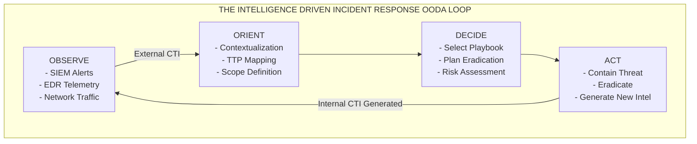

# 82.07 - Intelligence Driven Incident Response

## Introduction to Intelligence Driven Incident Response (IDIR)

In the modern cybersecurity landscape, traditional, reactive Incident Response (IR) is no longer sufficient against sophisticated Advanced Persistent Threats (APTs) and complex ransomware cartels. Traditional IR often focuses narrowly on the immediate crisis: isolating a machine, removing the malware, and restoring services. While essential, this "whack-a-mole" approach fails to address the root cause, understand the adversary's objectives, or prevent future attacks from the same threat actor.

**Intelligence Driven Incident Response (IDIR)** represents a paradigm shift. It integrates Cyber Threat Intelligence (CTI) into every phase of the incident response lifecycle. IDIR leverages internal and external intelligence to not only remediate the current breach but to understand the *who*, *why*, and *how* of the attack. By deeply analyzing the adversary's Tactics, Techniques, and Procedures (TTPs), organizations can anticipate future moves, systematically eradicate the adversary from the network, and build long-term resilience.

## The Evolution: Reactive vs. Proactive IR

To truly grasp the value of IDIR, we must contrast it with traditional methodologies:

### Traditional IR Characteristics:
- **Trigger-based:** Actions begin only after an alert fires or a breach is reported.
- **Narrow Scope:** Focuses on the infected endpoint and the specific malware binary in isolation.
- **Siloed Execution:** Incident responders work independently of threat intel analysts and threat hunters.
- **Outcome:** The immediate threat is neutralized, but the underlying vulnerability or the adversary's broader campaign is ignored, leaving the organization open to immediate reinfection.

### Intelligence Driven IR Characteristics:
- **Context-Rich Analysis:** Alerts are immediately enriched with external threat intelligence, providing crucial context (e.g., attributing an IP address to a known state-sponsored APT group).
- **Campaign-Focused:** Investigates the entire attack lifecycle, seeking to uncover the full scope of the adversary's operations within the network rather than just the single point of detection.
- **Symbiotic Workflow:** Incident responders, proactive threat hunters, and CTI analysts collaborate in a continuous, bidirectional feedback loop.
- **Outcome:** The adversary's infrastructure is comprehensively mapped, their TTPs are understood, robust detection rules are engineered, and long-term strategic defenses are permanently improved.

## Integrating Intelligence into the NIST IR Lifecycle

The NIST Special Publication 800-61 Rev. 2 outlines the standard four-step incident response lifecycle. IDIR does not replace this widely accepted framework; instead, it injects actionable intelligence into every single step.

### 1. Preparation
Traditional IR preparation involves creating policies, building communication plans, and deploying basic security tools.
**Intelligence Driven Preparation:**
- **Threat Profiling:** CTI teams identify the specific threat actors most likely to target the organization based on industry vertical, geography, and current geopolitics.
- **Intelligence Ingestion:** Integrating high-fidelity Indicators of Compromise (IOCs) and TTPs from platforms like MISP and OTX directly into SIEM and EDR solutions for automated blocking and alerting.
- **Proactive Hunting:** Using gathered intelligence to conduct threat hunting operations, searching for hidden adversaries before alerts even trigger.
- **Playbook Development:** Developing specific SOAR (Security Orchestration, Automation, and Response) playbooks tailored to known adversary behaviors and specific kill chain stages.

### 2. Detection & Analysis
Traditional detection relies heavily on static signatures and basic baseline anomalies.
**Intelligence Driven Detection & Analysis:**
- **Automated Alert Enrichment:** When a SIEM alert fires, automation instantly queries Threat Intelligence Platforms (TIPs) to add context (e.g., domain reputation, historical passive DNS records, associated malware families).
- **Behavioral Analysis:** Responders rigorously map observed malicious activities to the MITRE ATT&CK framework to understand the adversary's current phase in the attack lifecycle.
- **Pivoting and Expansion:** If a suspicious IP is detected, analysts use intelligence to "pivot" and discover related domains, file hashes, and other infrastructure, uncovering the full extent of the compromise.

### 3. Containment, Eradication, & Recovery
Traditional containment often involves immediately taking a system offline, which can destroy volatile memory evidence.
**Intelligence Driven Containment & Eradication:**
- **Calculated Containment:** Instead of immediate isolation (which alerts the adversary that they have been caught), responders might monitor the adversary to gather more intelligence on their objectives and full infrastructure footprint, carefully choosing the optimal time to strike and sever all access simultaneously.
- **Comprehensive Eradication:** Intelligence ensures that all backdoors, persistence mechanisms, and compromised credentials are removed. Without intel, a responder might delete a malware binary but miss the hidden scheduled task the adversary uses for reinfection.
- **Strategic Recovery:** Systems are restored with new, specific controls implemented specifically to counter the observed TTPs, definitively preventing a repeat attack.

### 4. Post-Incident Activity (Lessons Learned)
Traditional post-incident reviews focus purely on improving response times and fixing broken administrative processes.
**Intelligence Driven Post-Incident Activity:**
- **Intelligence Generation:** The internal data gathered during the incident (custom malware variants, new C2 IPs, specific exploit chains) is formalized into new, proprietary Cyber Threat Intelligence.
- **Dissemination:** This newly generated intelligence is shared internally to improve detection engineering (e.g., writing new YARA rules) and externally (via STIX/TAXII or MISP sharing groups) to aid the broader global security community.
- **Strategic Briefings:** Providing executives with a high-level intelligence report detailing the adversary's motivations, the specific vulnerabilities targeted, and strategic recommendations for capital security investments.

## The F3EAD Methodology in IDIR

Borrowed from military special operations, the **F3EAD** cycle is perfectly suited for Intelligence Driven Incident Response. It emphasizes the tight integration between operations (the Incident Responders) and intelligence (the CTI analysts).

- **Find:** Using threat intelligence and proactive hunting to discover the adversary within the network.
- **Fix:** Identifying the precise scope of the compromise. Which systems are affected? What accounts are compromised? Where is the data staged?
- **Finish:** Executing the coordinated containment and eradication plan to completely neutralize the threat.
- **Exploit:** Analyzing the artifacts left behind by the adversary (malware reverse engineering, memory forensics, disk imaging) to extract new, raw intelligence.
- **Analyze:** Fusing the extracted artifacts with external intelligence to deeply understand the adversary's campaign, attribution, and strategic goals.
- **Disseminate:** Distributing the analyzed intelligence to stakeholders, detection engineers, and external partners to fortify defenses globally and prepare for the next attack cycle.

## Visualizing the IDIR Lifecycle

## Key Roles in an IDIR Team

A successful and mature IDIR program requires specialized roles working in perfect unison:

| Role | Responsibility in IDIR |
| :--- | :--- |
| **Incident Commander** | Coordinates the overall response, manages executive communication, and ensures the response strategy aligns with business risk and intelligence findings. |
| **CTI Analyst** | Feeds external intelligence to responders, maps adversary infrastructure, provides formal attribution, and generates new intelligence post-incident. |
| **Threat Hunter** | Proactively searches the environment for hidden adversaries using hypotheses derived from CTI, acting as the tip of the spear. |
| **Forensic Analyst** | Performs deep-dive analysis on compromised hosts and memory dumps to extract malicious artifacts (executing the "Exploit" phase of F3EAD). |
| **Detection Engineer** | Takes the intelligence and TTPs uncovered during the incident and writes robust, durable detection rules (e.g., YARA, Sigma, Snort) to prevent recurrence. |

## Real-World Attack Scenario: Ransomware Outbreak and IDIR

Let us examine how an IDIR team handles a sophisticated ransomware attack (e.g., by the LockBit cartel) compared to a traditional team.

**The Initial Incident:** An EDR tool alerts on suspicious PowerShell execution on a critical internal database server.

**Traditional Response:**
The responder logs into the server, identifies a malicious script attempting to disable shadow copies, terminates the process, runs an antivirus scan, and closes the ticket. 
**Result:** Three days later, the entire corporate network is encrypted. The responder only stopped the final payload deployment; they completely missed the fact that the adversary had been in the network for three weeks, had stolen domain administrator credentials, and had planted multiple hidden backdoors.

**Intelligence Driven Response:**
1. **Detection & Enrichment:** The EDR alert fires. The SOAR platform immediately extracts the IP address the PowerShell script is communicating with and queries a TIP. The TIP identifies the IP as a known Cobalt Strike C2 server associated with Initial Access Brokers (IABs) that frequently sell access to the LockBit cartel.
2. **Analysis & Scope:** Knowing this is likely a precursor to a massive, enterprise-wide ransomware event, the IDIR team does not immediately isolate the server. Instead, they pivot on the C2 IP, searching historical firewall logs, and discover three other critical servers communicating with it.
3. **Hunting:** The CTI team provides the threat hunters with common TTPs used by this specific IAB (e.g., using the Rclone utility for covert data exfiltration). Hunters query the SIEM and find evidence of Rclone execution and massive data transfers to a cloud storage provider occurring over the last 48 hours.
4. **Containment:** Now understanding the full scope (4 compromised servers, compromised admin credentials, data exfiltration in progress), the Incident Commander executes a coordinated takedown. All compromised hosts are isolated simultaneously, the malicious IP is blocked at the perimeter firewall, and a global password reset for all administrators is forced.
5. **Eradication & Post-Incident:** The ransomware deployment is entirely thwarted. The team extracts the custom scripts, generates YARA rules for the specific Cobalt Strike configuration, and shares the attacker's infrastructure details with the community via MISP, ensuring the IAB's current campaign is disrupted globally.

## Chaining Opportunities

- IDIR heavily relies on understanding the **Lockheed Martin Cyber Kill Chain** to contextualize where the adversary currently operates within the environment.
- The intelligence consumed and generated by an IDIR team is typically structured using standardized **STIX/TAXII** formats to ensure rapid ingestion into security tools.
- IDIR relies on high-fidelity feeds like **MISP and OTX** to enrich alerts and guide deep investigations.
- A profound understanding of the difference between **IoCs and IoAs** is crucial for the Detection Engineers within an IDIR team to write effective, long-lasting rules.

## Related Notes

- [[06 - Lockheed Martin Cyber Kill Chain]]
- [[01 - MITRE ATT&CK Framework]]
- [[08 - Indicators of Compromise IoC vs Indicators of Attack IoA]]
- [[09 - STIX and TAXII Standards Explained]]
- [[10 - Open Source Threat Intelligence Feeds OTX MISP]]
