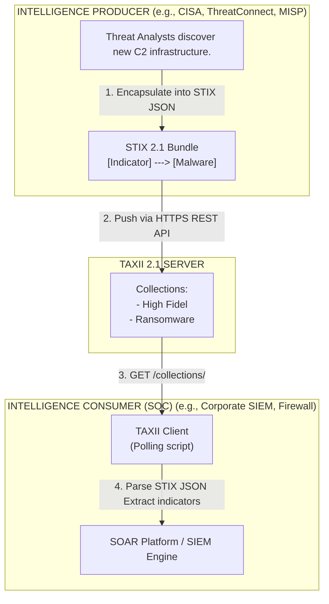

# 82.09 - STIX and TAXII Standards Explained

## Introduction to Structured Threat Intelligence

In the early days of Cyber Threat Intelligence (CTI), sharing indicators of compromise (IoCs) and threat data was a heavily manual, error-prone process. Analysts exchanged intelligence via fragmented PDF reports, disparate CSV files, and unstructured emails. This lack of standardization made automated ingestion into security tools (like SIEMs, EDRs, or firewalls) nearly impossible, resulting in massive delays between the discovery of a threat and the deployment of defensive countermeasures.

To solve this critical bottleneck, the security community, driven largely by MITRE and OASIS (Organization for the Advancement of Structured Information Standards), collaboratively developed two interconnected technical standards:
- **STIX (Structured Threat Information Expression):** The standardized *language* (format) used to describe cyber threat intelligence.
- **TAXII (Trusted Automated Exchange of Intelligence Information):** The standardized *transport mechanism* (protocol) used to exchange STIX data over secure HTTPS channels.

Together, STIX and TAXII enable the automated, machine-to-machine sharing of highly contextualized threat intelligence at wire speed, transforming a sluggish manual analysis process into a rapid, automated, proactive defense grid.

## Deep Dive: STIX (Structured Threat Information Expression)

STIX provides a standardized, rich syntax to describe a vast range of cyber threat information, from low-level technical indicators (file hashes, IP addresses) to high-level strategic intelligence (threat actor motivations, geopolitical campaign objectives).

### STIX 1.x vs STIX 2.x Architecture Evolution
- **STIX 1.x** was fundamentally XML-based. While highly expressive and comprehensive, it was notoriously complex, deeply nested, and exceptionally difficult for software developers to parse and integrate, leading to fragmented and slow industry adoption.
- **STIX 2.x** (currently version 2.1) completely overhauled the standard from the ground up, transitioning to **JSON (JavaScript Object Notation)**. It utilizes a modern, graph-based model consisting of specific objects and relationships, making it significantly lighter, substantially faster to parse, and remarkably developer-friendly.

### Core Components of STIX 2.1

STIX 2.1 represents intelligence as a connected graph consisting of two primary categories of objects:

1. **STIX Domain Objects (SDOs):** These represent the distinct entities that exist within the threat landscape.
   - **Indicator:** A pattern (e.g., a YARA rule, Sigma rule, or STIX pattern) that detects suspicious activity.
   - **Malware:** Details about a specific malicious software family or instance.
   - **Threat Actor:** Information about the individuals, groups, or nation-states orchestrating the cyberattacks.
   - **Campaign:** A deliberate grouping of adversary behavior targeting a specific objective over a period of time.
   - **Vulnerability:** A specific flaw in a software system (e.g., referencing a CVE) targeted for exploitation.
   - **Identity:** Represents individuals, organizations, or classes of organizations (often used to define the victim or the intelligence producer).

2. **STIX Relationship Objects (SROs):** These define exactly how the SDOs interact with one another, providing the critical *context* that elevates raw data to true intelligence. The standard strictly defines valid relationship types.
   - Example: An *Indicator* `indicates` *Malware*.
   - Example: A *Threat Actor* `uses` *Malware*.
   - Example: A *Malware* `targets` a *Vulnerability*.

### Example STIX 2.1 JSON Payload

Below is a simplified, highly detailed example of a STIX 2.1 graph payload. It demonstrates a `Threat Actor` (APT29) utilizing a piece of `Malware` (Cobalt Strike), which is successfully detected by an `Indicator` (a specific IP address).

```json
{
  "type": "bundle",
  "id": "bundle--5d0092c5-5f74-4b87-9642-33f4c2544f8d",
  "spec_version": "2.1",
  "objects": [
    {
      "type": "threat-actor",
      "id": "threat-actor--8e2e2d2b-17d4-4cbf-938f-98ee46b3cd3f",
      "created": "2026-06-10T10:00:00.000Z",
      "modified": "2026-06-10T10:00:00.000Z",
      "name": "APT29",
      "threat_actor_types": ["nation-state", "espionage"],
      "description": "Russian Foreign Intelligence Service (SVR) cyber operations group."
    },
    {
      "type": "malware",
      "id": "malware--31b940d4-6f7f-459a-80ea-9c1f17b58920",
      "created": "2026-06-10T10:05:00.000Z",
      "modified": "2026-06-10T10:05:00.000Z",
      "name": "Cobalt Strike Beacon",
      "is_family": false,
      "malware_types": ["backdoor", "c2"]
    },
    {
      "type": "indicator",
      "id": "indicator--8e2e2d2b-17d4-4cbf-938f-98ee46b3cd3f",
      "created": "2026-06-10T10:10:00.000Z",
      "modified": "2026-06-10T10:10:00.000Z",
      "name": "Malicious C2 IP Address",
      "pattern": "[ipv4-addr:value = '198.51.100.22']",
      "pattern_type": "stix",
      "valid_from": "2026-06-10T10:10:00.000Z"
    },
    {
      "type": "relationship",
      "id": "relationship--44298a74-ba52-4f0c-87a9-b6b8b0e736a1",
      "created": "2026-06-10T10:15:00.000Z",
      "modified": "2026-06-10T10:15:00.000Z",
      "relationship_type": "uses",
      "source_ref": "threat-actor--8e2e2d2b-17d4-4cbf-938f-98ee46b3cd3f",
      "target_ref": "malware--31b940d4-6f7f-459a-80ea-9c1f17b58920"
    },
    {
      "type": "relationship",
      "id": "relationship--9b88eb3f-ca60-4e3f-a316-1f72782eeb2c",
      "created": "2026-06-10T10:20:00.000Z",
      "modified": "2026-06-10T10:20:00.000Z",
      "relationship_type": "indicates",
      "source_ref": "indicator--8e2e2d2b-17d4-4cbf-938f-98ee46b3cd3f",
      "target_ref": "malware--31b940d4-6f7f-459a-80ea-9c1f17b58920"
    }
  ]
}
```
*Note how the graph relationships connect the Indicator directly to the Malware, and the Malware to the Threat Actor, building a complete, machine-readable intelligence story.*

## Deep Dive: TAXII (Trusted Automated Exchange of Intelligence Information)

While STIX dictates exactly *what* intelligence is being shared, TAXII dictates exactly *how* it is transported across the network. TAXII is an application layer protocol explicitly designed to exchange STIX data over HTTPS.

### TAXII 2.1 Architecture
TAXII 2.1 utilizes a standard RESTful API approach, making it highly compatible with modern web infrastructure and programming languages. It defines two primary operational services:
1. **Collections:** A logical repository of STIX objects. A single TAXII server can host multiple, distinct collections (e.g., "High Fidelity IP Blocklist," "Global APT Campaigns," "Sector-Specific Phishing Domains"). Clients can authenticate and connect to a collection, request data (polling), or push data to it (if authorized by the server).
2. **Channels:** A publish-subscribe (pub/sub) mechanism where clients continuously subscribe to a channel and receive real-time streams of STIX intelligence as it is actively published.

### Standard TAXII Endpoints
A compliant TAXII 2.1 server provides predictable REST endpoints:
- `GET /taxii2/` - The discovery endpoint. Tells the connecting client where the API roots are located.
- `GET /api1/collections/` - Lists all available intelligence collections the client has permission to view.
- `GET /api1/collections/{id}/objects/` - Retrieves the actual STIX objects from a specific collection UUID.

### Hands-on: Building a TAXII Python Client
Security engineers often need to programmatically interact with TAXII servers to extract data for custom analysis. Below is a Python script utilizing standard requests to pull intelligence from a TAXII server:

```python
import requests
from requests.auth import HTTPBasicAuth

# TAXII 2.1 Server Configuration parameters
TAXII_SERVER_URL = "https://cti-taxii.mitre.org/taxii/api/v2.1"
COLLECTION_ID = "91a7b528-80eb-42ed-a74d-c6fbd5a26116" # Example UUID

def fetch_stix_data():
    url = f"{TAXII_SERVER_URL}/collections/{COLLECTION_ID}/objects/"
    headers = {
        "Accept": "application/taxii+json;version=2.1"
    }
    
    print(f"[*] Initiating poll for TAXII Collection: {COLLECTION_ID}")
    response = requests.get(url, headers=headers)
    
    if response.status_code == 200:
        data = response.json()
        objects = data.get("objects", [])
        print(f"[+] Successfully retrieved {len(objects)} STIX objects.")
        
        # Parse and display the first few indicators
        for obj in objects[:3]:
            if obj.get("type") == "indicator":
                print(f"    - Indicator: {obj.get('name', 'N/A')}")
                print(f"      Pattern: {obj.get('pattern', 'N/A')}\n")
    else:
        print(f"[-] Failed to fetch data. HTTP Status Code: {response.status_code}")

if __name__ == "__main__":
    fetch_stix_data()
```

## Visualizing the STIX/TAXII Ecosystem



## Real-World Attack Scenario: Automated Zero-Day Mitigation

**The Scenario:** A new critical vulnerability (zero-day) in a highly popular enterprise VPN appliance is actively discovered by researchers. Advanced Persistent Threats (APTs) immediately begin massive, indiscriminate internet-wide scanning to exploit the vulnerability and deploy backdoors.

**The STIX/TAXII Driven Response:**
1. An intelligence sharing organization (such as an Information Sharing and Analysis Center - ISAC) detects the mass-scanning via honeypots and rapidly identifies the 50 distinct IP addresses being utilized by the threat actors.
2. The ISAC's automated systems generate a STIX 2.1 package containing a `Vulnerability` object (referencing the zero-day), a `Threat Actor` object, and 50 `Indicator` objects (representing the malicious IPs). Critical relationships are automatically created linking them all together.
3. The STIX package is immediately published to the ISAC's TAXII server in the designated "High Priority Urgent Alert" collection.
4. A hospital network's perimeter firewall, natively configured as a TAXII client, is scheduled to automatically poll the ISAC's TAXII server every 5 minutes.
5. The firewall ingests the new STIX JSON payload, natively parses the STIX pattern `[ipv4-addr:value = 'x.x.x.x']`, and dynamically adds the 50 malicious IPs to its hardware-level blocklist.
6. Ten minutes later, one of the adversary's automated scanners attempts to probe the hospital's VPN appliance. The inbound connection is instantaneously dropped at the perimeter. The attack is thwarted without any human SOC analyst ever needing to click a button.

## Challenges and Alternatives in the Real World

While undeniably powerful, STIX/TAXII implementation faces practical challenges in production environments:
- **Graph Complexity:** Even with the JSON simplification of STIX 2.x, properly generating and parsing deeply structured graph relationships requires significant logic, mature tooling, and strict adherence to the schema.
- **Parsing Overhead & Performance:** Processing massive STIX JSON bundles containing tens of thousands of interconnected objects can consume significant CPU and memory resources on SIEM platforms, occasionally leading to processing bottlenecks.
- **Flatter Alternatives:** Due to STIX's inherent complexity, many organizations rely on simpler, flatter standards for rapid, tactical indicator exchange, such as the **MISP Core Format** (which is also JSON based but simpler) or traditional plain text CSVs for pure IP/Hash blocklisting at the firewall level. They reserve STIX exclusively for sharing high-level, complex strategic intelligence reports.

## Chaining Opportunities

- **Open Source Feeds:** Open intelligence platforms like **MISP and AlienVault OTX** have robust, native capabilities to export their internal intelligence into STIX formats for seamless distribution via external TAXII servers.
- **Intelligence Driven IR (IDIR):** An established **Intelligence Driven Incident Response** team relies extensively on STIX to formalize their internal findings post-breach, allowing them to share the data with external partners effortlessly.
- **Indicator Lifecycle Management:** STIX allows for the precise, standardized tagging of the lifespan, confidence level, and operational fidelity of **Indicators of Compromise (IoCs)**.

## Related Notes

- [[01 - MITRE ATT&CK Framework]]
- [[07 - Intelligence Driven Incident Response]]
- [[08 - Indicators of Compromise IoC vs Indicators of Attack IoA]]
- [[10 - Open Source Threat Intelligence Feeds OTX MISP]]
