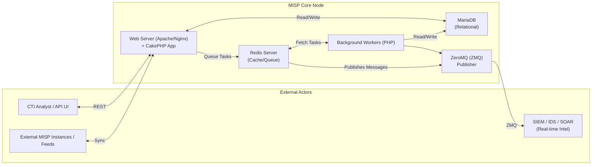

# Setting up a MISP Malware Information Sharing Platform

## Introduction to MISP

The Malware Information Sharing Platform (MISP) is an open-source threat intelligence platform designed for gathering, sharing, storing, and correlating Indicators of Compromise (IoCs) of targeted attacks, threat intelligence, financial fraud information, vulnerability information, and even counter-terrorism information. 

In the realm of Cyber Threat Intelligence (CTI), analysts are constantly bombarded with structured and unstructured data originating from open-source intelligence (OSINT), commercial feeds, community sharing circles, and internal telemetry. MISP serves as the central nervous system for this data, normalizing it into a structured format that can be easily parsed by security controls like SIEMs, Firewalls, EDRs, and IDS/IPS systems. 

Understanding how to properly architect, deploy, and configure MISP is a fundamental skill for any CTI analyst or Security Operations Center (SOC) engineer, as an improperly configured MISP instance can lead to severe operational issues, false positives, and degraded performance of the entire security stack.

## Architecture and Core Components

MISP is essentially a LAMP/LEMP stack application built primarily on CakePHP, backed by a MySQL/MariaDB database, and utilizing Redis for background task queuing and caching.

### The Component Stack

- **Web Application (CakePHP):** The core user interface and API endpoint.
- **Database (MariaDB/MySQL):** Stores the relational data (Events, Attributes, Objects, Users, Organizations).
- **Redis:** Handles caching and the queuing of background workers (ZeroMQ, email workers, STIX export workers).
- **Background Workers:** PHP processes managed by Supervisord that handle long-running tasks asynchronously.
- **ZeroMQ:** A high-performance asynchronous messaging library used for real-time pub/sub of MISP events.

### ASCII Diagram: MISP Architecture



## Step-by-Step Installation Guide (Ubuntu 22.04 LTS)

While MISP provides an auto-installation script, a deep understanding of manual installation is crucial for troubleshooting and highly secure deployments.

### 1. System Preparation

Ensure the system is fully updated and localized properly. MISP heavily relies on accurate timestamping.

```bash
sudo apt update && sudo apt upgrade -y
sudo apt install -y curl gcc git gnupg-agent make python3 python3-pip redis-server sudo vim
```

### 2. Database Setup

Install MariaDB and secure the installation.

```bash
sudo apt install -y mariadb-server mariadb-client
sudo mysql_secure_installation
```

Create the MISP database and user:

```sql
CREATE DATABASE misp DEFAULT CHARACTER SET utf8mb4 COLLATE utf8mb4_unicode_ci;
GRANT ALL PRIVILEGES ON misp.* to misp@localhost IDENTIFIED BY 'complex_password_here';
FLUSH PRIVILEGES;
```

### 3. Apache and PHP Configuration

Install Apache, PHP, and required extensions. MISP currently recommends PHP 7.4 to 8.2 depending on the branch, but standard stable releases typically target PHP 8.1 on modern Ubuntu.

```bash
sudo apt install -y apache2 libapache2-mod-php php-cli php-mysql php-redis \
php-xml php-mbstring php-curl php-zip php-gd php-bcmath php-intl
```

Configure PHP limits in `/etc/php/8.1/apache2/php.ini`:
```ini
memory_limit = 2048M
max_execution_time = 300
upload_max_filesize = 50M
post_max_size = 50M
```

### 4. Fetching MISP Code and Setting Permissions

Clone the repository to `/var/www/MISP` and set the correct ownership to the `www-data` user.

```bash
sudo mkdir /var/www/MISP
sudo chown www-data:www-data /var/www/MISP
sudo -u www-data git clone https://github.com/MISP/MISP.git /var/www/MISP
cd /var/www/MISP
sudo -u www-data git checkout tags/v2.4.170 # Always check for the latest stable tag
```

Install Composer dependencies:
```bash
sudo -u www-data wget https://getcomposer.org/installer -O composer-setup.php
sudo -u www-data php composer-setup.php
sudo -u www-data php composer.phar install --no-dev
```

### 5. Configuring CakePHP

Copy the template configuration files and generate cryptographic keys.

```bash
sudo -u www-data cp -a /var/www/MISP/app/Config/bootstrap.default.php /var/www/MISP/app/Config/bootstrap.php
sudo -u www-data cp -a /var/www/MISP/app/Config/database.default.php /var/www/MISP/app/Config/database.php
sudo -u www-data cp -a /var/www/MISP/app/Config/core.default.php /var/www/MISP/app/Config/core.php
```

Generate a random salt and update `core.php`:
```bash
sed -i -E "s/'salt' => '[^']+'/'salt' => '$(openssl rand -base64 32 | tr -d /=+)'/" /var/www/MISP/app/Config/core.php
```

### 6. Apache Virtual Host Configuration

Create an Apache Virtual Host configuration for MISP. It is strictly recommended to use HTTPS.

```apache
<VirtualHost *:443>
    ServerName misp.internal.local
    DocumentRoot /var/www/MISP/app/webroot

    SSLEngine On
    SSLCertificateFile /etc/ssl/certs/misp.crt
    SSLCertificateKeyFile /etc/ssl/private/misp.key

    <Directory /var/www/MISP/app/webroot>
        Options -Indexes
        AllowOverride All
        Require all granted
    </Directory>

    Header always set Strict-Transport-Security "max-age=31536000; includeSubdomains;"
    Header always set X-Content-Type-Options nosniff
    Header always set X-Frame-Options SAMEORIGIN
</VirtualHost>
```

Enable the site and modules:
```bash
sudo a2enmod rewrite ssl headers
sudo a2ensite misp-ssl
sudo systemctl restart apache2
```

## Tuning MISP for High Performance

When handling millions of IoCs, default configurations will fail. The following areas require extensive tuning.

### 1. Redis Optimization

Redis must be allowed to use sufficient memory, and persistence policies should be adjusted to prevent disk I/O bottlenecks.
Modify `/etc/redis/redis.conf`:
```ini
maxmemory 4gb
maxmemory-policy noeviction
save 900 1
save 300 10
```

### 2. Background Workers (Supervisord)

MISP relies on Python's `supervisor` daemon to keep its background workers alive. You must configure multiple workers for heavy tasks.
Increase the number of default workers in the MISP UI (`Administration -> Server Settings -> Workers`) or by modifying the database directly if the UI is unresponsive. Ensure you have dedicated workers for generic tasks, priority tasks, and specific push/pull operations.

### 3. Database Indexing and Tuning

MariaDB tuning is critical. Ensure `innodb_buffer_pool_size` is set to approximately 60-70% of available system RAM.
```ini
[mysqld]
innodb_buffer_pool_size = 12G
innodb_log_file_size = 2G
innodb_flush_log_at_trx_commit = 2
innodb_read_io_threads = 8
innodb_write_io_threads = 8
```

## Security Posture and Hardening

Exposing MISP to the internet without hardening is a severe risk.

### Principle of Least Privilege

- Ensure the database user only has access to the MISP database.
- Directory permissions must strictly limit write access to `www-data` only where necessary (`/app/tmp`, `/app/files`).

### API Key Management

API keys should be rotated regularly and bound to specific IPs if possible. Do not use the `site_admin` API key for integrations. Always create a dedicated sync user with the minimum necessary role.

### Fail2Ban Integration

Since MISP exposes an authentication portal, integrate Fail2Ban to monitor `/var/log/apache2/misp_access.log` and block brute-force attempts on the login endpoint.

## Real-World Attack Scenario

### Scenario: The Sync Protocol Exploitation

**The Setup:** A large national CERT maintains a central MISP instance and allows regional SOCs to sync with it. The syncing process relies on the MISP to MISP synchronization protocol via REST APIs.

**The Attack:** An advanced persistent threat (APT) actor compromises a poorly secured regional SOC's MISP instance. This instance has a bi-directional sync relationship with the central CERT MISP.

The APT actor realizes they cannot directly hack the central CERT. However, they possess a "site admin" equivalent API key on the regional node. They craft a malicious MISP Event. Within this event, they utilize a known (but unpatched on the central node) Object Template injection vulnerability.

1. **Crafting the Payload:** The attacker creates a custom MISP Object containing a serialized PHP payload within a hidden attribute field.
2. **Synchronization:** The regional MISP instance automatically pushes this new Event to the central CERT MISP instance via the established sync channel.
3. **Execution:** When the central CERT MISP attempts to parse and index the newly ingested custom Object, the insecure deserialization flaw triggers.
4. **Impact:** The attacker achieves Remote Code Execution (RCE) as the `www-data` user on the central CERT MISP server, subsequently pivoting to access the entire national intelligence database and exfiltrating embargoed threat intel.

**The Remediation:**
- Maintain strict unidirectional sync where possible.
- Filter incoming synchronization based on tags and distribution levels.
- Always run the latest patched version of MISP.
- Implement strict egress filtering on the MISP server to prevent reverse shells.

## Integration Strategies

### SIEM Integration

The most common use case is feeding IoCs to a SIEM like Splunk or Elastic. 

**Method 1: API Pulling (Polling)**
A script on the SIEM queries the `/events/restSearch` endpoint periodically. This is resource-intensive and introduces latency.

**Method 2: ZeroMQ (Push)**
MISP publishes IoCs in real-time to a ZMQ topic. A script (like `misp-zmq-subscriber`) listens and forwards the data to the SIEM via Syslog or direct HTTP ingest. This is highly efficient.

### Suricata / Zeek Integration

MISP can export NIDS rules directly. By setting up an export worker, MISP can generate Suricata rulesets based on IPs, domains, and hashes tagged with `ids="yes"`.

## Chaining Opportunities

- The intelligence gathered and stored here directly informs [[12 - YARA Rules for Threat Intelligence]] by providing the hashes and file paths needed to write accurate rules.
- Proper evaluation of feeds ingested into MISP relies heavily on concepts discussed in [[13 - Evaluating Source Reliability and Information Credibility]].
- Output from MISP searches forms the technical foundation for [[14 - Writing Actionable CTI Reports]].

## Related Notes
- [[12 - YARA Rules for Threat Intelligence]]
- [[13 - Evaluating Source Reliability and Information Credibility]]
- [[14 - Writing Actionable CTI Reports]]
- [[15 - Legal and Ethical Boundaries of CTI]]
