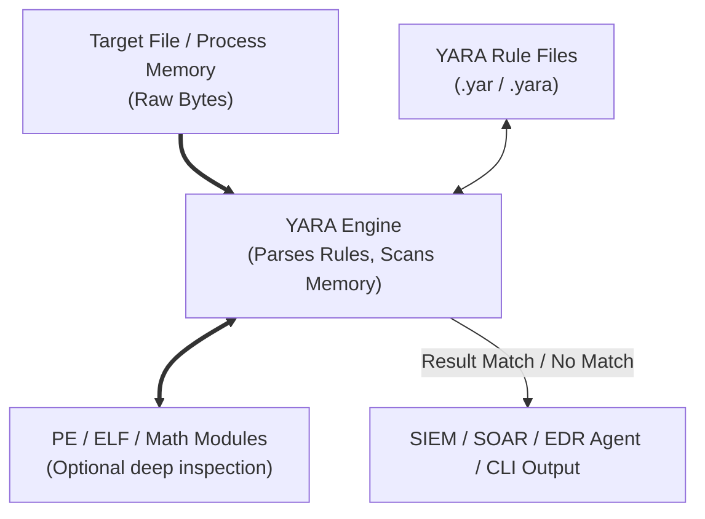

# YARA Rules for Threat Intelligence

## Introduction to YARA

YARA is often described as the "pattern matching swiss army knife" for malware researchers and threat intelligence analysts. It is a tool aimed at helping malware researchers to identify and classify malware samples. With YARA, you can create descriptions of malware families (or whatever you want to describe) based on textual or binary patterns. 

Each YARA rule consists of a set of strings and a boolean expression which determine its logic. In the context of Cyber Threat Intelligence (CTI), YARA rules are the bridge between abstract intelligence (knowing a threat actor uses a specific custom packer) and actionable detection (finding that packer in your environment).

## The Anatomy of a YARA Rule

A YARA rule is composed of three primary sections: `meta`, `strings`, and `condition`.

### 1. The Meta Section

This section contains metadata about the rule. It does not affect the rule's logic but is critical for CTI management, attributing rules to authors, providing context, and referencing threat reports.

```yara
rule APT29_CozyCar_Dropper
{
    meta:
        author = "CTI Team"
        date = "2023-10-27"
        description = "Detects CozyCar dropper mechanism based on unique mutexes and import patterns"
        reference = "https://example.com/apt29-report"
        tlp = "AMBER"
        version = "1.2"
        hash = "e3b0c44298fc1c149afbf4c8996fb92427ae41e4649b934ca495991b7852b855"
```

### 2. The Strings Section

This is where you define the patterns (strings, hex sequences, regular expressions) to search for within the target file or memory space.

- **Text Strings:** ASCII or Wide (UTF-16) strings.
- **Hexadecimal Strings:** Raw byte patterns. Wildcards `?` and jumps `[a-b]` are supported.
- **Regular Expressions:** PCRE-like regex for complex pattern matching.

```yara
    strings:
        // ASCII string, exact match
        $s1 = "C:\\Windows\\Temp\\payload.exe" ascii
        
        // Wide string (UTF-16), common in Windows APIs and registry paths
        $s2 = "Software\\Microsoft\\Windows\\CurrentVersion\\Run" wide
        
        // Case-insensitive string
        $s3 = "powershell.exe -ExecutionPolicy Bypass" nocase
        
        // Hexadecimal string with wildcards and jumps
        // Matches MZ header, then jumps 256-512 bytes, then looks for specific assembly
        $hex1 = { 4D 5A [256-512] 55 8B EC 83 EC ?? 53 56 57 }
        
        // Regular expression
        $re1 = /http:\/\/[0-9]{1,3}\.[0-9]{1,3}\.[0-9]{1,3}\.[0-9]{1,3}\/config\.php/
```

### 3. The Condition Section

The `condition` section dictates the logic that must be satisfied for the rule to trigger. It uses boolean operators (`and`, `or`, `not`), relational operators (`>`, `<`, `==`), and specialized YARA operators.

```yara
    condition:
        // The file must start with the MZ header (Windows PE)
        uint16(0) == 0x5A4D 
        and
        // And the file size must be less than 500KB
        filesize < 500KB
        and
        // And it must contain either string 1 and 2, OR the hex pattern and regex
        (($s1 and $s2) or ($hex1 and $re1))
        and
        // And string 3 must appear exactly 3 times
        #s3 == 3
}
```

## Advanced YARA Concepts for CTI

To write robust, false-positive resistant rules, analysts must leverage advanced features.

### ASCII Diagram: YARA Execution Flow



### Using Modules

YARA supports modules that allow you to parse file structures and perform advanced logic. The most critical for CTI is the `pe` module for Windows executables.

```yara
import "pe"
import "hash"

rule Suspicious_Packed_Binary
{
    meta:
        description = "Detects abnormally high entropy sections indicating packing"
    condition:
        uint16(0) == 0x5A4D and
        // Iterate over PE sections to check entropy
        for any i in (0..pe.number_of_sections - 1): (
            pe.sections[i].name == ".text" and
            math.entropy(pe.sections[i].raw_data_offset, pe.sections[i].raw_data_size) > 7.5
        ) and
        // Check for suspicious imports
        pe.imports("kernel32.dll", "VirtualAlloc") and
        pe.imports("kernel32.dll", "CreateRemoteThread")
}
```

### Rule Optimization

Poorly written YARA rules can cause 100% CPU spikes in EDR solutions.
- **Avoid short strings:** Strings shorter than 4 bytes cause massive overhead.
- **Anchor regexes:** Start regexes with anchors `^` if possible.
- **Fail fast conditions:** Put the fastest condition checks first. Checking `uint16(0) == 0x5A4D` is infinitely faster than calculating entropy. If it fails, the engine stops evaluating the expensive functions.

## Deploying YARA in the Intelligence Lifecycle

YARA rules are not just static detection signatures; they play a dynamic role across the intelligence lifecycle.

1. **Collection:** Scanning open directories or VirusTotal hunting (VT Intelligence) using YARA to automatically collect new samples matching a threat actor's profile.
2. **Processing:** Running YARA over a repository of malware to cluster families and extract indicators.
3. **Analysis:** Using YARA to reverse engineer similarities between codebases to attribute a new campaign to an existing APT group.
4. **Dissemination:** Sharing YARA rules via platforms like [[11 - Setting up a MISP Malware Information Sharing Platform]] so partners can deploy detections.

## Real-World Attack Scenario

### Scenario: The Polymorphic Ransomware Campaign

**The Setup:** A CTI team is tracking a new Ransomware-as-a-Service (RaaS) group dubbed "CryptosShadow." The group uses a highly polymorphic encryptor; traditional file hashes (MD5, SHA256) change with every single compilation, rendering traditional IoC blocklists completely useless.

**The Attack:** CryptosShadow launches a massive phishing campaign against the healthcare sector. The payload constantly evades signature-based antivirus because the file structure and hashes shift. The initial access vector drops a downloader that fetches the unique ransomware payload.

**The CTI Response (YARA Implementation):**
The CTI analyst obtains 5 different samples of CryptosShadow. By reverse-engineering them, the analyst realizes that while the code structure shifts, the custom base64 alphabet used for command and control (C2) communication and a specific cryptographic initialization vector (IV) hardcoded in the `.rdata` section remain static across all 5 samples.

The analyst authors a YARA rule:

```yara
rule RANSOM_CryptosShadow_Core
{
    meta:
        description = "Detects CryptosShadow polymorphic encryptor based on static C2 alphabet and IV"
        author = "CTI Team"
    strings:
        // Custom B64 alphabet: "Zyxwvutsrqponmlkjihgfedcba9876543210ABCDEFGHIJKLMNOPQRSTUVWXY+/"
        $custom_b64 = "Zyxwvutsrqponmlkjihgfedcba9876543210ABCDEFGHIJKLMNOPQRSTUVWXY+/" ascii
        
        // Hardcoded IV array in hex
        $crypto_iv = { 4A 9C 11 F2 00 00 00 00 B3 8A 77 6F [2-4] 1A 2B 3C 4D }
    condition:
        uint16(0) == 0x5A4D and filesize < 3MB and ($custom_b64 and $crypto_iv)
}
```

**The Outcome:** This YARA rule is immediately pushed to the organization's EDR platform. Within hours, the EDR agent scans memory and disks across 10,000 endpoints. It detects the ransomware executing in memory on an HR workstation—despite the payload having a completely unseen hash—and terminates the process before encryption begins.

## Best Practices for Threat Hunters

- **Test for False Positives:** Always test YARA rules against a corpus of "goodware" (clean Windows system files, standard applications) before deploying to production. A rule that alerts on `explorer.exe` will cause immense disruption.
- **Use Condition Hierarchies:** Build master/slave rules using YARA's `include` directive to modularize logic.
- **Document Everything:** The `meta` section is your documentation. If a rule triggers two years from now, you need to know exactly why it was written.

## Chaining Opportunities

- YARA rules are actively shared and distributed using platforms detailed in [[11 - Setting up a MISP Malware Information Sharing Platform]].
- The intelligence gathered from YARA hits is used to draft intelligence products as outlined in [[14 - Writing Actionable CTI Reports]].
- Rules must be based on credible intelligence, reinforcing the concepts in [[13 - Evaluating Source Reliability and Information Credibility]].

## Related Notes
- [[11 - Setting up a MISP Malware Information Sharing Platform]]
- [[13 - Evaluating Source Reliability and Information Credibility]]
- [[14 - Writing Actionable CTI Reports]]
- [[15 - Legal and Ethical Boundaries of CTI]]
