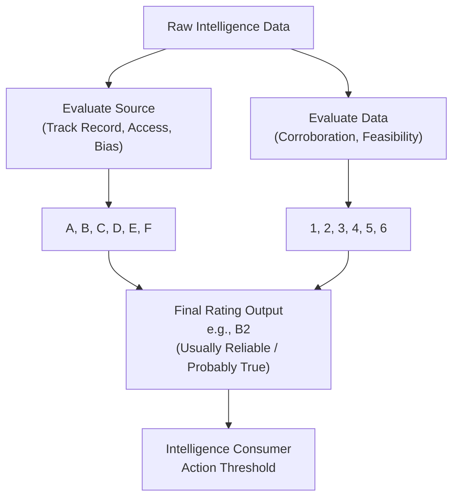

# Evaluating Source Reliability and Information Credibility

## Introduction to Intelligence Evaluation

In the domain of Cyber Threat Intelligence (CTI), data is abundant, but *accurate, actionable intelligence* is scarce. A CTI analyst receives input from an overwhelming variety of sources: open-source intelligence (OSINT) blogs, anonymous Pastebin dumps, dark web forum posts, commercial intelligence feeds, and government advisories. 

If an analyst acts upon false, deceptive, or poorly contextualized information, the consequences are severe: massive false positive storms in the SOC, misallocation of expensive incident response resources, and potentially blocking critical business operations. Therefore, the rigorous evaluation of both the **source of the information** and the **information itself** is the foundational bedrock of all intelligence analysis.

## The Admiralty Code (Admiralty System)

The most universally accepted framework for evaluating intelligence is the Admiralty Code (also known as the NATO System). It provides a standardized matrix to independently score the reliability of the source and the credibility of the information.

By separating the source from the data, analysts avoid cognitive biases. For example, a highly reliable source (like a Tier 1 security vendor) can sometimes pass on inaccurate information, and a notoriously unreliable source (an anonymous Twitter account) might leak a completely authentic zero-day exploit.

### Reliability of the Source (Alphanumeric)

This metric assesses the historical track record, access, and motivation of the entity providing the intelligence.

*   **A - Completely Reliable:** The source has a long, proven history of providing highly accurate information with no intent to deceive. (e.g., Internal forensic telemetry, recognized CERTs).
*   **B - Usually Reliable:** The source has a generally good track record, with minor past inaccuracies. (e.g., Reputable security vendors, established OSINT researchers).
*   **C - Fairly Reliable:** The source has provided a mix of valid and invalid information in the past. (e.g., Security blogs with mixed quality, new but promising vendors).
*   **D - Not Usually Reliable:** The source has a history of providing inaccurate, sensationalized, or speculative information. (e.g., Unvetted public forums, known sensationalist media).
*   **E - Unreliable:** The source is known to actively fabricate information or has zero track record of accuracy. (e.g., Known disinformation channels, fake leak sites).
*   **F - Reliability Cannot Be Judged:** There is absolutely no historical context or data to evaluate the source. (e.g., A newly created anonymous burner account on social media).

### Credibility of the Information (Numeric)

This metric assesses the likelihood of the information being true based on logical consistency, corroboration, and technical feasibility.

*   **1 - Confirmed by Other Sources:** The information is independently corroborated by separate, unconnected reliable sources or internal direct observation.
*   **2 - Probably True:** The information logically aligns with known facts, TTPs, or technical constraints, but lacks independent corroboration.
*   **3 - Possibly True:** The information is plausible but lacks corroboration and does not perfectly align with existing knowledge.
*   **4 - Doubtful:** The information contradicts known facts, exhibits technical impossibilities, or relies on severe logical leaps.
*   **5 - Improbable:** The information is fundamentally flawed, contradicts physical or technical reality, or is a known fabrication.
*   **6 - Truth Cannot Be Judged:** The information is completely opaque, lacking enough technical detail to even attempt verification.

### Mermaid Diagram: The Admiralty Matrix Evaluation Process

## Cognitive Biases in Evaluation

Analysts are human, and human psychology introduces significant risk to intelligence evaluation. Recognizing these biases is critical.

- **Confirmation Bias:** The tendency to highly rate information that confirms a pre-existing hypothesis while discounting information that contradicts it.
- **Source Fixation (Halo Effect):** Assigning a `1` (Confirmed) to information simply because the source is an `A` (Completely Reliable), effectively merging the two distinct ratings.
- **Mirroring:** Assuming the threat actor operates with the same logic, resources, and limitations as the analyst's own organization.

## Technical Corroboration Techniques

To elevate the Credibility score of technical data (like an IP address or file hash), analysts employ various tools:

1. **Passive DNS and WHOIS:** Does the domain registration history align with the supposed threat actor's timeline? Is the infrastructure shared with known malicious actors?
2. **Malware Sandboxing:** Executing a hash in a sandbox (like Cuckoo or Any.Run) to independently verify the stated behavior (C2 callbacks, dropped files).
3. **Telemetry Querying:** Checking internal SIEM logs to see if the organization has actually observed the IoCs interacting with internal assets.

## Real-World Attack Scenario

### Scenario: The Deceptive Zero-Day Leak

**The Setup:** A massive geopolitical conflict is underway. An anonymous account on X (formerly Twitter), created two days ago, posts a link to a Pastebin. The Pastebin contains a supposed Python exploit script claiming to be an unauthenticated Remote Code Execution (RCE) zero-day for a widely used VPN appliance.

**The Initial Reaction:** Junior analysts panic and want to immediately shut down all VPN gateways across the enterprise, which would cut off access for 10,000 remote employees.

**The CTI Evaluation Process:**

The lead CTI analyst applies the Admiralty framework:

1. **Source Evaluation:**
   - The account is brand new.
   - It has no historical track record.
   - The motivation is highly suspect given the geopolitical context (potential psychological operation/disinformation).
   - **Source Rating: F (Reliability Cannot Be Judged)**

2. **Information Evaluation:**
   - The analyst reviews the Python code.
   - The payload section of the code contains a base64 encoded string.
   - Upon decoding, the payload is not shellcode, but rather an aggressive `rm -rf /` command mixed with an obscure Linux wiping utility.
   - Furthermore, the HTTP request structure in the script targets a URI path that does not exist on the specified VPN appliance firmware.
   - The information is technically flawed and contradictory to reality.
   - **Information Rating: 5 (Improbable)**

**The Conclusion:** The intelligence is rated **F5**. It is highly likely a disinformation campaign or a honeypot script designed to trick script kiddies and analysts into executing destructive malware on their own testing environments. 

**The Outcome:** The CTI team advises the CISO to maintain normal VPN operations. They issue a threat advisory *about the fake exploit* to internal IT, warning them not to download or execute the script. The business avoids a catastrophic, self-inflicted outage.

## Establishing Thresholds for Action

Organizations must establish playbooks based on Admiralty scores:

- **A1 to B2:** Direct integration into automated blocking (Firewalls, EDR) via platforms like [[11 - Setting up a MISP Malware Information Sharing Platform]].
- **C3 to D3:** Deploy as "Alert Only" in the SIEM for threat hunting, but do not block traffic to avoid false positive disruptions.
- **F4 to E6:** Discard, or retain only in deep storage for historical context in case future corroboration emerges.

## Chaining Opportunities

- Proper source evaluation dictates what data gets entered into [[11 - Setting up a MISP Malware Information Sharing Platform]].
- The credibility of intelligence directly impacts the confidence level expressed when [[14 - Writing Actionable CTI Reports]].
- Ethical dilemmas often arise when evaluating sources from the dark web or leaked datasets, requiring knowledge of [[15 - Legal and Ethical Boundaries of CTI]].

## Related Notes
- [[11 - Setting up a MISP Malware Information Sharing Platform]]
- [[12 - YARA Rules for Threat Intelligence]]
- [[14 - Writing Actionable CTI Reports]]
- [[15 - Legal and Ethical Boundaries of CTI]]
