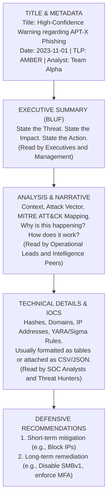

# Writing Actionable CTI Reports

## Introduction to Intelligence Reporting

Cyber Threat Intelligence (CTI) is useless if it exists purely in the mind of the analyst or buried within the JSON output of a threat intelligence platform. The primary vehicle for communicating intelligence, risk, and technical data to stakeholders is the CTI Report.

However, writing a CTI report is fundamentally different from writing an academic paper or a generic IT ticket. A CTI report must be **actionable**. This means the consumer of the report—whether it is a CISO making budgetary decisions, a SOC analyst tuning a SIEM, or a threat hunter writing [[12 - YARA Rules for Threat Intelligence]]—must be able to read the report and immediately understand *what* the threat is, *why* they should care, and *how* to defend against it.

## The BLUF Principle (Bottom Line Up Front)

In military and intelligence writing, BLUF is the golden rule. Senior executives and busy technical staff do not have time to read a chronological narrative to discover the point of the report on page ten. 

The most critical information—the assessment, the impact, and the required actions—must be stated in the very first paragraph.

**Poor Example (Narrative):**
"On Tuesday, we started looking at some logs and noticed unusual outbound traffic. After analyzing the PCAPs, we saw DNS tunneling. We eventually tracked this down to a new malware strain acting on our domain controllers, which means we might lose data."

**Excellent Example (BLUF):**
"A newly identified malware strain (UNC2452) is actively utilizing DNS tunneling to exfiltrate data from internal Domain Controllers. Immediate isolation of affected DCs and implementation of strict DNS egress filtering is required to prevent critical data loss. This report details the attack vector, Indicators of Compromise (IoCs), and remediation steps."

## Audience Tailoring and Report Types

A single intelligence product rarely satisfies all audiences. CTI teams typically produce three tiers of reports:

### 1. Strategic Reports
- **Audience:** C-Suite, Board of Directors, CISOs.
- **Focus:** High-level trends, financial impact, geopolitical risk, long-term defensive posture, and budgetary justifications.
- **Content:** "Ransomware groups are shifting from purely encrypting data to double-extortion tactics. We need a 15% budget increase for data-loss prevention (DLP) tools."

### 2. Operational Reports
- **Audience:** SOC Managers, Incident Response Leads, Vulnerability Management.
- **Focus:** Threat actor campaigns, specific Tactics, Techniques, and Procedures (TTPs), MITRE ATT&CK mappings, and defensive posture adjustments.
- **Content:** "APT32 is actively exploiting CVE-2023-XXXX in our sector. Review patch compliance on edge firewalls and increase monitoring on VPN endpoints."

### 3. Tactical / Technical Reports
- **Audience:** SOC Analysts, Threat Hunters, Forensics Specialists.
- **Focus:** Highly granular technical data, file hashes, IPs, domains, YARA rules, and exact log queries.
- **Content:** "Block the following 25 SHA256 hashes. Implement the attached YARA rule to scan memory for the payload. Query the SIEM for event ID 4688 containing the command line arguments `powershell -enc`."

### ASCII Diagram: Report Structure and Flow

## Estimative Language and Confidence Levels

CTI analysts rarely deal in absolute certainties. Information is often incomplete. To communicate uncertainty without sounding indecisive, analysts must use standardized estimative language (derived from Intelligence Community Directives like ICD 203).

- **High Confidence:** Information is based on high-quality, corroborated sources. (e.g., Internal forensic analysis).
- **Moderate Confidence:** Information is credibly sourced and plausible, but not fully corroborated or rests on assumptions.
- **Low Confidence:** Information is fragmented, highly questionable, or from untested sources.

**Words of Estimative Probability (WEP):**
Instead of saying "might" or "maybe," use standardized terms:
- *Highly Likely* (80-95%)
- *Likely / Probable* (55-80%)
- *Roughly Even Chance* (45-55%)
- *Unlikely* (20-45%)
- *Highly Unlikely* (5-20%)

*Example:* "We assess with **high confidence** that APT29 is **highly likely** to target our cloud infrastructure within the next 30 days based on recent sector trends."

## Real-World Attack Scenario

### Scenario: The Supply Chain Compromise Report

**The Setup:** A CTI analyst discovers that a popular third-party IT management software, "ManageIT-Pro," used across the company, has been compromised via a malicious software update. 

**The Analyst's Actions:** The analyst evaluates the credibility of the intel (confirming it via internal telemetry where ManageIT-Pro servers are seen beaconing to an unknown Russian IP). They must now write a report to trigger Incident Response.

**The Report Execution:**
The analyst immediately drafts an Operational/Technical hybrid report.

**BLUF:** "We have identified an active supply chain compromise originating from the ManageIT-Pro application (CVE-2024-XXXX). Affected internal servers are actively beaconing to malicious infrastructure, presenting an immediate risk of domain-wide ransomware deployment. Immediate network isolation of all ManageIT-Pro servers is required."

**Recommendations Section:**
1. **Immediate:** Sever network connectivity to all servers running ManageIT-Pro.
2. **Immediate:** Ingest the attached IoCs (IPs and Hashes) into the firewall and EDR blocklists via our [[11 - Setting up a MISP Malware Information Sharing Platform]].
3. **Short-Term:** Perform credential resets for all service accounts tied to the ManageIT-Pro application.
4. **Long-Term:** Transition to a zero-trust architecture for third-party management tools, requiring strict outbound proxy whitelisting.

**The Outcome:** Because the report is structured with a clear BLUF and prioritized, actionable recommendations, the Incident Response team immediately understands the gravity of the situation and executes the containment plan within 15 minutes of the report's publication, preventing the deployment of the final ransomware payload.

## Avoiding Common Pitfalls

1. **"The Sandbox Dump":** Do not paste 50 pages of automated sandbox output into a report. Synthesize the findings. The SOC does not want to read raw API calls; they want the 3 malicious domains the malware contacted.
2. **Lack of Context:** An IP address is not intelligence; it is data. Contextualize the IP. Is it a Tor exit node? A compromised WordPress site? Dedicated attacker infrastructure?
3. **Ignoring TLP:** Always properly mark the Traffic Light Protocol (TLP). Sharing a TLP:RED report with external vendors violates trust and potentially ruins ongoing law enforcement investigations.

## Chaining Opportunities

- Reports should be heavily informed by the reliability evaluation methods discussed in [[13 - Evaluating Source Reliability and Information Credibility]].
- Technical sections of the report will frequently include outputs like [[12 - YARA Rules for Threat Intelligence]].
- Machine-readable components of the report (IoCs) should be structured and pushed to [[11 - Setting up a MISP Malware Information Sharing Platform]].
- When writing reports, analysts must be careful not to include Personally Identifiable Information (PII) of victims improperly, adhering to [[15 - Legal and Ethical Boundaries of CTI]].

## Related Notes
- [[11 - Setting up a MISP Malware Information Sharing Platform]]
- [[12 - YARA Rules for Threat Intelligence]]
- [[13 - Evaluating Source Reliability and Information Credibility]]
- [[15 - Legal and Ethical Boundaries of CTI]]
