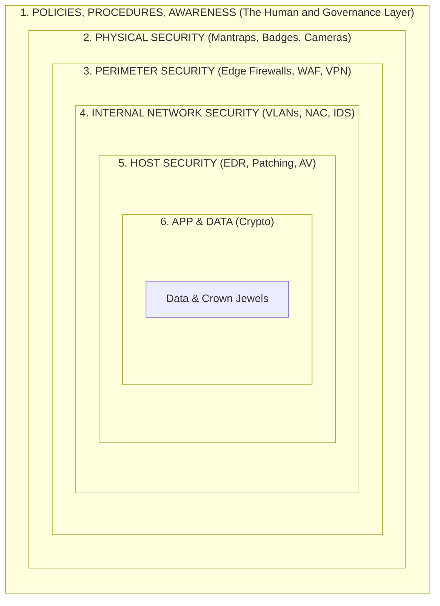

# Defense-in-Depth (DiD) Layered Security Model

## Introduction to Defense-in-Depth

Defense-in-Depth (DiD) is a foundational cybersecurity strategy that employs multiple layers of overlapping security controls and defensive mechanisms throughout an Information Technology (IT) system. The core philosophy is based on the military concept of the same name: **if one defensive measure fails or is bypassed by an attacker, subsequent layers will continue to provide protection, detect the anomaly, and thwart the intrusion.**

This approach is highly critical in modern infrastructure because no single security product, appliance, or policy is impenetrable. Vulnerabilities are discovered daily, misconfigurations happen, and human error is inevitable. By relying on a layered "onion" approach, organizations can drastically reduce their overall risk profile and increase the cost and effort required for a threat actor to successfully compromise the core assets.

In VAPT (Vulnerability Assessment and Penetration Testing), understanding DiD is crucial. As a penetration tester, your goal is often to chain vulnerabilities across multiple layers, bypassing each defensive ring to reach the "crown jewels." Conversely, as a defensive consultant, you must assess where these layers are missing, thin, or misconfigured.

---

## Architectural ASCII Diagram: The Security Onion

---

## The Seven Layers of Defense-in-Depth

### 1. Policies, Procedures, and Awareness (The Administrative Layer)
This is the outermost layer and often the most critical because it dictates how the rest of the security architecture is built, maintained, and operated. Technology cannot fix a broken policy.
*   **Components**: Security awareness training, Acceptable Use Policies (AUP), Incident Response (IR) plans, Password policies, Access management procedures, and compliance frameworks.
*   **VAPT Perspective (Why it fails)**: Social engineering (phishing, vishing) targets this layer directly. If users are not trained to spot malicious attachments, perimeter and endpoint controls have to work twice as hard. Furthermore, a lack of strict IAM (Identity and Access Management) procedures leads to privilege creep, making lateral movement easier for attackers.

### 2. Physical Security
Physical access to hardware bypasses almost all network and software-based security controls. If an attacker can touch the server, it is no longer your server.
*   **Components**: Mantraps, RFID badge readers, biometric scanners, CCTV, security guards, server cage locks, and HVAC monitoring (to prevent thermal sabotage).
*   **VAPT Perspective (Why it fails)**: Tailgating into a building, cloning RFID badges, or simply plugging a rogue device (like a Bash Bunny or a LAN Turtle) into an exposed wall port in a lobby can entirely bypass perimeter network defenses.

### 3. Perimeter Security
The network perimeter is the boundary between the internal corporate network and the untrusted public Internet. While Zero Trust architectures are blurring this line, perimeter defense remains vital.
*   **Components**: Next-Generation Firewalls (NGFW), Web Application Firewalls (WAF), Distributed Denial of Service (DDoS) mitigation solutions (e.g., Cloudflare, Akamai), and Virtual Private Network (VPN) gateways.
*   **VAPT Perspective (Why it fails)**: Firewalls are frequently misconfigured with overly permissive rules (e.g., `Any/Any`). VPNs may lack Multi-Factor Authentication (MFA), allowing attackers with compromised credentials to slip directly into the internal network. Zero-day exploits against perimeter devices (like Pulse Secure or Fortinet VPNs) instantly defeat this layer.

### 4. Internal Network Security
Once inside the perimeter, the network must not be a "flat" trusted zone. Internal network security aims to prevent lateral movement and contain breaches.
*   **Components**: Network Access Control (NAC) like 802.1X, VLAN segmentation (separating guest, IT, HR, and server networks), internal Intrusion Detection/Prevention Systems (IDS/IPS), and internal firewalls.
*   **VAPT Perspective (Why it fails)**: Many organizations still run flat networks where a compromised receptionist's workstation can route directly to the domain controllers or backup servers. LLMNR/NBT-NS poisoning and ARP spoofing run rampant in segmented networks lacking port security.

### 5. Host / Endpoint Security
Endpoints (laptops, servers, mobile devices) are the main targets for exploitation. Host security ensures that individual operating systems and devices can defend themselves.
*   **Components**: Endpoint Detection and Response (EDR) agents (e.g., CrowdStrike, SentinelOne), OS Hardening (CIS benchmarks), Host-based firewalls, local least privilege (removing local admin rights), and rigorous patch management.
*   **VAPT Perspective (Why it fails)**: Legacy systems that cannot run modern EDR, unpatched OS vulnerabilities, and users running with local Administrator privileges. Attackers bypass EDR using API unhooking, direct syscalls, and bring-your-own-vulnerable-driver (BYOVD) techniques.

### 6. Application Security
Applications are the front doors to the data. In a cloud-first world, applications are often exposed directly to the internet, bypassing traditional perimeters.
*   **Components**: Secure Software Development Life Cycle (SDLC), Static and Dynamic Application Security Testing (SAST/DAST), Runtime Application Self-Protection (RASP), API Gateways, and strict input validation.
*   **VAPT Perspective (Why it fails)**: Web application vulnerabilities (SQL Injection, Cross-Site Scripting, Broken Access Control, Insecure Deserialization). Often, perimeter WAFs are bypassed due to complex encoding, leaving the flawed application logic to handle malicious input.

### 7. Data Security
Data is the ultimate target—whether for theft (espionage) or encryption (ransomware). Data security must protect the information regardless of where it resides or travels.
*   **Components**: Encryption at rest (AES-256, BitLocker), Encryption in transit (TLS 1.3), Data Loss Prevention (DLP) solutions, Database activity monitoring, and Data classification tags.
*   **VAPT Perspective (Why it fails)**: Hardcoded encryption keys in scripts, weak cipher suites, storing sensitive data in cleartext inside S3 buckets, or highly privileged accounts (e.g., Domain Admin) that possess the necessary rights to decrypt or bulk-export data.

---

## Defense-in-Depth vs. Zero Trust Architecture (ZTA)

It is a common misconception that Zero Trust replaces Defense-in-Depth. In reality, **Zero Trust is an evolution of the Defense-in-Depth philosophy.**

*   **Traditional DiD**: Historically focused on the "castle and moat" model, assuming that internal entities were somewhat more trusted than external entities.
*   **Zero Trust**: Assumes breach. It applies the principles of Defense-in-Depth at a microscopic level, demanding continuous authentication, authorization, and validation for every single transaction, regardless of whether the request originates from the internal network or the public internet.

By combining Zero Trust Identity principles with DiD structural layers, an organization maximizes its resilience. A WAF (Perimeter) protects a web server (Host) that validates the JWT (Application) of a user authenticated via MFA (Policy/Identity) before querying an encrypted database (Data).

---

## Attack Scenario: Defeating the Layers

To truly understand DiD, we must look at how an attacker attempts to penetrate an organization and how overlapping controls stop or slow them down.

### Scenario: The Ransomware Campaign
1.  **Reconnaissance & Weaponization**: Attackers craft a sophisticated phishing email containing a macro-enabled Excel document.
2.  **Delivery (Perimeter Layer)**: The email passes through the organization's Email Gateway. *Failure*: The gateway's signature-based AV doesn't recognize the novel payload.
3.  **Exploitation (Human Layer)**: The user receives the email and opens it. *Defense Trigger*: The user has undergone security awareness training but falls for the urgent pretext anyway. *Failure*.
4.  **Installation (Host Layer)**: The macro attempts to spawn PowerShell to download a C2 beacon. *Defense Trigger*: The EDR solution detects abnormal parent-child process behavior (Excel -> PowerShell) and blocks the execution. **Success.**
5.  **Alternative Execution (Host Layer)**: The attacker adjusts the payload to use COM object hijacking instead. The payload executes. *Failure*.
6.  **Lateral Movement (Internal Network Layer)**: The beacon attempts to scan the internal network on port 445 (SMB) for BloodHound enumeration. *Defense Trigger*: The internal network is heavily segmented by VLANs, and the host firewall blocks outbound SMB traffic from client subnets. The SOC is alerted to the abnormal internal scan. **Success.**

In this scenario, while several layers failed (Perimeter, Human, and partially Host), the combination of EDR and Network Segmentation (Internal Network) ultimately thwarted the attack before data exfiltration or domain-wide ransomware deployment could occur.

---

## Integrating Threat Intelligence into DiD

Defense in depth cannot remain static. It must be a living architecture informed by Cyber Threat Intelligence (CTI).
*   **Strategic CTI**: Informs the Policies and Procedures layer (e.g., deciding to mandate hardware security keys because phishing attacks against SMS MFA are rising).
*   **Operational CTI**: Informs the Perimeter and Host layers (e.g., ingesting new Indicators of Compromise (IoCs) and YARA rules into the EDR and WAF based on a newly discovered Advanced Persistent Threat (APT) group).
*   **Tactical CTI**: Informs Application and Data security (e.g., understanding the specific TTPs an attacker uses to dump databases, leading to enhanced DLP monitoring).

---

## Chaining Opportunities & VAPT Mapping

When conducting penetration tests, identifying the *absence* of Defense-in-Depth is key to providing high-value findings:
*   **Network to App Mapping**: If a WAF is absent or weak `[[05 - Web Server Hardening]]`, application vulnerabilities like SQLi are trivial to exploit.
*   **Perimeter to Host Mapping**: If an attacker bypasses the perimeter via a weak VPN configuration, but the underlying host is unpatched `[[03 - Linux Hardening]]` or `[[04 - Windows Hardening]]`, it leads to immediate root/SYSTEM compromise.
*   **Policy to Data Mapping**: If data is encrypted, but IAM policies are overly permissive, an attacker simply steals the credentials of an authorized user, rendering the encryption moot.

## Related Notes
*   `[[02 - Security Hardening CIS Benchmarks]]` - The gold standard for applying host and network hardening controls.
*   `[[03 - Linux Hardening]]` - Technical implementation of the Host Security layer on Linux systems.
*   `[[04 - Windows Hardening]]` - Technical implementation of the Host Security layer on Windows systems.
*   `[[05 - Web Server Hardening]]` - Hardening the Application and Perimeter layers of web infrastructure.
*   `[[10 - Network Access Control and Segmentation]]` - Deep dive into Internal Network Security boundaries.
