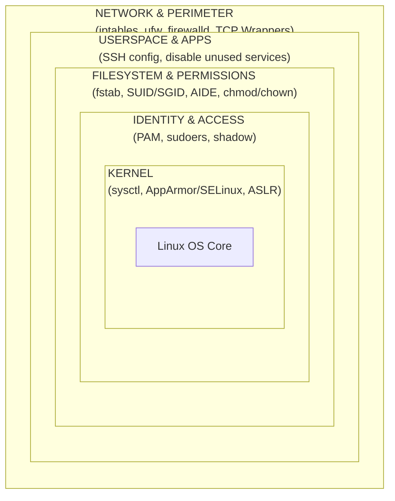

# Linux OS Hardening

## Introduction to Linux Security Philosophy

Linux security is built on fundamental Unix principles: "Everything is a file" and "Multi-user privilege separation." Because everything (hardware devices, network sockets, system configurations) is treated as a file, securing a Linux system heavily revolves around strict file permission management, user access control, and kernel-level network parameter tuning.

Out of the box, standard Linux distributions (like Ubuntu, Debian, CentOS, RHEL) optimize for broad compatibility rather than maximum security. Hardening Linux means deliberately stripping away unnecessary functionality, locking down the kernel network stack, enforcing Mandatory Access Control (MAC), and meticulously auditing the environment.

For VAPT professionals, a poorly hardened Linux machine provides easy avenues for privilege escalation (via SUID binaries, misconfigured `sudo`, or weak kernel parameters) and persistence.

---

## Architectural ASCII Diagram: Linux Hardening Rings



---

## 1. Kernel Network Hardening (`sysctl.conf`)

The Linux kernel networking stack controls how the system handles incoming and outgoing packets. By default, it accepts ICMP redirects and source-routed packets, which can be abused for Man-in-the-Middle (MitM) attacks.

Hardening requires modifying `/etc/sysctl.conf` or creating a file in `/etc/sysctl.d/`.

```ini
# /etc/sysctl.d/99-security.conf

# 1. IP Spoofing protection
net.ipv4.conf.all.rp_filter = 1
net.ipv4.conf.default.rp_filter = 1

# 2. Ignore ICMP broadcast requests (Prevents Smurf attacks)
net.ipv4.icmp_echo_ignore_broadcasts = 1

# 3. Disable source packet routing
net.ipv4.conf.all.accept_source_route = 0
net.ipv6.conf.all.accept_source_route = 0

# 4. Ignore send redirects (You are not a router)
net.ipv4.conf.all.send_redirects = 0

# 5. Block SYN attacks (Enable SYN cookies)
net.ipv4.tcp_syncookies = 1

# 6. Log packets with impossible addresses to kernel log
net.ipv4.conf.all.log_martians = 1

# 7. Enable Address Space Layout Randomization (ASLR)
kernel.randomize_va_space = 2

# 8. Restrict access to kernel logs / dmesg to root only
kernel.dmesg_restrict = 1

# 9. Prevent unprivileged BPF (Berkeley Packet Filter) execution
kernel.unprivileged_bpf_disabled = 1
```
*Apply changes immediately with `sysctl -p`.*

## 2. Boot and Physical Security

If an attacker has physical access or can reboot the system, they can interrupt the boot process, pass `init=/bin/bash` to the kernel, and drop into a root shell without a password.

*   **GRUB Bootloader Password**: Secure the bootloader by generating a password hash using `grub-mkpasswd-pbkdf2` and adding it to `/etc/grub.d/40_custom`.
*   **Disable USB Mass Storage**: Prevent exfiltration or payload delivery via USB by blacklisting the kernel module.
    ```bash
    echo "install usb-storage /bin/true" > /etc/modprobe.d/disable-usb-storage.conf
    ```

## 3. Account, PAM, and Access Control

Pluggable Authentication Modules (PAM) dictate how users authenticate to the system.

### Password Complexity and Lockout
Edit `/etc/pam.d/common-password` (Debian/Ubuntu) or `/etc/pam.d/system-auth` (RHEL) to enforce complexity.
*   **Complexity**: Use `pam_pwquality` or `pam_cracklib` to require minlen, uppercase, numbers, and symbols.
*   **Account Lockout**: Use `pam_faillock` (RHEL) or `pam_tally2` (legacy) to lock out accounts after N failed attempts.
    ```text
    # Example faillock configuration in system-auth
    auth required pam_faillock.so preauth silent audit deny=5 unlock_time=900
    ```

### Securing `sudo` and Root
*   **Lock the Root Account**: Root should not have a password set to prevent direct login. Admins must log in as a standard user and escalate via `sudo`.
    `passwd -l root`
*   **Sudoers**: Never use `NOPASSWD` in `/etc/sudoers`. Use `visudo` and ensure the `wheel` or `sudo` group requires password re-authentication.

## 4. Filesystem, Partitions, and Permissions

Certain directories are globally writable (like `/tmp`, `/var/tmp`, `/dev/shm`). Attackers use these directories to drop payloads and compile exploits.

### Mount Options (`/etc/fstab`)
Ensure these partitions are mounted separately with restrictive flags:
*   `nodev`: Do not interpret character/block special devices.
*   `nosuid`: Ignore set-user-identifier (SUID) and set-group-identifier (SGID) bits.
*   `noexec`: Do not allow direct execution of binaries.

```fstab
# /etc/fstab examples
tmpfs     /dev/shm    tmpfs   defaults,nodev,nosuid,noexec  0 0
/dev/sda5 /tmp        ext4    defaults,nodev,nosuid,noexec  0 0
/dev/sda6 /var/tmp    ext4    defaults,nodev,nosuid,noexec  0 0
/dev/sda7 /home       ext4    defaults,nodev,nosuid         0 0
```

### Hunting Rogue SUID Binaries
SUID binaries execute with the privileges of the file owner (usually root). Attackers look for obscure SUID binaries to exploit for privilege escalation (e.g., GTFOBins).
```bash
# Find all SUID/SGID files
find / -type f \( -perm -4000 -o -perm -2000 \) -exec ls -l {} +
```
*Hardening Action*: Remove the SUID bit from unnecessary binaries (like `ping`, `mount`, `pkexec`) using `chmod a-s /path/to/binary`.

## 5. SSH Hardening

SSH is the primary administrative gateway. A weak SSH config is a severe risk. Edit `/etc/ssh/sshd_config`:

```sshdconfig
# 1. Disable Root Login entirely
PermitRootLogin no

# 2. Disable Password Authentication (Require SSH Keys)
PasswordAuthentication no
PubkeyAuthentication yes

# 3. Disable Empty Passwords
PermitEmptyPasswords no

# 4. Limit which users/groups can connect
AllowUsers admin jdoe
# AllowGroups sshusers

# 5. Set idle timeout interval (disconnects inactive sessions)
ClientAliveInterval 300
ClientAliveCountMax 0

# 6. Use strong cryptography (Disable weak MACs and Ciphers)
KexAlgorithms curve25519-sha256@libssh.org,ecdh-sha2-nistp521,ecdh-sha2-nistp384,ecdh-sha2-nistp256,diffie-hellman-group-exchange-sha256
Ciphers chacha20-poly1305@openssh.com,aes256-gcm@openssh.com,aes128-gcm@openssh.com,aes256-ctr,aes192-ctr,aes128-ctr
MACs hmac-sha2-512-etm@openssh.com,hmac-sha2-256-etm@openssh.com,umac-128-etm@openssh.com
```

## 6. Mandatory Access Control (MAC)

Discretionary Access Control (DAC)—standard `rwx` permissions—is insufficient if a user account or daemon is compromised. MAC restricts *what* an application can do, regardless of the user running it.

*   **SELinux (Security-Enhanced Linux)**: Default on RHEL/CentOS. Operates on labels and contexts. If an Apache web server is compromised, SELinux prevents the attacker's shell from reading `/etc/shadow` because the `httpd_t` process context does not have access to the `shadow_t` file context. Ensure it is set to `Enforcing` in `/etc/selinux/config`.
*   **AppArmor**: Default on Ubuntu/Debian. Profile-based approach limiting capabilities of specific programs (e.g., restricting MySQL from executing bash).

## 7. Auditing and File Integrity Monitoring (FIM)

To detect a breach, continuous auditing is mandatory.

*   **Auditd (`/etc/audit/audit.rules`)**: Log specific system calls and file access.
    ```bash
    # Log changes to shadow and passwd files
    -w /etc/passwd -p wa -k identity
    -w /etc/shadow -p wa -k identity
    # Log sudo usage
    -w /var/log/sudo.log -p wa -k actions
    ```
*   **AIDE (Advanced Intrusion Detection Environment)**: A File Integrity Monitor. It creates a baseline database of file hashes, permissions, and timestamps. Running periodic checks will alert administrators if an attacker modifies a binary (e.g., placing a backdoor in `/bin/ls`).

## Chaining Opportunities & Related Notes
*   `[[01 - Defense-in-Depth Layered Security Model]]` - Linux hardening represents the Host-level execution of this model.
*   `[[02 - Security Hardening CIS Benchmarks]]` - CIS Linux benchmarks provide the exhaustive list of the controls detailed above.
*   `[[17 - Linux Privilege Escalation]]` - How attackers exploit the absence of these hardening controls (e.g., abusing SUIDs, weak sudoers, kernel exploits).
*   `[[05 - Web Server Hardening]]` - Hardening the specific Apache/Nginx daemons running on top of the secured Linux OS.
