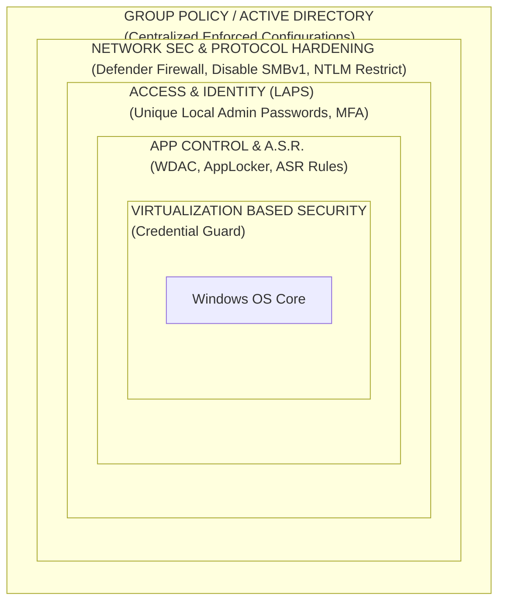

# Windows OS and Active Directory Hardening

## Introduction to Windows Security Architecture

Hardening a Windows environment is vastly different and often more complex than Linux due to the deep integration of the Active Directory (AD) ecosystem, legacy backward compatibility, and the intricacies of the Windows Registry, Component Object Model (COM), and remote management protocols (RPC, SMB, WMI).

A standalone Windows workstation requires local policy configuration, but in an enterprise, Windows hardening is orchestrated centrally via **Group Policy Objects (GPOs)** or Modern Device Management (MDM / Intune). The goal is to reduce the attack surface, enforce least privilege, block credential dumping, and secure lateral movement pathways.

For VAPT professionals, Active Directory is the ultimate playground. Misconfigurations in Windows networking, weak NTLM usage, and excessive privileges are the primary mechanisms for achieving Domain Admin status.

---

## Architectural ASCII Diagram: Windows Attack Surface Reduction

---

## 1. Network Security and Protocol Hardening

Windows networking historically prioritized ease of file sharing over security, leaving highly exploitable protocols active by default.

### SMB Hardening
Server Message Block (SMB) is the backbone of Windows file sharing and IPC.
*   **Disable SMBv1**: SMBv1 is highly vulnerable (e.g., EternalBlue/MS17-010). Disable it via Registry or PowerShell:
    `Set-SmbServerConfiguration -EnableSMB1Protocol $false`
*   **Require SMB Signing**: Prevents SMB Relay attacks. An attacker intercepts an NTLM authentication request and relays it to a target server. If SMB signing is enforced, the relayed request is rejected because the attacker cannot sign the packet without the password hash.
    *   *GPO*: Computer Configuration \> Windows Settings \> Security Settings \> Local Policies \> Security Options \> `Microsoft network server: Digitally sign communications (always) = Enabled`.

### NTLM Restriction
NTLM is an older challenge-response authentication protocol susceptible to Pass-the-Hash and relay attacks. Modern AD should rely entirely on Kerberos.
*   **Disable NTLMv1**: Ensure LM and NTLMv1 are entirely disabled.
    *   *GPO*: `Network security: LAN Manager authentication level` set to `Send NTLMv2 response only. Refuse LM & NTLM`.
*   **Restrict NTLM Auditing**: Before fully blocking NTLM to prevent outages, set `Network security: Restrict NTLM: Audit Incoming NTLM Traffic` to identify legacy systems still using it.

### Windows Defender Firewall
Ensure Domain, Private, and Public profiles are active. By default, client endpoints should block **all** unsolicited inbound traffic, including ICMP (ping) and SMB (445), unless specifically required for management (and then restricted by IPsec or originating IP).

---

## 2. Access and Identity Hardening

### LAPS (Local Administrator Password Solution)
One of the most critical AD defenses. Without LAPS, organizations often deploy a single, uniform local Administrator password across all workstations. If an attacker compromises one workstation and extracts the local admin hash, they can "Pass-the-Hash" to every other workstation in the network, instantly compromising the entire fleet.
*   **How LAPS Works**: LAPS generates a random, unique, complex password for the local Administrator account of *every* domain-joined machine and rotates it automatically. The password is securely stored as a hidden attribute in AD, readable only by authorized personnel (e.g., Helpdesk).

### Privileged Access Workstations (PAWs) & Tiering
Implement the **Tiered Admin Model**:
*   **Tier 0**: Domain Controllers, Enterprise Admins.
*   **Tier 1**: Server Admins, Application Servers.
*   **Tier 2**: Workstations, Standard Users.
*   *Rule*: A Tier 0 admin credential must *never* be typed or cached on a Tier 1 or Tier 2 machine. If a Domain Admin logs into a standard user's compromised workstation, the attacker steals the Domain Admin token via LSASS.

---

## 3. Credential Guard and VBS

**Virtualization-Based Security (VBS)** uses the Windows Hypervisor to create an isolated, secure memory enclave apart from the standard OS kernel.
*   **Windows Defender Credential Guard**: Moves the Local Security Authority (LSA) secrets (NTLM hashes, Kerberos TGTs) into this isolated enclave. Even if an attacker achieves `SYSTEM` level privileges on the OS, tools like Mimikatz cannot read LSASS memory to extract credentials, stopping credential dumping dead in its tracks.

---

## 4. Attack Surface Reduction (ASR) Rules

ASR is a feature of Microsoft Defender for Endpoint that blocks behaviors frequently abused by malware and attackers, particularly targeting office productivity suites and scripting engines.
Implemented via GPO or Intune using specific GUIDs.

**Critical ASR Rules to Enable (Block Mode):**
*   Block executable content from email client and webmail (`be9ba2d9-53ea-4cdc-84e5-9b1eeee46550`)
*   Block Office applications from creating child processes (`d4f940ab-401b-4efc-aadc-ad5f3c50688a`) - *Stops Macro -> PowerShell chains.*
*   Block Office applications from injecting code into other processes (`75668c1f-73b5-4cf0-bb93-3df05f75227e`)
*   Block JavaScript or VBScript from launching downloaded executable content (`d3e037e1-3eb8-44c8-a917-57927947596d`)
*   Block credential stealing from the Windows local security authority subsystem (lsass.exe) (`9e6c4e1f-7d60-472f-ba1a-a39ef669e4b2`)

---

## 5. Application Control (WDAC / AppLocker)

Application Control moves from a "blacklist" model (AV blocking known bad) to a "whitelist" model (only allowing known good).
*   **AppLocker**: Easy to configure via GPO. Can block execution based on Path (e.g., block all execution from `%AppData%` or `%Temp%`), Publisher (Code Signing Cert), or File Hash.
*   **Windows Defender Application Control (WDAC)**: More secure and integrated deeper into the kernel than AppLocker, capable of blocking unsigned drivers and powershell scripts.

*VAPT Perspective*: Pentesters constantly look for "AppLocker Bypasses" using Living Off the Land Binaries (LOLBins) like `InstallUtil.exe`, `MSBuild.exe`, or `Regsvr32.exe` to execute arbitrary code since these Microsoft binaries are natively trusted by application control policies.

---

## 6. Advanced Logging and PowerShell Visibility

Attackers live in PowerShell. Without logging, their actions are invisible.
Configure via GPO (`Computer Configuration > Admin Templates > Windows Components > PowerShell`):
1.  **Turn on Module Logging**: Logs pipeline execution details. (Event ID 4103).
2.  **Turn on PowerShell Script Block Logging**: Captures the full, de-obfuscated content of scripts as they execute. Critical for detecting encoded/obfuscated payloads. (Event ID 4104).
3.  **Turn on PowerShell Transcription**: Records all console input and output to a centralized text file on a secure share.

**Command Line Auditing**: Enable `Audit Process Creation` and configure `Include command line in process creation events`. This ensures Event ID 4688 logs exactly *what* arguments were passed to an executable (e.g., `cmd.exe /c powershell -enc JABZ...`).

## Chaining Opportunities & Related Notes
*   `[[01 - Defense-in-Depth Layered Security Model]]` - Contextualizing Windows Hardening within the broader network defense strategy.
*   `[[02 - Security Hardening CIS Benchmarks]]` - The exact Group Policy settings required to achieve the configurations mentioned above.
*   `[[18 - Windows Privilege Escalation]]` - How attackers bypass poor permissions and missing patches on Windows.
*   `[[20 - Active Directory Attacks]]` - In-depth look at Pass-the-Hash, Kerberoasting, and SMB Relay attacks that occur when these hardening steps are skipped.
