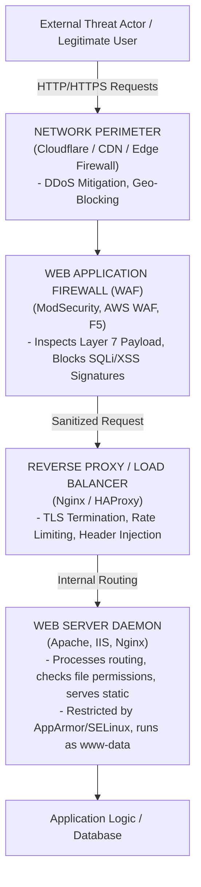

# Web Server Hardening

## Introduction to Web Server Security

Web servers (Apache, Nginx, IIS) sit at the absolute edge of an organization's perimeter. Because they must be publicly accessible on ports 80 and 443 to function, they are constantly bombarded by automated scanners, botnets, and targeted attacks. 

Hardening a web server is distinct from securing the application logic itself. While Application Security focuses on mitigating OWASP Top 10 vulnerabilities (like SQLi or XSS in the code), Web Server Hardening focuses on securing the hosting environment. This includes encrypting data in transit, preventing directory traversal, enforcing strict HTTP protocol parameters, injecting secure HTTP headers, and restricting the web daemon's access to the underlying Operating System.

For VAPT professionals, web server misconfigurations yield immediate wins: verbose error messages leaking backend frameworks, exposed `.git` directories, weak SSL/TLS allowing decryption, or missing security headers enabling client-side attacks.

---

## Architectural ASCII Diagram: Web Request Security Flow



---

## 1. Information Disclosure & Attack Surface Reduction

The first step in hardening is making the server as quiet and small as possible. Threat actors rely on version banners to identify known CVEs.

### Hiding Server Signatures
*   **Apache** (`/etc/apache2/apache2.conf`):
    ```apache
    ServerTokens Prod
    ServerSignature Off
    ```
*   **Nginx** (`/etc/nginx/nginx.conf`):
    ```nginx
    server_tokens off;
    ```
*   **IIS**: Use the URL Rewrite module to remove the `Server: Microsoft-IIS/10.0` header, and remove the `X-Powered-By: ASP.NET` header in HTTP Response Headers.

### Disabling Directory Listing (Browsing)
If an `index.html` file is missing, the server might display a list of all files in the directory, exposing sensitive backups or configuration files.
*   **Apache**: `Options -Indexes`
*   **Nginx**: `autoindex off;`

### Disabling Unnecessary HTTP Methods
Web servers should only accept methods required by the application (usually `GET`, `POST`, and `HEAD`). `TRACE` can lead to Cross-Site Tracing (XST), and `PUT`/`DELETE` can lead to arbitrary file modification if not authenticated.
*   **Apache**:
    ```apache
    TraceEnable off
    <LimitExcept GET POST HEAD>
        Require all denied
    </LimitExcept>
    ```

---

## 2. Cryptographic Hardening (TLS/SSL)

Serving traffic over unencrypted HTTP (Port 80) is obsolete. All traffic must be encrypted (Port 443). However, merely enabling HTTPS is not enough; the cipher suites and protocol versions must be hardened to prevent downgrade attacks (POODLE) and cryptographic breaks.

*   **Disable SSLv2, SSLv3, TLS 1.0, and TLS 1.1**. Only permit **TLS 1.2** and **TLS 1.3**.
*   **Implement Strong Cipher Suites**: Require Forward Secrecy (FS) ciphers (e.g., ECDHE) and strong block ciphers (AES-GCM, ChaCha20). Disable weak ciphers (RC4, 3DES, MD5).

**Nginx Mozilla Modern Configuration Example**:
```nginx
server {
    listen 443 ssl http2;
    ssl_protocols TLSv1.2 TLSv1.3;
    ssl_ciphers ECDHE-ECDSA-AES128-GCM-SHA256:ECDHE-RSA-AES128-GCM-SHA256:ECDHE-ECDSA-AES256-GCM-SHA384:ECDHE-RSA-AES256-GCM-SHA384:ECDHE-ECDSA-CHACHA20-POLY1305:ECDHE-RSA-CHACHA20-POLY1305:DHE-RSA-AES128-GCM-SHA256:DHE-RSA-AES256-GCM-SHA384;
    ssl_prefer_server_ciphers off;
    
    # Diffie-Hellman parameter for DHE ciphersuites
    ssl_dhparam /etc/nginx/dhparam.pem;
}
```

---

## 3. Injecting Secure HTTP Headers

Web servers must instruct the client's browser to enforce security mechanisms locally. This is done by injecting HTTP Response Headers.

1.  **Strict-Transport-Security (HSTS)**: Forces the browser to strictly use HTTPS for all future requests, preventing MitM downgrade attacks.
    *   `Strict-Transport-Security: max-age=31536000; includeSubDomains; preload`
2.  **X-Frame-Options**: Prevents Clickjacking by instructing the browser not to render the page inside a `<frame>` or `<iframe>` on another domain.
    *   `X-Frame-Options: DENY` (or `SAMEORIGIN`)
3.  **X-Content-Type-Options**: Prevents MIME-sniffing. Forces the browser to respect the declared `Content-Type`, neutralizing certain XSS attacks where malicious HTML is uploaded disguised as an image.
    *   `X-Content-Type-Options: nosniff`
4.  **Content-Security-Policy (CSP)**: The ultimate defense against XSS. Instructs the browser exactly which domains are allowed to load scripts, images, and styles.
    *   `Content-Security-Policy: default-src 'self'; script-src 'self' https://trusted-cdn.com;`
5.  **Referrer-Policy**: Controls how much referrer information (the URL the user came from) is included with requests.
    *   `Referrer-Policy: strict-origin-when-cross-origin`

*Nginx Implementation Example*:
```nginx
add_header Strict-Transport-Security "max-age=31536000; includeSubDomains" always;
add_header X-Frame-Options "SAMEORIGIN" always;
add_header X-Content-Type-Options "nosniff" always;
add_header Content-Security-Policy "default-src 'self';" always;
```

---

## 4. File System Permissions and Isolation

If the web application is compromised (e.g., via a Remote Code Execution payload), the impact is determined by the privileges of the web daemon.

*   **Least Privilege**: The web server must run as a low-privileged user (e.g., `www-data`, `nginx`, or an `AppPool` identity in IIS). It must NEVER run as `root` or `Administrator`.
*   **Web Root Ownership**: The `www-data` user should generally only have `Read` and `Execute` permissions on the web root files (e.g., `/var/www/html`). It should **not** own the files or have `Write` access, except in highly specific upload directories.
    ```bash
    # Set owner to a dedicated admin, group to www-data
    chown -R admin_user:www-data /var/www/html
    # Set directories to 750 (Admin rwx, Group rx, Others 0)
    find /var/www/html -type d -exec chmod 750 {} \;
    # Set files to 640 (Admin rw, Group r, Others 0)
    find /var/www/html -type f -exec chmod 640 {} \;
    ```
*   **Chroot Jails / Containers**: Isolate the web server entirely using Docker containers or `chroot`. If breached, the attacker is trapped in an empty filesystem devoid of standard Linux utilities.

---

## 5. Mitigation of DoS and Brute Force Attacks

Web servers can be tuned to resist application-layer (Layer 7) Denial of Service attacks (like Slowloris) and mitigate brute-force attempts.

*   **Timeouts**: Drastically reduce the time the server will wait for a client to finish sending a request.
    *   Apache: Lower `Timeout` and `KeepAliveTimeout`.
*   **Request Limits**: Limit the size of acceptable HTTP payloads to prevent buffer overflows or massive file uploads from consuming disk space.
    *   Nginx: `client_max_body_size 10m;`
*   **Rate Limiting**: Limit the number of connections from a single IP address within a timeframe to thwart brute-forcing.
    *   Nginx `limit_req` and `limit_conn` zones.

---

## 6. Web Application Firewalls (WAF) Integration

A WAF provides a virtual patching layer. The industry standard is **ModSecurity** combined with the **OWASP Core Rule Set (CRS)**.
*   The WAF inspects incoming HTTP data (headers, URI, POST bodies) against a vast database of regex signatures mapping to known attacks (SQLi keywords, XSS vectors, LFI traversals like `../../../etc/passwd`).
*   It operates in either *DetectionOnly* (Logging) or *SecRuleEngine On* (Blocking).
*   Care must be taken to tune the WAF to prevent false positives that block legitimate application traffic.

## Chaining Opportunities & Related Notes
*   `[[01 - Defense-in-Depth Layered Security Model]]` - Contextualizing the web server at the perimeter and application layers.
*   `[[03 - Linux Hardening]]` - Securing the underlying OS that hosts Apache/Nginx.
*   `[[32 - OWASP Top 10 Security Risks]]` - Application-level flaws that Web Server Hardening (like CSP and WAFs) attempt to mitigate.
*   `[[31.10 - API Gateway Security]]` - Similar concepts applied specifically to REST/GraphQL API endpoints.
