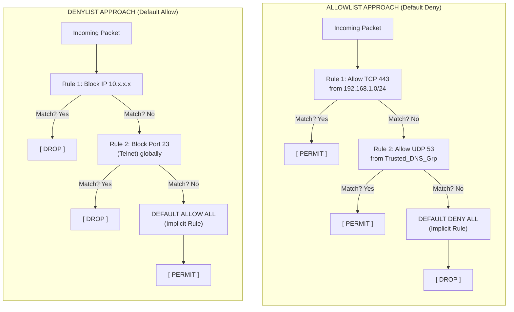

# 56.07 Firewall Rules Allowlist vs Denylist

## Introduction
Firewalls are the bedrock of network security, acting as the primary gatekeepers between trusted internal networks and untrusted external environments. The effectiveness of a firewall is entirely dictated by its ruleset. When constructing these rulesets, security engineers must choose an overarching philosophy: **Allowlisting (Default Deny)** or **Denylisting (Default Allow)**. Understanding the nuances, strengths, operational complexities, and implementations of both approaches is critical for building robust defensive architectures.

## Definitions

### Allowlist (Default Deny / Positive Security Model)
An allowlist is a security strategy where the default stance is "deny all." Every packet, connection attempt, or payload is blocked by default unless there is an explicit rule permitting it. You only allow known, trusted entities or traffic. If the firewall does not explicitly recognize the traffic as permitted, it drops it.

### Denylist (Default Allow / Negative Security Model)
A denylist is the opposite. The default stance is "allow all." Traffic is permitted to flow freely unless it matches a specific rule that explicitly blocks it. You only block known bad entities or traffic, like known malicious IP ranges or specific attacked ports.

## Architectural Diagram

## Deep Dive: Allowlisting

### The Mechanism
Allowlisting requires a deep, comprehensive understanding of the environment. The administrator must map out exactly what communication is necessary for business operations. If Application A needs to talk to Database B on port 5432, a specific rule is created for that exact path. Any deviation is dropped.

### Strengths
1. **Zero-Day Protection:** Because everything unknown is blocked, allowlisting inherently protects against zero-day exploits and novel malware that attempt to phone home on non-standard ports or to unknown IP addresses.
2. **Reduced Attack Surface:** Only the absolute minimum required ports and protocols are open. This drastically shrinks the attack surface.
3. **High Security Posture:** It is the embodiment of the Principle of Least Privilege at the network layer.
4. **Predictability:** Network traffic flows are highly predictable because only explicitly defined flows can exist.

### Weaknesses
1. **High Administrative Overhead:** It requires massive initial effort to catalog all legitimate traffic. In dynamic environments (e.g., Kubernetes, auto-scaling cloud infrastructure), maintaining static IP-based allowlists can be a nightmare.
2. **Business Disruption Risk:** If a legitimate required connection is missed during configuration, or if an application changes its behavior, the traffic is blocked, causing immediate business disruption.
3. **Application Complexity:** Modern applications often use dynamic ephemeral ports or communicate with a vast array of third-party APIs (CDNs, telemetry, updates), making strict allowlisting highly complex to maintain.

## Deep Dive: Denylisting

### The Mechanism
Denylisting relies on maintaining a list of "known bads." This could be malicious IP addresses sourced from threat intelligence feeds, blocked ports (e.g., blocking 445 globally to prevent SMB attacks like WannaCry), or specific application signatures (in the case of Next-Generation Firewalls or WAFs).

### Strengths
1. **Low Friction:** It is very easy to deploy. Business operations are rarely disrupted because the default state is to allow traffic.
2. **Low Initial Overhead:** It doesn't require an exhaustive mapping of legitimate business traffic flows.
3. **Effective for Known Threats:** Highly effective at blocking known malicious actors, botnets, and script kiddies using standard attack vectors.

### Weaknesses
1. **Reactive, Not Proactive:** Denylists are inherently reactive. You can only block a threat after it has been identified as bad. You are perpetually playing "whack-a-mole" against new infrastructure.
2. **Ineffective Against Zero-Days:** Novel attacks, or attackers using fresh, unknown IP infrastructure, will bypass the denylist completely.
3. **Vast Attack Surface:** By defaulting to allow, you leave ports and protocols open that you might not even realize are active, creating massive blind spots.

## Firewall Rule Ordering and "Top-Down" Execution
Firewalls process rules sequentially from top to bottom. Once a packet matches a rule, the firewall takes the corresponding action (allow or block) and stops evaluating further rules.
- **Shadowing:** A common misconfiguration occurs when a broad rule is placed above a specific rule. For example, if Rule 1 allows all IP traffic, Rule 2 (blocking a specific IP) will never be triggered because Rule 1 already permitted the packet. This is known as a shadowed rule.
- **Optimization:** Frequently hit rules should be placed higher in the rulebase to reduce CPU cycles spent processing packets through unnecessary rule checks.

## Hybrid Approaches and Modern Context

In reality, pure allowlisting or pure denylisting is rare in modern enterprise edge security. Instead, organizations use a hybrid approach heavily skewed towards allowlisting.

### The Standard Best Practice Ruleset
1. **Explicit Denies (The Denylist Layer):** Explicitly block known bad traffic early in the rule chain to save processing power. For example, explicitly blocking Geo-IP regions where the business has no operations, or blocking known Tor exit nodes via dynamic blocklists.
2. **Explicit Allows (The Allowlist Layer):** Define specific rules for known, required traffic (e.g., Allow inbound TCP 443 to the Web Server VIP).
3. **The Default Deny (The Catch-All):** The final, immutable rule at the bottom of the ruleset must be a `Deny All / Drop All`. If traffic has not explicitly been allowed by the rules above it, it dies here.

### Next-Generation Firewalls (NGFW)
NGFWs complicate and enhance the paradigm. Instead of just IP/Port allow/deny (Layer 3/4), they introduce Layer 7 (Application layer) visibility.
- **Application Control:** You can *allowlist* specific applications regardless of port. (e.g., "Allow Slack, Block all other chat apps, even if they run over port 443").
- **Identity Awareness:** You can use dynamic objects, integrating with Identity Providers (IdP) to allowlist based on user identity rather than IP. (e.g., "Allow John Doe to access RDP, block everyone else").
- **SSL Decryption:** NGFWs can decrypt HTTPS traffic, inspect the payload against denylists (signatures), and re-encrypt it, exposing threats hidden in encrypted tunnels.

## Operationalizing the Strategy

### Implementing an Allowlist
1. **Baseline Phase:** Run the firewall in a permissive mode but turn on deep logging (Any-Any-Allow with Logging enabled).
2. **Analysis:** Analyze the logs to identify all legitimate traffic over a representative time period (e.g., 30 days).
3. **Rule Creation:** Create granular rules based on the observed baseline.
4. **Testing:** Switch to a blocking mode in a staged rollout, monitoring carefully for dropped legitimate traffic.
5. **Continuous Review:** Firewall rules degrade over time. Implement a rule lifecycle management process to remove stale allowlist entries that are no longer needed.

### Microsegmentation
Allowlisting is the core philosophy behind microsegmentation. In a zero-trust environment, workloads are segmented at a micro-level, and communication between them is strictly allowlisted. A compromised container cannot pivot to an adjacent container because no allowlist rule exists to permit that lateral movement.

## Chaining Opportunities
- **[[08 - Network Segmentation and VLANs]]**: Allowlisting is the mechanism that enforces the boundaries between VLANs. Without strict allowlists, segmentation is merely logical routing without security.
- **[[09 - Zero Trust Architecture]]**: Zero Trust relies heavily on granular allowlisting based on identity, device posture, and application context, moving away from broad network-based rules.
- **[[10 - Intrusion Detection IDS vs IPS]]**: An IPS often uses a denylist approach (signature matching for known exploits) layered on top of a firewall's allowlist configuration.

## Related Notes
- [[01 - Security Baselines]]
- [[02 - Defense in Depth]]
- [[04 - Web Application Firewalls]]
- [[06 - Database Hardening]]
