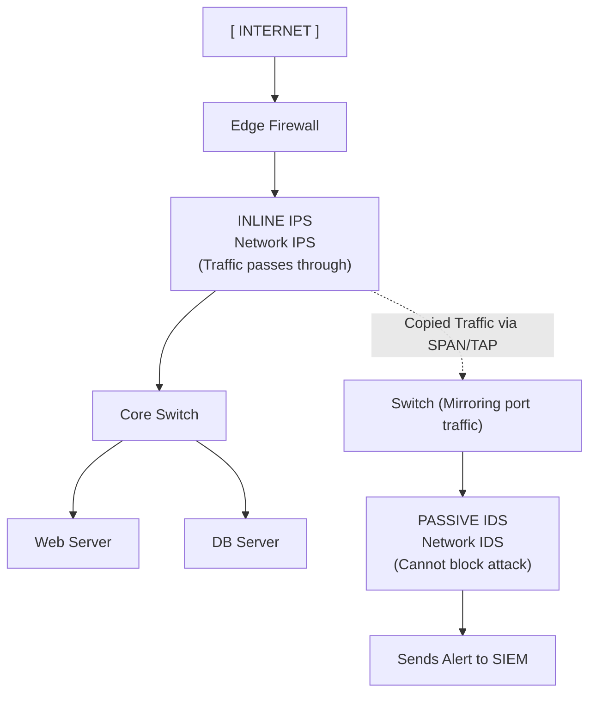

# 56.10 Intrusion Detection IDS vs IPS

## Introduction
In the realm of network security, perimeter defenses like firewalls act as the gatekeepers, ensuring only authorized traffic flows between networks. However, firewalls are generally blind to the *intent* of allowed traffic. For example, a firewall will allow all HTTPS traffic to a web server, but it cannot tell if that HTTPS traffic contains a malicious SQL injection payload or a legitimate user request. 

Intrusion Detection Systems (IDS) and Intrusion Prevention Systems (IPS) act as the internal security cameras and automated bouncers of the network. They deeply inspect traffic flows and packet contents to identify, alert on, and potentially stop malicious activity that has evaded primary defenses.

## IDS vs IPS: The Core Difference
While often bundled together in unified threat management platforms, their core functionality differs fundamentally in *action* and *network placement*.

### Intrusion Detection System (IDS)
An IDS is **passive**. It acts strictly as a monitoring and alerting tool.
- **Function:** It copies network traffic, analyzes it against known threat signatures or baseline anomalies, and if it spots something suspicious, it generates an alert (sending it to a SIEM or administrator).
- **Action:** It **cannot** stop an attack in progress. It is entirely out-of-band. (In rare cases, it can send TCP reset packets to try and kill a connection, but this is unreliable).
- **Advantage:** Because it is passive, a false positive (flagging legitimate traffic as malicious) will not disrupt business operations. It cannot accidentally block legitimate traffic. It has zero impact on network latency.

### Intrusion Prevention System (IPS)
An IPS is **active**. It acts as an automated control mechanism.
- **Function:** It sits inline with the network traffic. Every single packet must pass *through* the IPS before reaching its destination. It analyzes the traffic just like an IDS.
- **Action:** If it detects malicious activity, it can actively drop the packets, reset the connection, or dynamically block the offending IP address in the firewall rules in real-time.
- **Advantage:** It actively stops attacks before they reach their target, preventing compromise.
- **Disadvantage:** A false positive will result in dropped packets and immediate business disruption. It can also introduce minor network latency since it must process every packet inline.

## Architectural Placement Diagram

## Detection Methodologies

Both IDS and IPS rely on specific methodologies to identify bad behavior. Modern systems (like Snort, Suricata, and Zeek) utilize a combination of these approaches.

### 1. Signature-Based Detection
This is analogous to antivirus software. The system maintains a massive database of known threat signatures—specific patterns of bytes, known malicious file hashes, or specific sequences in network packets that correspond to known exploits (e.g., a specific byte pattern representing the Log4Shell exploit string).
- **Example Snort Rule:** `alert tcp $EXTERNAL_NET any -> $HTTP_SERVERS $HTTP_PORTS (msg:"SQL Injection Attempt"; content:"%27 OR 1=1"; http_uri; sid:10001; rev:1;)`
- **Pros:** Highly accurate with very few false positives for known threats. Very fast processing.
- **Cons:** Completely blind to zero-day (unknown) attacks. Attackers can easily bypass signatures by obfuscating their payloads or changing slight details in the attack pattern.

### 2. Anomaly-Based (Heuristic / Behavior) Detection
This methodology establishes a baseline of "normal" network behavior using machine learning and statistical analysis. It learns what typical traffic volumes, protocols, and communication paths look like. If traffic deviates significantly from this baseline (e.g., a server that normally sends 10MB a day suddenly sends 5GB over a non-standard port), it triggers an alert.
- **Pros:** Capable of detecting novel, zero-day attacks, and slow-and-low insider threats that lack signatures.
- **Cons:** High rate of false positives. If the network changes legitimately (e.g., a new application is deployed, or a massive legitimate backup transfer occurs), the system may flag it as an attack. Requires a long "learning" period to establish the baseline.

### 3. Protocol-Based Detection
This analyzes the state and structure of network protocols against published RFC standards. If an attacker sends malformed TCP packets, fragmented packets designed to crash a system, or violates HTTP structure to exploit a buffer overflow, the system flags the protocol anomaly.

## Host-Based vs. Network-Based

IDS/IPS solutions can be deployed at different layers:

- **Network-Based (NIDS / NIPS):** Analyzes traffic flowing across the network infrastructure. Placed at strategic choke points (like a DMZ boundary or inter-VLAN router). They provide broad visibility but struggle with encrypted traffic. If traffic is TLS encrypted, the NIDS cannot see the payload unless SSL decryption (TLS inspection) is configured.
- **Host-Based (HIDS / HIPS):** Installed directly on individual servers or endpoints as software agents. They monitor local operating system logs, file integrity (FIM), system calls, memory space, and local network traffic. They are highly effective because they can see the traffic *after* it has been decrypted by the host OS. OSSEC, Wazuh, and modern EDR (Endpoint Detection and Response) solutions fall into this category.

## Evading IDS / IPS
Offensive security professionals constantly attempt to bypass these controls during engagements:
- **Fragmentation:** Splitting malicious payloads across multiple small, fragmented packets. If the IDS does not properly reassemble the fragments before inspection, it misses the signature.
- **Encryption:** Using TLS/HTTPS to hide the payload. If the IPS cannot decrypt the traffic, it is effectively blind. Attackers use C2 over HTTPS specifically for this reason.
- **Obfuscation / Encoding:** Encoding the payload (e.g., Base64, URL encoding, Unicode evasion, polymorphic shellcode) so the static signature no longer matches the bytes on the wire.
- **Timing Attacks:** Sending malicious packets extremely slowly (low and slow) to avoid triggering anomaly-based rate limits or baseline deviations.

## Tuning and False Positive Management
The biggest challenge with IDS/IPS is alert fatigue. An untuned IDS can generate thousands of false positive alerts a day. Security engineers must constantly "tune" the system:
- Disabling signatures for technologies not present in the environment (e.g., disabling Apache Struts rules if the company only uses IIS).
- Adjusting threshold limits for anomaly detection.
- Writing custom rules for specific internal applications.

## Chaining Opportunities
- IDS/IPS platforms are deeply integrated with **[[05 - SIEM and Log Aggregation]]**. The IDS acts as the raw sensor, while the SIEM provides correlation, long-term storage, and analytics.
- Modern **[[04 - Web Application Firewalls]]** incorporate IPS capabilities specifically tuned for Layer 7 web traffic, understanding HTTP structures much better than a standard NIPS.
- HIDS is a critical component of assessing endpoint health in a **[[09 - Zero Trust Architecture]]**.

## Related Notes
- [[01 - Security Baselines]]
- [[02 - Defense in Depth]]
- [[07 - Firewall Rules Allowlist vs Denylist]]
- [[08 - Network Segmentation and VLANs]]
