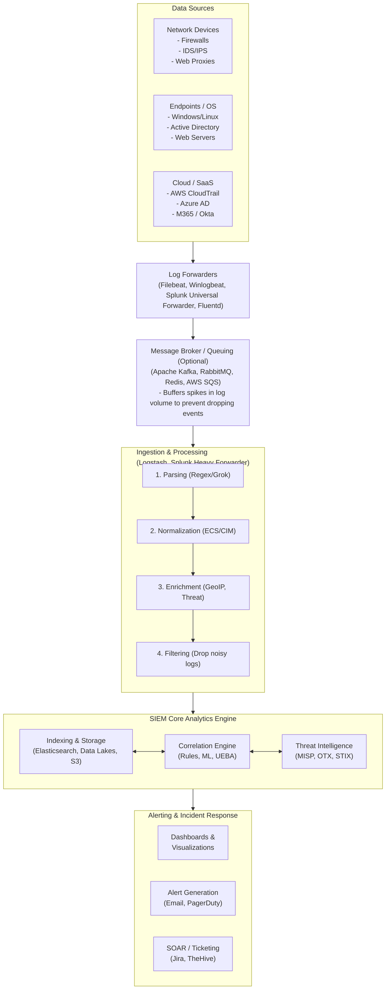

# SIEM Concepts: Log Aggregation & Alerting

## Overview
Security Information and Event Management (SIEM) systems represent the nerve center of a modern Security Operations Center (SOC). A SIEM solution ingests, normalizes, and analyzes log data from across the entire IT infrastructure to detect malicious activity, operational anomalies, and compliance violations in real-time. By providing centralized visibility, SIEMs enable security analysts to identify threats that might go unnoticed if logs were analyzed in isolation. 

The complexity of modern hybrid environments—spanning on-premises datacenters, cloud providers (AWS, Azure, GCP), and SaaS applications—makes a unified logging strategy paramount. Without a SIEM, security teams operate blindly, forced to log into dozens of disparate consoles to piece together an attacker's footprints.

SIEM architecture consists of several core components working in tandem: data collection/ingestion, parsing/normalization, indexing/storage, correlation/analytics, and alerting/reporting. The effectiveness of a SIEM heavily depends on the quality of the data it receives, the precision of its parsing logic, and the fidelity of its correlation rules.

## Architecture and ASCII Diagram

Below is a detailed architectural representation of a typical distributed SIEM deployment. It illustrates data ingestion pipelines, message brokering, core processing, and the analyst interface.



## Log Aggregation Strategies

Log aggregation is the absolute foundation of any SIEM. Without comprehensive, reliable, and timely data ingestion, the analytical capabilities of the SIEM are rendered useless. "Garbage in, garbage out" applies heavily here.

### Critical Data Sources and Telemetry
Effective SIEM deployments require high-fidelity telemetry from multiple layers of the defense-in-depth architecture. Selecting the right logs is an exercise in balancing visibility with cost.

1.  **Network Layer:** 
    *   Firewalls: Allow/deny logs to track data exfiltration and external scanning.
    *   IDS/IPS: Network-level threat signatures (e.g., Snort/Suricata alerts).
    *   Web Proxies: URL filtering logs, critical for spotting C2 beacons and drive-by downloads.
    *   DNS Servers: Query/response logs to identify Domain Generation Algorithms (DGA) or DNS tunneling.
2.  **Endpoint Layer:** 
    *   Windows Event Logs: Specifically Security, System, and PowerShell Operational logs.
    *   Sysmon: Deep visibility into process creation, network connections, file creation, and registry modifications.
    *   EDR/XDR Telemetry: Advanced process tracking and behavioral alerts.
    *   Linux: Syslog, Auditd, and bash history.
3.  **Identity and Access Management (IAM):** 
    *   Active Directory: Kerberos authentication, privilege escalation, group changes.
    *   SSO Providers: Okta, Azure AD, Duo Security logs indicating MFA successes, failures, or bypass attempts.
4.  **Application and Database Layer:** 
    *   Web server logs (Apache, Nginx, IIS) to detect SQLi, XSS, or directory traversal attempts.
    *   Database query logs to detect data dumping or unauthorized table access.
5.  **Cloud Infrastructure:** 
    *   AWS CloudTrail, Azure Activity Logs, GCP Cloud Audit Logs to track control-plane modifications (e.g., spinning up rogue instances, altering security groups).

### Log Formats and Parsing
Raw logs arrive in vastly different, often proprietary formats. Standardized formats exist, such as:
*   **CEF (Common Event Format):** Developed by ArcSight, widely used by security appliances.
*   **LEEF (Log Event Extended Format):** Developed by IBM QRadar.
*   **JSON:** The modern standard, easily parsed and highly structured.
*   **Windows XML Event Log (EVTX):** Complex structured XML used by modern Windows.

### Normalization and Taxonomies
Normalization is the critical process of standardizing this disparate data into a common schema. Without normalization, cross-platform correlation is impossible.
*   **Splunk CIM (Common Information Model)**
*   **Elastic ECS (Elastic Common Schema)**

For instance, a source IP address might be represented as `src_ip` in Cisco ASA logs, `SourceAddress` in Windows Event Logs, and `c-ip` in IIS logs. The parsing pipeline extracts these fields and maps them to a normalized field, such as `source.ip`. This allows analysts to write a single, unified query `source.ip: 192.168.1.10` that searches across all underlying log types simultaneously.

#### Example Parse Logic (Logstash Grok for Apache Combined Log)
```ruby
filter {
  grok {
    match => { "message" => "%{COMBINEDAPACHELOG}" }
  }
  date {
    match => [ "timestamp" , "dd/MMM/yyyy:HH:mm:ss Z" ]
  }
}
```
This pattern parses unstructured text into discrete JSON fields (clientip, verb, request, httpversion, response, bytes).

### Log Enrichment
Before indexing, logs are enriched with additional contextual data to enhance their analytical value and save analysts time during triage:
-   **GeoIP Lookup:** Mapping IP addresses to physical locations (City, Country, ASN).
-   **Threat Intelligence Matching:** Checking IP addresses, domains, and file hashes against known malicious IoCs (Indicators of Compromise) from feeds like MISP, AlienVault OTX, or proprietary sources.
-   **Identity Resolution:** Correlating abstract usernames or IPs to actual employee identities, roles, and departments via LDAP/HR system lookups.
-   **Asset Criticality:** Tagging logs based on the criticality of the source/destination asset (e.g., tagging a server as "Crown Jewel", "PCI Scope", or "Domain Controller").

## Correlation and Analytics

Correlation is the analytical brain of the SIEM. It involves linking discrete events, potentially from different sources, over a specific time window to identify complex attack patterns that a single log entry cannot reveal.

### Rule-Based Correlation (Deterministic)
Traditional SIEM detection relies on deterministic correlation rules written by security engineers. These rules look for specific sequences or combinations of events based on known attacker TTPs (Tactics, Techniques, and Procedures).

#### Example Scenario: Pass-the-Hash Detection
An attacker compromises a workstation, dumps credentials, and uses a hashed password to authenticate to a server.
1.  **Rule Logic:** Look for Windows Event ID 4624 (Successful Logon).
2.  **Conditions:** 
    *   Logon Type is 9 (NewCredentials)
    *   Authentication Package is NTLM
    *   Logon Process is `seclogo`
3.  **Action:** If all conditions match, trigger a High severity alert for "Potential Pass-the-Hash Activity".

#### Sigma Rules: The Universal Language
Sigma is an open-source standard for describing SIEM rules in a vendor-agnostic YAML format. A Sigma rule can be translated instantly into Splunk SPL, Elastic Query DSL, QRadar AQL, etc.

```yaml
title: Potential Pass-the-Hash Activity
id: 12345678-1234-1234-1234-123456789012
status: experimental
description: Detects logon events that suggest a Pass-the-Hash attack.
logsource:
    product: windows
    service: security
detection:
    selection:
        EventID: 4624
        LogonType: 9
        LogonProcessName: 'seclogo'
        AuthenticationPackageName: 'Negotiate'
    condition: selection
level: high
tags:
    - attack.lateral_movement
    - attack.t1050
```

### Advanced Analytics (UEBA and Machine Learning)
Deterministic rules fail against novel, "low and slow" attacks, or insider threats. Modern SIEMs incorporate User and Entity Behavior Analytics (UEBA) and Machine Learning (ML) to detect these threats.
-   **Baselining:** The SIEM establishes a mathematical baseline of "normal" behavior for users and entities (e.g., typical logon times, standard data transfer volumes, common applications accessed, typical peer groups).
-   **Anomaly Detection:** Deviations from the baseline generate risk scores. If a user who usually logs in from New York at 9 AM suddenly logs in from a suspicious VPN IP at 3 AM and attempts to access an unusual HR database, the system will flag the anomaly, even if no static rule was explicitly violated.

## Alerting, Triage, and Automation

The output of correlation rules and analytical models is an alert. Effective alerting is crucial to prevent "alert fatigue," a dangerous phenomenon where analysts are overwhelmed by too many false positives, leading them to ignore or miss critical warnings.

### Alert Tuning and Fidelity
High-fidelity alerts are those that have a high probability of representing actual malicious activity. Tuning is a continuous process.
-   **Whitelisting/Exclusions:** Removing known legitimate administrative behavior from alerting logic (e.g., excluding vulnerability scanners from triggering excessive brute-force alerts).
-   **Threshold Adjustments:** Increasing the threshold for generic alerts to match the environment (e.g., changing "5 failed logins" to "50 failed logins").
-   **Risk-Based Alerting (RBA):** Instead of alerting on every single event, the SIEM assigns risk scores to users and assets. An alert is only generated when a user's cumulative risk score exceeds a specific threshold within a 24-hour period.

### Integration with SOAR (Security Orchestration, Automation, and Response)
SOAR platforms integrate tightly with SIEMs to automate the incident response lifecycle. When a SIEM generates an alert, the SOAR platform can automatically execute playbooks:
1.  **Enrichment Playbook:** Automatically query VirusTotal for file hashes, query Active Directory for user details, and attach this context to the ticket before an analyst even sees it.
2.  **Containment Playbook:** If a severe ransomware alert fires, SOAR can automatically interact with the firewall API to block the C2 IP, and tell the EDR API to isolate the infected host from the network.

## Log Retention and Compliance Architecture

SIEMs also serve as the central repository for compliance auditing (PCI-DSS, HIPAA, SOC2). This requires complex storage architectures.

-   **Hot Storage:** Fast, expensive NVMe/SSD storage for recent logs (e.g., 7 to 30 days). Data is fully indexed and ready for rapid searching and active correlation.
-   **Warm Storage:** Slower, cheaper HDD storage for logs up to 90 days. Queries are slower but still possible within the SIEM interface.
-   **Cold Storage / Data Lake:** Extremely cheap object storage (like AWS S3 Glacier or Azure Blob). Logs are kept for 1 to 7 years. They are not indexed for fast search; if needed for a historical forensic investigation, they must be "rehydrated" or queried via serverless tools like AWS Athena.
-   **Immutability (WORM):** Write-Once-Read-Many storage ensures that once a log is written, it cannot be modified or deleted by an attacker attempting to cover their tracks.

## Chaining Opportunities
-   A well-tuned SIEM provides the necessary, correlated telemetry for effective operations in [[12 - SOC Operations Tier 1 2 3 Overview]].
-   The High-fidelity alerts generated by the SIEM are the primary triggers for initiating the formal [[13 - Incident Response PICERL]] framework.
-   SIEM data can be used to identify specific endpoints, timestamps, and network connections requiring deeper analysis during [[14 - Digital Forensics Evidence Collection]].
-   By observing specific command-line executions logged in the SIEM, analysts might decide a system warrants an in-depth look using [[15 - Memory Forensics Volatility]].

## Related Notes
-   [[12 - SOC Operations Tier 1 2 3 Overview]]
-   [[13 - Incident Response PICERL]]
-   [[14 - Digital Forensics Evidence Collection]]
-   [[15 - Memory Forensics Volatility]]
-   [[01 - Network Security Architecture]]
-   [[04 - Endpoint Security and EDR]]
