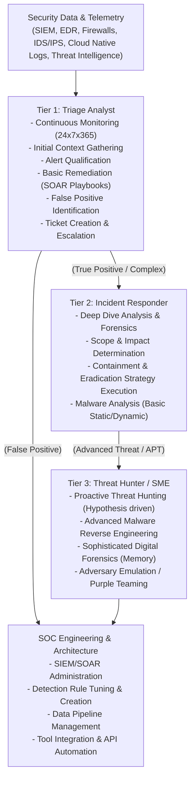

# SOC Operations: Tier 1, 2, 3 Overview

## Overview
A Security Operations Center (SOC) is a centralized unit that deals with security issues on an organizational and technical level. It comprises the people, processes, and technology responsible for continuously monitoring and improving an organization's security posture while preventing, detecting, analyzing, and responding to cybersecurity incidents. 

Modern SOCs deal with massive volumes of data and alerts. To manage this operational load efficiently and ensure that critical incidents receive expert attention while routine events are handled swiftly, most mature SOCs adopt a tiered, hierarchical structure. This structure ensures a defined escalation path. The standard model consists of Tier 1 (Triage), Tier 2 (Incident Response), and Tier 3 (Threat Hunting/SME), supported by a SOC Manager and specialized Engineering teams.

## Architecture and ASCII Diagram

Below is a visualization of the SOC operational flow, demonstrating how security events are processed through the various tiers, the escalation pathways, and how feedback loops drive continuous improvement.

## Tier 1: Triage Analyst (The Frontline)

Tier 1 analysts are the "eyes on the glass." They operate in shifts to provide 24/7/365 coverage, constantly monitoring the SIEM and other security dashboards for alerts. Their primary goal is speed and accuracy: perform initial triage rapidly to determine if an alert represents a true threat requiring escalation, or a false positive that can be closed.

### Responsibilities
-   **Alert Monitoring:** Continuously watching queues for incoming alerts from various security controls.
-   **Initial Qualification:** Reviewing the alert details, evaluating the context (e.g., user identity, asset criticality, network zone), and determining the priority of the event based on established matrices.
-   **Context Gathering:** Utilizing OSINT and internal tools to gather initial data (e.g., checking an IP against VirusTotal, looking up a user's role in Active Directory, reviewing recent host activity in the EDR console).
-   **Basic Remediation:** Executing predefined Standard Operating Procedures (SOPs) or initiating SOAR playbooks for well-understood, low-complexity threats (e.g., isolating a host infected with known commodity malware, executing a password reset for a compromised account).
-   **Escalation:** If the alert is confirmed as a complex, high-impact, or unidentifiable incident, the Tier 1 analyst gathers all compiled evidence, opens a detailed incident ticket, and hands it off to Tier 2.
-   **False Positive Disposition:** Closing alerts deemed non-malicious and providing specific feedback (e.g., "This IP belongs to our approved vulnerability scanner") for rule tuning.

### Skillset and Metrics
-   **Skills:** Familiarity with SIEM navigation, basic networking (TCP/IP, DNS, HTTP), operating system fundamentals, and strict adherence to playbooks.
-   **Key Metrics:** Mean Time to Triage (MTTT) - How fast can they look at an alert and make a decision? Typically aimed at < 15 minutes.

## Tier 2: Incident Responder (The Investigators)

Tier 2 analysts are more experienced responders who take over incidents escalated by Tier 1. They handle the "heavy lifting" of incident response, focusing on deep technical analysis, determining the full scope of the breach, and orchestrating containment.

### Responsibilities
-   **Deep Analysis:** Conducting detailed investigations of escalated incidents. This involves reviewing packet captures (PCAP), analyzing endpoint logs, and tracing lateral movement across the network.
-   **Scope Determination:** Identifying all compromised systems, accounts, and data to understand the full blast radius of the incident. Did the attacker pivot? Did they establish persistence?
-   **Containment Strategy:** Developing and executing a plan to "stop the bleeding." This might involve complex network segmentation, disabling critical service accounts, or coordinating widespread password resets without tipping off the attacker prematurely.
-   **Remediation & Eradication:** Guiding IT operations teams in removing the threat from the environment (e.g., deleting malicious files, removing registry run keys, patching vulnerabilities).
-   **Basic Malware Analysis:** Performing static and dynamic analysis of suspicious files in a sandbox to extract Indicators of Compromise (IoCs - IPs, domains, hashes) and understand the malware's capabilities.
-   **Reporting:** Documenting the incident timeline, root cause, and remediation steps for the final incident report.

### Skillset and Metrics
-   **Skills:** Advanced knowledge of digital forensics and incident response (DFIR) methodologies. Proficiency with EDR platforms and forensic triage tools (e.g., KAPE). Deep understanding of attacker TTPs mapped to the MITRE ATT&CK framework.
-   **Key Metrics:** Mean Time to Detect (MTTD) and Mean Time to Respond (MTTR).

## Tier 3: Threat Hunter / Subject Matter Expert (SME)

Tier 3 analysts are the most senior technical staff in the SOC. They are completely decoupled from the reactive daily alert queue. Instead, they focus on proactive defense, hunting for sophisticated adversaries (APTs) that have successfully evaded all existing Tier 1 and Tier 2 security controls.

### Responsibilities
-   **Proactive Threat Hunting:** Formulating hypotheses about potential threats based on intelligence (e.g., "If APT29 is using a new Kerberoasting technique, what would it look like in our logs?"). They proactively query massive datasets in the SIEM or data lake to find hidden compromises.
-   **Advanced Forensics & Malware Analysis:** Handling the most complex, high-stakes investigations. This includes deep memory forensics (using tools like Volatility) and reverse engineering of custom, obfuscated malware or zero-day exploits using disassemblers like Ghidra or IDA Pro.
-   **Threat Intelligence Operationalization:** Consuming tactical and strategic threat intelligence to anticipate adversary moves and adapt organizational defenses preemptively.
-   **Purple Teaming:** Collaborating with Red Teams or performing adversary emulation to proactively test the effectiveness of SOC detection rules and processes against known threat profiles.

### Skillset
-   Expert-level knowledge of OS kernel internals, network protocols, cryptography, and scripting (Python, PowerShell, C/C++).
-   Experience with reverse engineering, exploit development concepts, and advanced debugging.

## Supporting SOC Functions

The tiered analysts form the core operational workflow, but they rely heavily on supporting roles to function effectively:

### SOC Engineering / Detection Architecture
This team builds, maintains, and optimizes the platform.
-   **Tool Management:** Administering the SIEM, EDR, SOAR, and log forwarding pipelines.
-   **Detection Engineering:** The critical task of translating threat intelligence and Tier 3 findings into actionable correlation rules. They continuously tune existing rules to reduce false positives for Tier 1.
-   **Automation Development:** Writing custom Python scripts and SOAR playbooks to automate repetitive tasks, dramatically reducing MTTR and analyst burnout.

### SOC Manager / Director
Oversees the entire operation, focusing on metrics, personnel, and strategic alignment.
-   **Metrics & KPI Tracking:** Monitoring SOC health via MTTT, MTTD, MTTR, and alert volumes.
-   **Resource Management:** Handling complex shift scheduling (Follow-the-Sun vs. localized 24/7 shifts), training paths, burnout prevention, and hiring.
-   **Stakeholder Communication:** Reporting SOC performance, risk posture, and critical incident updates to the CISO, Legal, and executive leadership.

## The SOC Lifecycle and Feedback Loop

A mature SOC operates as a continuous, closed feedback loop. 
1. When Tier 1 analysts identify a high volume of false positives from a specific rule, they report it to SOC Engineering for tuning. 
2. When Tier 2 analysts uncover a novel attack vector during an investigation, they extract the IoCs and TTPs.
3. They share these findings with Tier 3, who develop new threat hunting hypotheses.
4. Tier 3 works with SOC Engineering to create robust, new detection rules. 
This continuous improvement cycle is the only way to maintain an effective defense against a constantly evolving threat landscape.

## Chaining Opportunities
-   The daily workflow of Tier 1 relies completely on the data pipelines and alerting mechanisms discussed in [[11 - SIEM Concepts Log Aggregation Alerting]].
-   When Tier 2 formally engages a major breach, they execute the standardized framework detailed in [[13 - Incident Response PICERL]].
-   Tier 2 and Tier 3 analysts utilize advanced techniques from [[14 - Digital Forensics Evidence Collection]] and [[15 - Memory Forensics Volatility]] to investigate complex incidents and extract malware.

## Related Notes
-   [[11 - SIEM Concepts Log Aggregation Alerting]]
-   [[13 - Incident Response PICERL]]
-   [[14 - Digital Forensics Evidence Collection]]
-   [[15 - Memory Forensics Volatility]]
