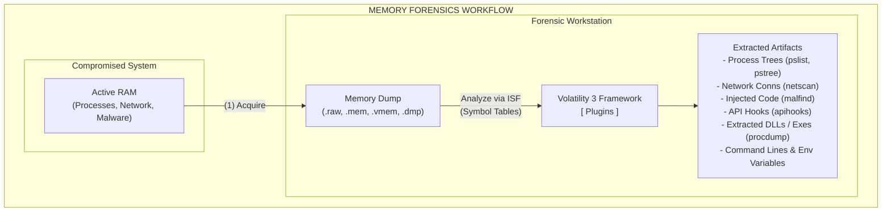

# Memory Forensics: Deep Analysis with Volatility

## Overview
Memory forensics (or RAM forensics) is the complex analysis of a computer's volatile memory dump. As adversaries become increasingly sophisticated, employing fileless malware, kernel-level rootkits, and in-memory execution techniques (e.g., Reflective DLL injection, Cobalt Strike beacons, Metasploit Meterpreter), traditional disk-based forensics often completely fails to detect their presence. Because almost every action a computer takes must pass through RAM—including running processes, open network connections, decrypted passwords, registry hives, and encryption keys—memory analysis is an indispensable capability for uncovering advanced threats.

The industry-standard open-source framework for this discipline is **Volatility**. Built in Python, Volatility provides a massive suite of specialized plugins capable of extracting profound programmatic insight from a raw, unstructured memory image. It allows investigators to reconstruct the state of the operating system exactly as it existed at the microsecond the snapshot was taken.

## Architecture and ASCII Diagram

Below is a visualization of how Volatility interacts with a raw memory dump, utilizing Symbol Tables to map binary offsets to human-readable OS data structures, thereby extracting structured forensic artifacts.

## Profiles (Volatility 2) vs. Symbol Tables (Volatility 3)

To analyze a memory dump, the forensic tool must perfectly understand the internal structures of the operating system that was running at the time. A memory dump is just billions of unformatted 1s and 0s. The tool needs to know, for example, the exact byte offset of the `ImageFileName` within the `_EPROCESS` block in a specific build of Windows 10.

-   **Volatility 2:** Relied on static **Profiles**. The analyst had to manually specify the OS profile (e.g., `--profile=Win10x64_18362`) often by first running the `imageinfo` plugin to guess it. If the profile was wrong, or if a Windows update slightly shifted a data structure, the entire analysis would output garbage data or crash.
-   **Volatility 3:** Introduced a massive architectural improvement: **Intermediate Symbol Format (ISF)**. Volatility 3 automatically detects the OS version by searching for the kernel directory base. It then dynamically downloads or utilizes local symbol tables (derived from Microsoft's PDB debugging files or Linux System.map files) to accurately interpret the memory structures. This makes Volatility 3 much faster and significantly more reliable across different OS patches.

*Note: The commands below will utilize the modern Volatility 3 syntax (`vol.py -f <image_file> <plugin_name>`).*

## Core Analysis Plugins and Threat Hunting Methodologies

A typical memory forensic investigation follows a structured, deductive path, moving from broad system state analysis to the extraction of specific malicious code.

### 1. Process Identification and Rogue Process Hunting
The very first step is identifying what was running. Malware often attempts to hide in plain sight by mimicking legitimate OS processes (e.g., naming itself `svchost.exe` or `lsass.exe`) or by utilizing advanced kernel techniques to hide entirely from the OS's API.

-   **`windows.pslist.PsList`:** Walks the doubly-linked list of active `_EPROCESS` structures in memory. This is essentially what Task Manager uses.
    -   *Evasion Technique:* Advanced rootkits can alter pointers to unlink their malicious process from this active list (a technique known as Direct Kernel Object Manipulation - DKOM), effectively hiding it from `pslist` and Task Manager.
-   **`windows.psscan.PsScan`:** Scans the raw memory space looking for specific `_EPROCESS` pool tag signatures. This technique bypasses DKOM because it doesn't rely on the linked list; it carves the structures directly from the raw bytes. If a process appears in the output of `psscan` but is missing from `pslist`, it is an extremely strong indicator of a rootkit intentionally hiding the process.
-   **`windows.pstree.PsTree`:** Displays processes in a parent-child hierarchy. This is crucial for spotting behavioral anomalies.
    -   *Hunting Anomaly Example:* The legitimate `svchost.exe` should ALWAYS execute as a child of `services.exe`. If you observe an instance of `svchost.exe` running as a child of `explorer.exe`, `cmd.exe`, or `powershell.exe`, it is almost certainly malware masquerading as a system process.

### 2. Network Activity Analysis
Malware requires communication for Command and Control (C2), receiving instructions, or exfiltrating stolen data.

-   **`windows.netscan.NetScan`:** Scans memory for network connection structures (like `_TCPT_OBJECT`), revealing active, listening, and recently closed TCP/UDP connections. Crucially, it maps these connections back to the specific Process ID (PID) that owns them.
    -   *Hunting:* Look for suspicious processes communicating on non-standard ports, or standard applications (like `notepad.exe` or `calculator.exe`) making outbound HTTP/HTTPS connections.

### 3. Detecting Injected Code and Fileless Malware
Modern malware routinely avoids dropping executable files to the hard disk to bypass traditional Antivirus. Instead, it injects malicious code directly into the memory space of legitimate, running processes (e.g., Process Hollowing, Reflective DLL Injection).

-   **`windows.malfind.Malfind`:** This is arguably the most powerful plugin for finding advanced threats. It scans process memory blocks (VAD structures) looking for sections that possess both `PAGE_EXECUTE_READWRITE` (RWX) memory protections and contain characteristics of executable code (such as the `MZ` PE header magic bytes or raw shellcode). Legitimate applications rarely need RWX memory segments. If `malfind` flags a segment, it warrants immediate, deep investigation.
-   **`windows.vadinfo.VadInfo`:** The Virtual Address Descriptor (VAD) tree tracks memory allocations for a given process. Examining the VAD can reveal hidden, unbacked memory segments that `malfind` might occasionally miss, or provide deeper context on how the malicious memory was allocated.
-   **`windows.apihooks.ApiHooks`:** Rootkits and banking trojans hook core OS APIs (like `NtReadVirtualMemory` in `ntdll.dll` or networking functions in `ws2_32.dll`) to intercept data, steal credentials, or hide their presence. This plugin detects inline hooks, IAT (Import Address Table) hooks, and EAT hooks.

### 4. Extracting Artifacts for Reverse Engineering
Once a suspicious process, an injected code segment, or a malicious file hidden in memory is identified, it must be extracted out of the memory dump for further static analysis (disassembly) and dynamic analysis (sandboxing).

-   **`windows.pslist.PsList --pid <PID> --dump`:** Dumps the entire memory space of a specific process to a `.dmp` file.
-   **`windows.malfind.Malfind --pid <PID> --dump`:** Extracts only the specific injected, executable memory segments identified by malfind. This is exactly how you pull a Cobalt Strike beacon out of a hollowed process.
-   **`windows.dumpfiles.DumpFiles --pid <PID>`:** Extracts files (DLLs, executables, documents) that are currently loaded and mapped into the memory space. This allows you to pull the malware out of memory even if the attacker has already deleted it from the hard drive.

### 5. Specialized Extractions and Context Gathering
Memory contains vast amounts of contextual data beyond just executing code.
-   **`windows.cmdline.CmdLine`:** Extracts the command-line arguments used to launch every running process. This is invaluable for finding malicious, base64-encoded PowerShell scripts or obfuscated command execution.
-   **`windows.envars.Envars`:** Extracts the environment variables for processes.
-   **`windows.hashdump.Hashdump`:** Extracts the NTLM password hashes from the registry hives loaded into the memory space.
-   **`windows.lsadump.Lsadump`:** Extracts LSA secrets (cleartext passwords, service account credentials) stored in the memory space of `lsass.exe`.

## Workflow Example: Investigating a Cobalt Strike Infection
1.  Run `vol.py -f dump.raw windows.netscan.NetScan` -> Notice `rundll32.exe` (PID 4501) connecting to an unknown IP on port 443.
2.  Run `vol.py -f dump.raw windows.cmdline.CmdLine --pid 4501` -> Observe `rundll32.exe` has no command line arguments (highly suspicious for rundll32, which normally requires a DLL path).
3.  Run `vol.py -f dump.raw windows.malfind.Malfind --pid 4501` -> Volatility identifies a hidden RWX memory segment containing an `MZ` header inside the `rundll32` process space. This indicates Process Injection.
4.  Run `vol.py -f dump.raw windows.malfind.Malfind --pid 4501 --dump` -> The Cobalt Strike beacon is extracted from memory to a `.dmp` file on the analyst's machine.
5.  The extracted `.dmp` file is sent to the reverse engineering team to extract the C2 configuration block.

## Chaining Opportunities
-   The physical memory image (`.raw`, `.vmem`, `.mem`) analyzed by Volatility is acquired using the strict Live Response methodologies outlined in [[14 - Digital Forensics Evidence Collection]].
-   Memory forensics is a core Tier 2 and Tier 3 function within the hierarchy of [[12 - SOC Operations Tier 1 2 3 Overview]] and is vital during the deep investigation phase of [[13 - Incident Response PICERL]].
-   Extracted binaries from memory are often analyzed to understand exactly how the malware successfully bypassed the controls detailed in [[04 - Endpoint Security and EDR]].

## Related Notes
-   [[14 - Digital Forensics Evidence Collection]]
-   [[13 - Incident Response PICERL]]
-   [[12 - SOC Operations Tier 1 2 3 Overview]]
-   [[04 - Endpoint Security and EDR]]
