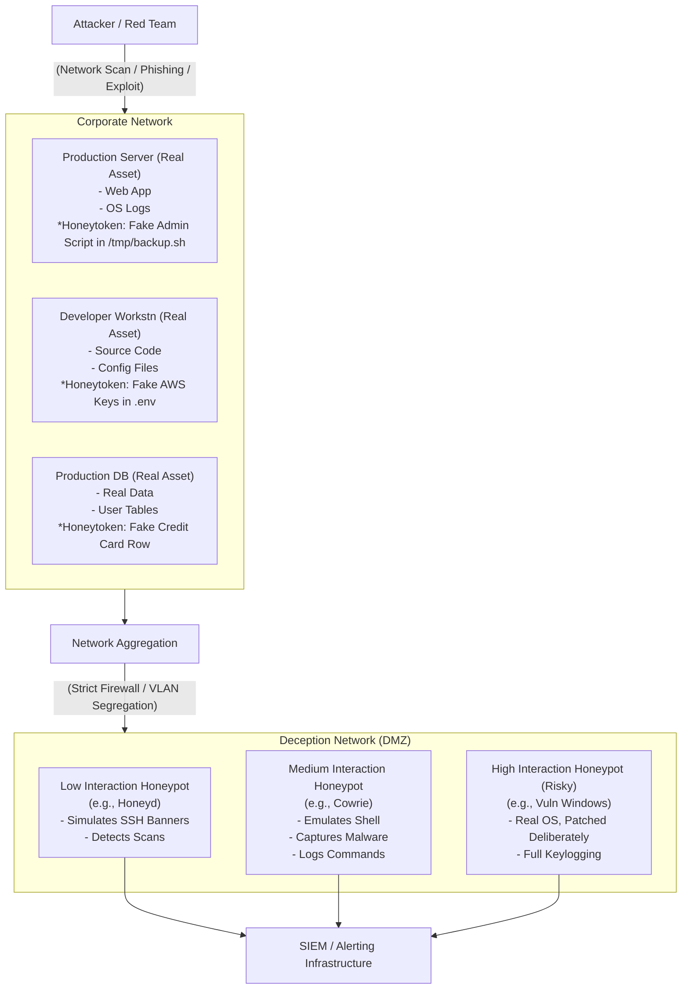

# 18 - Honeypots and Honeytokens

In the landscape of Defensive Security, deception technology represents a shift from a purely reactive posture to an active defense strategy. Instead of relying solely on perimeter defenses and signature-based detection to keep attackers out, deception assumes the perimeter will be (or has been) breached. The goal is to detect post-compromise activity rapidly by baiting the attacker into interacting with fake assets.

**Honeypots** and **Honeytokens** are the foundational elements of this strategy. They provide high-fidelity, low-noise alerts because legitimate users have no reason to interact with them; any interaction is, by definition, suspicious.

## Honeypots

A honeypot is a decoy computer system designed to mimic a legitimate target (a server, an IoT device, an industrial controller). Its purpose is to attract attackers, log their activities, analyze their techniques, and slow their progression through the real network.

### Classification by Interaction Level

Honeypots are primarily categorized by the level of interaction they allow the attacker.

1.  **Low-Interaction Honeypots:**
    *   *Concept:* These simulate only specific services or protocols (e.g., SSH, Telnet, HTTP) at a superficial level. They do not have a real operating system behind them.
    *   *Mechanism:* If an attacker attempts to log in via SSH, the honeypot might accept any password, present a fake banner, and perhaps simulate a few basic shell commands before dropping the connection.
    *   *Pros:* Easy to deploy, low resource footprint, very low risk of compromise (cannot be used as a pivot point).
    *   *Cons:* Easily fingerprinted by sophisticated attackers; provides limited intelligence.
    *   *Examples:* Honeyd, Cowrie (basic configuration).

2.  **Medium-Interaction Honeypots:**
    *   *Concept:* These offer a more comprehensive simulation, often emulating a full shell environment or a complex web application architecture without providing access to the underlying host OS.
    *   *Mechanism:* An attacker might successfully "exploit" a simulated vulnerability, drop a payload, and attempt to execute commands. The honeypot captures the payload and logs the commands, but the execution happens within an isolated, simulated environment.
    *   *Pros:* Captures payloads (malware) and detailed behavioral data; balances risk and intelligence gathering.
    *   *Examples:* Cowrie (advanced configuration, simulating file systems), Dionaea (designed to capture malware payloads over SMB, HTTP, FTP).

3.  **High-Interaction Honeypots:**
    *   *Concept:* These are actual, real operating systems and applications (often running in virtual machines) intentionally left vulnerable or lightly secured.
    *   *Mechanism:* The attacker interacts with a completely real environment. They can fully exploit vulnerabilities, install rootkits, establish C2, and move laterally (within the containment zone).
    *   *Pros:* Provides the highest fidelity intelligence; captures zero-day exploits, advanced post-exploitation techniques, and complex human attacker behavior.
    *   *Cons:* High resource cost; extremely difficult to maintain securely; **High Risk:** If the containment fails, the attacker can use the high-interaction honeypot as a launchpad to attack the real production network. Strict firewalls and network isolation are mandatory.

## Honeytokens (Digital Tripwires)

While a honeypot is an entire decoy system, a honeytoken is a piece of decoy *data* or a specific digital artifact. Honeytokens are embedded within legitimate systems, databases, or file shares.

The principle is the same: no legitimate user should ever access, use, or query the honeytoken.

### Types of Honeytokens

1.  **Fake Credentials (Honey Accounts):**
    *   Creating a highly attractive Active Directory account (e.g., `Administrator_Backup` or `Service_SQL`) and leaving its credentials in a script or memory dump. Any attempt to authenticate using this account immediately triggers a high-severity alert.
2.  **Canary Files (Decoy Documents):**
    *   Placing attractive files (e.g., `Q3_Financial_Projections.xlsx`, `Password_List.txt`) on a network share. These files might contain a "web bug" (an embedded 1x1 pixel image that loads from a unique URL) or a macro that executes a benign script to notify the SOC when the file is opened.
3.  **Database Honeytokens (Fake Records):**
    *   Injecting fake customer records (e.g., a specific credit card number or email address) into a production database. If that specific record is ever queried or exported, it indicates a database breach or an insider threat.
4.  **AWS API Keys / Azure Service Principals:**
    *   Leaving fake or highly restricted cloud credentials in developer repositories (Git), Slack channels, or configuration files. Attackers constantly scan for these. Using them triggers an alert on the cloud provider's API logs.
5.  **DNS Canarytokens:**
    *   A unique hostname (e.g., `db-backup-staging-v2.internal.company.com`). If an attacker performs network reconnaissance or attempts to resolve this hostname, the DNS query is logged by the authoritative nameserver, triggering an alert.

## Deception Architecture Diagram

## Evasion and Fingerprinting

Attackers employ specific techniques to identify honeypots and avoid them, a practice known as honeypot fingerprinting.

1.  **Behavioral Inconsistencies:** Low and medium interaction honeypots often fail to perfectly emulate an OS.
    *   An attacker might try to run a complex script or an obscure command. If the system returns an unnatural error or responds too quickly/slowly, the attacker will realize it's an emulation.
2.  **Environment Artifacts:**
    *   Virtual Machine artifacts (VMware/VirtualBox specific MAC addresses, drivers, registry keys).
    *   Default configurations of known honeypot software (e.g., standard Cowrie SSH keys or default usernames).
3.  **Outbound Connection Restrictions:**
    *   To prevent a compromised high-interaction honeypot from attacking others, security teams strictly limit outbound traffic. Attackers will attempt to ping an external server or curl a payload. If DNS works but all TCP traffic drops silently, it heavily implies a contained environment.
4.  **Time and Uptime Analysis:**
    *   A server with an unusually low uptime, or a system clock that is drastically out of sync, can raise suspicion.

## Deploying Deception Effectively

1.  **Zero False Positives (Ideally):** The strength of deception lies in its low noise. Ensure legitimate automated scanners (like Nessus) or monitoring tools do not trip the honeypots, or whitelist their IPs.
2.  **Blend In:** Honeypots must match the surrounding environment. Placing a Windows 2003 server in a VLAN consisting entirely of modern CentOS machines is a dead giveaway. Naming conventions, domains, and simulated activity must be realistic.
3.  **Continuous Monitoring:** A honeypot is useless if its logs are not actively monitored and integrated into the SIEM. Alerts generated by a honeytoken should trigger an immediate, high-priority Incident Response protocol.

## Chaining Opportunities

*   **Incident Response:** Honeytoken alerts are often the first true indicator of a breach, immediately initiating the IR lifecycle. Connects to `[[12 - Incident Response Frameworks]]`.
*   **Log Analysis:** The data generated by honeypots must be ingested and correlated within the central logging infrastructure. Connects to `[[17 - Log Analysis for Attack Detection]]`.
*   **Malware Analysis:** Payloads captured by medium/high interaction honeypots are sent directly to analysts for reverse engineering. Connects to `[[22 - Malware Analysis Reverse Engineering]]`.

## Related Notes
*   `[[14 - Digital Forensics Fundamentals]]`
*   `[[19 - Threat Hunting Hypothesis-Driven Approach]]`
*   `[[08 - Network Traffic Analysis]]` (Analyzing the traffic flows to and from honeypots)
