# Security Monitoring: What to Alert On

## Introduction
Security monitoring forms the backbone of the modern Security Operations Center (SOC). It is not enough to simply log every event; organizations must extract actionable intelligence from a sea of data. The critical question facing any security engineering team is: *What do we actually alert on?* The goal is to maximize true positive alerts that indicate genuine malicious activity or high-risk policy violations, while aggressively minimizing false positives that lead to alert fatigue. This document provides a comprehensive, advanced framework for defining high-fidelity security alerts across multiple layers of the enterprise architecture, moving beyond legacy signature-based approaches into behavior-driven detection engineering.

## Core Philosophy: Alert Fatigue vs. True Positives
Alert fatigue is the silent killer of the SOC. When analysts are inundated with thousands of low-fidelity alerts daily, their cognitive load increases, leading to "alert blindness" where critical indicators of compromise (IOCs) or attack behaviors are dismissed or ignored.
To combat this, alert engineering must focus on:
- **Behavioral Indicators over Signatures:** Signatures decay rapidly. Alerting on a specific malware hash is fragile. Alerting on the behavior (e.g., a Word document spawning `cmd.exe` or `powershell.exe`) is robust and durable across multiple campaigns.
- **Contextual Enrichment:** An alert should never just be "Multiple Failed Logins." It must be enriched at the point of creation to become: "Multiple Failed Logins from an Anonymized Proxy IP targeting a High-Value Administrator Account followed by a Successful Login."
- **Risk-Based Alerting (RBA):** Instead of firing a discrete alert for every minor anomaly, assign risk scores to entities (users, hosts) based on their activities. Only generate a primary alert when the cumulative risk score crosses a predefined threshold within a specific time window.
- **The Pyramid of Pain:** Detections should target the top of the pyramid (TTPs - Tactics, Techniques, and Procedures) rather than the bottom (Hash Values, IP Addresses, Domain Names).

## The ASCII Architecture: Alert Pipeline

```mermaid
flowchart LR
    subgraph DataSources["Data Sources"]
        direction TB
        DS1["- EDR / XDR"]
        DS2["- Firewalls / IDS"]
        DS3["- Active Directory"]
    end

    subgraph Ingest["Ingestion & Parse"]
        direction TB
        I1["- Logstash / Cribl"]
        I2["- Normalization"]
        I3["- CIM Mapping"]
    end

    subgraph Enrichment["Enrichment Layer"]
        direction TB
        E1["- Threat Intel"]
        E2["- Asset Value"]
        E3["- Identity Info"]
    end

    subgraph SIEM["SIEM / Data Lake"]
        direction TB
        S1["- Rule Execution"]
        S2["- Risk Scoring"]
        S3["- Aggregation"]
    end

    subgraph AlertingEngine["Alerting Engine"]
        direction TB
        AE1["- Thresholds"]
        AE2["- ML Anomalies"]
        AE3["- Correlation"]
    end

    subgraph SOAR["SOAR Automation"]
        direction TB
        SO1["- Auto-Triage"]
        SO2["- Playbooks"]
        SO3["- Ticket Creation"]
    end

    SOC["SOC Analyst\n- Investigation\n- Threat Hunting\n- Remediation"]

    DataSources ==> Ingest
    Ingest ==> Enrichment
    Enrichment --> SIEM
    SIEM ==> AlertingEngine
    AlertingEngine ==> SOAR
    SOAR --> SOC
```

## What to Alert On: Endpoint Layer (EDR/XDR)
The endpoint is where modern attacks materialize. EDR provides the telemetry necessary to catch advanced tradecraft. Key alerting use cases include:

### 1. Suspicious Parent-Child Process Trees
Attackers frequently use legitimate applications to spawn malicious shells.
- **Office Macros/Exploits:** Office applications (e.g., `winword.exe`, `excel.exe`) spawning command-line interpreters (`cmd.exe`, `powershell.exe`, `wscript.exe`).
- **Web Server Exploitation:** `w3wp.exe`, `tomcat.exe`, or `nginx.exe` spawning shells (`bash`, `sh`, `cmd.exe`), strongly indicative of web shell execution or remote code execution.
- **Scripting Engine Abuse:** `services.exe` spawning unexpected processes or binaries executing from user temp directories.

### 2. Credential Access and Dumping
Protecting identity boundaries starts at the endpoint memory space.
- **LSASS Access:** Processes requesting highly privileged handles to `lsass.exe` (e.g., PROCESS_ALL_ACCESS) or attempting to read memory spaces associated with it.
- **Tooling Signatures:** Usage of known credential dumping utilities (Mimikatz, Procdump) or their command-line arguments (e.g., `procdump.exe -ma lsass.exe`).
- **Registry Hive Extraction:** Unauthorized access or modification to the SAM hive (`reg save HKLM\SAM`) or NTDS.dit extraction via `vssadmin` or `ntdsutil`.

### 3. Defense Evasion and Impairment
Attackers will attempt to blind the SOC before proceeding.
- **Log Clearing:** Tampering with security event logs (e.g., `wevtutil cl System`, `Clear-EventLog`, or `rm -rf /var/log/*`).
- **Security Tool Tampering:** Disabling or modifying EDR/AV services, unloading drivers, or adding sweeping folder exclusions to Windows Defender (`Add-MpPreference -ExclusionPath "C:\"`).
- **Living off the Land (LOLBins):** Execution of native binaries in anomalous ways, such as using `certutil.exe -urlcache -split -f` to download remote files, or `regsvr32.exe /s /n /u /i:http... scrobj.dll` to execute squibblydoo attacks.

### 4. Persistence Mechanisms
Detecting how attackers maintain access through reboots.
- **Registry Modifications:** Creation or modification of obscure autostart execution nodes (ASEPs) beyond standard Run keys.
- **WMI Abuse:** Creation of malicious WMI event subscriptions (`__EventFilter`, `__EventConsumer`).
- **Scheduled Tasks:** Creation of hidden or obfuscated scheduled tasks (`schtasks /create /ru SYSTEM`).
- **Accessibility Features:** Replacing `sethc.exe` (Sticky Keys) or `utilman.exe` with `cmd.exe` for unauthenticated system access on the lock screen.

## What to Alert On: Network Layer (NDR/IDS)
Network monitoring provides the "ground truth" that attackers cannot easily tamper with or hide from.

### 1. Command and Control (C2) Activity
- **Beaconing Behavior:** Periodic, symmetric communication patterns (jittered or unjittered) over HTTP/HTTPS to unknown external infrastructure.
- **Domain Generation Algorithms (DGAs):** High entropy in DNS query names requesting resolution for non-existent domains (NXDOMAIN spikes).
- **Suspicious TLS/SSL:** Connections to newly registered domains, domains with mismatched/self-signed certificates used by known threat actors, or usage of JA3/JA3S hashes associated with known malware.

### 2. Lateral Movement
- **SMB Anomalies:** Anomalous SMB (Port 445) traffic mapping, such as an endpoint that typically acts as a client suddenly making multiple SMB connections to other endpoints (e.g., BloodHound/Sharphound execution).
- **Remote Execution:** Execution of administrative shares and tools over the network (e.g., `psexec` traffic, Windows Remote Management - WinRM on 5985/5986).
- **Kerberos Abuse:** Pass-the-Hash or Pass-the-Ticket signatures observed in Kerberos or NTLM traffic, or abnormal spikes in Kerberos TGS-REQ packets indicating Kerberoasting.

### 3. Data Exfiltration
- **Volume Anomalies:** Unusually large outbound data transfers (bytes out >> bytes in) over protocols not typically used for file transfer (e.g., DNS tunneling, ICMP tunneling).
- **Destination Anomalies:** Connections to known public file-sharing sites (Mega, Pastebin, Dropbox, ngrok) from servers or sensitive subnetworks that have no business interacting with them.

## What to Alert On: Identity and Access Layer
Identity is the new perimeter. Attackers increasingly "log in" rather than "break in."

### 1. Authentication Anomalies
- **Impossible Travel:** A user authenticating from Mumbai and 10 minutes later from London.
- **Contextual Deviations:** First-time access from a new geographic location, ASN, or unrecognized device, particularly for privileged accounts.
- **Password Spraying:** A low number of failed login attempts across a large number of user accounts originating from a single IP or small IP range.

### 2. Privilege Escalation and Group Modifications
- **Domain Admin Changes:** Any modification to high-privilege groups in Active Directory (e.g., Domain Admins, Enterprise Admins, Schema Admins).
- **Just-in-Time Abuse:** Account creation followed immediately by privilege assignment and subsequent rapid usage.
- **DCSync/DCShadow:** Granting of specific risky rights such as DCSync privileges (Replicating Directory Changes) to a non-domain controller account.

### 3. MFA Bypasses and Abuse
- **MFA Fatigue/Prompt Bombing:** Multiple denied or ignored MFA prompts followed by an immediate success.
- **Rogue Registration:** Registration of a new MFA device on an account outside of a recognized provisioning window, especially if the account recently experienced suspicious login activity.
- **Session Hijacking:** Re-use of session tokens (AiTM attacks) where the IP or user-agent abruptly changes mid-session without re-authentication.

## What to Alert On: Cloud and Infrastructure
Cloud environments (AWS, Azure, GCP) present unique attack vectors based heavily on API interactions and IAM configurations.

### 1. Anomalous IAM Actions
- **Backdoor Creation:** Creation of new IAM users, access keys, or roles by identities not part of the standard deployment pipeline or DevOps team.
- **Evasion Tactics:** Disabling or modification of CloudTrail, GuardDuty, AWS Config, or Azure Monitor configurations.

### 2. Compute and Resource Abuse
- **Cryptojacking:** Sudden instantiation of expensive GPU-based instances in unauthorized or rarely used regions.
- **Container Escapes:** Unpacking or modification of container images at runtime, execution of interactive shells within production Kubernetes pods, or mounting of the underlying host filesystem (`/var/run/docker.sock`).

### 3. Data Exposure
- **Bucket Misconfigurations:** Changing S3 bucket or Azure Blob Storage policies to allow public, unauthenticated read/write access.
- **Mass Data Egress:** Massive downloading of objects from storage buckets by unexpected roles or from external, non-corporate IPs.

## Building High-Fidelity Use Cases
Every alert implemented should follow a structured Use Case lifecycle document:
1. **Hypothesis/Threat:** What specific attacker technique are we trying to detect? (e.g., MITRE ATT&CK T1003 - OS Credential Dumping).
2. **Log Requirements:** What specific logs and fields are necessary? (e.g., Windows Event ID 4656, 4663 with specific access masks).
3. **Logic/Query (Splunk/KQL/YARA):** The actual query language used.
   - *Example KQL:* `DeviceProcessEvents | where ProcessName == "powershell.exe" and ProcessCommandLine contains "-enc"`
4. **Tuning Exclusions:** Known good business processes that mimic the behavior and must be whitelisted (e.g., a specific vulnerability scanner).
5. **Runbook/Playbook:** Step-by-step instructions for the SOC analyst on how to investigate the alert if it fires, including triage steps and escalation paths.

## Tuning and False Positive Management
An alert without maintenance will eventually become noise. Regular tuning is mandatory:
- **Baseline Reviews:** Every 30-90 days, review the top firing alerts. If an alert has a 99% false positive rate, it must be rewritten, heavily tuned, or deprecated.
- **Exception Scoping:** Apply exceptions granularly. Do not whitelist an entire server if only one specific scheduled task on that server is causing the noise. Whitelist the specific hash, path, and parent process.
- **Feedback Loops:** Ensure SOC analysts have a formalized process to provide feedback to detection engineers when an alert is continuously failing to provide value.

## Security Orchestration, Automation, and Response (SOAR)
To handle the sheer volume of alerts, SOAR platforms are utilized to automate the initial triage phases:
- **Auto-Enrichment:** When an alert containing an IP fires, the SOAR automatically queries VirusTotal, AlienVault OTX, and internal threat intel feeds, appending the results to the ticket.
- **Auto-Triage:** If the IP is confirmed malicious by 5+ engines and the target is a high-value asset, escalate to Critical. If the IP is an internal vulnerability scanner, automatically close as False Positive.
- **Auto-Containment:** For high-fidelity alerts like ransomware behavior, the SOAR can automatically invoke the EDR API to isolate the host from the network without human intervention.

## Continuous Monitoring Strategy
Monitoring is not a "set it and forget it" capability. It requires continuous alignment with the evolving threat landscape. Threat Intelligence teams must constantly feed new TTPs into the detection engineering pipeline. When a new zero-day or attack framework is released, the SOC must immediately ask: "Do we have the logs to see this? Do we have the logic to alert on it?"

## Chaining Opportunities
- Alert logic directly relies on the foundational data provided by [[20 - Log Aggregation and SIEM Architecture]].
- The insights derived from tuning alerts feed into prioritizing assets in the [[23 - Vulnerability Management Program]].
- Validating the effectiveness of these alerts is the primary objective of [[24 - Purple Team Red Blue Collaboration]].
- Cloud-specific monitoring alerts must align with the guardrails defined in [[18 - Cloud Security Architecture]].

## Related Notes
- [[19 - Endpoint Detection and Response EDR]]
- [[12 - Identity and Access Management IAM Security]]
- [[22 - Patch Management Strategy]]
- [[25 - Security Maturity Models]]
