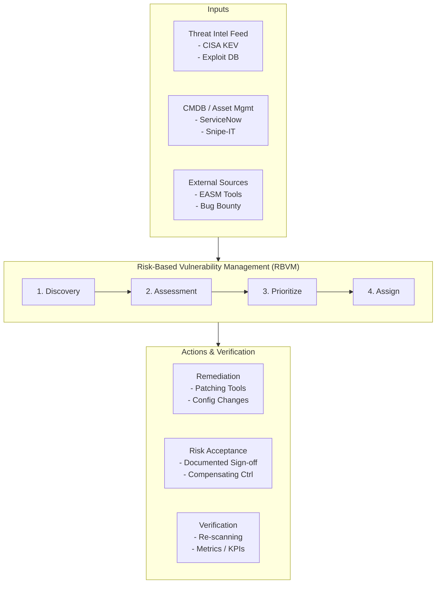

# Vulnerability Management Program

## Introduction
A Vulnerability Management (VM) program is vastly different from simple "vulnerability scanning." Scanning is merely the tactical execution of running a tool (like Nessus, Qualys, or Rapid7) to identify missing patches or misconfigurations. A true Vulnerability Management Program is a strategic, continuous lifecycle encompassing discovery, prioritization, remediation tracking, risk acceptance, and deep integration with IT operations. The objective of VM is to reduce the organizational attack surface and continuously manage cyber risk within acceptable, quantifiable thresholds.

## Moving Beyond Scanning to Management
Many organizations fail at VM because they treat it as a sterile, report-generation exercise. Security teams toss thousand-page PDFs of vulnerabilities over the fence to IT operations, creating friction, resentment, and ultimately, inaction. The IT team is overwhelmed by the sheer volume of "Critical" findings, many of which are theoretical or contextually irrelevant.

A mature VM program shifts this paradigm by:
- **Providing Actionable Context:** Enriching vulnerability data with business criticality and threat intelligence.
- **Workflow Integration:** Integrating directly into IT workflows via API (e.g., auto-creating and auto-updating Jira tickets or ServiceNow incidents).
- **Realistic SLAs:** Fostering collaboration through mutually agreed-upon Service Level Agreements for remediation timelines.

## The ASCII Architecture: The VM Ecosystem

## Phase 1: Discovery and Asset Inventory
The absolute foundation of VM. You cannot protect, assess, or patch an asset you do not know exists. A mature program utilizes multiple discovery vectors to eliminate blind spots:
- **Active Discovery:** Utilizing scheduled network sweeps (Nmap, ICMP Ping sweeps, ARP requests) to map out responsive IP addresses across all corporate subnets.
- **Passive Discovery:** Integrating with network span ports, flow logs, or NDR tools to identify assets dynamically by observing network traffic.
- **Cloud API Integration:** Connecting VM tools directly to AWS (EC2/EKS), Azure, and GCP APIs to automatically detect dynamically spun-up compute instances, serverless functions, or containers.
- **Agent-Based Tracking:** Deploying lightweight VM agents to all endpoints (especially laptops) to ensure they are tracked, inventoried, and assessed even when operating remotely off the corporate VPN.

## Phase 2: Assessment and Scanning
Once assets are cataloged, they must be rigorously assessed for flaws, misconfigurations, and missing updates.
- **Unauthenticated Scanning:** Provides a hacker's "outside-in" view. It is fast and identifies externally visible services, but lacks deep visibility into installed software or local registry keys. It is highly prone to false positives based on banner grabbing.
- **Authenticated Scanning (Credentialed):** The gold standard for network scanning. The scanner logs in via SSH, WinRM, or SMB using a dedicated service account to interrogate the file system, registry, and package managers accurately.
- **Continuous Agent Assessment:** Shifting from heavy, monthly monolithic network scans to continuous assessment. EDR tools and VM agents now provide real-time vulnerability telemetry, instantly identifying vulnerable software the moment it is executed or installed.
- **Application Security (AppSec):** VM must not be limited to infrastructure. It must encompass DAST (Dynamic), SAST (Static), and SCA (Software Composition Analysis) for custom-developed applications seamlessly integrated into the CI/CD pipeline.

## Phase 3: Risk-Based Prioritization (RBVM)
This is the crucible of a modern VM program. An enterprise may have millions of raw vulnerabilities. It is mathematically impossible to fix them all. How do you choose the top 1% that actually matter?
- **The CVSS Fallacy:** Relying solely on the Common Vulnerability Scoring System (CVSS) is deeply flawed. CVSS measures technical severity, not real-world risk. A CVSS 9.8 vulnerability on an isolated, air-gapped test server represents lower real-world risk than a CVSS 7.5 vulnerability on an Internet-facing production gateway.
- **Threat Intelligence Overlays:** Priority must be driven by exploitation reality. 
  - Does the vulnerability have a public, weaponized Proof-of-Concept (PoC)? 
  - Is it integrated into exploitation frameworks like Metasploit or Cobalt Strike? 
  - Is it listed in the CISA Known Exploited Vulnerabilities (KEV) catalog? If yes, it bypasses standard queues and becomes an immediate incident response task.
- **Business Impact:** Leveraging the CMDB to understand asset criticality. A database holding millions of PII records requires a significantly tighter remediation SLA than an internal marketing intranet server.

## Phase 4: Remediation and Mitigation
The operational execution phase where vulnerabilities are neutralized.
- **Remediation:** Completely resolving the flaw, typically via the automated pipelines established in the [[22 - Patch Management Strategy]], or by correcting a misconfiguration (e.g., modifying Group Policy to disable an insecure protocol like LLMNR).
- **Mitigation (Virtual Patching):** Applying compensating controls when full remediation is impossible (due to legacy software, vendor delays, or unacceptable downtime). Examples include adding WAF rules, implementing strict network segmentation, or restricting port access.
- **Risk Acceptance:** A formal, documented Governance process where business owners accept the residual risk of not fixing a vulnerability. This must have a strict time-limit (e.g., valid for 6 or 12 months) and require executive (CISO/CIO) sign-off for high severities. It is never a permanent free pass.

## Phase 5: Verification and Reporting
Trust, but verify. Security must not rely on IT's verbal confirmation.
- **Automated Re-scanning:** Once IT marks a Jira ticket as "Resolved," the VM tool's API should automatically trigger a targeted micro-scan of that specific asset to confirm the patch was effectively applied, the registry key actually changed, and no new issues were introduced.
- **KPIs, Metrics, and Velocity:** Reporting must shift from raw counts (e.g., "We have 500 criticals") to trend analysis and velocity metrics.
  - **Mean Time to Remediate (MTTR):** How fast are we fixing issues from the date of discovery?
  - **SLA Compliance Rate:** What percentage of vulnerabilities are fixed within defined policy windows?
  - **Risk Density:** The number of high-risk vulnerabilities per asset class or per department.
  - **Recidivism Rate:** How often do "fixed" vulnerabilities reappear due to bad server imaging or configuration drift?

## External Attack Surface Management (EASM)
Modern VM programs incorporate EASM to monitor the external perimeter continuously from an attacker's perspective. EASM tools act like persistent OSINT and reconnaissance engines, mapping exposed cloud buckets, shadow IT deployments, forgotten subdomains, expired certificates, and exposed developer environments that traditional internal VM scanners completely miss.

## Chaining Opportunities
- VM output feeds directly into the operational queues of the [[22 - Patch Management Strategy]].
- Highlights coverage gaps and critical risk areas that should be investigated by offensive testing in [[24 - Purple Team Red Blue Collaboration]].
- The maturity, automation, and SLA compliance of the VM program is a core metric evaluated in [[25 - Security Maturity Models]].

## Related Notes
- [[01 - Internal Network Penetration Testing]]
- [[02 - External Network Penetration Testing]]
- [[16 - Container and Kubernetes Security]]
- [[17 - DevSecOps and CI CD Security]]
