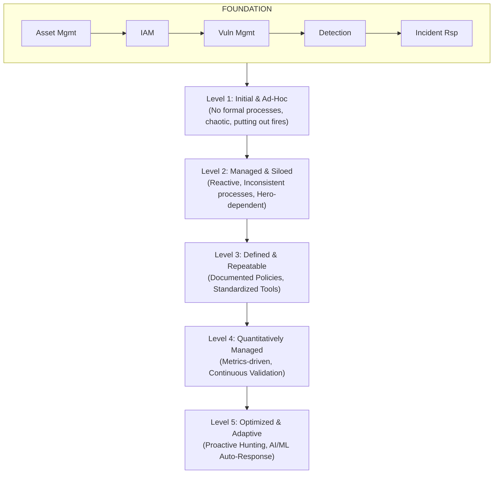

# Security Maturity Models

## Introduction
Cybersecurity is not a binary state; an organization is never simply "100% secure" or "completely insecure." It exists on a dynamic spectrum of capability, resilience, and readiness. Security Maturity Models provide structured, objective frameworks to evaluate an organization's current security posture, identify critical gaps, and establish a strategic, multi-year roadmap for continuous improvement. These models elevate cybersecurity from a tactical, firefighting IT problem to a strategic business enabler, allowing CISOs to communicate effectively with the Board of Directors by demonstrating measurable progress and justifying security investments.

## Why Maturity Models Matter
Without a formal maturity model, security programs suffer from "shiny object syndrome"—purchasing the latest AI-driven, next-generation security tools while completely lacking foundational capabilities like a basic asset inventory, robust patch management, or multifactor authentication. Maturity models enforce foundational hygiene before advanced capabilities are pursued. They systematically answer three fundamental questions for executive leadership:
1. **Current State:** Where are we today relative to industry peers and best practices?
2. **Target State:** Where do we need to be based on our organization's specific risk appetite, regulatory requirements, and threat landscape?
3. **Strategic Roadmap:** How do we get there efficiently, and how much will it cost?

## The ASCII Architecture: The Maturity Progression Model

## Prominent Security Maturity Frameworks
Several industry-standard frameworks exist, each with specific organizational focus areas. Choosing the right framework depends heavily on the organization's vertical and regulatory landscape.

### 1. Cybersecurity Capability Maturity Model (C2M2)
Developed by the U.S. Department of Energy, originally for critical infrastructure, but applicable broadly across any enterprise. It evaluates 10 domains (e.g., Risk Management, Identity and Access Management, Situational Awareness) across Maturity Indicator Levels (MIL 0 to MIL 3).
- **MIL 0:** Practices are not performed.
- **MIL 1:** Practices are performed ad-hoc, but not documented.
- **MIL 2:** Practices are documented, planned, and adequately resourced.
- **MIL 3:** Practices are managed, governed, continuously evaluated, and optimized based on metrics.

### 2. NIST Cybersecurity Framework (CSF) Tiers
While the core of the NIST CSF (Identify, Protect, Detect, Respond, Recover) is a control framework, its Implementation Tiers serve as a functional maturity model:
- **Tier 1 (Partial):** Informal, reactive risk management.
- **Tier 2 (Risk Informed):** Risk management practices are approved by management but are not established organization-wide.
- **Tier 3 (Repeatable):** Formal, enterprise-wide policies are updated regularly based on business needs and threat intelligence.
- **Tier 4 (Adaptive):** Continuous improvement based on advanced threat intelligence, predictive analytics, and lessons learned from internal/external incidents.

### 3. CMMC (Cybersecurity Maturity Model Certification)
Mandatory for the U.S. Defense Industrial Base (DIB). It maps strictly to NIST 800-171 and dictates that defense contractors must pass third-party assessments at specific maturity levels (Level 1: Foundational, Level 2: Advanced, Level 3: Expert) to bid on Department of Defense contracts. CMMC is unique because it ties revenue directly to validated security maturity.

### 4. SOC-CMM (Security Operations Center - Capability Maturity Model)
A highly specialized model designed strictly to evaluate the maturity of the SOC. It measures the maturity of SOC People, Processes, and Technology, assessing capabilities like use-case engineering, threat intelligence integration, and incident handling velocity.

## Moving from Reactive to Proactive
The chasm between Level 2 (Reactive) and Level 3 (Defined) is the hardest to cross for most organizations.
- **Level 1 to 2:** Requires purchasing basic tools (AV, Firewalls) and relying on the "heroics" of a few dedicated IT staff members working long hours.
- **Level 2 to 3:** Requires massive cultural shifts. Heavy documentation, policy creation, establishing Standard Operating Procedures (SOPs), and moving away from tribal knowledge. This ensures the capability survives if the "heroes" leave the company.
- **Level 3 to 4:** Requires automation, deep systems integration (e.g., SOAR), and establishing robust Key Performance Indicators (KPIs) to prove the processes are working.
- **Level 4 to 5:** Involves advanced, proactive concepts like automated adversary emulation, SOAR-driven auto-remediation, predictive threat hunting, and dynamic risk scoring.

## Measuring and Reporting to the Board
Maturity models are the preferred, and often the only, language of the boardroom when discussing cyber risk.
- **Visualizing the Gap:** Presenting spider-charts or radar graphs comparing the Current State versus the Target State across different security domains. This visual makes complex technical gaps immediately understandable to non-technical executives.
- **Justifying Budget:** "We are currently at Level 1 in Identity Management. To achieve our target of Level 3 to comply with new regulatory requirements and enable our remote-work strategy, we require $X for a centralized IAM platform and implementation services."
- **Demonstrating ROI:** Showing how the aggregate maturity score has improved year-over-year as a direct result of previous capital investments.
- **KRIs vs. KPIs:** Using maturity models to define Key Risk Indicators (e.g., % of critical assets without EDR coverage) and Key Performance Indicators (e.g., Mean Time to Remediate high vulnerabilities).

## Building a Custom Maturity Model
Organizations with unique operational constraints (e.g., hyper-growth SaaS startups, OT-heavy manufacturing) often build custom models by blending frameworks. A common approach is overlaying a 1-5 maturity scale onto the CIS Critical Security Controls (CIS Top 18).
For every single control, the organization objectively evaluates:
1. Is the policy formally documented?
2. Is the technology fully deployed across 100% of the scope?
3. Is the process operationalized and staffed?
4. Is there an automated feedback loop to detect failures?

## Overcoming Stagnation
Many mature organizations stall at Level 3. They have excellent policies, expensive tools, and large teams, but fail to optimize. Breaking through to Level 4 requires shifting from compliance-driven security ("Are we checking the auditor's box?") to effectiveness-driven security ("Can we actually stop a modern threat actor?"). This breakthrough is strictly achieved through continuous validation exercises.

## Chaining Opportunities
- Advancing detection maturity (moving to Level 4) explicitly requires implementing the advanced behavioral strategies detailed in [[21 - Security Monitoring What to Alert On]].
- Reaching Level 4/5 maturity heavily relies on continuous control validation and emulation via [[24 - Purple Team Red Blue Collaboration]].
- Foundational maturity (Level 2/3) is mathematically impossible without a functioning, integrated [[23 - Vulnerability Management Program]] and a robust [[22 - Patch Management Strategy]].

## Related Notes
- [[15 - Governance Risk and Compliance GRC]]
- [[18 - Cloud Security Architecture]]
- [[20 - Log Aggregation and SIEM Architecture]]
- [[12 - Identity and Access Management IAM Security]]
