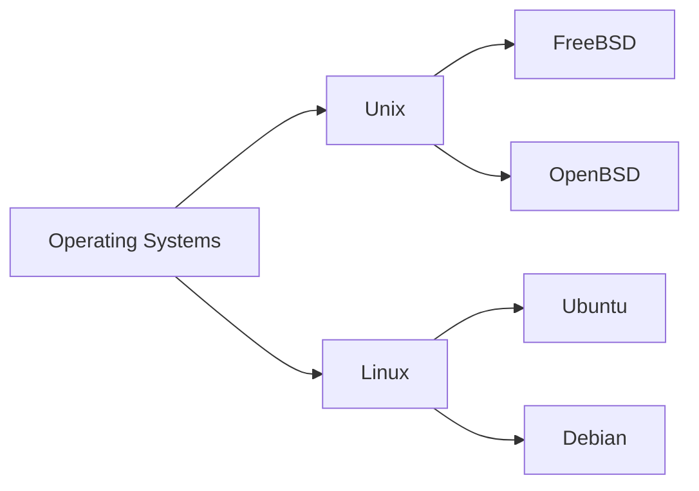
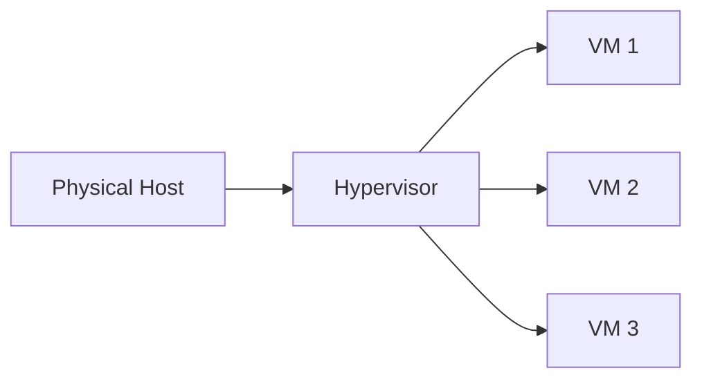
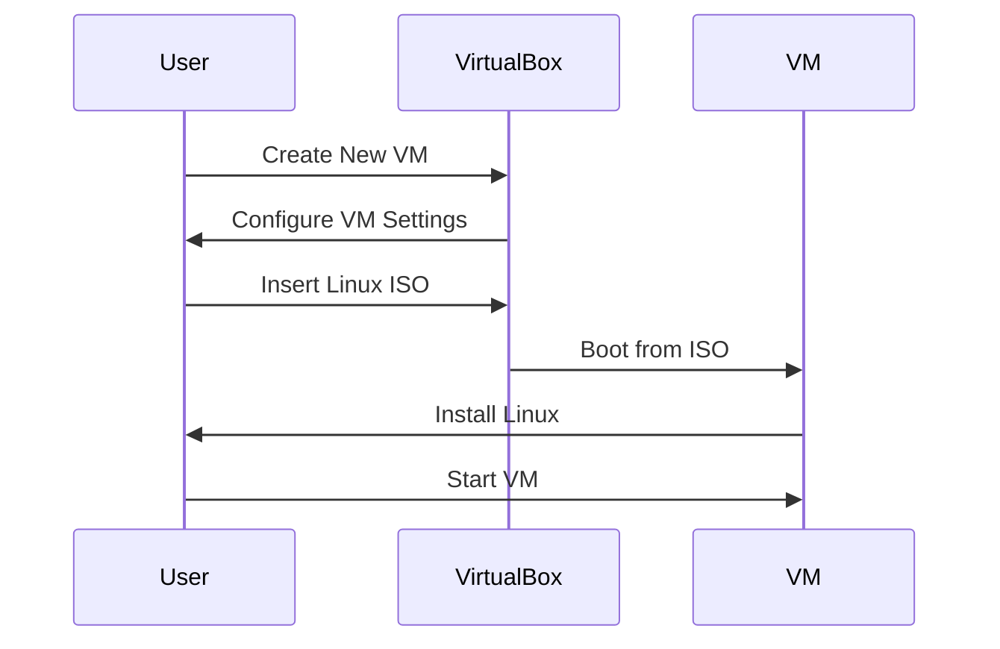

## Introduction to Operating Systems

### What is an Operating System?

An **operating system (OS)** is a collection of software that manages computer hardware resources and provides common services for computer programs. Essentially, it acts as a bridge between the hardware and the user, enabling users to interact with the computer efficiently. The OS controls and coordinates the use of the hardware among various applications, ensuring that each application gets the resources it needs to function properly.

#### Why is an Operating System Important?

The importance of an operating system lies in its ability to manage and control the execution of programs, handle input and output operations, and provide a user-friendly interface. Without an OS, it would be extremely difficult for users to interact with the computer directly through hardware instructions. The OS abstracts these complexities, allowing users to perform tasks using high-level commands and graphical interfaces.

#### How Does an Operating System Work?

At a high level, an operating system performs several key functions:

1. **Process Management**: The OS manages processes, which are instances of programs in execution. This includes creating and terminating processes, scheduling CPU time, and managing process states (running, waiting, etc.).

2. **Memory Management**: The OS allocates and deallocates memory to processes, ensuring that each process has the necessary memory to run without interfering with others.

3. **File Management**: The OS handles file creation, deletion, modification, and access control. It also manages the storage space on disks and other storage devices.

4. **Device Management**: The OS interacts with hardware devices such as printers, scanners, and network interfaces, providing drivers and interfaces for communication.

5. **Security Management**: The OS enforces security policies, including user authentication, access control, and encryption.

### Types of Operating Systems

There are several types of operating systems, each designed for specific purposes:

1. **Unix/Linux**: These are open-source operating systems that are highly customizable and widely used in servers, desktops, and embedded systems. They are known for their stability and security features.

2. **Windows**: Developed by Microsoft, Windows is a proprietary operating system primarily used on personal computers. It offers a user-friendly interface and supports a wide range of applications.

3. **MacOS**: Also developed by Apple, MacOS is a proprietary operating system used on Apple's Macintosh computers. It is known for its integration with other Apple products and services.

4. **Embedded Systems**: These are specialized operating systems designed for specific hardware configurations, often found in devices like routers, smartphones, and IoT devices.

### Differences Between Operating Systems

#### Unix vs. Linux

**Unix** is a family of multitasking, multiuser computer operating systems that derive from the original AT&T Unix, developed starting in the 1970s at the Bell Labs research center by Ken Thompson, Dennis Ritchie, and others. **Linux**, on the other hand, is a free and open-source implementation of the Unix operating system. While both share many similarities, Linux is more flexible and customizable due to its open-source nature.

#### Windows vs. MacOS

**Windows** and **MacOS** are both proprietary operating systems, but they differ in terms of user interface, application support, and hardware compatibility. Windows is more widely used on personal computers, while MacOS is exclusive to Apple's hardware.

### Virtualization and Virtual Machines

Virtualization is the process of creating a virtual version of something, such as a hardware platform, operating system, or storage device. A **virtual machine (VM)** is a software emulation of a physical computer system, capable of executing programs and accessing resources as if it were a separate physical machine.

#### Why is Virtualization Important?

Virtualization allows multiple VMs to run on a single physical host, maximizing resource utilization and reducing hardware costs. It also enables easy deployment, management, and scaling of applications, making it a crucial technology in modern IT environments.

#### How Does Virtualization Work?

Virtualization relies on a hypervisor, which is a layer of software that creates and manages VMs. The hypervisor allocates resources (CPU, memory, storage) to each VM, ensuring that they operate independently and securely.

### Setting Up a Linux Virtual Machine

To set up a Linux virtual machine, you can use popular virtualization software such as VMware, VirtualBox, or Hyper-V. Here’s a step-by-step guide using VirtualBox:

1. **Install VirtualBox**: Download and install VirtualBox from the official website.

2. **Create a New VM**: Open VirtualBox and click on "New" to create a new virtual machine.

3. **Configure the VM**: Specify the name, type (Linux), and version of the operating system. Allocate memory and disk space according to your requirements.

4. **Install Linux**: Insert the Linux ISO file and boot the VM from it. Follow the installation prompts to install Linux on the virtual machine.

5. **Start the VM**: Once installed, start the VM and log in to the Linux environment.

### Common Pitfalls and How to Prevent Them

#### Pitfall: Insufficient Resource Allocation

**Problem**: Allocating insufficient resources (CPU, memory, disk space) to a VM can lead to performance issues and instability.

**Solution**: Ensure that the VM is allocated adequate resources based on the workload. Monitor resource usage and adjust allocations as needed.

#### Pitfall: Insecure Configuration

**Problem**: Improperly configured VMs can expose vulnerabilities to attacks.

**Solution**: Harden the VM configuration by disabling unnecessary services, applying security patches, and configuring firewalls. Use secure coding practices and follow best practices for securing the operating system.

### Real-World Examples

#### CVE-2021-3156: Dirty Pipe Vulnerability

**Description**: The Dirty Pipe vulnerability (CVE-2021-3156) is a privilege escalation flaw in the Linux kernel that allows unprivileged users to overwrite arbitrary files in the system.

**Impact**: This vulnerability could allow attackers to gain root access on affected systems, leading to potential data breaches and system compromises.

**Mitigation**: Apply the latest security patches and updates to the Linux kernel. Regularly monitor system logs for suspicious activities and use intrusion detection systems to detect and respond to potential attacks.

### Conclusion

Understanding the fundamentals of operating systems and virtualization is crucial for DevOps engineers. By mastering these concepts, you can effectively manage and deploy applications in complex IT environments. Always ensure that your systems are properly configured and secured to prevent potential vulnerabilities and attacks.

### Practice Labs

For hands-on practice, consider the following labs:

- **PortSwigger Web Security Academy**: Offers comprehensive training on web application security.
- **OWASP Juice Shop**: A deliberately insecure web application for practicing web security skills.
- **DVWA (Damn Vulnerable Web Application)**: A PHP/MySQL web application that is riddled with vulnerabilities for educational purposes.
- **WebGoat**: An interactive, gamified training application for learning about web application security.

These labs provide practical experience in setting up and securing virtual machines, as well as understanding the underlying principles of operating systems and virtualization.

---
<!-- nav -->
[[01-Advanced Bash Scripting Concepts|Advanced Bash Scripting Concepts]] | [[DevOps/DevOps Bootcamp/01-Linux & OS Basics/01-Linux Essentials For DevOps Engineers/00-Overview|Overview]] | [[03-Linux Essentials for DevOps Engineers|Linux Essentials for DevOps Engineers]]
