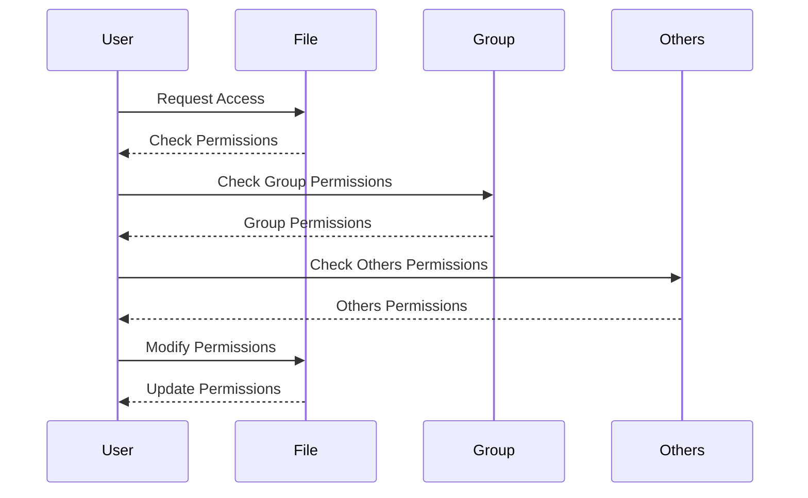

## Understanding Linux File Permissions and Ownership Concepts

### Introduction to Linux File Permissions and Ownership

Linux file permissions and ownership are fundamental concepts that govern access control and security within a Linux system. These mechanisms ensure that users and processes interact with files and directories in a controlled manner, preventing unauthorized access and potential security breaches.

#### What Are File Permissions?

File permissions define the level of access granted to different users and groups for reading, writing, and executing files and directories. In Linux, each file and directory has three types of permissions:

- **Read (r)**: Allows viewing the contents of a file or listing the contents of a directory.
- **Write (w)**: Allows modifying the contents of a file or adding/removing files within a directory.
- **Execute (x)**: Allows running a file as a program or navigating into a directory.

These permissions are assigned to three categories of users:

- **Owner**: The user who owns the file or directory.
- **Group**: Users belonging to the same group as the owner.
- **Others**: All other users on the system.

#### Why Are File Permissions Important?

File permissions are crucial for maintaining the integrity and security of a Linux system. They help prevent unauthorized access to sensitive data and ensure that only authorized users can modify or execute specific files. Without proper file permissions, a system could be vulnerable to various attacks, such as unauthorized data modification or execution of malicious programs.

### Displaying File Permissions with `ls -l`

To view the permissions of files and directories, the `ls` command with the `-l` option is commonly used. This command provides a detailed list of files and directories along with their permissions.

```bash
ls -l
```

The output of `ls -l` includes several fields, but the first field represents the file permissions. Here is an example output:

```plaintext
-rwxr-xr-x 1 user group 0 Jan 1 12:00 filename
```

- The first character (`-`) indicates the type of file (directory, symbolic link, etc.). A hyphen (`-`) denotes a regular file.
- The next nine characters represent the permissions for the owner, group, and others, respectively. Each set of three characters corresponds to read, write, and execute permissions.

For example, `-rwxr-xr-x` means:
- Owner has read, write, and execute permissions.
- Group has read and execute permissions.
- Others have read and execute permissions.

### Displaying Hidden Files with `ls -la`

Hidden files and directories in Linux are those whose names start with a dot (`.`). By default, the `ls` command does not display these hidden files. To include hidden files in the output, you can use the `-a` option along with `-l`.

```bash
ls -la
```

This command will display all files and directories, including hidden ones, with their detailed permissions.

### Changing Permissions for Hidden Files

Changing permissions for hidden files follows the same process as changing permissions for regular files. You can use the `chmod` command to modify the permissions of hidden files.

#### Example: Changing Permissions for a Hidden File

Suppose you have a hidden file named `.hiddenfile`. To change its permissions, you can use the following command:

```bash
chmod 755 .hiddenfile
```

Here, `755` is the octal representation of the permissions:
- `7` (owner): Read, write, and execute.
- `5` (group): Read and execute.
- `5` (others): Read and execute.

The `chmod` command can also be used with symbolic notation to make changes more intuitive.

```bash
chmod u=rwx,g=rx,o=rx .hiddenfile
```

This command sets the following permissions:
- Owner (`u`): Read, write, and execute.
- Group (`g`): Read and execute.
- Others (`o`): Read and execute.

### Mermaid Diagrams for File Permission Flow

A mermaid diagram can help visualize the flow of file permission checks and modifications.



### Real-World Examples and Recent Breaches

#### Example: CVE-2021-22204

CVE-2021-22204 is a vulnerability in the Apache Tomcat server where improper file permissions allowed unauthorized access to sensitive files. This breach highlights the importance of setting appropriate file permissions to prevent unauthorized access.

#### Example: SolarWinds Supply Chain Attack

In the SolarWinds supply chain attack, attackers exploited a vulnerability in the SolarWinds Orion software to inject malicious code into updates. This code was then executed on victim systems due to improper file permissions, leading to widespread compromise.

### Common Pitfalls and How to Avoid Them

#### Pitfall: Improper Default Permissions

Improper default permissions can lead to security vulnerabilities. For example, setting overly permissive permissions on sensitive files can allow unauthorized access.

**Secure Coding Fix:**

```bash
# Vulnerable Code
touch sensitive_file
chmod 777 sensitive_file

# Secure Code
touch sensitive_file
chmod 600 sensitive_file
```

In the secure version, the file is set to be readable and writable only by the owner, ensuring that no other user can access it.

### How to Prevent / Defend Against File Permission Issues

#### Detection

Regularly audit file permissions using tools like `find` and `ls`.

```bash
find /path/to/directory -type f -perm /u=x,g=x,o=x
```

This command finds files with executable permissions for all users.

#### Prevention

- Set appropriate default permissions for new files and directories.
- Regularly review and update file permissions.
- Use tools like `auditd` to monitor changes to file permissions.

#### Secure Configuration Hardening

- Use SELinux or AppArmor for additional security controls.
- Implement strict file permission policies in your organization.

### Complete Example: Setting and Verifying Permissions

#### Setting Permissions

```bash
# Create a new file
touch newfile

# Set permissions
chmod 644 newfile

# Verify permissions
ls -l newfile
```

Expected Output:

```plaintext
-rw-r--r-- 1 user group 0 Jan 1 12:00 newfile
```

#### Verifying Permissions

```bash
# Check permissions
ls -l newfile
```

Expected Output:

```plaintext
-rw-r--r-- 1 user group 0 Jan 1 12:00 newfile
```

### Practice Labs

For hands-on practice with Linux file permissions and ownership, consider the following labs:

- **PortSwigger Web Security Academy**: Offers exercises on file permissions and ownership in a web application context.
- **OWASP Juice Shop**: Provides a vulnerable web application where you can explore file permissions and ownership issues.
- **DVWA (Damn Vulnerable Web Application)**: Contains scenarios where file permissions play a critical role in security.

By thoroughly understanding and applying the principles of Linux file permissions and ownership, you can significantly enhance the security and integrity of your Linux systems.

---
<!-- nav -->
[[01-Linux File Permissions and Ownership Concepts|Linux File Permissions and Ownership Concepts]] | [[DevOps/DevOps Bootcamp/01-Linux & OS Basics/02-Linux File Permissions and Ownership Concepts/00-Overview|Overview]] | [[DevOps/DevOps Bootcamp/01-Linux & OS Basics/02-Linux File Permissions and Ownership Concepts/03-Practice Questions & Answers|Practice Questions & Answers]]
