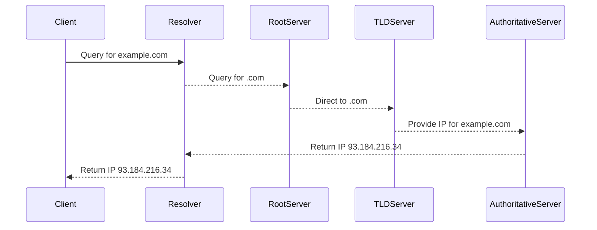

## Introduction to DNS and Its Role in Networking

### What is DNS?

DNS stands for Domain Name System. It is a critical component of the Internet infrastructure that translates human-readable domain names into numerical IP addresses. Humans find it easier to remember names like `google.com` rather than IP addresses like `216.58.192.174`. DNS acts as a mediator between these two forms, allowing users to access websites and services using familiar names.

### Why is DNS Important?

DNS is essential because it simplifies the process of accessing resources on the Internet. Without DNS, users would have to memorize complex IP addresses to navigate the web, which is impractical. DNS makes the Internet more user-friendly and accessible.

### How Does DNS Work Under the Hood?

When a user types a domain name into a browser, the following steps occur:

1. **Client Request**: The client device sends a DNS query to a DNS resolver, typically provided by the ISP or a public DNS service like Google DNS or Cloudflare DNS.
2. **Resolver Query**: The DNS resolver checks its cache for the IP address associated with the domain name. If it finds the information, it returns it to the client. If not, it proceeds to query other DNS servers.
3. **Recursive Query**: The resolver queries the root DNS servers, which direct it to the appropriate top-level domain (TLD) servers.
4. **TLD Server Response**: The TLD server provides the IP address of the authoritative DNS server for the domain.
5. **Authoritative Server Response**: The authoritative DNS server returns the IP address associated with the domain name.
6. **Response to Client**: The DNS resolver caches the result and sends the IP address back to the client, which then uses it to establish a connection to the desired website.

### Example of DNS Resolution

Consider the domain name `example.com`. Here’s a step-by-step breakdown of the DNS resolution process:

1. **Client Request**: The client sends a DNS query for `example.com`.
2. **Resolver Cache Check**: The DNS resolver checks its cache. If the entry is not found, it proceeds to the next step.
3. **Root DNS Query**: The resolver queries the root DNS servers.
4. **TLD Server Response**: The root servers direct the resolver to the `.com` TLD servers.
5. **Authoritative Server Response**: The `.com` TLD servers provide the IP address of the authoritative DNS server for `example.com`.
6. **Final Resolution**: The authoritative DNS server returns the IP address `93.184.216.34` for `example.com`.



### Hierarchical Structure of DNS

DNS operates on a hierarchical structure, which helps manage the vast number of domain names and IP addresses. The hierarchy consists of several levels:

1. **Root Domain**: The topmost level of the DNS hierarchy. There are 13 root servers named from `A` to `M`, distributed globally.
2. **Top-Level Domains (TLDs)**: These are the second level in the hierarchy. Examples include `.com`, `.org`, `.net`, etc.
3. **Second-Level Domains**: These are the domains registered under TLDs, such as `google.com`.
4. **Subdomains**: These are further divisions within second-level domains, such as `mail.google.com`.

### Common TLDs and Their Purposes

- **.com**: Commercial entities.
- **.org**: Non-profit organizations.
- **.net**: Network providers.
- **.edu**: Educational institutions.
- **.mil**: Military applications.
- **.gov**: Government agencies.

### Real-World Example: DNS Hijacking

DNS hijacking is a type of cyberattack where attackers redirect traffic intended for one domain to another. This can lead to phishing attacks or malware distribution. A notable example is the 2019 DNS hijacking incident involving the domain `yahoo.com`.

#### Vulnerable DNS Configuration

```yaml
# Vulnerable DNS Configuration
domain: yahoo.com
nameservers:
  - ns1.yahoo.com
  - ns2.yahoo.com
```

#### Secure DNS Configuration

```yaml
# Secure DNS Configuration
domain: yahoo.com
nameservers:
  - ns1.secure-dns.com
  - ns2.secure-dns.com
dnssec: enabled
```

### How to Prevent DNS Attacks

1. **DNSSEC**: Enable DNSSEC (DNS Security Extensions) to ensure the integrity and authenticity of DNS data.
2. **Monitoring**: Regularly monitor DNS logs for unusual activity.
3. **Secure Configurations**: Use secure configurations and regularly update DNS servers.
4. **Two-Factor Authentication**: Implement two-factor authentication for DNS management interfaces.

### Conclusion

DNS is a fundamental component of the Internet that simplifies the process of accessing online resources. Understanding how DNS works and its hierarchical structure is crucial for managing and securing network infrastructure. By implementing secure configurations and monitoring practices, organizations can protect against DNS-based attacks.

### Practice Labs

For hands-on experience with DNS, consider the following labs:

- **PortSwigger Web Security Academy**: Offers exercises on DNS hijacking and other DNS-related vulnerabilities.
- **OWASP Juice Shop**: Provides a simulated environment to practice DNS-related security measures.

These labs will help you gain practical experience in managing and securing DNS configurations.

---
<!-- nav -->
[[DevOps/DevOps Bootcamp/01-Linux & OS Basics/03-Linux Networking Fundamentals Explained/00-Overview|Overview]] | [[02-Introduction to IP Addresses|Introduction to IP Addresses]]
