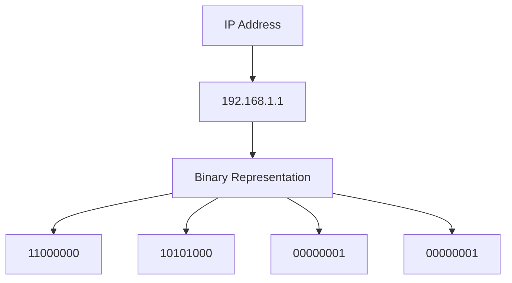
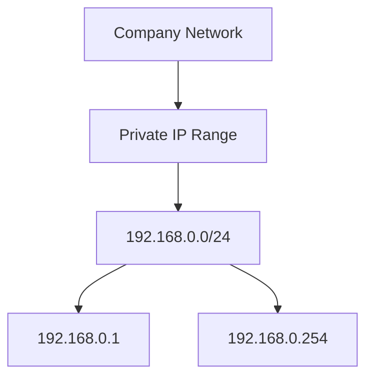
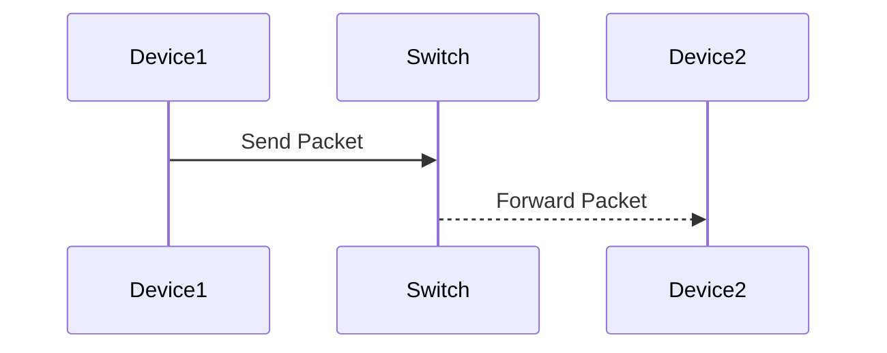
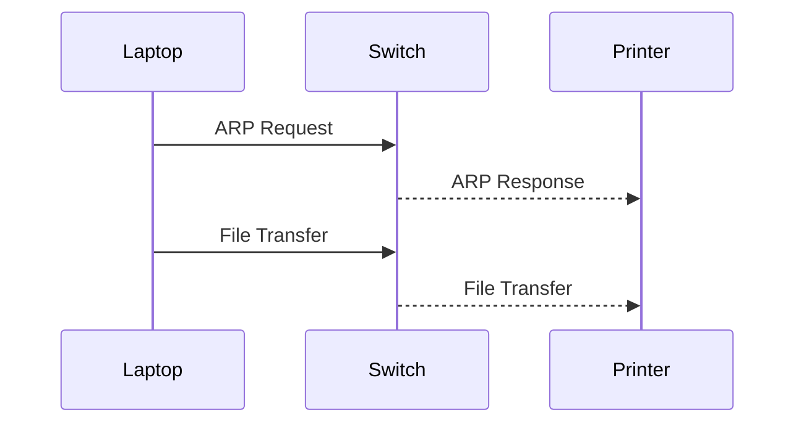
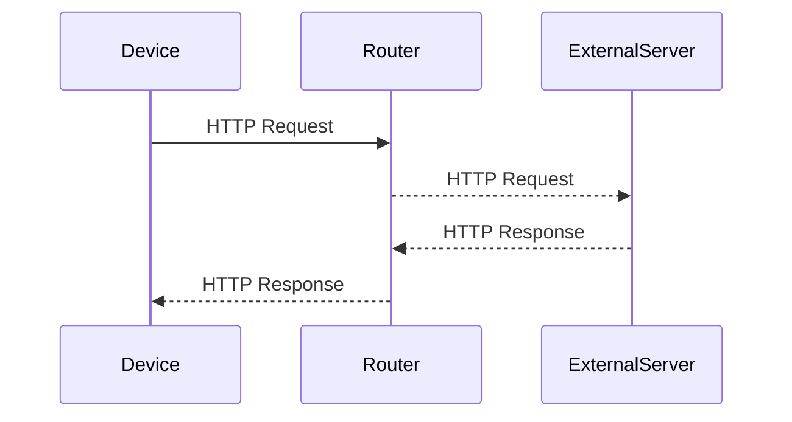
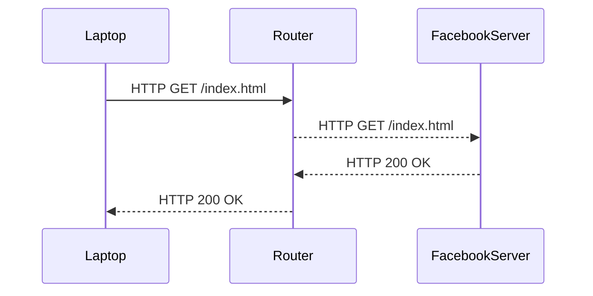

## Introduction to IP Addresses

### What is an IP Address?

An IP address, short for Internet Protocol address, is a numerical label assigned to each device connected to a computer network that uses the Internet Protocol for communication. An IPv4 address is composed of 32 bits, which can be represented as four groups of eight bits (octets) separated by dots. Each octet can range from 0 to 255, allowing for a total of \(2^{32}\) unique addresses.

### Structure of an IPv4 Address

An IPv4 address is typically written in dotted-decimal notation, such as `192.168.1.1`. Here’s a breakdown of the structure:

- **Octets**: Each group of eight bits (an octet) can be represented as a decimal number ranging from 0 to 255.
- **Dots**: The dots separate the four octets, making it easier for humans to read and understand.

For example, the IP address `192.168.1.1` can be broken down as follows:
- First octet: `192`
- Second octet: `168`
- Third octet: `1`
- Fourth octet: `1`

### Binary Representation

Each octet can also be represented in binary form. For instance, the octet `192` in binary is `11000000`, and `168` is `10101000`.



### Range of IP Addresses

The range of possible IPv4 addresses spans from `0.0.0.0` to `255.255.255.255`. However, certain ranges are reserved for specific purposes, such as private networks and multicast addresses.

### Real-World Example: IP Address Allocation

Consider a scenario where a company needs to assign IP addresses to its internal network. The company might choose a private IP address range, such as `192.168.0.0/24`, which allows for 254 usable IP addresses (`192.168.0.1` to `192.168.0.254`).



### How Devices Communicate Using IP Addresses

Devices on a local area network (LAN) use their IP addresses to communicate with each other. This communication is facilitated by a special device called a switch, which maintains a table of IP addresses and corresponding MAC addresses (hardware addresses) of devices on the network.

### Switch Functionality

A switch is a networking device that connects multiple devices within a LAN and enables them to communicate with each other. It operates at the data link layer (Layer 2) of the OSI model and uses MAC addresses to forward data packets.

#### MAC Address Table

When a device sends a packet to another device on the same LAN, the switch uses its MAC address table to determine the correct port to forward the packet. The MAC address table is dynamically built as devices send and receive data.



### Communication Within a LAN

Consider a scenario where a laptop wants to send a file to a printer on the same LAN. The laptop will first send an ARP (Address Resolution Protocol) request to find the MAC address of the printer. Once the MAC address is resolved, the switch will forward the packet to the printer.



### Communication Outside the LAN

If a device wants to communicate with a server or another device outside the LAN, such as accessing a website like Facebook, the switch alone cannot facilitate this communication. Instead, a router is required to route traffic between different networks.

### Router Functionality

A router operates at the network layer (Layer 3) of the OSI model and uses IP addresses to forward data packets between different networks. It maintains a routing table that contains information about the paths to various networks.

#### Routing Table

A routing table contains entries that specify the next hop for a given destination network. For example, if a device wants to access a website hosted on a server outside the LAN, the router will use its routing table to determine the appropriate path.



### Real-World Example: Accessing a Website

Consider a scenario where a user wants to access the Facebook website from their laptop. The laptop will send an HTTP request to the router, which will then forward the request to the external server hosting the Facebook website.



### HTTP Request and Response

Here is an example of a full HTTP request and response:

```http
GET /index.html HTTP/1.1
Host: www.facebook.com
User-Agent: Mozilla/5.0 (Windows NT 10.0; Win64; x64) AppleWebKit/537.36 (KHTML, like Gecko) Chrome/91.0.4472.124 Safari/537.36
Accept: text/html,application/xhtml+xml,application/xml;q=0.9,image/webp,*/*;q=0.8
Connection: keep-alive

HTTP/1.1 200 OK
Date: Tue, 14 Mar 2023 12:00:00 GMT
Server: Apache/2.4.41 (Ubuntu)
Content-Type: text/html; charset=UTF-8
Content-Length: 12345
Connection: keep-alive
Cache-Control: max-age=3600
Expires: Tue, 14 Mar 2023 13:00:00 GMT
Last-Modified: Mon, 13 Mar 2023 12:00:00 GMT
Vary: Accept-Encoding
ETag: "12345-abcde"
```

### Common Pitfalls and Best Practices

#### Misconfigured Routers

Misconfigured routers can lead to routing loops, where packets are forwarded indefinitely between routers without reaching their intended destination. This can cause network congestion and performance issues.

**How to Prevent / Defend**

- **Routing Protocols**: Use routing protocols like OSPF (Open Shortest Path First) or BGP (Border Gateway Protocol) to ensure proper routing.
- **Access Control Lists (ACLs)**: Implement ACLs to control traffic flow and prevent unauthorized access.
- **Regular Audits**: Regularly audit router configurations to identify and correct misconfigurations.

#### Example of Secure Configuration

Here is an example of a secure router configuration using Cisco IOS:

```plaintext
access-list 100 permit ip 192.168.1.0 0.0.0.255 any
access-list 100 deny ip any any
router ospf 1
 network 192.168.1.0 0.0.0.255 area 0
!
line vty 0 4
 login local
 transport input ssh
!
```

### Conclusion

Understanding the fundamentals of IP addresses and how devices communicate within and outside a LAN is crucial for effective network management. By leveraging switches and routers, devices can communicate efficiently and securely across different networks. Proper configuration and regular audits are essential to prevent common pitfalls and ensure optimal network performance.

### Practice Labs

To gain hands-on experience with Linux networking fundamentals, consider the following practice labs:

- **PortSwigger Web Security Academy**: Offers comprehensive labs on web application security, including network fundamentals.
- **OWASP Juice Shop**: Provides a vulnerable web application for practicing security testing and network analysis.
- **DVWA (Damn Vulnerable Web Application)**: A deliberately insecure web application for practicing penetration testing and network security.

These labs provide practical scenarios to apply the concepts learned in this chapter.

---
<!-- nav -->
[[01-Introduction to DNS and Its Role in Networking|Introduction to DNS and Its Role in Networking]] | [[DevOps/DevOps Bootcamp/01-Linux & OS Basics/03-Linux Networking Fundamentals Explained/00-Overview|Overview]] | [[03-Introduction to Linux Networking Fundamentals|Introduction to Linux Networking Fundamentals]]
