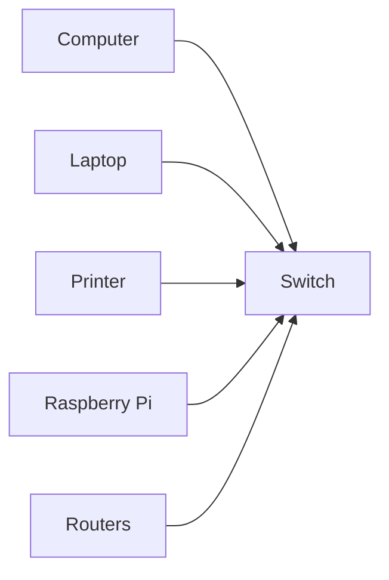

## Introduction to Linux Networking Fundamentals

In this section, we will delve deep into the fundamentals of Linux networking, covering essential concepts such as Local Area Networks (LANs), Internet Protocol (IP) addresses, and ports. Understanding these concepts is crucial for anyone working with Linux systems, especially in a DevOps context. By the end of this chapter, you should have a solid grasp of how computer networks function and how devices communicate within them.

### Local Area Network (LAN)

A Local Area Network (LAN) is a computer network that connects devices within a limited geographical area, such as a home, office, or school campus. LANs allow devices to share resources, such as printers, files, and internet connections, and to communicate with each other efficiently.

#### What is a LAN?

A LAN is a network of interconnected devices within a single physical location. These devices can include computers, laptops, smartphones, printers, and other network-enabled devices. The primary purpose of a LAN is to facilitate communication and resource sharing among these devices.

#### Why is a LAN Important?

LANs are essential because they provide a way for devices to communicate and share resources within a confined space. This is particularly useful in environments where multiple users need access to shared resources, such as printers or file servers. Additionally, LANs can be used to create a more secure environment by isolating devices from external networks.

#### How Does a LAN Work?

A LAN typically consists of several components:

- **Devices**: Computers, laptops, smartphones, printers, etc.
- **Network Interface Cards (NICs)**: Hardware that allows devices to connect to the network.
- **Switches**: Devices that manage the flow of data between devices on the network.
- **Routers**: Devices that connect the LAN to other networks, such as the internet.

Here is a simple diagram illustrating a basic LAN topology:

### Internet Protocol (IP) Addresses

An Internet Protocol (IP) address is a unique identifier assigned to each device on a network. IP addresses are essential for routing data packets between devices on a network.

#### What is an IP Address?

An IP address is a numerical label assigned to each device on a network. It serves as a unique identifier that allows devices to communicate with each other. IP addresses are typically represented in dotted-decimal notation, such as `172.16.0.1`.

#### Why is an IP Address Important?

IP addresses are crucial because they enable devices to identify and communicate with each other on a network. Without IP addresses, devices would not be able to send or receive data packets, making communication impossible.

#### How Does an IP Address Work?

An IP address is a 32-bit value, which means it consists of four 8-bit octets. Each octet is represented as a decimal number between 0 and 255. For example, the IP address `172.16.0.1` is composed of four octets: `172`, `16`, `0`, and `1`.

Here is a breakdown of the IP address `172.16.0.1`:

- **172**: First octet
- **16**: Second octet
- **0**: Third octet
- **1**: Fourth octet

Each octet is separated by a dot (`.`) in the dotted-decimal notation.

#### Example of an IP Address

Consider the following IP address: `172.16.0.1`. This is a valid IPv4 address, which is commonly used in LANs. Here is a detailed breakdown of this IP address:

- **172**: This is the first octet, which falls within the range of private IP addresses (172.16.0.0 to 172.31.255.255).
- **16**: This is the second octet, which further narrows down the range of private IP addresses.
- **0**: This is the third octet, which can be any value between 0 and 255.
- **1**: This is the fourth octet, which can also be any value between  0 and 255.

Here is a simple diagram illustrating the structure of an IP address:

### Recent Real-World Examples

Understanding IP addresses is crucial in today's digital landscape. Here are some recent real-world examples where IP addresses played a significant role:

- **CVE-2021-21974**: This vulnerability affected the Cisco Small Business RV series routers. Attackers could exploit this vulnerability to gain unauthorized access to the router's management interface by sending specially crafted IP packets. This highlights the importance of securing IP-based communications.

- **DNS Hijacking**: In 2020, a DNS hijacking attack was discovered that affected millions of devices worldwide. Attackers redirected DNS queries to malicious IP addresses, leading to potential data theft and malware infections. This underscores the critical nature of ensuring the integrity of IP addresses and DNS resolution.

### Common Pitfalls and How to Prevent Them

When working with IP addresses, there are several common pitfalls to be aware of:

- **Incorrect IP Configuration**: Misconfigured IP addresses can lead to connectivity issues. Always double-check IP configurations to ensure they are correct.
- **IP Address Conflicts**: Two devices on the same network cannot have the same IP address. This can cause conflicts and disrupt network communication. Use DHCP (Dynamic Host Configuration Protocol) to automatically assign unique IP addresses.
- **Security Vulnerabilities**: IP addresses can be exploited in various ways, such as through IP spoofing attacks. Implement robust security measures, such as firewalls and intrusion detection systems, to mitigate these risks.

#### How to Prevent IP Address Issues

To prevent IP address-related issues, follow these best practices:

- **Use DHCP**: Automatically assign unique IP addresses to devices on the network.
- **Implement Subnetting**: Divide large networks into smaller subnets to improve performance and security.
- **Regularly Audit IP Configurations**: Periodically review and verify IP configurations to ensure they are correct and up-to-date.
- **Secure IP Communications**: Use encryption and authentication mechanisms to protect IP-based communications.

### Conclusion

In this section, we covered the basics of Local Area Networks (LANs) and Internet Protocol (IP) addresses. Understanding these concepts is fundamental to working with Linux networking. By following best practices and being aware of common pitfalls, you can ensure smooth and secure network operations.

### Practice Labs

For hands-on practice with Linux networking fundamentals, consider the following labs:

- **PortSwigger Web Security Academy**: Offers interactive labs on network security, including IP address manipulation and network scanning.
- **OWASP Juice Shop**: Provides a vulnerable web application that can be used to practice network security techniques, including IP address analysis.
- **DVWA (Damn Vulnerable Web Application)**: Another vulnerable web application that can be used to practice network security skills, including IP address management.

By completing these labs, you can gain practical experience in applying the concepts covered in this chapter.

---
<!-- nav -->
[[02-Introduction to IP Addresses|Introduction to IP Addresses]] | [[DevOps/DevOps Bootcamp/01-Linux & OS Basics/03-Linux Networking Fundamentals Explained/00-Overview|Overview]] | [[04-Linux Networking Fundamentals|Linux Networking Fundamentals]]
