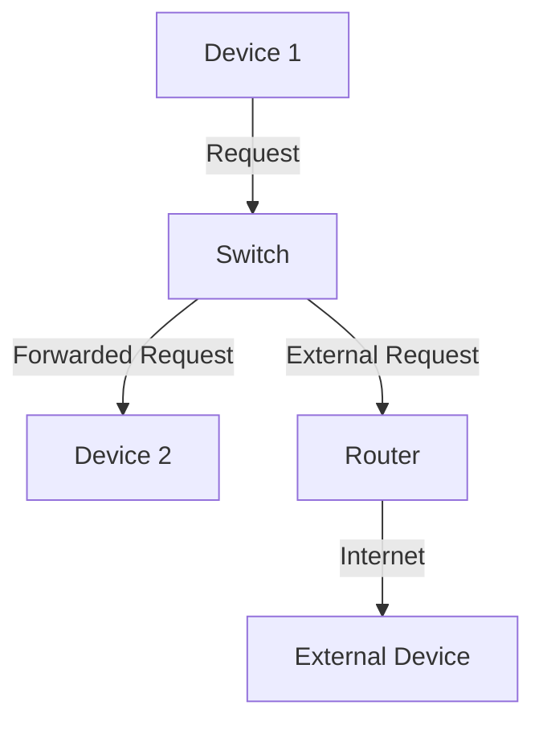
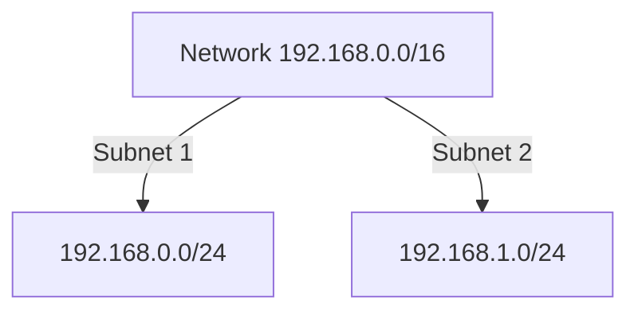

## Linux Networking Fundamentals

### Introduction to IP Addresses and Subnet Masks

In the context of networking, an IP address is a unique identifier assigned to each device connected to a network. This identifier allows devices to communicate with one another. An IPv4 address is typically represented as four decimal numbers separated by periods, such as `192.168.1.1`. Each number can range from 0 to 255, making the total address space 32 bits.

A subnet mask is used to divide the IP address into two parts: the network portion and the host portion. The subnet mask is a 32-bit number that, when applied to an IP address using a bitwise AND operation, isolates the network portion. For example, the subnet mask `255.255.255.0` (or `/24` in CIDR notation) indicates that the first 24 bits are the network portion, and the remaining 8 bits are the host portion.

#### CIDR Notation

CIDR (Classless Inter-Domain Routing) notation is a more concise way to represent IP addresses and their associated subnet masks. Instead of writing out the full subnet mask, CIDR notation uses a slash followed by the number of bits in the network portion. For instance:

- `192.168.1.0/24` means the first 24 bits are the network portion, and the last 8 bits are the host portion.
- `192.168.0.0/16` means the first 16 bits are the network portion, and the last 16 bits are the host portion.

This notation simplifies the representation and makes it easier to understand the scope of the network.

### Network Topology and Communication

In a local area network (LAN), devices communicate with each other through switches. A switch is a networking device that forwards data between devices on the same network. When a device sends a request to another device within the LAN, the switch receives the request and forwards it to the appropriate device based on the destination IP address.

If the destination IP address is external to the LAN, the request is forwarded to the router. The router then routes the request to the appropriate external network. This process ensures that data is efficiently transmitted between devices within the same network and across different networks.

#### Example of Network Communication

Consider a simple network topology with a switch and a router:



In this example, Device 1 sends a request to Device 2 through the switch. If Device 1 sends a request to an external device, the request is forwarded to the router, which then routes it to the external network.

### IP Address Range and Subnetting

The IP address range within a LAN is determined by the network administrator or the internet service provider (ISP). For example, in a home network, the ISP might assign the IP address range `192.168.1.0/24`, meaning that the first 24 bits are the network portion, and the last 8 bits are the host portion. This results in a range of IP addresses from `192.168.1.1` to `192.168.1.254`.

Subnetting is the process of dividing a larger network into smaller subnetworks. This is useful for managing large networks and improving performance. For example, a company might have a network with the IP address range `192.168.0.0/16`. To manage this network more effectively, the administrator might decide to create two subnets: `192.168.0.0/24` and `192.168.1.0/24`.

#### Example of Subnetting

Consider a network with the IP address range `192.168.0.0/16`. The administrator decides to create two subnets: `192.168.0.0/24` and `192.168.1.0/24`.



In this example, the original network is divided into two subnets, each with its own range of IP addresses.

### Network Configuration and Communication Requirements

For a device to communicate with other devices on a network, it needs three pieces of information: the IP address, the subnet mask, and the default gateway. The IP address identifies the device on the network, the subnet mask defines the network portion of the IP address, and the default gateway is the IP address of the router that forwards traffic to external networks.

#### Example of Network Configuration

Consider a device with the following configuration:

- IP Address: `192.168.1.10`
- Subnet Mask: `255.255.255.0` (or `/24`)
- Default Gateway: `192.168.1.1`

This configuration allows the device to communicate with other devices on the same network and to access external networks through the default gateway.

### Real-World Examples and Security Implications

Recent breaches and vulnerabilities often involve misconfigured networks and improper handling of IP addresses and subnet masks. For example, the Heartbleed bug (CVE-2014-0160) affected OpenSSL, which is widely used in network communication. While this vulnerability was not directly related to IP addressing, it highlights the importance of secure network configurations.

Another example is the KRACK attack (CVE-2017-13082), which exploited vulnerabilities in the WPA2 protocol used in Wi-Fi networks. This attack could allow an attacker to intercept and decrypt network traffic, highlighting the importance of secure network protocols and configurations.

### How to Prevent / Defend

To prevent and defend against network-related vulnerabilities, it is essential to follow best practices in network configuration and management. Here are some key steps:

1. **Secure Network Configuration**: Ensure that all devices on the network have proper IP address, subnet mask, and default gateway configurations. Use secure protocols such as HTTPS and SSH for network communication.

2. **Regular Audits and Monitoring**: Regularly audit network configurations and monitor network traffic for unusual activity. Use tools such as Wireshark to analyze network packets and identify potential security issues.

3. **Patch Management**: Keep all network devices and software up to date with the latest security patches and updates. This includes routers, switches, and other network infrastructure devices.

4. **Firewall and Access Control**: Implement firewalls and access control lists (ACLs) to restrict unauthorized access to the network. Configure firewalls to allow only necessary traffic and block potentially malicious traffic.

5. **Secure Wireless Networks**: Secure wireless networks using strong encryption protocols such as WPA3. Disable WPS (Wi-Fi Protected Setup) to prevent brute-force attacks.

### Complete Example of Network Configuration

Here is a complete example of configuring a network interface on a Linux system:

```bash
# Configure the network interface
sudo ip addr add 192.168.1.10/24 dev eth0
sudo ip route add default via 192.168.1.1

# Verify the configuration
ip addr show eth0
ip route show
```

The output should show the configured IP address, subnet mask, and default gateway:

```plaintext
2: eth0: <BROADCAST,MULTICAST,UP,LOWER_UP> mtu 1500 qdisc pfifo_fast state UP group default qlen 1000
    link/ether 00:11:22:33:44:55 brd ff:ff:ff:ff:ff:ff
    inet 192.168.1.10/24 brd 1192.168.1.255 scope global dynamic eth0
       valid_lft 86399sec preferred_lft 86399sec
default via 192.168.1.1 dev eth0 proto static metric 100
```

### Common Pitfalls and Detection

Common pitfalls in network configuration include:

- Incorrect IP address assignment, leading to conflicts or unreachable devices.
- Misconfigured subnet masks, resulting in incorrect network segmentation.
- Improper default gateway settings, causing routing issues.

Detection of these issues can be done using tools such as `ping`, `traceroute`, and `tcpdump`. For example, to check if a device is reachable:

```bash
ping 192.168.1.10
```

To trace the path to a remote device:

```bash
traceroute 192.168.1.1
```

To capture network traffic:

```bash
sudo tcpdump -i eth0
```

### Hands-On Labs

To practice and reinforce the concepts learned, consider the following hands-on labs:

- **PortSwigger Web Security Academy**: Offers a comprehensive set of labs covering various aspects of web security, including network fundamentals.
- **OWASP Juice Shop**: A deliberately insecure web application for practicing web security skills.
- **DVWA (Damn Vulnerable Web Application)**: Another intentionally vulnerable web application for learning web security.
- **WebGoat**: An interactive training application for learning about web application security.

These labs provide practical experience in configuring and securing networks, helping to solidify the theoretical knowledge gained.

### Conclusion

Understanding IP addresses, subnet masks, and network communication is crucial for effective network management and security. By following best practices and using the right tools, you can ensure that your network is secure and efficient. Regular audits, monitoring, and patch management are essential for maintaining a secure network environment.

---
<!-- nav -->
[[03-Introduction to Linux Networking Fundamentals|Introduction to Linux Networking Fundamentals]] | [[DevOps/DevOps Bootcamp/01-Linux & OS Basics/03-Linux Networking Fundamentals Explained/00-Overview|Overview]] | [[05-Subnetting Fundamentals|Subnetting Fundamentals]]
