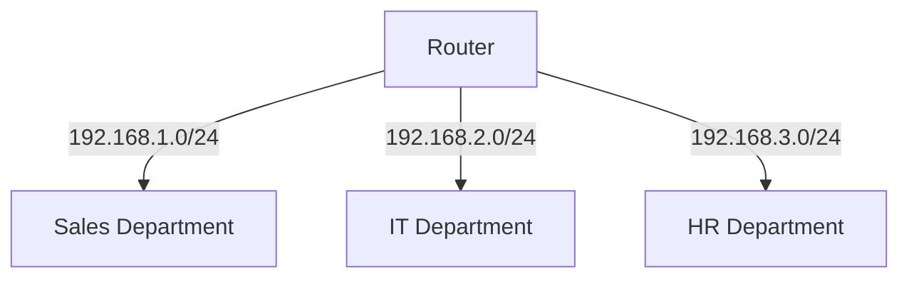
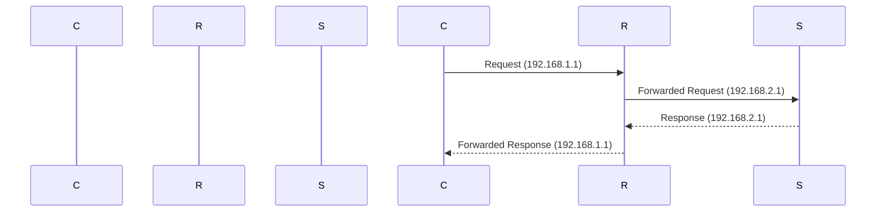

## Subnetting Fundamentals

### What is Subnetting?

Subnetting is the process of dividing a larger network into smaller, more manageable subnetworks. Each subnetwork, or subnet, is assigned a unique portion of the original network's IP address space. This division allows for better network management, improved security, and efficient use of IP addresses.

### Why Subnetting Matters

Subnetting is crucial for several reasons:

1. **Efficient IP Address Usage**: By dividing a large network into smaller subnets, you can avoid wasting IP addresses. For example, a Class C network (with a default subnet mask of `255.255.255.0`) can support up to 254 hosts. However, if you only need to support a small number of devices, subnetting allows you to allocate smaller ranges of IP addresses to different segments of the network.

2. **Network Management**: Smaller subnets make it easier to manage and troubleshoot networks. Each subnet can be treated as a separate logical network, allowing for better control over traffic and resource allocation.

3. **Security**: Subnetting can enhance network security by isolating different parts of the network. For instance, you can create a separate subnet for sensitive data, which can then be protected with firewalls and access controls.

4. **Broadcast Control**: In a large network, broadcast traffic can cause significant performance issues. By creating smaller subnets, you can limit the scope of broadcasts, reducing network congestion.

### How Subnetting Works

To understand subnetting, it's essential to know how IP addresses and subnet masks work.

#### IP Addresses

An IPv4 address consists of four octets (groups of eight bits), each ranging from 0 to 255. For example, `192.168.0.1` is an IPv4 address. Each octet represents a byte of the address.

#### Subnet Masks

A subnet mask is used to determine which part of an IP address represents the network and which part represents the host. A subnet mask is also composed of four octets, but unlike an IP address, a subnet mask uses `255` to represent a fixed part of the address and `0` to represent a variable part.

For example, the subnet mask `255.255.255.0` indicates that the first three octets (`192.168.0`) are fixed and represent the network, while the fourth octet (`1`) is variable and represents the host.

### Subnet Mask Examples

Let's look at some examples to understand how subnet masks work.

#### Example 1: Subnet Mask `255.255.255.0`

Consider the IP address `192.168.0.1` with the subnet mask `255.255.255.0`.

```plaintext
IP Address: 192.168.0.1
Subnet Mask: 255.255.255.0
```

Here, the first three octets (`192.168.0`) are fixed and represent the network, while the fourth octet (`1`) is variable and represents the host. The possible IP addresses in this subnet range from `192.168.0.0` to `192.168.0.255`.

#### Example 2: Subnet Mask `255.255.0.0`

Now consider the IP address `192.168.0.1` with the subnet mask `255.255.0.0`.

```plaintext
IP Address: 192.168.0.1
Subnet Mask: 255.255.0.0
```

Here, the first two octets (`192.168`) are fixed and represent the network, while the last two octets (`0.1`) are variable and represent the host. The possible IP addresses in this subnet range from `192.168.0.0` to `192.168.255.255`.

### Binary Representation

Understanding subnetting in binary form can help clarify how the fixed and variable parts of an IP address are determined.

#### Example 1: Subnet Mask `255.255.255.0`

In binary, `255.255.255.0` is represented as:

```plaintext
255.255.255.0 = 11111111.11111111.11111111.00000000
```

The first three octets are all `1`s, indicating that they are fixed, while the fourth octet is all `0`s, indicating that it is variable.

#### Example 2: Subnet Mask `255.255.0.0`

In binary, `255.255.0.0` is represented as:

```plaintext
255.255.0.0 = 11111111.11111111.00000000.00000000
```

The first two octets are all `1`s, indicating that they are fixed, while the last two octets are all `0`s, indicating that they are variable.

### Subnet Calculation

To calculate the number of subnets and hosts per subnet, you need to understand the relationship between the subnet mask and the number of bits used for the network and host portions.

#### Number of Subnets

The number of subnets is determined by the number of bits used for the network portion of the IP address. For example, if you use 2 bits for the network portion, you can create 2^2 = 4 subnets.

#### Number of Hosts Per Subnet

The number of hosts per subnet is determined by the number of bits used for the host portion of the IP address. For example, if you use 6 bits for the host portion, you can have 2^6 - 2 = 62 hosts per subnet (subtracting 2 for the network and broadcast addresses).

### Real-World Examples

#### Example 1: Network Segmentation

Suppose you have a company with multiple departments, and you want to segment the network to improve security and management. You might use subnetting to create separate subnets for each department.

For example, you could use the subnet mask `255.255.255.0` to create subnets like:

- `192.168.1.0/24` for the Sales department
- `192.168.2.0/24` for the IT department
- `192.168.3.0/24` for the HR department

Each subnet would have its own range of IP addresses, improving network management and security.

#### Example 2: ISP Allocation

Internet Service Providers (ISPs) often use subnetting to allocate IP addresses to their customers. For example, an ISP might receive a block of IP addresses like `192.168.0.0/16` and then subnet it to allocate smaller ranges to individual customers.

For example, the ISP might allocate:

- `192.168.1.0/24` to Customer A
- `192.168.2.0/24` to Customer B
- `192.168.3.0/24` to Customer C

This allows the ISP to efficiently manage and allocate IP addresses to its customers.

### Recent Real-World Examples

#### CVE-2021-3427: Microsoft Exchange Server Vulnerability

In 2021, a series of vulnerabilities were discovered in Microsoft Exchange Server, collectively known as ProxyLogon. One of the vulnerabilities, CVE-2021-3427, allowed attackers to bypass authentication and gain unauthorized access to the server.

Subnetting played a role in mitigating this vulnerability. By segmenting the network and placing the Exchange Server in a separate subnet, organizations could limit the potential impact of the vulnerability. For example, they could use a firewall to restrict access to the Exchange Server subnet, preventing unauthorized access from other parts of the network.

### Pitfalls and Common Mistakes

#### Over-Segmentation

One common mistake is over-segmenting the network. While subnetting can improve security and management, creating too many subnets can lead to complexity and increased administrative overhead. It's important to strike a balance between security and manageability.

#### Incorrect Subnet Mask

Another common mistake is using an incorrect subnet mask. For example, using a subnet mask like `255.255.255.255` would result in a single-host network, which is not practical for most use cases. It's important to choose the appropriate subnet mask based on the number of hosts and subnets required.

### How to Prevent / Defend

#### Detection

To detect potential issues with subnetting, you can use network scanning tools like Nmap. Nmap can scan the network and identify the IP addresses and subnets in use. This can help you verify that the subnetting is configured correctly and that there are no unexpected subnets or IP addresses.

```bash
nmap -sn 192.168.0.0/24
```

#### Prevention

To prevent issues with subnetting, it's important to follow best practices:

1. **Plan Your Subnetting**: Before implementing subnetting, plan out the subnets and IP address ranges you will use. Consider the number of hosts and subnets required and choose appropriate subnet masks.

2. **Use VLANs**: Virtual Local Area Networks (VLANs) can help isolate different parts of the network and improve security. By using VLANs, you can create separate logical networks within a physical network.

3. **Configure Firewalls**: Use firewalls to restrict access between subnets. For example, you can configure a firewall to allow traffic between certain subnets but block traffic between others.

4. **Document Your Configuration**: Document your subnetting configuration, including the IP address ranges and subnet masks used. This can help with troubleshooting and management.

#### Secure Coding Fixes

When working with subnetting in code, it's important to ensure that the IP addresses and subnet masks are handled correctly. Here's an example of how to check if an IP address belongs to a specific subnet:

```python
def ip_in_subnet(ip_address, subnet):
    ip_parts = [int(part) for part in ip_address.split('.')]
    subnet_parts = [int(part) for part in subnet.split('.')]

    for i in range(4):
        if subnet_parts[i] != 255 and ip_parts[i] != subnet_parts[i]:
            return False
    return True

ip_address = "192.168.0.1"
subnet = "192.168.0.0/24"

if ip_in_subnet(ip_address, subnet):
    print(f"{ip_address} is in the {subnet} subnet.")
else:
    print(f"{ip_address} is not in the {subnet} subnet.")
```

#### Configuration Hardening

To harden your network configuration, you can implement the following measures:

1. **Use Strong Subnet Masks**: Choose subnet masks that provide the appropriate level of segmentation for your network. Avoid using overly broad subnet masks that could expose large portions of the network.

2. **Enable IP Address Filtering**: Configure routers and switches to filter IP addresses based on the subnet mask. This can help prevent unauthorized access to subnets.

3. **Implement Access Controls**: Use access controls to restrict access to sensitive subnets. For example, you can configure firewalls to allow access only from trusted IP addresses.

### Mermaid Diagrams

#### Network Topology

Here's a mermaid diagram showing a simple network topology with subnetting:



#### Request/Response Flow

Here's a mermaid diagram showing a request/response flow between a client and a server in different subnets:



### Practice Labs

For hands-on practice with subnetting, consider the following labs:

- **PortSwigger Web Security Academy**: Offers a lab on subnetting and network segmentation.
- **OWASP Juice Shop**: Provides a lab on network segmentation and subnetting.
- **DVWA (Damn Vulnerable Web Application)**: Includes a lab on subnetting and network segmentation.

These labs will help you apply the concepts of subnetting in a practical setting and reinforce your understanding of the topic.

By following these guidelines and best practices, you can effectively use subnetting to improve network management, security, and efficiency.

---
<!-- nav -->
[[04-Linux Networking Fundamentals|Linux Networking Fundamentals]] | [[DevOps/DevOps Bootcamp/01-Linux & OS Basics/03-Linux Networking Fundamentals Explained/00-Overview|Overview]] | [[06-DNS Resolution Process|DNS Resolution Process]]
