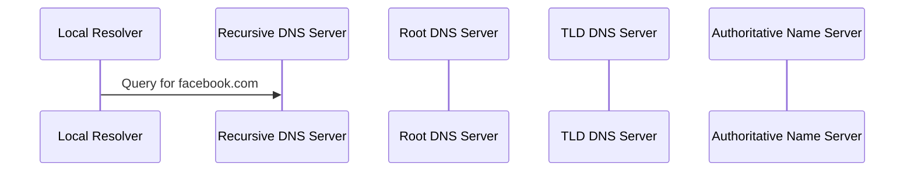
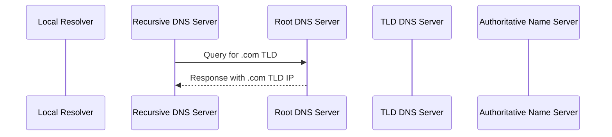
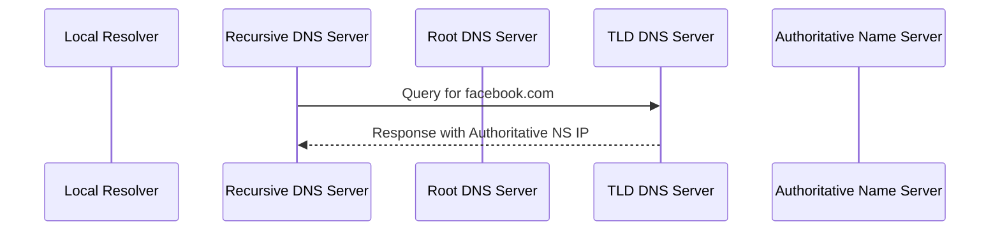
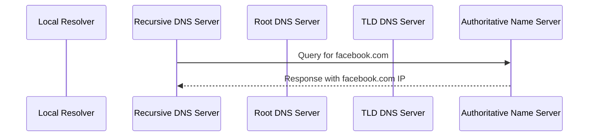
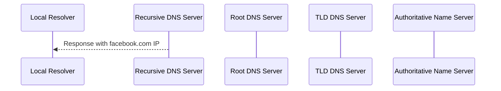
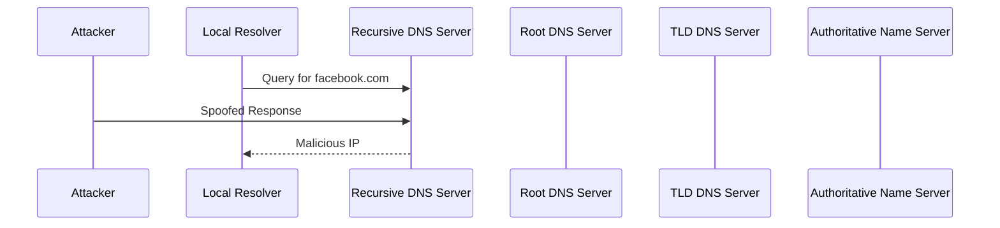
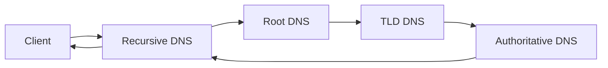

## DNS Resolution Process

### Overview of DNS Resolution

The Domain Name System (DNS) is a hierarchical and distributed naming system for computers, services, or any resource connected to the Internet or a private network. It translates human-readable domain names (like `facebook.com`) into IP addresses (like `192.0.2.1`), which are used by devices to locate and communicate with each other over the network.

#### Steps in DNS Resolution

1. **Local Cache Check**: The resolver first checks its local cache to see if it already has the IP address for the domain name.
2. **Recursive Query**: If the IP address is not found in the local cache, the resolver sends a query to a recursive DNS server.
3. **Root Server Query**: The recursive DNS server queries the root DNS server for the IP address of the top-level domain (TLD) server (e.g., `.com`).
4. **TLD Server Query**: The TLD server responds with the IP address of an authoritative name server for the domain.
5. **Authoritative Name Server Query**: The recursive DNS server then queries the authoritative name server for the domain name.
6. **Response**: The authoritative name server returns the IP address of the domain name.
7. **Cache Update**: Both the recursive DNS server and the local resolver cache the result for a specified period (TTL).

### Detailed Example: Resolving `facebook.com`

Let's walk through the detailed steps of resolving `facebook.com`.

1. **Local Cache Check**:
    - The resolver first checks its local cache to see if it already has the IP address for `facebook.com`.
    - If it does, it uses that cached value and skips the rest of the process.

2. **Recursive Query**:
    - If the IP address is not found in the local cache, the resolver sends a query to a recursive DNS server.
    - This query is typically sent via UDP port 53.



3. **Root Server Query**:
    - The recursive DNS server queries the root DNS server for the IP address of the `.com` TLD server.
    - The root DNS server responds with the IP address of the `.com` TLD server.



4. **TLD Server Query**:
    - The recursive DNS server then queries the `.com` TLD server for the IP address of an authoritative name server for `facebook.com`.
    - The TLD server responds with the IP address of the authoritative name server for `facebook.com`.



5. **Authoritative Name Server Query**:
    - The recursive DNS server then queries the authoritative name server for `facebook.com`.
    - The authoritative name server returns the IP address of `facebook.com`.



6. **Response**:
    - The recursive DNS server sends the IP address back to the local resolver.
    - The local resolver caches the result for a specified period (TTL).



7. **Cache Update**:
    - Both the recursive DNS server and the local resolver cache the result for a specified period (TTL).

### DNS Caching

To improve efficiency and reduce latency, both the recursive DNS server and the local resolver cache DNS records. This caching mechanism helps in reducing the number of queries to the authoritative name servers, thereby improving performance.

#### TTL (Time-to-Live)

Each DNS record has a TTL value, which specifies how long the record should be cached before it needs to be refreshed. This value is set by the authoritative name server and is crucial for maintaining up-to-date DNS records.

### DNS Security Considerations

DNS resolution is critical for the functioning of the Internet, and any vulnerabilities in this process can lead to significant security issues. One such vulnerability is DNS spoofing or poisoning, where an attacker intercepts and modifies DNS responses to redirect traffic to malicious sites.

#### DNS Spoofing

DNS spoofing occurs when an attacker intercepts and modifies DNS responses to redirect traffic to malicious sites. This can be achieved by either compromising the DNS server or by intercepting DNS queries and responses.

##### Real-World Example: DNS Cache Poisoning (CVE-2008-1447)

In 2008, a vulnerability was discovered in the DNS protocol that allowed attackers to perform cache poisoning attacks. This vulnerability, known as CVE-2008-1447, affected many DNS servers and could be exploited to redirect users to malicious websites.



### How to Prevent / Defend Against DNS Spoofing

To defend against DNS spoofing, several measures can be taken:

1. **DNSSEC (DNS Security Extensions)**: DNSSEC adds cryptographic signatures to DNS records, ensuring their authenticity and integrity.
2. **DNS Over HTTPS (DoH)**: DoH encrypts DNS queries and responses, making it difficult for attackers to intercept and modify them.
3. **Proper Configuration of DNS Servers**: Ensure that DNS servers are properly configured and updated with the latest security patches.
4. **Monitoring and Logging**: Regularly monitor DNS queries and responses for suspicious activity and maintain logs for forensic analysis.

#### Secure DNS Configuration Example

Here is an example of a secure DNS configuration using BIND, a popular DNS server software.



```yaml
options {
    directory "/var/named";
    recursion yes;
    forwarders { 8.8.8.8; 8.8.4.4; };
    dnssec-enable yes;
    dnssec-validation yes;
}
zone "example.com" IN {
    type master;
    file "example.com.db";
    allow-update { none; };
};
```

### Network Information Commands

To view network information on your computer, several useful commands and tools are available. These commands provide details about your network configuration, active connections, and more.

#### `ifconfig` Command

The `ifconfig` command displays the IP address, subnet mask, gateway address, and other network-related information for your computer.

```bash
ifconfig
```

Example output:

```plaintext
eth0: flags=4163<UP,BROADCAST,RUNNING,MULTICAST>  mtu 1500
        inet 192.168.1.10  netmask 255.255.255.0  broadcast 192.168.1.255
        inet6 fe80::20c:29ff:fe8b:6d0c  prefixlen 64  scopeid 0x20<link>
        ether 00:0c:29:8b:6d:0c  txqueuelen 1000  (Ethernet)
        RX packets 123456  bytes 123456789 (117.7 MiB)
        RX errors 0  dropped 0  overruns 0  frame 0
        TX packets 123456  bytes 123456789 (117.7 MiB)
        TX errors 0  dropped 0 overruns 0  carrier 0  collisions 0
```

#### `netstat` Command

The `netstat` command shows active network connections and listening ports on your machine.

```bash
netstat -an
```

Example output:

```plaintext
Active Internet connections (servers and established)
Proto Recv-Q Send-Q Local Address           Foreign Address         State      
tcp        0      0 0.0.0.0:22              0.0.0.0:*               LISTEN     
tcp        0      1 192.168.1.10:56789      192.168.1.1:80          SYN_SENT   
udp        0      0 0.0.0.0:68              0.0.0.0:*                          
udp        0      0 192.168.1.10:123        0.0.0.0:*                          
Active UNIX domain sockets (servers and established)
Proto RefCnt Flags       Type       State         I-Node   Path
unix  2      [ ACC ]     STREAM     LISTENING     12345    /tmp/.X11-unix/X0
unix  2      [ ]         DGRAM                    12346    /run/systemd/notify
```

### Practical Labs

For hands-on practice with Linux networking fundamentals, consider the following labs:

- **PortSwigger Web Security Academy**: Offers interactive labs to understand and practice web security concepts.
- **OWASP Juice Shop**: A deliberately insecure web application for practicing web security skills.
- **DVWA (Damn Vulnerable Web Application)**: Another intentionally vulnerable web application for learning web security.
- **WebGoat**: An interactive, gamified training application for learning about web application security.

These labs provide a practical environment to apply the concepts learned in this chapter.

### Conclusion

Understanding DNS resolution and network information commands is crucial for effective network management and security. By mastering these concepts, you can ensure that your systems are properly configured and secure. Always stay vigilant and keep your systems up-to-date with the latest security practices and tools.

---
<!-- nav -->
[[05-Subnetting Fundamentals|Subnetting Fundamentals]] | [[DevOps/DevOps Bootcamp/01-Linux & OS Basics/03-Linux Networking Fundamentals Explained/00-Overview|Overview]] | [[07-Domain Names and Fully Qualified Domain Names|Domain Names and Fully Qualified Domain Names]]
