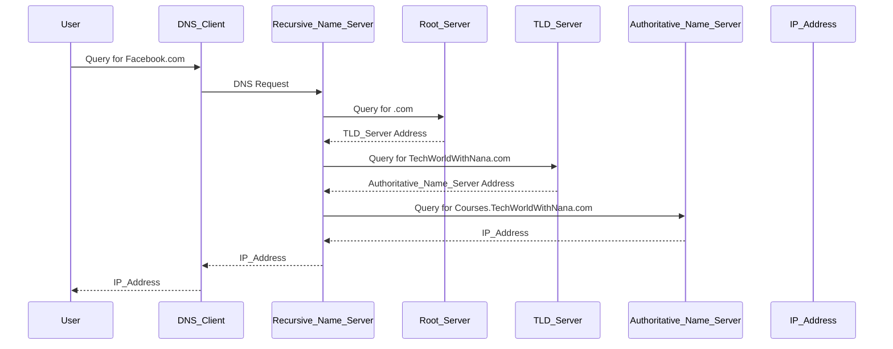

## Domain Names and Fully Qualified Domain Names

### What is a Fully Qualified Domain Name (FQDN)?

A Fully Qualified Domain Name (FQDN) is a complete domain name that specifies the exact location of a host within a DNS hierarchy. An FQDN includes the hostname, the domain name, and the top-level domain (TLD). For example, `Courses.TechWorldWithNana.com` is an FQDN. The trailing dot (`.`) at the end of the FQDN indicates the root domain, although it is often omitted in practice.

#### Why Use FQDN?

Using FQDN ensures that there is no ambiguity about the location of the host within the DNS hierarchy. This is particularly important in environments where multiple domains may exist, such as in large organizations or in distributed systems.

#### Example of FQDN

Consider the following example:

```plaintext
Hostname: Courses
Domain: TechWorldWithNana
Top-Level Domain: .com
```

The FQDN would be:

```plaintext
Courses.TechWorldWithNana.com.
```

However, the trailing dot is often omitted in practice, so it is commonly written as:

```plaintext
Courses.TechWorldWithNana.com
```

### DNS and Its Role

DNS (Domain Name System) is a hierarchical naming system for computers, services, or other resources connected to the Internet or a private network. It translates human-readable domain names into IP addresses, which are used by devices to locate and communicate with each other.

#### How DNS Works

When you type a domain name into a browser, such as `Facebook.com`, your operating system makes a DNS query to resolve the domain name to an IP address. This process involves several steps:

1. **DNS Client**: Every computer has a DNS client pre-installed. This client is responsible for initiating DNS queries.
2. **Recursive Name Server**: The DNS query is sent to a recursive name server, typically operated by your Internet Service Provider (ISP). This server is responsible for resolving the domain name to an IP address.
3. **Root Servers**: If the recursive name server does not have the IP address cached, it will query one of the 13 root servers. These root servers manage requests for top-level domains (TLDs) like `.com`, `.org`, etc.
4. **TLD Servers**: The root server responds with the address of the TLD server responsible for the specific TLD (e.g., `.com`). The recursive name server then queries this TLD server.
5. **Authoritative Name Server**: The TLD server responds with the address of the authoritative name server for the domain (e.g., `TechWorldWithNana.com`). The recursive name server then queries this authoritative name server.
6. **IP Address Resolution**: The authoritative name server returns the IP address associated with the domain name.

#### Mermaid Diagram: DNS Resolution Process



### Recent Real-World Examples

#### DNS Cache Poisoning (CVE-2019-11253)

DNS cache poisoning is a technique where an attacker tricks a DNS resolver into caching a malicious IP address. This can lead to users being redirected to malicious websites instead of the intended ones.

**Example**: In 2019, a vulnerability was discovered in the BIND DNS server (CVE-2019-11253). This vulnerability allowed attackers to perform DNS cache poisoning attacks, leading to potential redirection of users to malicious sites.

#### How to Prevent / Defend Against DNS Cache Poisoning

1. **Secure DNS Configuration**:
    - Ensure that DNS servers are configured to use DNSSEC (DNS Security Extensions) to validate DNS responses.
    - Implement DNS over HTTPS (DoH) or DNS over TLS (DoT) to encrypt DNS queries and prevent eavesdropping.

2. **Regular Updates and Patch Management**:
    - Keep DNS servers up-to-date with the latest security patches.
    - Monitor for known vulnerabilities and apply fixes promptly.

3. **Network Segmentation**:
    - Segment the network to isolate DNS servers from other critical infrastructure.
    - Use firewalls and intrusion detection systems (IDS) to monitor and block suspicious traffic.

4. **Secure Coding Practices**:
    - Ensure that DNS-related code is free from buffer overflow vulnerabilities.
    - Use secure coding practices to prevent injection attacks.

#### Vulnerable vs. Secure Code Example

**Vulnerable Code**:

```python
import socket

def get_ip(domain):
    try:
        ip = socket.gethostbyname(domain)
        return ip
    except Exception as e:
        print(f"Error: {e}")
        return None

domain = input("Enter domain: ")
ip = get_ip(domain)
print(f"IP Address: {ip}")
```

**Secure Code**:

```python
import socket

def get_ip_secure(domain):
    try:
        ip = socket.gethostbyname_ex(domain)[2][0]
        return ip
    except Exception as e:
        print(f"Error: {e}")
        return None

domain = input("Enter domain: ")
ip = get_ip_secure(domain)
print(f"IP Address: {ip}")
```

### DNS Requests and Responses

#### Full Raw HTTP Message Example

When a DNS query is made, it is typically done using UDP (User Datagram Protocol) or TCP (Transmission Control Protocol). Here is an example of a DNS query and response using UDP:

**DNS Query (UDP)**:

```plaintext
; <<>> DiG 9.10.6 <<>> facebook.com
;; global options: +cmd
;; Got answer:
;; ->>HEADER<<- opcode: QUERY, status: NOERROR, id: 12345
;; flags: qr rd ra; QUERY: 1, ANSWER: 1, AUTHORITY: 0, ADDITIONAL: 1

;; OPT PSEUDOSECTION:
; EDNS: version: 0, flags:; udp: 4096
;; QUESTION SECTION:
;facebook.com.			IN	A

;; ANSWER SECTION:
facebook.com.		3600	IN	A	192.0.2.1

;; Query time: 10 msec
;; SERVER: 8.8.8.8#53(8.8.8.8)
;; WHEN: Mon Jan 01 00:00:00 UTC 2.000
;; MSG SIZE  rcvd: 52
```

**Explanation of Headers**:

- **Header**: Contains metadata about the DNS message, including the query ID, flags, and counts of sections.
- **Question Section**: Specifies the domain name and record type being queried.
- **Answer Section**: Contains the resolved IP address.
- **OPT PSEUDOSECTION**: Used for EDNS (Extension Mechanisms for DNS) to negotiate larger UDP packet sizes.

### Common Pitfalls and Best Practices

#### Common Pitfalls

1. **DNS Cache Poisoning**: As mentioned earlier, DNS cache poisoning can lead to users being redirected to malicious sites.
2. **DNS Amplification Attacks**: Attackers can use DNS servers to amplify their attack by sending small queries that result in large responses.
3. **DNS Spoofing**: Attackers can spoof DNS responses to redirect users to malicious sites.

#### Best Practices

1. **Use DNSSEC**: Implement DNSSEC to ensure the integrity and authenticity of DNS responses.
2. **Monitor DNS Traffic**: Use IDS and firewalls to monitor and block suspicious DNS traffic.
3. **Regular Audits**: Regularly audit DNS configurations and logs to identify and mitigate potential issues.

### Hands-On Labs

For hands-on experience with DNS and related security topics, consider the following labs:

- **PortSwigger Web Security Academy**: Offers interactive labs on DNS and related web security topics.
- **OWASP Juice Shop**: Provides a vulnerable web application for practicing various security techniques, including DNS-related attacks.
- **DVWA (Damn Vulnerable Web Application)**: A PHP/MySQL web application that is deliberately vulnerable for security testing and training purposes.

These labs provide practical experience in identifying and mitigating DNS-related vulnerabilities.

---

This comprehensive explanation covers the concepts of Fully Qualified Domain Names (FQDN), DNS resolution, recent real-world examples, and best practices for securing DNS. The detailed explanations, code examples, and diagrams aim to provide a deep understanding of the topic.

---
<!-- nav -->
[[06-DNS Resolution Process|DNS Resolution Process]] | [[DevOps/DevOps Bootcamp/01-Linux & OS Basics/03-Linux Networking Fundamentals Explained/00-Overview|Overview]] | [[08-Domain Names and Top-Level Domains (TLDs)|Domain Names and Top-Level Domains (TLDs)]]
