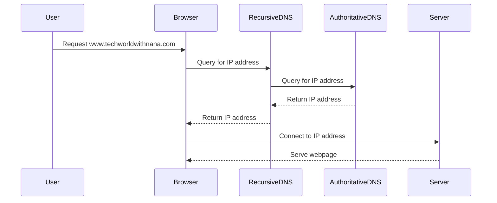

## Internet Corporation for Assigned Names and Numbers (ICANN)

The Internet Corporation for Assigned Names and Numbers (ICANN) is a non-profit organization responsible for coordinating the maintenance and procedures of several databases related to the namespaces and numerical addresses used in the Internet. This includes the management of domain names, IP addresses, and protocol port numbers. ICANN ensures the stability, security, and interoperability of the global Internet.

### What is ICANN?

ICANN was founded in 1998 and took over the responsibility for managing the Domain Name System (DNS) from the U.S. government. The DNS is a hierarchical decentralized naming system for computers, services, or other resources connected to the Internet or a private network. Each domain name is associated with an IP address, which is used to locate the resource on the network.

### Why is ICANN Important?

ICANN plays a crucial role in maintaining the structure and functionality of the Internet. Without ICANN, the management of domain names would be chaotic and inconsistent, leading to potential conflicts and disruptions in Internet services. ICANN ensures that domain names are unique and properly managed, which is essential for the smooth operation of the Internet.

### How Does ICANN Work?

ICANN operates through a multi-stakeholder model, involving various groups such as governments, businesses, civil society, and technical experts. These stakeholders work together to make decisions about the management of the Internet's naming systems. ICANN's primary functions include:

1. **Domain Name Management**: ICANN oversees the registration of domain names through accredited registrars. Registrars are organizations that sell domain names to individuals and businesses.
2. **IP Address Allocation**: ICANN coordinates the allocation of IP addresses to ensure that they are used efficiently and effectively.
3. **Protocol Parameter Assignment**: ICANN manages the assignment of protocol parameters, such as port numbers, to ensure consistency across the Internet.

### Real-World Example: Domain Name Registration

Consider the process of registering a domain name like `techworldwithnana.com`. Here’s a step-by-step breakdown:

1. **Select a Top-Level Domain (TLD)**: You choose a TLD, such as `.com`, `.org`, or `.net`.
2. **Find a Registrar**: You select an ICANN-accredited registrar, such as GoDaddy or Namecheap.
3. **Register the Domain**: You submit your chosen domain name to the registrar, who checks its availability and processes the registration.
4. **Manage the Domain**: Once registered, you can manage the domain through the registrar's interface, including updating DNS records.

### Recent Breaches and CVEs

While ICANN itself is not typically the target of cyberattacks, domain name registration systems can be vulnerable to various types of attacks. For example:

- **Phishing Attacks**: Attackers may attempt to trick domain owners into revealing their login credentials.
- **DNS Hijacking**: Attackers may take control of a domain's DNS settings to redirect traffic to malicious sites.

### How to Prevent / Defend Against Domain Name Attacks

#### Secure Domain Registration

To prevent unauthorized access to your domain, follow these steps:

1. **Use Strong Passwords**: Ensure that your registrar account uses strong, unique passwords.
2. **Enable Two-Factor Authentication (2FA)**: Many registrars offer 2FA, which adds an extra layer of security.
3. **Monitor Your Domain**: Regularly check your domain's WHOIS information and DNS settings for any unauthorized changes.

#### Secure DNS Configuration

To secure your DNS configuration, consider the following:

1. **Use DNSSEC**: DNSSEC (DNS Security Extensions) provides a way to digitally sign DNS data, ensuring its integrity and authenticity.
2. **Configure DNS Caching**: Properly configure DNS caching to reduce the load on your DNS servers and improve performance.

### Code Example: DNS Configuration

Here’s an example of a DNS configuration file (`named.conf`):

```plaintext
options {
    directory "/var/named";
    recursion yes;
};

zone "techworldwithnana.com" IN {
    type master;
    file "techworldwithnana.com.db";
};
```

And the corresponding zone file (`techworldwithnana.com.db`):

```plaintext
$TTL 86400
@       IN      SOA     ns1.techworldwithnana.com. admin.techworldwithnana.com. (
                        2023092501 ; serial
                        3600       ; refresh
                        1800       ; retry
                        1209600    ; expire
                        86400 )    ; minimum
        IN      NS      ns1.techworldwithnana.com.
        IN      NS      ns2.techworldwithnana.com.
ns1     IN      A       192.0.2.1
ns2     IN      A       192.0.2.2
www     IN      A       192.0.2.3
```

### Mermaid Diagram: DNS Resolution Process



---
<!-- nav -->
[[08-Domain Names and Top-Level Domains (TLDs)|Domain Names and Top-Level Domains (TLDs)]] | [[DevOps/DevOps Bootcamp/01-Linux & OS Basics/03-Linux Networking Fundamentals Explained/00-Overview|Overview]] | [[10-Subdomains and Their Usage|Subdomains and Their Usage]]
