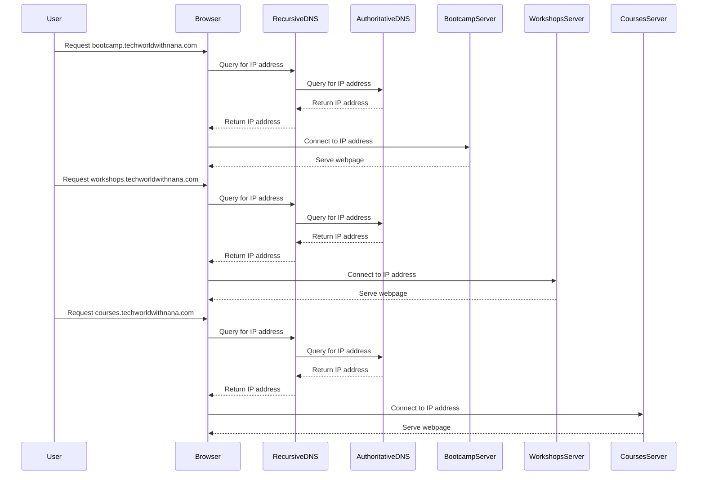

## Subdomains and Their Usage

Subdomains are a way to divide a domain into smaller, more manageable parts. They allow you to organize your domain based on different applications, services, or geographical regions.

### What are Subdomains?

A subdomain is a part of a domain name that is located before the main domain. For example, in `bootcamp.techworldwithnana.com`, `bootcamp` is the subdomain, and `techworldwithnana.com` is the main domain.

### Why Use Subdomains?

Subdomains provide several benefits:

1. **Organization**: They help organize different parts of your domain, making it easier to manage.
2. **Scalability**: They allow you to scale your infrastructure by assigning different subdomains to different servers or services.
3. **Security**: They can enhance security by isolating different parts of your domain.

### How to Create Subdomains

Creating subdomains involves configuring your DNS settings. Here’s a step-by-step guide:

1. **Access Your DNS Settings**: Log in to your domain registrar or DNS provider.
2. **Create a New Record**: Add a new A record or CNAME record for the subdomain.
3. **Assign an IP Address**: Assign an IP address to the subdomain, either directly (A record) or via a CNAME record.

### Real-World Example: Subdomain Configuration

Suppose you want to create subdomains for different parts of your company, such as `bootcamp.techworldwithnana.com`, `workshops.techworldwithnana.com`, and `courses.techworldwithnana.com`.

1. **Create A Records**:
   - `bootcamp.techworldwithnana.com` → `192.0.2.1`
   - `workshops.techworldwithnana.com` → `192.0.2.2`
   - `courses.techworldwithnana.com` → `192.0.2.3`

2. **Configure DNS Settings**:
   - Update your DNS zone file to include these records.

### Code Example: DNS Zone File with Subdomains

Here’s an updated zone file (`techworldwithnana.com.db`) with subdomains:

```plaintext
$TTL 86400
@       IN      SOA     ns1.techworldwithnana.com. admin.techworldwithnana.com. (
                        2023092502 ; serial
                        3600       ; refresh
                        1800       ; retry
                        1209600    ; expire
                        86400 )    ; minimum
        IN      NS      ns1.techworldwithnana.com.
        IN      NS      ns2.techworldwithnana.com.
ns1     IN      A       192.0.2.1
ns2     IN      A       192.0.2.2
www     IN      A       192.0.2.3
bootcamp IN     A       192.0.2.4
workshops IN    A       192.0.2.5
courses  IN     A       192.0.2.6
```

### Mermaid Diagram: DNS Resolution with Subdomains



### How to Prevent / Defend Against Subdomain Attacks

#### Secure Subdomain Configuration

To prevent unauthorized access to your subdomains, follow these steps:

1. **Use Strong Passwords**: Ensure that your DNS provider account uses strong, unique passwords.
2. **Enable Two-Factor Authentication (2FA)**: Many DNS providers offer 2FA, which adds an extra layer of security.
3. **Monitor Your DNS Settings**: Regularly check your DNS settings for any unauthorized changes.

#### Secure Subdomain Servers

To secure the servers hosting your subdomains, consider the following:

1. **Use Firewalls**: Configure firewalls to restrict access to your servers.
2. **Patch and Update**: Keep your servers up-to-date with the latest security patches.
3. **Use SSL/TLS**: Ensure that all communication with your subdomains is encrypted using SSL/TLS.

### Code Example: Firewall Configuration

Here’s an example of a firewall configuration using `iptables`:

```bash
# Allow incoming HTTP traffic
iptables -A INPUT -p tcp --dport 80 -j ACCEPT

# Allow incoming HTTPS traffic
iptables -A INPUT -p tcp --dport 443 -j ACCEPT

# Block all other incoming traffic
iptables -A INPUT -j DROP
```

### Practice Labs

For hands-on practice with DNS and subdomains, consider the following labs:

- **PortSwigger Web Security Academy**: Offers a comprehensive course on web security, including DNS and subdomain enumeration.
- **OWASP Juice Shop**: A deliberately insecure web application for practicing web security skills.
- **DVWA (Damn Vulnerable Web Application)**: Another intentionally vulnerable web application for learning web security.

By thoroughly understanding and securing your domain and subdomain configurations, you can ensure the stability and security of your online presence.

---
<!-- nav -->
[[09-Internet Corporation for Assigned Names and Numbers (ICANN)|Internet Corporation for Assigned Names and Numbers (ICANN)]] | [[DevOps/DevOps Bootcamp/01-Linux & OS Basics/03-Linux Networking Fundamentals Explained/00-Overview|Overview]] | [[DevOps/DevOps Bootcamp/01-Linux & OS Basics/03-Linux Networking Fundamentals Explained/11-Practice Questions & Answers|Practice Questions & Answers]]
