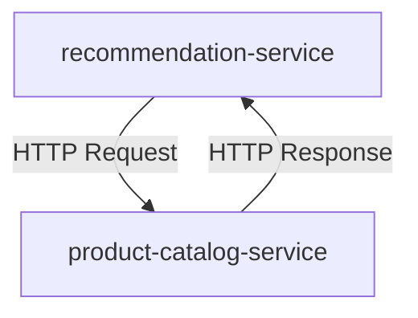

## Container Naming and Configuration

### Setting the Container Name

When deploying a microservice, one of the first steps is to set the container name. In this context, the container name is `service`. This naming convention helps in identifying the container within the system, especially when dealing with multiple services. The name `service` is chosen to reflect the nature of the component being deployed, which is a microservice.

### Image Definition

The next step is to define the image used by the container. The image is specified using the container registry and the name of the microservice. For instance, if the microservice is named `recommendation-service`, the image might be defined as:

```yaml
image: myregistry/recommendation-service:latest
```

Here, `myregistry` is the container registry, and `recommendation-service` is the name of the microservice. The `:latest` tag indicates the latest version of the image.

### Port Configuration

The microservice should start on a specific port, typically `8080`. This port is referred to as the **target port**. The target port is the port on which the container listens for incoming connections. 

In Kubernetes, for example, you would define the service and its ports as follows:

```yaml
apiVersion: v1
kind: Service
metadata:
  name: recommendation-service
spec:
  selector:
    app: recommendation-service
  ports:
    - protocol: TCP
      port: 8080
      targetPort: 8080
```

Here, `port` is the port on which the service listens, and `targetPort` is the port on which the container listens. Both are set to `8080`.

### Environment Variables

Microservices often require environment variables to configure their behavior. In this case, the `recommendation-service` requires an environment variable named `PORT`, which is set to `8080`.

```yaml
env:
  - name: PORT
    value: "8080"
```

This environment variable ensures that the microservice knows which port to listen on.

### Inter-Service Communication

The `recommendation-service` communicates with the `product-catalog-service`. To facilitate this communication, the `recommendation-service` needs to know the address of the `product-catalog-service`. This information is provided via an environment variable named `PRODUCT_CATALOG_SERVICE_ADDRESS`.

```yaml
env:
  - name: PRODUCT_CATALOG_SERVICE_ADDRESS
    value: "product-catalog-service"
```

Here, `product-catalog-service` is the name of the service that the `recommendation-service` will communicate with.

### Complete Example

Let's put all these pieces together in a complete Kubernetes deployment and service definition:

```yaml
apiVersion: apps/v1
kind: Deployment
metadata:
  name: recommendation-service
spec:
  replicas: 1
  selector:
    matchLabels:
      app: recommendation-service
  template:
    metadata:
      labels:
        app: recommendation-service
    spec:
      containers:
      - name: service
        image: myregistry/recommendation-service:latest
        env:
          - name: PORT
            value: "8080"
          - name: PRODUCT_CATALOG_SERVICE_ADDRESS
            value: "product-catalog-service"
        ports:
          - containerPort: 8080
---
apiVersion: v1
kind: Service
metadata:
  name: recommendation-service
spec:
  selector:
    app: recommendation-service
  ports:
    - protocol: TCP
      port: 8080
      targetPort: 8080
```

### Mermaid Diagram

To visualize the inter-service communication, consider the following mermaid diagram:



### Common Pitfalls and How to Prevent Them

#### Incorrect Port Configuration

**Problem**: If the `targetPort` and `port` are not correctly configured, the service may not be accessible.

**Solution**: Ensure that both `targetPort` and `port` are set to the correct values. Use tools like `kubectl get svc` to verify the configuration.

```bash
kubectl get svc recommendation-service
```

#### Missing Environment Variables

**Problem**: If required environment variables are missing, the microservice may fail to start or behave incorrectly.

**Solution**: Always validate the environment variables before deploying the service. Use tools like `kubectl describe pod <pod-name>` to check the environment variables.

```bash
kubectl describe pod recommendation-service-<pod-id>
```

#### Inter-Service Communication Issues

**Problem**: If the `PRODUCT_CATALOG_SERVICE_ADDRESS` is incorrect, the `recommendation-service` may fail to communicate with the `product-catalog-service`.

**Solution**: Ensure that the service names are correctly configured and that the DNS resolution works as expected. Use tools like `kubectl exec` to test the connectivity.

```bash
kubectl exec -it recommendation-service-<pod-id> -- sh
# Inside the pod
curl http://product-catalog-service:8080
```

### Real-World Examples

#### CVE-2021-21277

In 2021, a vulnerability was discovered in Kubernetes where incorrect port configurations could lead to unauthorized access. This highlights the importance of ensuring that all ports are correctly configured and validated.

#### Breach Example: Capital One Data Breach (2019)

In the Capital One data breach, misconfigured Kubernetes services allowed unauthorized access to sensitive data. This underscores the need for proper configuration and validation of all services and their dependencies.

### Secure Coding Practices

#### Vulnerable Code

```yaml
apiVersion: apps/v1
kind: Deployment
metadata:
  name: recommendation-service
spec:
  replicas: 1
  selector:
    matchLabels:
      app: recommendation-service
  template:
    metadata:
      labels:
        app: recommendation-service
    spec:
      containers:
      - name: service
        image: myregistry/recommendation-service:latest
        env:
          - name: PORT
            value: "8080"
        ports:
          - containerPort: 8080
---
apiVersion: v1
kind: Service
metadata:
  name: recommendation-service
spec:
  selector:
    app: recommendation-service
  ports:
    - protocol: TCP
      port: 8080
      targetPort: 8080
```

#### Secure Code

```yaml
apiVersion: apps/v1
kind: Deployment
metadata:
  name: recommendation-service
spec:
  replicas: 1
  selector:
    matchLabels:
      app: recommendation-service
  template:
    metadata:
      labels:
        app: recommendation-service
    spec:
      containers:
      - name: service
        image: myregistry/recommendation-service:latest
        env:
          - name: PORT
            value: "8080"
          - name: PRODUCT_CATALOG_SERVICE_ADDRESS
            value: "product-catalog-service"
        ports:
          - containerPort: 8080
---
apiVersion: v1
kind: Service
metadata:
  name: recommendation-service
spec:
  selector:
    app: recommendation-service
  ports:
    - protocol: TCP
      port: 8080
      targetPort:  8080
```

### Detection and Prevention

#### Detection

Use tools like `kube-bench` to validate the configuration of your Kubernetes cluster and services.

```bash
kube-bench run --version=1.21 --check=4.2.1
```

#### Prevention

Implement strict validation checks during deployment. Use tools like `helm lint` to ensure that all configurations are correct before deploying.

```bash
helm lint .
```

### Hands-On Labs

For hands-on practice, consider using the following labs:

- **PortSwigger Web Security Academy**: Focuses on web application security but includes sections on microservices and container security.
- **OWASP Juice Shop**: A deliberately insecure web application for practicing web security skills.
- **Kubernetes Goat**: A Kubernetes-based security training platform designed to help users understand and mitigate security risks in Kubernetes environments.

These labs provide practical experience in configuring and securing microservices and their interactions.

By thoroughly understanding and implementing these concepts, you can ensure that your microservices are properly configured, secure, and ready to handle complex interactions with other services.

---
<!-- nav -->
[[02-Microservices Deployment Process Overview|Microservices Deployment Process Overview]] | [[DevOps/DevOps Bootcamp/01-Linux & OS Basics/04-Microservices Deployment Process Overview/00-Overview|Overview]] | [[04-Creating Deployment and Service Configuration Files|Creating Deployment and Service Configuration Files]]
