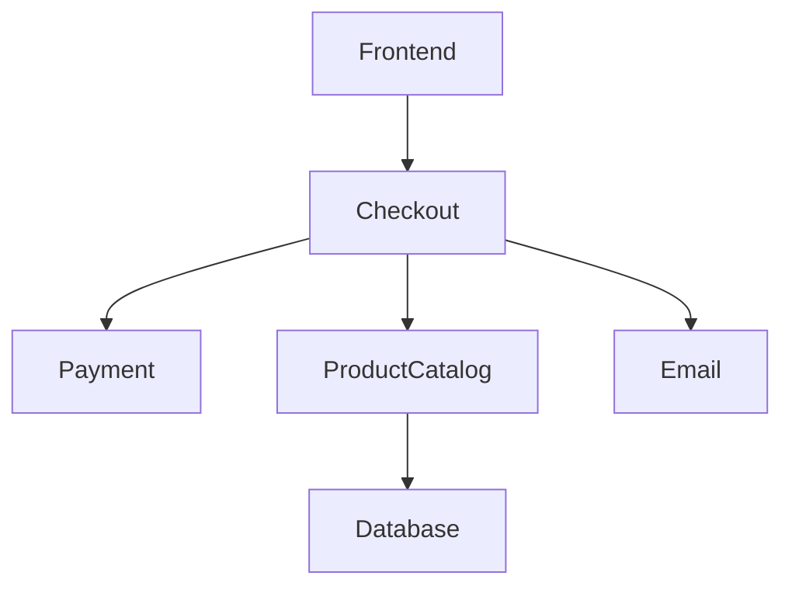

## Understanding Microservices

### What Are Microservices?

Microservices are a design approach to building applications as a collection of small, independent services that communicate with each other through well-defined APIs. Each microservice is responsible for a specific business function and can be developed, deployed, and scaled independently. This architecture contrasts with monolithic applications, where all components are tightly coupled and run as a single unit.

### Why Use Microservices?

The primary benefits of microservices include:

1. **Scalability**: Individual services can scale independently based on demand.
2. **Flexibility**: Different teams can work on different services simultaneously without interfering with each other.
3. **Resilience**: A failure in one service does not necessarily bring down the entire system.
4. **Technology Heterogeneity**: Each service can be built using the most appropriate technology stack for its specific requirements.

### How Microservices Work

In a microservices architecture, services communicate with each other using APIs. These APIs can be synchronous (HTTP, gRPC) or asynchronous (message queues, event streams). Services often rely on external dependencies such as databases, message brokers, and third-party services.

### Example: Online Shop Microservices

Consider an online shop with the following microservices:

- **Email Service**: Sends emails for order confirmations, password resets, etc.
- **Checkout Service**: Handles the checkout process.
- **Payment Service**: Processes payments.
- **Product Catalog Service**: Manages product listings and inventory.

### Dependencies and External Access

#### Internal Dependencies

Each microservice may depend on other services or external systems. For instance:

- The **Checkout Service** might depend on the **Payment Service** to process payments.
- The **Product Catalog Service** might depend on a database to store product information.

#### External Access

One or more services might be accessible externally. In the context of an online shop, the **Frontend Service** is typically the entry point that handles requests from browsers.

### Connection Graph Visualization

To understand how microservices interact, it's useful to create a connection graph. This graph visualizes the dependencies and communication patterns between services.



### Information Source

As a DevOps engineer, you will receive information about the microservices architecture from the development team. Developers have detailed knowledge of how their services work and communicate with each other.

### Real-World Examples

#### Recent Breaches and CVEs

- **CVE-2021-21972**: A vulnerability in the Log4j library affected many microservices-based applications. This highlights the importance of securing external dependencies.
- **SolarWinds Supply Chain Attack (2020)**: Demonstrates the risks associated with third-party services and the need for robust security practices.

### Complete Example: Deployment Process

Let's walk through a complete example of deploying the microservices for an online shop.

#### Step 1: Define the Services

Identify the microservices and their dependencies. For our online shop, we have:

- **Frontend Service**
- **Checkout Service**
- **Payment Service**
- **Product Catalog Service**
- **Database**
- **Message Broker**

#### Step 2: Create the Connection Graph

Visualize the dependencies using a connection graph.


#### Step 3: Deploy the Services

Deploy each microservice independently. Here’s an example deployment script using Docker Compose:

```yaml
version: '3'
services:
  frontend:
    image: myshop/frontend:latest
    ports:
      - "8080:80"
  checkout:
    image: myshop/checkout:latest
    depends_on:
      - payment
      - productcatalog
      - email
  payment:
    image: myshop/payment:latest
  productcatalog:
    image: myshop/productcatalog:latest
    depends_on:
      - database
  database:
    image: postgres:latest
    environment:
      POSTGRES_PASSWORD: mysecretpassword
  email:
    image: myshop/email:latest
```

#### Step 4: Configure Communication

Ensure that services can communicate with each other. For example, the **Checkout Service** needs to call the **Payment Service**.

```http
POST /api/payment/process HTTP/1.1
Host: payment-service
Content-Type: application/json

{
  "amount": 100,
  "currency": "USD",
  "card_number": "4111111111111111"
}
```

Response:

```http
HTTP/1.1 200 OK
Content-Type: application/json

{
  "status": "success",
  "transaction_id": "TX123456"
}
```

### Pitfalls and Best Practices

#### Common Mistakes

- **Over-Engineering**: Avoid creating too many microservices, which can lead to unnecessary complexity.
- **Under-Engineering**: Ensure that each microservice is sufficiently decoupled and can be developed independently.
- **Security Risks**: Neglecting to secure external dependencies and third-party services can lead to vulnerabilities.

#### Best Practices

- **Service Isolation**: Ensure that each service is isolated and can fail independently.
- **API Versioning**: Use versioning to manage changes in APIs without breaking existing clients.
- **Continuous Integration/Continuous Deployment (CI/CD)**: Implement automated testing and deployment pipelines to ensure consistency and reliability.

### How to Prevent / Defend

#### Detection

- **Logging and Monitoring**: Implement comprehensive logging and monitoring to detect anomalies and potential security issues.
- **Security Scanning**: Regularly scan your services and dependencies for known vulnerabilities.

#### Prevention

- **Secure Coding Practices**: Follow secure coding guidelines to prevent common vulnerabilities such as SQL injection and cross-site scripting (XSS).
- **Dependency Management**: Keep track of external dependencies and update them regularly to patch known vulnerabilities.

#### Secure Code Fix

Here’s an example of a vulnerable code snippet and its secure counterpart:

**Vulnerable Code:**

```python
import sqlite3

def get_user_details(user_id):
    conn = sqlite3.connect('database.db')
    cursor = conn.cursor()
    cursor.execute(f"SELECT * FROM users WHERE id = {user_id}")
    result = cursor.fetchone()
    conn.close()
    return result
```

**Secure Code:**

```python
import sqlite3

def get_user_details(user_id):
    conn = sqlite3.connect('database.db')
    cursor = conn.cursor()
    cursor.execute("SELECT * FROM users WHERE id = ?", (user_id,))
    result = cursor.fetchone()
    conn.close()
    return result
```

### Hands-On Labs

For practical experience with microservices deployment, consider the following labs:

- **PortSwigger Web Security Academy**: Offers exercises on securing web applications.
- **OWASP Juice Shop**: A deliberately insecure web app for practicing security skills.
- **DVWA (Damn Vulnerable Web Application)**: A PHP/MySQL web application that demonstrates web application vulnerabilities.

By following these steps and best practices, you can effectively deploy and manage microservices in a secure and scalable manner.

---
<!-- nav -->
[[10-Service Ports in Microservices|Service Ports in Microservices]] | [[DevOps/DevOps Bootcamp/01-Linux & OS Basics/04-Microservices Deployment Process Overview/00-Overview|Overview]] | [[DevOps/DevOps Bootcamp/01-Linux & OS Basics/04-Microservices Deployment Process Overview/12-Practice Questions & Answers|Practice Questions & Answers]]
