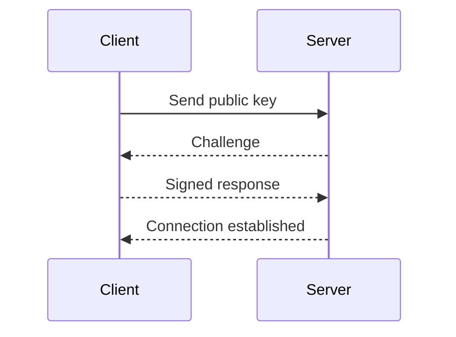

## Secure Shell Concepts and Usage

### Introduction to Secure Shell (SSH)

Secure Shell (SSH) is a cryptographic network protocol used for secure data communication, remote command-line login, and other secure network services between two networked computers. It provides a secure channel over an unsecured network in a client-server architecture, connecting a local client to a remote host. SSH is widely used for managing systems remotely and securely transferring files.

### User Authentication via Passwords

Traditionally, user authentication over SSH involves entering a username and password. While this method is straightforward, it has several drawbacks:

1. **Security Risks**: Passwords can be stolen through various means such as phishing attacks, brute-force attacks, or keylogging.
2. **Usability Issues**: Repeatedly entering passwords can be cumbersome and may lead to users choosing weak passwords for convenience.

### SSH Key-Based Authentication

To address these issues, SSH supports key-based authentication, which is more secure and convenient. In this method, a client machine generates a pair of cryptographic keys: a public key and a private key.

#### Key Generation

The SSH key pair is generated using cryptographic algorithms like RSA or Ed25519. Here’s a step-by-step process of generating an SSH key pair:

1. **Generate the Key Pair**:
    ```bash
    ssh-keygen -t rsa -b 4096 -C "your_email@example.com"
    ```
    This command generates an RSA key pair with a bit length of 4096 and adds a comment (email) for identification.

2. **Store the Private Key**:
    The private key (`id_rsa`) is stored securely on the client machine. It should never be shared with anyone else.

3. **Public Key Distribution**:
    The public key (`id_rsa.pub`) is distributed to the remote server. This can be done manually or using the `ssh-copy-id` command:
    ```bash
    ssh-copy-id user@remote_host
    ```

#### How SSH Key-Based Authentication Works

When a client attempts to connect to a remote server using SSH key-based authentication, the following steps occur:

1. **Client Sends Public Key**:
    The client sends its public key to the server.
2. **Server Verifies Public Key**:
    The server checks if the public key is authorized to access the account.
3. **Challenge Response**:
    If the public key is valid, the server sends a challenge to the client.
4. **Client Responds**:
    The client uses its private key to sign the challenge and sends the signed response back to the server.
5. **Server Validates Response**:
    The server verifies the signed response using the public key. If the signature is valid, the connection is established.

### Mermaid Diagram: SSH Key-Based Authentication Flow



### Security Implications of SSH Key-Based Authentication

Key-based authentication offers several security advantages over password-based authentication:

1. **Stronger Encryption**: SSH keys provide stronger encryption compared to passwords.
2. **Resistance to Brute-Force Attacks**: Unlike passwords, SSH keys are much harder to guess or brute-force.
3. **No Password Transmission**: The private key is never transmitted over the network, reducing the risk of interception.

### Recent Real-World Examples

Several high-profile breaches have highlighted the importance of secure SSH configurations:

1. **CVE-2021-21547**: A vulnerability in the OpenSSH server allowed attackers to bypass authentication mechanisms. This underscores the importance of keeping SSH software up-to-date.
2. **SolarWinds Breach (2020)**: Attackers exploited weak SSH configurations to gain unauthorized access to networks. This incident emphasizes the need for robust SSH key management practices.

### Pitfalls and Common Mistakes

Despite its benefits, SSH key-based authentication can still be misused or configured incorrectly:

1. **Weak Key Lengths**: Using short key lengths (less than 2048 bits) can make keys vulnerable to attacks.
2. **Improper Key Storage**: Storing private keys insecurely (e.g., on a shared drive) can expose them to unauthorized access.
3. **Lack of Key Rotation**: Not rotating keys periodically can leave systems vulnerable to compromised keys.

### How to Prevent / Defend

#### Detection

1. **Audit SSH Configurations**: Regularly audit SSH configurations to ensure compliance with security policies.
2. **Monitor SSH Logs**: Monitor SSH logs for suspicious activities, such as repeated failed login attempts.

#### Prevention

1. **Use Strong Key Lengths**: Generate SSH keys with strong lengths (e.g., 4096 bits).
2. **Secure Key Storage**: Store private keys securely, preferably on encrypted drives or hardware security modules (HSMs).
3. **Key Rotation**: Rotate SSH keys regularly to minimize the risk of compromise.

#### Secure Coding Fixes

Here’s an example of a vulnerable SSH configuration and its secure counterpart:

**Vulnerable Configuration**:
```yaml
# Vulnerable SSHD configuration
PermitRootLogin yes
PasswordAuthentication yes
PubkeyAuthentication no
```

**Secure Configuration**:
```yaml
# Secure SSHD configuration
PermitRootLogin no
PasswordAuthentication no
PubkeyAuthentication yes
```

### Complete Example: SSH Key-Based Authentication

#### Generating SSH Keys

```bash
ssh-keygen -t rsa -b 4096 -C "your_email@example.com"
```

#### Copying Public Key to Remote Server

```bash
ssh-copy-id user@remote_host
```

#### Full SSH Request and Response

**Request**:
```http
POST /ssh/login HTTP/1.1
Host: remote_host
Authorization: SSH-Key your_public_key
Content-Type: application/json

{
  "username": "user",
  "private_key": "your_private_key"
}
```

**Response**:
```http
HTTP/1.1 200 OK
Date: Mon, 20 Mar 2023 12:00:00 GMT
Content-Type: application/json

{
  "message": "Connection established",
  "session_id": "abc123"
}
```

### Hands-On Labs

For practical experience with SSH key-based authentication, consider the following labs:

- **PortSwigger Web Security Academy**: Offers interactive labs on SSH and other security topics.
- **OWASP Juice Shop**: Provides a vulnerable web application environment for learning security concepts.
- **DVWA (Damn Vulnerable Web Application)**: A deliberately insecure web application for practicing penetration testing.

By mastering SSH key-based authentication, you can significantly enhance the security and usability of remote system management tasks.

---
<!-- nav -->
[[01-Introduction to Secure Shell (SSH)|Introduction to Secure Shell (SSH)]] | [[DevOps/DevOps Bootcamp/01-Linux & OS Basics/05-Secure Shell Concepts And Usage/00-Overview|Overview]] | [[DevOps/DevOps Bootcamp/01-Linux & OS Basics/05-Secure Shell Concepts And Usage/03-Practice Questions & Answers|Practice Questions & Answers]]
