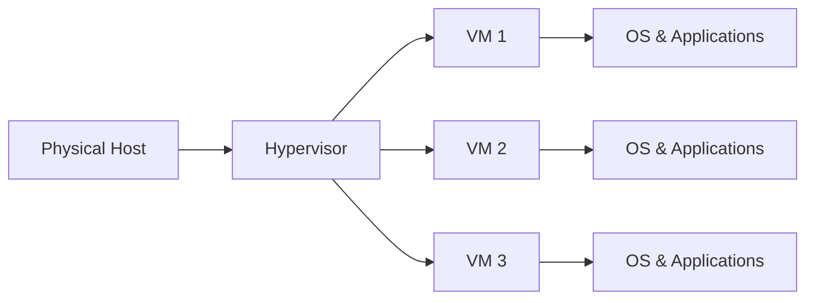
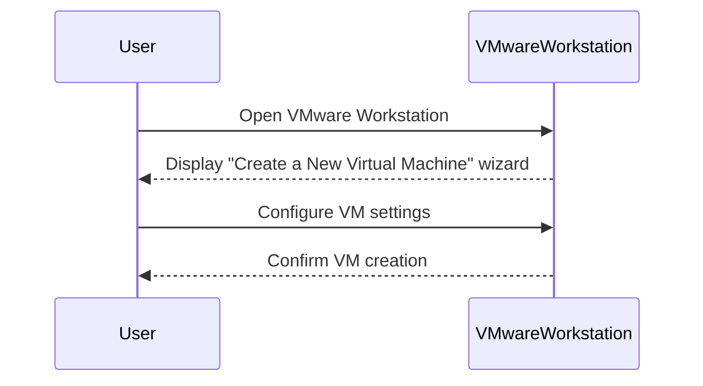
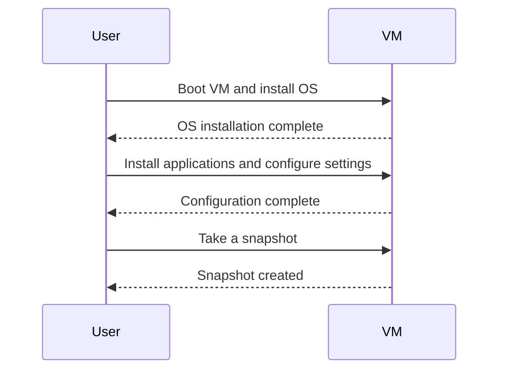

## Introduction to Virtual Machines and Virtualization Concepts

Virtualization is a technology that allows the creation of multiple virtual machines (VMs) on a single physical host. Each VM operates independently and can run its own operating system (OS) and applications, making it a powerful tool for managing resources efficiently and providing flexibility in IT environments. This chapter delves into the concepts of virtualization, the benefits it offers, and how it can be effectively utilized in modern DevOps practices.

### What is Virtualization?

Virtualization is the process of creating a virtual version of something, such as a hardware platform, operating system, storage device, or network resource. In the context of computing, virtualization typically refers to the creation of virtual machines (VMs) that emulate the behavior of physical computers. These VMs can run their own OS and applications, just like a physical computer, but they exist within a software layer that abstracts them from the underlying hardware.

#### Why Virtualization Matters

Virtualization offers several key benefits:

1. **Resource Efficiency**: By allowing multiple VMs to run on a single physical host, virtualization maximizes the use of hardware resources, reducing costs and improving efficiency.
   
2. **Flexibility and Scalability**: VMs can be easily created, cloned, moved, and deleted, providing flexibility in managing IT resources. This is particularly valuable in dynamic environments where demands can change rapidly.
   
3. **Isolation and Security**: Each VM operates independently, isolating applications and data from one another. This isolation enhances security by containing potential vulnerabilities and minimizing the impact of failures.

4. **Disaster Recovery and Backup**: VMs can be backed up and restored quickly, making disaster recovery more efficient and reliable.

### How Virtualization Works

Virtualization relies on a hypervisor, which is a software layer that manages and allocates the physical resources of the host machine among the VMs. There are two main types of hypervisors:

1. **Type 1 Hypervisors (Bare-Metal)**: These hypervisors run directly on the host's hardware and manage the VMs. Examples include VMware ESXi, Microsoft Hyper-V, and KVM (Kernel-based Virtual Machine).

2. **Type 2 Hypervisors (Hosted)**: These hypervisors run on top of a host OS and manage the VMs. Examples include VMware Workstation, Oracle VirtualBox, and Parallels Desktop.

#### Virtual Machine Images

A virtual machine image is a file that contains the entire state of a VM, including the OS, applications, configurations, and data. This file can be stored on a disk and moved between different hosts, making it highly portable. The most common formats for VM images include VMDK (VMware Disk Format), VHD (Virtual Hard Disk), and QCOW2 (QEMU Copy-On-Write Version 2).

### Benefits of Virtualization

#### Resource Efficiency

In traditional non-virtualized environments, each application or service often requires its own dedicated physical server. This leads to underutilization of resources, as servers may not be fully utilized at all times. Virtualization addresses this issue by consolidating multiple VMs onto a single physical host, maximizing resource utilization.

#### Flexibility and Scalability

Virtualization provides unparalleled flexibility in managing IT resources. VMs can be easily created, cloned, moved, and deleted, allowing organizations to respond quickly to changing demands. This is particularly valuable in DevOps environments where rapid deployment and scaling are essential.

#### Isolation and Security

Each VM operates independently, isolated from other VMs on the same host. This isolation enhances security by containing potential vulnerabilities and minimizing the impact of failures. For example, if one VM is compromised, the attacker cannot easily access other VMs on the same host.

#### Disaster Recovery and Backup

VMs can be backed up and restored quickly, making disaster recovery more efficient and reliable. Snapshots, which are point-in-time copies of a VM’s state, can be taken and used to restore the VM to a previous state if needed.

### Real-World Examples

#### Recent Breaches and CVEs

One notable example of the importance of virtualization in enhancing security is the Equifax breach in 2017. The breach was caused by a vulnerability in Apache Struts, which allowed attackers to gain unauthorized access to sensitive data. Had the affected systems been properly isolated using virtualization, the impact of the breach might have been minimized.

Another example is the SolarWinds supply chain attack in 2020, where attackers compromised the build environment of SolarWinds Orion software, inserting malicious code into updates. Properly isolated and managed VMs could have helped contain the spread of the malware.

### Complete Example: Creating a Virtual Machine Image

Let's walk through the process of creating a virtual machine image using VMware Workstation as an example.

#### Step 1: Install VMware Workstation

First, download and install VMware Workstation on your host machine. Ensure you have the necessary permissions and resources to run the software.

#### Step 2: Create a New Virtual Machine

Open VMware Workstation and select "Create a New Virtual Machine." Follow the wizard to configure the new VM:

- **Name and Location**: Choose a name and location for the VM.
- **Operating System**: Select the type and version of the OS you want to install.
- **Disk Type**: Choose whether to create a new virtual disk or use an existing one.
- **Memory and CPU**: Allocate the appropriate amount of memory and CPU resources.

#### Step 3: Install the Operating System

Boot the VM and install the chosen OS. Follow the installation steps to set up the OS and any necessary configurations.

#### Step 4: Install Applications and Configure Settings

Once the OS is installed, install any required applications and configure the settings as needed. This might include setting up Jenkins, configuring web browsers, and installing development tools.

#### Step 5: Take a Snapshot

After the VM is fully configured, take a snapshot to save the current state. This snapshot can be used to restore the VM to this state if needed.

### Common Pitfalls and Best Practices

#### Over-Provisioning Resources

One common pitfall is over-provisioning resources, such as allocating too much memory or CPU to VMs. This can lead to performance issues and inefficient use of resources. To avoid this, carefully monitor and adjust resource allocations based on actual usage patterns.

#### Security Risks

While virtualization enhances security through isolation, it also introduces new risks. For example, vulnerabilities in the hypervisor can be exploited to compromise multiple VMs. To mitigate these risks, ensure that the hypervisor and all VMs are kept up-to-date with the latest security patches.

### How to Prevent / Defend

#### Detection and Prevention

Regularly monitor the health and performance of VMs and the hypervisor. Use tools like VMware vCenter to manage and monitor VMs, and ensure that security policies are enforced across all VMs.

#### Secure Coding Fixes

When configuring VMs, follow secure coding practices. For example, ensure that all applications and services are configured securely, and use strong authentication mechanisms.

#### Configuration Hardening

Harden the configuration of both the hypervisor and the VMs. Disable unnecessary services, apply security patches promptly, and use firewalls to control traffic between VMs.

#### Mitigations

Implement robust backup and disaster recovery plans. Regularly test these plans to ensure they work as expected. Use snapshots to quickly restore VMs to a known good state.

### Conclusion

Virtualization is a powerful technology that offers numerous benefits, including resource efficiency, flexibility, isolation, and disaster recovery. By understanding the concepts and best practices of virtualization, organizations can effectively leverage this technology to enhance their IT operations and security.

### Practice Labs

For hands-on experience with virtualization, consider the following labs:

- **VMware Workstation**: VMware offers comprehensive documentation and tutorials for setting up and managing VMs.
- **Oracle VirtualBox**: VirtualBox provides a free and open-source alternative for creating and managing VMs.
- **CloudGoat**: While primarily focused on cloud security, CloudGoat includes scenarios that involve virtualization and can provide practical experience in managing VMs in a cloud environment.

By engaging with these labs, you can gain practical experience in creating, managing, and securing virtual machines, further solidifying your understanding of virtualization concepts.

---
<!-- nav -->
[[DevOps/DevOps Bootcamp/01-Linux & OS Basics/06-Virtual Machines and Virtualization Concepts/00-Overview|Overview]] | [[02-Introduction to Virtualization and Virtual Machines|Introduction to Virtualization and Virtual Machines]]
