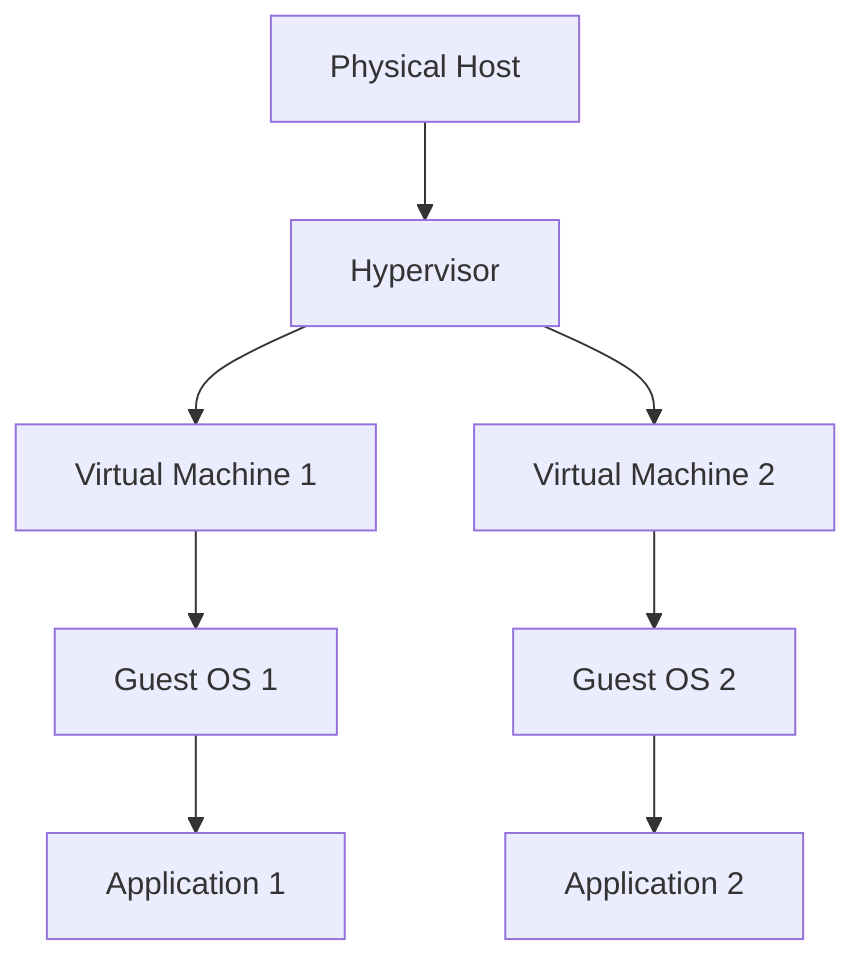

## Introduction to Virtualization and Virtual Machines

Virtualization is a fundamental concept in modern computing that allows us to create and manage multiple virtual environments on a single physical host. This technology has revolutionized the way we deploy and manage applications, making it possible to run multiple operating systems and applications on a single piece of hardware. In this section, we will delve deep into the concept of virtualization, focusing specifically on virtual machines (VMs).

### What is a Virtual Machine?

A virtual machine is a software-based emulation of a physical computer. It provides a complete, isolated environment that behaves exactly like a physical computer, but it runs within another operating system. The virtual machine has its own virtual hardware, including a virtual CPU, memory, storage, and network interfaces. These virtual components are allocated from the physical resources of the host machine.

#### Example: Running Linux on Windows

Imagine you have a Windows computer with hardware components such as CPU, RAM, and storage. On top of this hardware, you have the Windows operating system (OS) that manages how applications interact with these hardware resources. Applications running on Windows communicate with the OS to access the underlying hardware.

Now, suppose you want to use Linux for some tasks, either for work or to learn a new operating system. Traditionally, you would need a separate physical machine with hardware resources and a Linux OS installed. However, with virtualization, you can create a virtual machine that runs Linux on top of your existing Windows OS. This means you can have both Windows and Linux running simultaneously on the same physical hardware.

### Why Use Virtual Machines?

Virtual machines offer several advantages:

1. **Resource Efficiency**: Multiple VMs can share the same physical resources, leading to better utilization of hardware.
2. **Isolation**: Each VM operates independently, ensuring that issues in one VM do not affect others.
3. **Portability**: VMs can be easily moved between different physical hosts.
4. **Testing and Development**: Developers can test applications in different environments without needing multiple physical machines.
5. **Cost Savings**: Reduces the need for multiple physical servers, lowering hardware costs.

### How Virtual Machines Work

To understand how virtual machines work, we need to look at the architecture of a virtualized environment. There are two key components:

1. **Hypervisor**: A hypervisor is a software layer that creates and manages virtual machines. It allocates physical resources to VMs and ensures that they operate independently.
2. **Guest Operating System**: The guest OS is the operating system running inside the virtual machine. It interacts with the virtual hardware provided by the hypervisor.

#### Types of Hypervisors

There are two types of hypervisors:

1. **Type 1 (Bare-Metal) Hypervisors**: These hypervisors run directly on the host's hardware. Examples include VMware ESXi and Microsoft Hyper-V.
2. **Type 2 (Hosted) Hypervisors**: These hypervisors run on top of a host operating system. Examples include Oracle VirtualBox and VMware Workstation.

### Creating a Virtual Machine Using VirtualBox

Let's walk through the process of creating a Linux virtual machine on a Windows host using VirtualBox, a popular open-source hypervisor.

#### Step-by-Step Guide

1. **Install VirtualBox**:
   - Download and install VirtualBox from the official website: https://www.virtualbox.org/wiki/Downloads
   - Follow the installation wizard to complete the setup.

2. **Create a New Virtual Machine**:
   - Open VirtualBox and click on "New" to create a new VM.
   - Enter a name for the VM (e.g., "LinuxVM").
   - Choose the type of operating system (Linux) and the version (e.g., Ubuntu 64-bit).
   - Allocate memory (RAM) to the VM. A minimum of 2GB is recommended for most Linux distributions.
   - Create a virtual hard disk. Choose "VDI" as the file type and "Dynamically allocated" as the storage type. Allocate a sufficient amount of storage (e.g., 20GB).

3. **Configure the Virtual Machine**:
   - After creating the VM, go to the settings and configure the network adapter. Choose "NAT" for basic internet connectivity.
   - Under the "Storage" tab, attach an ISO image of the Linux distribution you want to install (e.g., Ubuntu ISO).

4. **Start the Virtual Machine**:
   - Click on "Start" to boot the VM. The installation process will begin, similar to installing Linux on a physical machine.
   - Follow the prompts to complete the installation.

5. **Access the Virtual Machine**:
   - Once the installation is complete, you can start the VM and access the Linux operating system.

### Mermaid Diagram: Virtual Machine Architecture



### Real-World Examples and Recent Breaches

Virtualization has been widely adopted in various industries, but it also comes with security risks. Here are some recent examples:

1. **CVE-2021-21972**: This vulnerability affected VMware ESXi, a Type 1 hypervisor. An attacker could exploit this flaw to execute arbitrary code on the host system. This highlights the importance of keeping hypervisors up-to-date with the latest security patches.

2. **Cloudflare Incident (2020)**: Cloudflare experienced a breach where an attacker gained access to a virtual machine running on their infrastructure. This incident underscores the need for robust isolation and monitoring of virtual environments.

### How to Prevent / Defend Against Virtualization Risks

#### Detection

1. **Monitoring Tools**: Use tools like VMware vCenter or Microsoft SCVMM to monitor the health and security of virtual machines.
2. **Security Information and Event Management (SIEM)**: Implement SIEM solutions to detect and respond to security events in real-time.

#### Prevention

1. **Patch Management**: Regularly update hypervisors and guest operating systems to address known vulnerabilities.
2. **Network Segmentation**: Isolate virtual machines on different networks to limit the spread of attacks.
3. **Secure Configuration**: Follow best practices for securing virtual machines, such as disabling unnecessary services and enabling firewalls.

#### Secure Coding Fixes

Here’s an example of how to securely configure a virtual machine using a configuration management tool like Ansible:

```yaml
---
- name: Configure Virtual Machine
  hosts: vm_host
  become: yes

  tasks:
    - name: Update packages
      apt:
        upgrade: yes
        autoclean: yes
        autoremove: yes

    - name: Install necessary packages
      apt:
        name: "{{ item }}"
        state: present
      loop:
        - openssh-server
        - ufw

    - name: Enable firewall
      ufw:
        state: enabled
        default: deny
        rules:
          - rule: allow
            port: 22
            proto: tcp
```

### Complete Example: Full HTTP Request and Response

While virtualization does not typically involve HTTP requests, we can consider an example where a virtual machine is accessed via a web interface. Here’s a complete HTTP request and response:

```http
GET /api/vm/status HTTP/1.1
Host: localhost:8080
User-Agent: curl/7.64.1
Accept: */*
Authorization: Bearer <token>

HTTP/1.1 200 OK
Date: Mon, 20 Mar 2023 12:00:00 GMT
Content-Type: application/json
Content-Length: 123
Connection: keep-alive

{
  "status": "running",
  "cpu_usage": "20%",
  "memory_usage": "50%"
}
```

### Pitfalls and Common Mistakes

1. **Over-Provisioning Resources**: Allocating too much CPU or memory to a VM can lead to performance issues on the host.
2. **Ignoring Security Updates**: Failing to patch hypervisors and guest OSes can expose virtual environments to known vulnerabilities.
3. **Poor Network Configuration**: Misconfigured network settings can lead to security risks and performance issues.

### Hands-On Labs

For practical experience with virtualization, consider the following labs:

- **PortSwigger Web Security Academy**: Offers exercises related to web application security, including virtualization concepts.
- **OWASP Juice Shop**: A deliberately insecure web application for practicing web security skills.
- **DVWA (Damn Vulnerable Web Application)**: A PHP/MySQL web application that is riddled with vulnerabilities for educational purposes.

These labs provide a comprehensive learning experience, allowing you to apply the concepts learned in a controlled environment.

### Conclusion

Virtualization is a powerful technology that enables efficient resource utilization and flexible deployment of applications. By understanding the concepts, architecture, and best practices, you can effectively leverage virtual machines in your DevOps workflows. Always ensure that you follow security guidelines to protect your virtual environments from potential threats.

---
<!-- nav -->
[[01-Introduction to Virtual Machines and Virtualization Concepts|Introduction to Virtual Machines and Virtualization Concepts]] | [[DevOps/DevOps Bootcamp/01-Linux & OS Basics/06-Virtual Machines and Virtualization Concepts/00-Overview|Overview]] | [[03-Virtual Machines and Virtualization Concepts|Virtual Machines and Virtualization Concepts]]
