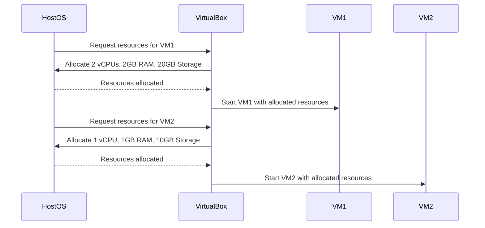
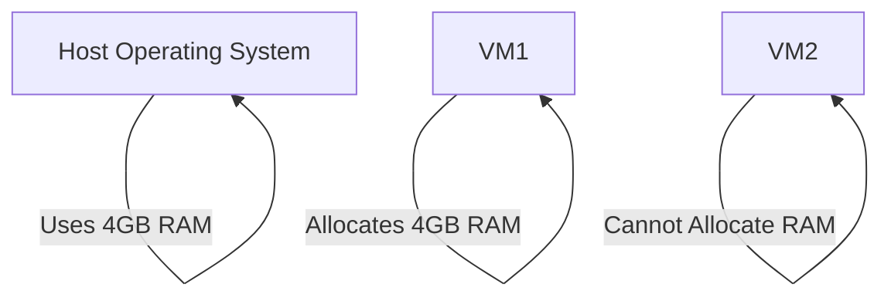

## Virtual Machines and Virtualization Concepts

### Introduction to Virtualization

Virtualization is a powerful technology that enables the creation of multiple virtual machines (VMs) on a single physical host. This allows for efficient resource utilization and provides flexibility in managing computing environments. In essence, virtualization abstracts the underlying hardware, enabling multiple operating systems to run concurrently on the same physical machine.

### What is a Hypervisor?

A **hypervisor** is a software layer that creates and manages virtual machines. It acts as a mediator between the physical hardware and the virtual machines, allocating and managing hardware resources such as CPU, memory, and storage. There are two types of hypervisors:

1. **Type 1 (Bare-Metal Hypervisors)**: These hypervisors run directly on the host's hardware and provide a layer of abstraction between the hardware and the VMs. Examples include VMware ESXi and Microsoft Hyper-V.
2. **Type 2 (Hosted Hypervisors)**: These hypervisors run on top of an existing operating system. They rely on the host OS to manage hardware resources. Examples include Oracle VirtualBox and VMware Workstation.

### Popular Hypervisor: Oracle VirtualBox

One of the most widely used hypervisors is **Oracle VirtualBox**, which is open-source and runs on various operating systems including Windows, macOS, and Linux. VirtualBox allows users to create and manage virtual machines easily.

#### Installing VirtualBox

To install VirtualBox, follow these steps:

1. **Download VirtualBox**: Visit the [Oracle VirtualBox website](https://www.virtualbox.org/) and download the appropriate version for your operating system.
2. **Install VirtualBox**: Run the installer and follow the on-screen instructions to complete the installation process.

#### Creating a Virtual Machine

Once VirtualBox is installed, you can create a new virtual machine by following these steps:

1. **Open VirtualBox**: Launch the VirtualBox application.
2. **Create a New VM**: Click on "New" to start creating a new virtual machine.
3. **Name and Type**: Enter a name for your VM and select the type of operating system you want to install (e.g., Windows, Linux).
4. **Memory Size**: Allocate memory (RAM) for your VM. Ensure that the allocated memory does not exceed the available physical memory on your host machine.
5. **Hard Disk**: Choose whether to create a new virtual hard disk or use an existing one. Specify the size and type of the virtual hard disk.
6. **Finish Setup**: Complete the setup process by clicking "Create."

### Resource Allocation in Virtual Machines

When creating a virtual machine, it is crucial to allocate hardware resources effectively. The primary resources managed by a hypervisor include:

- **CPU**: Virtual CPUs (vCPUs) are allocated to VMs. The number of vCPUs should not exceed the physical CPU cores available on the host machine.
- **Memory (RAM)**: Memory is allocated to VMs based on their requirements. The total allocated memory should not exceed the physical memory available on the host machine.
- **Storage**: Virtual disks are created to store data for VMs. The size of the virtual disk should be carefully planned based on the expected usage.

#### Example: Allocating Resources in VirtualBox

Here is an example of allocating resources in VirtualBox:

### Limitations of Resource Allocation

It is important to understand the limitations of resource allocation in virtual machines. For instance, if the host machine has 8GB of RAM and the host OS is using 4GB, you can only allocate up to 4GB of RAM to VMs. If you allocate 4GB to one VM, you cannot allocate additional RAM to another VM.

#### Example: Resource Exhaustion

Consider a scenario where a host machine has 8GB of RAM:

In this case, if VM1 is allocated 4GB of RAM, there is no remaining RAM to allocate to VM2.

### Benefits of Virtualization

Virtualization offers several benefits, including:

- **Resource Efficiency**: Multiple VMs can share the same physical hardware, leading to better resource utilization.
- **Flexibility**: VMs can be easily created, cloned, and migrated across different physical hosts.
- **Isolation**: Each VM operates independently, providing isolation between different applications and environments.
- **Cost Savings**: Reduces the need for multiple physical servers, leading to cost savings in hardware and maintenance.

### Real-World Examples of Virtualization

Virtualization is widely used in various industries, including:

- **Cloud Computing**: Providers like Amazon Web Services (AWS), Microsoft Azure, and Google Cloud Platform use virtualization to offer scalable and flexible computing resources.
- **Enterprise Environments**: Large organizations use virtualization to manage their IT infrastructure efficiently, reducing hardware costs and improving resource utilization.
- **Development and Testing**: Developers use virtual machines to test software in different environments without affecting the production environment.

### Pitfalls and Best Practices

While virtualization offers numerous benefits, there are also potential pitfalls to consider:

- **Overcommitting Resources**: Allocating more resources than physically available can lead to performance degradation.
- **Security Risks**: Improperly configured VMs can pose security risks, such as unauthorized access or data breaches.
- **Performance Issues**: Overloading the host machine with too many VMs can result in performance issues.

#### How to Prevent / Defend

To ensure the effective and secure use of virtualization, follow these best practices:

1. **Proper Resource Planning**: Carefully plan the allocation of resources to avoid overcommitting.
2. **Secure Configuration**: Configure VMs securely to prevent unauthorized access and data breaches.
3. **Regular Monitoring**: Monitor the performance of VMs and the host machine to identify and address any issues promptly.

### Conclusion

Virtualization is a powerful technology that enables efficient resource utilization and provides flexibility in managing computing environments. By understanding the concepts of hypervisors and virtual machines, you can effectively leverage virtualization to meet your computing needs.

### Hands-On Labs

For practical experience with virtualization, consider the following labs:

- **PortSwigger Web Security Academy**: Offers hands-on labs to practice web security techniques.
- **OWASP Juice Shop**: A deliberately insecure web application for practicing web security skills.
- **DVWA (Damn Vulnerable Web Application)**: A PHP/MySQL web application that is riddled with vulnerabilities for educational purposes.
- **WebGoat**: An interactive, gamified training application for learning about web security.

These labs provide a comprehensive learning experience and help you master the concepts of virtualization and related technologies.

---
<!-- nav -->
[[02-Introduction to Virtualization and Virtual Machines|Introduction to Virtualization and Virtual Machines]] | [[DevOps/DevOps Bootcamp/01-Linux & OS Basics/06-Virtual Machines and Virtualization Concepts/00-Overview|Overview]] | [[DevOps/DevOps Bootcamp/01-Linux & OS Basics/06-Virtual Machines and Virtualization Concepts/04-Practice Questions & Answers|Practice Questions & Answers]]
