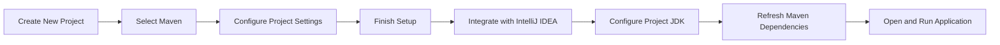
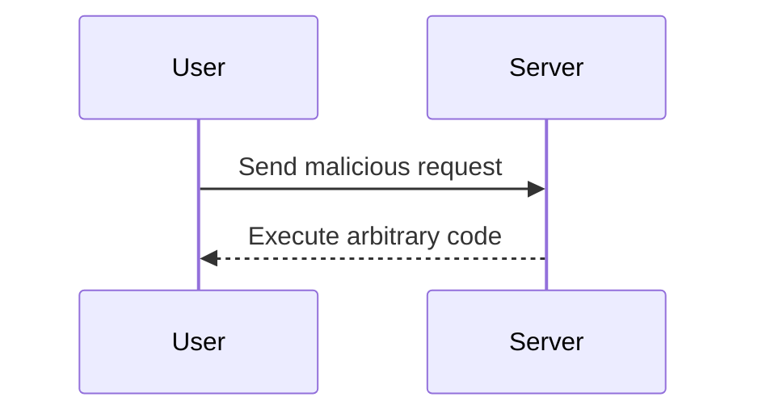

## Introduction to IntelliJ IDEA and Maven Projects

In this section, we will delve into the intricacies of setting up and managing a Maven project within IntelliJ IDEA, a powerful Integrated Development Environment (IDE) widely used for Java development. We'll explore the steps involved in initializing a Maven project, integrating it with IntelliJ IDEA, and ensuring that all necessary components are correctly configured. This will provide a solid foundation for further development and build processes.

### Setting Up IntelliJ IDEA

IntelliJ IDEA is a popular IDE developed by JetBrains, designed specifically for Java developers. It offers a wide range of features that enhance productivity, including intelligent code completion, on-the-fly error checking, and refactoring capabilities. To get started, ensure that IntelliJ IDEA is installed on your system. You can download it from the JetBrains website.

#### Installing IntelliJ IDEA

1. **Download**: Visit the JetBrains website and download the latest version of IntelliJ IDEA.
2. **Install**: Follow the installation wizard to install IntelliJ IDEA on your system.
3. **Configure**: After installation, configure IntelliJ IDEA according to your preferences. This includes setting up the SDK (Java Development Kit) and other essential settings.

### Initializing a Maven Project

Maven is a popular build automation tool used primarily for Java projects. It simplifies the build process by managing dependencies and providing a standardized directory structure. To initialize a Maven project in IntelliJ IDEA:

1. **Open IntelliJ IDEA**.
2. **Create New Project**:
    - Click on `File` > `New` > `Project`.
    - Select `Maven` from the list of available project types.
    - Click `Next`.

3. **Configure Project Settings**:
    - Enter the Group Id and Artifact Id.
    - Specify the project name and location.
    - Ensure that the `Create from archetype` option is selected.
    - Choose an appropriate archetype (e.g., `maven-archetype-quickstart`).

4. **Finish Setup**:
    - Click `Finish` to create the project.

### Integrating Maven with IntelliJ IDEA

Once the Maven project is created, IntelliJ IDEA automatically integrates it with the necessary tools and configurations. Here’s how the integration works:

1. **Maven Tab**:
    - IntelliJ IDEA provides a dedicated Maven tab that displays the project’s Maven-related information.
    - This tab includes details about Maven plugins, dependencies, and the overall project structure.

2. **Dependency Management**:
    - Maven manages dependencies through the `pom.xml` file, which is automatically recognized by IntelliJ IDEA.
    - Dependencies are displayed in the Maven tab, allowing you to easily manage and update them.

3. **Plugin Management**:
    - Maven plugins are also managed through the `pom.xml` file.
    - IntelliJ IDEA provides a convenient interface to view and manage these plugins.

### Configuring the Project JDK

One of the critical steps in setting up a Maven project in IntelliJ IDEA is configuring the Project JDK. The Project JDK specifies the Java runtime environment that the project will use.

1. **Setting the Project JDK**:
    - Open the `Project Structure` dialog by clicking `File` > `Project Structure`.
    - Navigate to the `Modules` section.
    - Under the `Sources` tab, select the module and specify the Project SDK.

2. **Ensuring Correct Configuration**:
    - Ensure that the specified JDK matches the version required by your project.
    - Incorrect JDK configuration can lead to compilation errors and runtime issues.

### Refreshing Maven Dependencies

Sometimes, it may be necessary to refresh Maven dependencies to ensure that all required libraries are up-to-date. IntelliJ IDEA provides a convenient way to refresh Maven dependencies:

1. **Refreshing Maven**:
    - In the Maven tab, locate the `Refresh` button.
    - Click the `Refresh` button to update the project’s dependencies.

2. **Handling Dependency Conflicts**:
    - IntelliJ IDEA highlights dependency conflicts, making it easier to resolve them.
    - Review the highlighted conflicts and adjust the `pom.xml` file accordingly.

### Opening and Running the Application

Once the project is set up and configured, you can proceed to open and run the application:

1. **Opening the Application**:
    - Navigate to the `src/main/java` directory.
    - Locate the main application class (e.g., `Application.java`).
    - Open the class in the editor.

2. **Running the Application**:
    - Click the `Run` button to execute the application.
    - IntelliJ IDEA compiles the code and runs the application, displaying the output in the console.

### Common Pitfalls and How to Prevent Them

#### Unresolved Dependencies

**Problem**: Unresolved dependencies can cause compilation errors and runtime issues.

**Solution**:
- Ensure that all required dependencies are correctly specified in the `pom.xml` file.
- Use the `Refresh` button in the Maven tab to update dependencies.

```xml
<!-- Example pom.xml -->
<dependencies>
    <dependency>
        <groupId>org.springframework</groupId>
        <artifactId>spring-core</artifactId>
        <version>5.3.10</version>
    </dependency>
</dependencies>
```

#### Incorrect JDK Configuration

**Problem**: Using an incorrect JDK version can lead to compatibility issues.

**Solution**:
- Verify that the specified JDK matches the version required by your project.
- Adjust the Project SDK in the `Project Structure` dialog.



### Real-World Examples and Recent CVEs

#### Example: Spring Framework Vulnerability (CVE-2021-22107)

**Description**: A remote code execution vulnerability in the Spring Framework allowed attackers to execute arbitrary code on the server.

**Impact**: This vulnerability affected applications using the Spring Framework, leading to potential data breaches and unauthorized access.

**Mitigation**:
- Update to the latest version of the Spring Framework.
- Ensure that all dependencies are up-to-date and free from known vulnerabilities.



### Secure Coding Practices

#### Example: SQL Injection Prevention

**Problem**: SQL injection attacks can compromise database integrity and confidentiality.

**Solution**:
- Use parameterized queries to prevent SQL injection.
- Validate user input to ensure it meets expected criteria.

```java
// Vulnerable Code
String query = "SELECT * FROM users WHERE username = '" + username + "'";

// Secure Code
PreparedStatement pstmt = connection.prepareStatement("SELECT * FROM users WHERE username = ?");
pstmt.setString(1, username);
ResultSet rs = pstmt.executeQuery();
```

### Conclusion

In this section, we covered the essential steps for setting up and managing a Maven project within IntelliJ IDEA. We explored the integration of Maven with IntelliJ IDEA, the configuration of the Project JDK, and the refreshing of Maven dependencies. Additionally, we discussed common pitfalls and provided secure coding practices to mitigate potential risks. By following these guidelines, you can ensure a robust and secure development environment for your Java projects.

### Practice Labs

For hands-on practice, consider the following labs:

- **PortSwigger Web Security Academy**: Offers interactive labs for web application security.
- **OWASP Juice Shop**: Provides a vulnerable web application for practicing security testing.
- **DVWA (Damn Vulnerable Web Application)**: Another popular choice for learning web application security.

These labs will help you apply the concepts learned in this section and gain practical experience in securing Java applications.

---
<!-- nav -->
[[DevOps/DevOps Bootcamp/01-Linux & OS Basics/07-Windows File System and Command Line Basics/00-Overview|Overview]] | [[02-Introduction to IntelliJ IDEA and Project Setup|Introduction to IntelliJ IDEA and Project Setup]]
