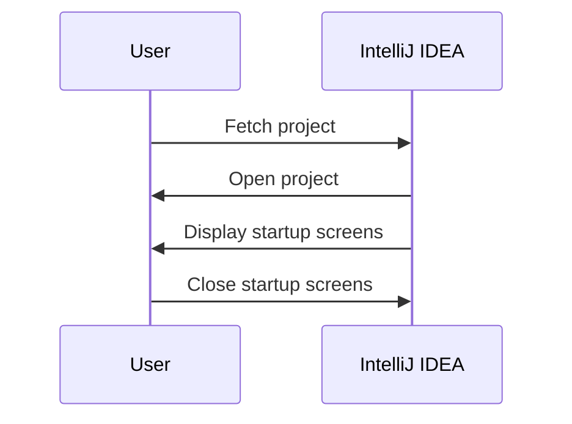
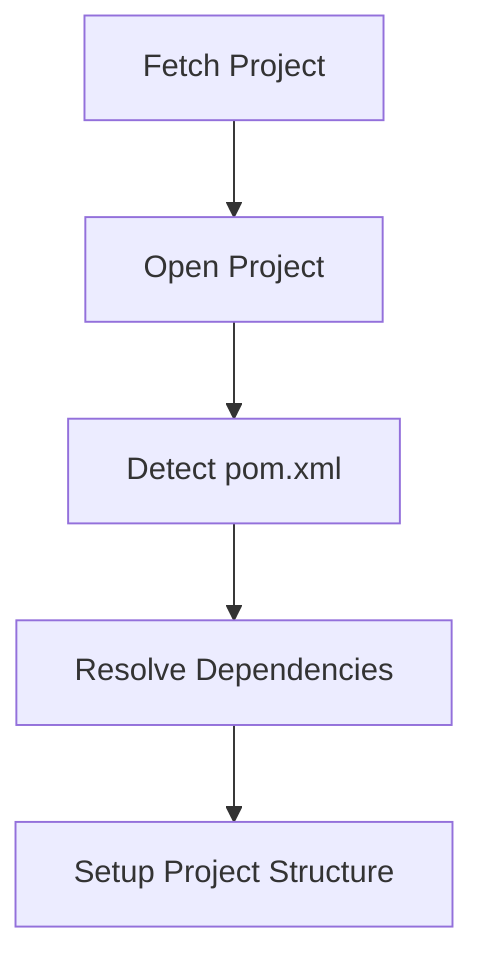
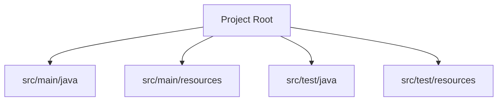

## Introduction to IntelliJ IDEA and Project Setup

### Overview of IntelliJ IDEA

IntelliJ IDEA is a powerful Integrated Development Environment (IDE) primarily used for Java development but also supports other languages such as Kotlin, Scala, Groovy, and more. It is developed by JetBrains and is widely regarded as one of the most advanced IDEs available today. IntelliJ IDEA offers a rich set of features including intelligent code completion, on-the-fly error checking, refactoring tools, and integration with various version control systems.

### Setting Up a Project in IntelliJ IDEA

When you first open a project in IntelliJ IDEA, the IDE performs several tasks to ensure that the project is properly configured and ready for development. This process includes detecting the type of project, resolving dependencies, and setting up the project structure.

#### Opening a Project in IntelliJ IDEA

1. **Fetching the Project**: Before opening the project, IntelliJ IDEA fetches the project files from the repository or local directory.
2. **Opening the Project**: Once the project is fetched, IntelliJ IDEA opens it and displays the project structure.
3. **Startup Screens**: IntelliJ IDEA shows several startup screens with keyboard shortcuts and tips. These can be closed to proceed with the project setup.



### Detecting Project Type and Resolving Dependencies

IntelliJ IDEA automatically detects the type of project based on the presence of certain files and configurations. For a Java Maven project, the IDE looks for a `pom.xml` file, which contains the project's metadata and dependencies.

#### Maven Project Detection

Maven is a build automation tool primarily used for Java projects. It uses a `pom.xml` file to manage project dependencies and build configurations. When IntelliJ IDEA detects a `pom.xml` file, it recognizes the project as a Maven project and proceeds to resolve the dependencies.



### Resolving Dependencies

Once IntelliJ IDEA detects the `pom.xml` file, it starts downloading the required dependencies specified in the file. This ensures that all necessary libraries and frameworks are available for the project.

#### Example `pom.xml` File

Here is an example of a `pom.xml` file:

```xml
<project xmlns="http://maven.apache.org/POM/4.0.0"
         xmlns:xsi="http://www.w3.org/2001/XMLSchema-instance"
         xsi:schemaLocation="http://maven.apache.org/POM/4.0.0 http://maven.apache.org/xsd/maven-4.0.0.xsd">
    <modelVersion>4.0.0</modelVersion>
    <groupId>com.example</groupId>
    <artifactId>example-project</artifactId>
    <version>1.0-SNAPSHOT</version>
    <dependencies>
        <dependency>
            <groupId>org.springframework</groupId>
            <artifactId>spring-core</artifactId>
            <version>5.3.10</version>
        </dependency>
        <dependency>
            <groupId>org.springframework</groupId>
            <artifactId>spring-web</artifactId>
            <version>5.3.10</version>
        </dependency>
    </dependencies>
</project>
```

### Project Structure

After resolving the dependencies, IntelliJ IDEA sets up the project structure. This includes creating directories for source code, resources, and test files. The typical structure for a Maven project is as follows:

- `src/main/java`: Contains the main source code.
- `src/main/resources`: Contains application resources.
- `src/test/java`: Contains test source code.
- `src/test/resources`: Contains test resources.



### Trusting the Project

When you first open a project in IntelliJ IDEA, you may be prompted to trust the project. This is a security measure to ensure that the project does not contain malicious code. By trusting the project, you allow IntelliJ IDEA to perform actions such as resolving dependencies and indexing the codebase.

### Common Pitfalls and How to Prevent Them

#### Unresolved Dependencies

**Problem**: If IntelliJ IDEA fails to resolve dependencies, the project may not compile or run correctly.

**Solution**: Ensure that the `pom.xml` file is correctly formatted and contains valid dependency declarations. Check the internet connection and ensure that the Maven repositories are accessible.

#### Incorrect Project Structure

**Problem**: If the project structure is incorrect, IntelliJ IDEA may not recognize the project as a Maven project.

**Solution**: Verify that the project root contains a `pom.xml` file and that the directory structure matches the standard Maven layout.

### Secure Coding Practices

#### Dependency Management

**Vulnerable Code**:

```xml
<dependency>
    <groupId>org.springframework</groupId>
    <artifactId>spring-core</artifactId>
    <version>5.3.10</version>
</dependency>
```

**Secure Code**:

Ensure that all dependencies are up-to-date and free from known vulnerabilities. Regularly check for updates and patches.

```xml
<dependency>
    <groupId>org.springframework</groupId>
    <artifactId>spring-core</artifactId>
    <version>5.3.15</version>
</dependency>
```

### Real-World Examples

#### CVE-2021-22107

This CVE affects Spring Framework versions prior to 5.3.8. To prevent this vulnerability, ensure that all Spring dependencies are updated to at least version 5.3.8.

### Hands-On Labs

For hands-on practice with IntelliJ IDEA and Maven projects, consider the following labs:

- **PortSwigger Web Security Academy**: Offers exercises on web application security.
- **OWASP Juice Shop**: A deliberately insecure web application for security training.
- **DVWA (Damn Vulnerable Web Application)**: A PHP/MySQL web application that demonstrates web application vulnerabilities.

These labs provide practical experience in setting up and managing projects in IntelliJ IDEA.

### Conclusion

In this section, we covered the basics of setting up a project in IntelliJ IDEA, including project detection, dependency resolution, and project structure. We also discussed common pitfalls and provided secure coding practices to ensure the integrity and security of your projects. By following these guidelines, you can effectively use IntelliJ IDEA for your Java development needs.

---
<!-- nav -->
[[01-Introduction to IntelliJ IDEA and Maven Projects|Introduction to IntelliJ IDEA and Maven Projects]] | [[DevOps/DevOps Bootcamp/01-Linux & OS Basics/07-Windows File System and Command Line Basics/00-Overview|Overview]] | [[03-Introduction to Windows File System and Command Line Basics|Introduction to Windows File System and Command Line Basics]]
