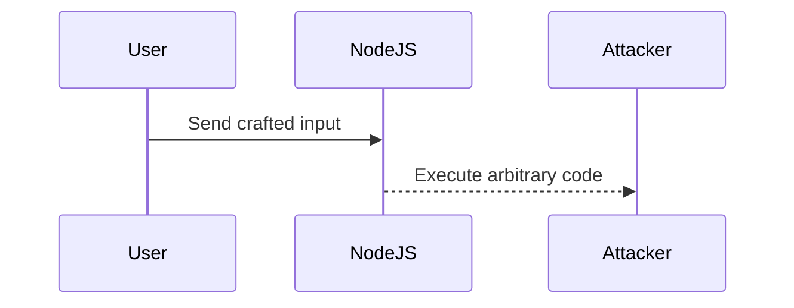
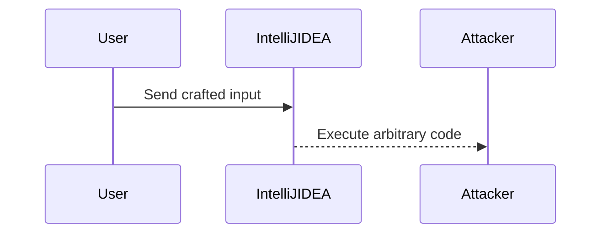

## Introduction to Windows File System and Command Line Basics

In this section, we will delve into the basics of setting up a development environment on a Windows machine, specifically focusing on installing IntelliJ IDEA and Node.js. We will cover the necessary steps, underlying concepts, and provide detailed explanations to ensure a comprehensive understanding.

### Setting Up IntelliJ IDEA on Windows

IntelliJ IDEA is a popular Integrated Development Environment (IDE) used for developing applications in Java and other languages. In this section, we will walk through the process of downloading and installing IntelliJ IDEA Community Edition on a Windows machine.

#### Downloading IntelliJ IDEA

1. **Opening the Browser**: 
   - Open your preferred web browser. For this example, we will use Google Chrome, but any modern browser such as Firefox or Edge will work.
   - Navigate to the JetBrains website, which hosts IntelliJ IDEA. The URL is `https://www.jetbrains.com/idea/download/`.

2. **Selecting the Version**:
   - On the download page, you will see options for different versions of IntelliJ IDEA. For this tutorial, we will choose the **Community Edition**, which is free and sufficient for most development needs.
   - Click on the **Windows** button to download the installer for Windows.

3. **Downloading the Installer**:
   - The download will begin automatically. The size of the installer is approximately 643 MB, so it may take some time depending on your internet connection speed.
   - Once the download is complete, locate the installer in your Downloads folder.

#### Installing IntelliJ IDEA

1. **Running the Installer**:
   - Navigate to the Downloads folder and find the downloaded installer file. Double-click on it to start the installation process.
   - You may be prompted to allow the installer to make changes to your system. Click **Yes** to proceed.

2. **Installation Wizard**:
   - The installation wizard will guide you through the setup process. Click **Next** to proceed to the next step.
   - Choose the installation directory. By default, it will be installed in `C:\Program Files\JetBrains`. You can change this if desired.
   - Continue clicking **Next** until you reach the final screen. Click **Install** to begin the installation process.

3. **Completing the Installation**:
   - Wait for the installation to complete. This may take a few minutes.
   - Once the installation is finished, click **Finish** to close the installer.

### Setting Up Node.js and NPM on Windows

Node.js is a JavaScript runtime built on Chrome's V8 JavaScript engine. It allows developers to run JavaScript on the server-side. NPM (Node Package Manager) is a package manager for Node.js that helps manage dependencies and packages.

#### Downloading Node.js

1. **Navigating to the Node.js Website**:
   - Open your web browser and navigate to the Node.js website at `https://nodejs.org/en/download/`.
   - On the download page, you will see options for different operating systems. Select the **Windows Installer**.

2. **Downloading the Installer**:
   - Click on the **Windows Installer** link to download the installer. The size of the installer is relatively small, so the download should be quick.
   - Once the download is complete, locate the installer in your Downloads folder.

#### Installing Node.js

1. **Running the Installer**:
   - Navigate to the Downloads folder and find the downloaded installer file. Double-click on it to start the installation process.
   - You may be prompted to allow the installer to make changes to your system. Click **Yes** to proceed.

2. **Installation Wizard**:
   - The installation wizard will guide you through the setup process. Click **Next** to proceed to the next step.
   - Choose the installation directory. By default, it will be installed in `C:\Program Files\nodejs`. You can change this if desired.
   - Continue clicking **Next** until you reach the final screen. Click **Install** to begin the installation process.

3. **Completing the Installation**:
   - Wait for the installation to complete. This may take a few minutes.
   - Once the installation is finished, click **Finish** to close the installer.

### Verifying the Installation

To verify that both IntelliJ IDEA and Node.js have been installed correctly, you can check their versions from the command line.

#### Checking IntelliJ IDEA Version

1. **Opening the Command Prompt**:
   - Press `Win + R` to open the Run dialog box.
   - Type `cmd` and press Enter to open the Command Prompt.

2. **Running IntelliJ IDEA**:
   - Type `idea64.exe` and press Enter to launch IntelliJ IDEA.
   - Check the version by navigating to `Help > About` within IntelliJ IDEA.

#### Checking Node.js and NPM Versions

1. **Opening the Command Prompt**:
   - Press `Win + R` to open the Run dialog box.
   - Type `cmd` and press Enter to open the Command Prompt.

2. **Checking Node.js Version**:
   - Type `node -v` and press Enter. This will display the version of Node.js installed on your system.

3. **Checking NPM Version**:
   - Type `npm -v` and press Enter. This will display the version of NPM installed on your system.

### Common Pitfalls and How to Prevent Them

#### Incorrect Installation Path

**Problem**: If you choose an incorrect installation path, it may lead to issues with finding the installed software.

**Solution**: Always ensure that the installation path is correct and accessible. Use the default path unless you have a specific reason to change it.

#### Missing Environment Variables

**Problem**: If environment variables are not set correctly, you may encounter issues running commands from the command line.

**Solution**: Ensure that the installation path is added to the system's PATH environment variable. This can be done during the installation process or manually after installation.

#### Conflicting Software

**Problem**: Having conflicting software installed can cause issues with running Node.js and NPM.

**Solution**: Ensure that there are no conflicting software installations. Uninstall any conflicting software and reinstall Node.js and NPM.

### Real-World Examples and Recent CVEs

#### CVE-2021-2136

**Description**: A vulnerability in Node.js allowed remote attackers to execute arbitrary code via crafted input.

**Impact**: This vulnerability could allow an attacker to gain unauthorized access to a system and execute malicious code.

**Mitigation**: Ensure that you are using the latest version of Node.js and keep it updated to the latest security patches.

#### CVE-2022-21456

**Description**: A vulnerability in IntelliJ IDEA allowed remote attackers to execute arbitrary code via crafted input.

**Impact**: This vulnerability could allow an attacker to gain unauthorized access to a system and execute malicious code.

**Mitigation**: Ensure that you are using the latest version of IntelliJ IDEA and keep it updated to the latest security patches.

### Hands-On Labs

For practical experience with setting up a development environment on Windows, consider the following labs:

- **PortSwigger Web Security Academy**: Offers hands-on labs for web application security.
- **OWASP Juice Shop**: A deliberately insecure web application for security training.
- **DVWA (Damn Vulnerable Web Application)**: A PHP/MySQL web application that is riddled with vulnerabilities for educational purposes.

These labs will help you practice and reinforce the concepts learned in this section.

### Conclusion

In this section, we covered the basics of setting up IntelliJ IDEA and Node.js on a Windows machine. We provided detailed steps, explanations, and real-world examples to ensure a comprehensive understanding. By following these instructions, you should be able to set up a robust development environment on Windows.

---
<!-- nav -->
[[02-Introduction to IntelliJ IDEA and Project Setup|Introduction to IntelliJ IDEA and Project Setup]] | [[DevOps/DevOps Bootcamp/01-Linux & OS Basics/07-Windows File System and Command Line Basics/00-Overview|Overview]] | [[04-Overview of Windows File System and Command Line Basics|Overview of Windows File System and Command Line Basics]]
