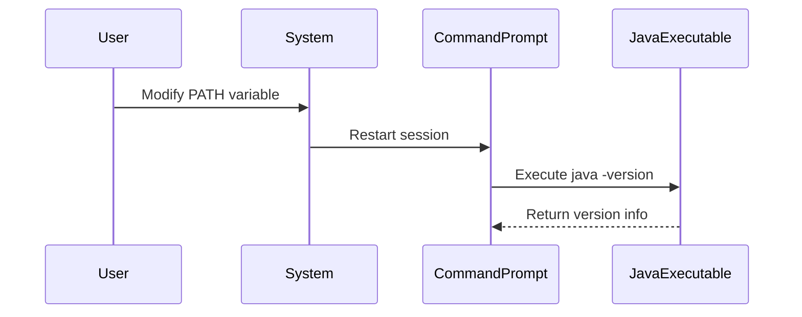

## Understanding the Windows File System and Command Line Basics

### Introduction to the Windows File System

The Windows file system is a hierarchical structure used to organize files and directories on a computer. It is essential to understand the basics of the file system to navigate and manage files effectively. The most commonly used file systems in Windows are NTFS (New Technology File System) and FAT (File Allocation Table).

#### NTFS (New Technology File System)

NTFS is the default file system for Windows operating systems since Windows NT. It provides advanced features such as file permissions, encryption, and support for large volumes. NTFS is designed to handle large amounts of data efficiently and securely.

#### FAT (File Allocation Table)

FAT is an older file system that is less commonly used today but can still be found on removable media like USB drives. FAT supports fewer features compared to NTFS, such as limited file size and no built-in security features.

### Understanding Paths in Windows

In Windows, paths are used to specify the location of files and directories. A path can be either absolute or relative.

#### Absolute Path

An absolute path specifies the complete path from the root directory to the desired file or directory. For example:

```plaintext
C:\Program Files\Java\bin
```

This path starts from the root directory `C:\` and specifies the exact location of the `bin` directory within the `Java` installation.

#### Relative Path

A relative path specifies the location of a file or directory relative to the current working directory. For example:

```plaintext
..\..\bin
```

This path moves up two levels from the current directory and then specifies the `bin` directory.

### Environment Variables in Windows

Environment variables are dynamic values that can affect the way processes run in Windows. One of the most important environment variables is the `PATH`.

#### What is the PATH Variable?

The `PATH` variable is a list of directories where the operating system looks for executable files. When you type a command in the command prompt, Windows searches through the directories listed in the `PATH` variable to find the corresponding executable file.

#### Why is the PATH Important?

The `PATH` variable is crucial because it determines which programs are accessible from the command line. Without the correct entries in the `PATH`, you may encounter errors like "command not recognized."

#### How to Modify the PATH Variable

To modify the `PATH` variable, follow these steps:

1. **Open System Properties**:
    - Right-click on the `Start` button and select `System`.
    - Click on `Advanced system settings` on the left side.
    - Click on `Environment Variables`.

2. **Edit the PATH Variable**:
    - In the `System variables` section, find the `Path` variable and click `Edit`.
    - Click `New` to add a new entry.
    - Enter the full path to the directory containing the executable you want to add (e.g., `C:\Program Files\Java\bin`).

3. **Apply Changes**:
    - Click `OK` to close all dialog boxes.
    - Restart your command prompt session for the changes to take effect.

### Example: Adding Java to the PATH

Let's walk through the process of adding the Java executable to the `PATH` variable.

#### Step-by-Step Guide

1. **Locate the Java Executable**:
    - Find the directory where the `java.exe` file is located. Typically, this is in the `bin` directory of the Java installation.

2. **Add the Directory to the PATH**:
    - Follow the steps outlined above to add the directory to the `PATH` variable.

3. **Verify the Change**:
    - Open a new command prompt session and type `java -version`. If the change was successful, you should see the version information for Java.

#### Full Example

Here is a detailed example of adding the Java executable to the `PATH`:

1. **Locate the Java Executable**:
    - Suppose the `java.exe` file is located at `C:\Program Files\Java\jdk-17.0.1\bin`.

2. **Add the Directory to the PATH**:
    - Open `System Properties` and go to `Environment Variables`.
    - In the `System variables` section, find the `Path` variable and click `Edit`.
    - Click `New` and enter `C:\Program Files\Java\jdk-17.0.1\bin`.
    - Click `OK` to close all dialog boxes.

3. **Verify the Change**:
    - Open a new command prompt session and type `java -version`.

```plaintext
C:\> java -version
java version "17.0.1" 2021-10-19 LTS
Java(TM) SE Runtime Environment (build 17.0.1+12-LTS-39)
Java HotSpot(TM) 64-Bit Server VM (build 17.0.1+12-LTS-39, mixed mode, sharing)
```

### Common Pitfalls and How to Avoid Them

#### Not Restarting the Command Prompt Session

One common mistake is not restarting the command prompt session after modifying the `PATH` variable. This can lead to the error "command not recognized" even though the path has been correctly added.

#### Incorrect Path Entry

Another common issue is entering an incorrect path. Make sure to double-check the path to ensure it points to the correct directory.

### How to Prevent / Defend

#### Detection

To detect issues with the `PATH` variable, you can use the following commands:

- **View the Current PATH**:
    ```plaintext
    C:\> echo %PATH%
    ```

- **Check if a Program is Recognized**:
    ```plaintext
    C:\> where java
    ```

#### Prevention

To prevent issues with the `PATH` variable, follow these best practices:

- Always restart the command prompt session after modifying the `PATH`.
- Double-check the path to ensure it is correct.
- Use absolute paths instead of relative paths to avoid confusion.

#### Secure Coding Fixes

When working with environment variables in scripts, ensure that you validate and sanitize input to prevent injection attacks.

#### Configuration Hardening

- **Use Group Policy**:
    - Use Group Policy to enforce consistent `PATH` configurations across multiple machines.
    - Ensure that only trusted directories are included in the `PATH`.

- **Audit Logins**:
    - Regularly audit login sessions to detect unauthorized modifications to the `PATH`.

### Real-World Examples

#### CVE-2021-44228 (Log4Shell)

The Log4Shell vulnerability (CVE-2021-44228) demonstrated the importance of securing environment variables. Attackers exploited a flaw in the Apache Log4j library to execute arbitrary code by manipulating environment variables.

#### Full Raw HTTP Message Example

Consider a scenario where an attacker manipulates the `PATH` variable to inject malicious code. Here is an example of a full raw HTTP message:

```http
POST /api/v1/login HTTP/1.1
Host: example.com
Content-Type: application/json
User-Agent: Mozilla/5.0
Accept: */*
Connection: keep-alive
Content-Length: 100

{
  "username": "admin",
  "password": "password",
  "env": {
    "PATH": "/usr/local/bin:/usr/bin:/bin:/tmp/malicious"
  }
}
```

In this example, the attacker attempts to inject a malicious directory into the `PATH` variable.

### Mermaid Diagrams

#### Sequence Diagram for PATH Modification



### Practice Labs

For hands-on practice with Windows file system and command line basics, consider the following labs:

- **PortSwigger Web Security Academy**: Offers interactive labs to practice web security concepts.
- **OWASP Juice Shop**: A deliberately insecure web application for practicing web security skills.
- **DVWA (Damn Vulnerable Web Application)**: A PHP/MySQL web application that is riddled with vulnerabilities for educational purposes.
- **WebGoat**: An interactive, gamified training application for learning about web application security.

These labs provide practical experience in managing file systems and environment variables in a controlled environment.

### Conclusion

Understanding the Windows file system and command line basics is crucial for effective file management and system administration. By mastering these concepts, you can ensure that your system is configured securely and efficiently. Always remember to validate and sanitize inputs, and regularly audit your configurations to prevent unauthorized modifications.

---
<!-- nav -->
[[04-Overview of Windows File System and Command Line Basics|Overview of Windows File System and Command Line Basics]] | [[DevOps/DevOps Bootcamp/01-Linux & OS Basics/07-Windows File System and Command Line Basics/00-Overview|Overview]] | [[06-Windows File System and Command Line Basics|Windows File System and Command Line Basics]]
